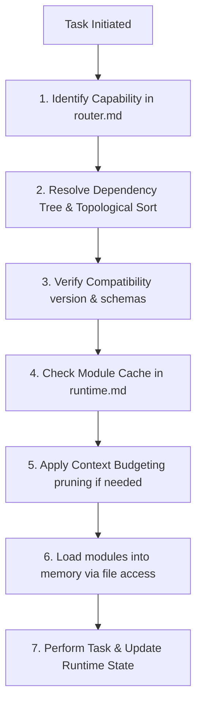

# Agent OS Loader

This loader sequence manages context initialization and ensures that only relevant governance rules, schemas, and shared constants are active in the agent's working memory at any time.

## 1. Loader sequence (Dynamic Initialization)

When starting a task, the agent must execute the following sequence:

1. **Scan**: Analyze task intent and identify the required capability (e.g., `INGEST`, `LINK`) from [router.md](file:///.antigravity/bootstrap/router.md).
2. **Resolve Dependencies**: Find the entry-point modules for the capability. Build the dependency tree by reading each module's `depends_on` manifest field, and construct a topologically sorted list.
3. **Verify Compatibility**: For each module in the sort:
   - Check that `compatible_schema_versions` matches the vault's `CURRENT_SCHEMA_VERSION` in [constants.md](file:///.antigravity/shared/constants.md).
   - Check that dependencies are declared and present in [registry.md](file:///.antigravity/bootstrap/registry.md).
   - If any check fails, abort and trigger Failure Behavior.
4. **Check Cache**: Compare the sorted list against the `loaded_modules` array in [runtime.md](file:///.antigravity/bootstrap/runtime.md). Skip loading any module that is already marked as loaded.
5. **Budget Context**:
   - Sum the `estimated_token_cost` of all modules scheduled to load.
   - If the sum exceeds the **Context Budget Limit** (8,000 tokens for rules), prune non-leaf dependencies or split large modules into micro-modules.
6. **Load**: Execute the available file access mechanism on the resolved paths in [registry.md](file:///.antigravity/bootstrap/registry.md).
7. **Execute**: Perform the task, updating [runtime.md](file:///.antigravity/bootstrap/runtime.md) with active state, decisions, and outcomes.

## 2. Dependency Resolution Algorithm
The topological sort is defined as:
1. Initialize an empty list `ordered_list` and a set `visited`.
2. For each entry-point module, call `visit(module_id)`:
   - If `module_id` is in `visiting` (current path), abort with a cyclic dependency error.
   - If `module_id` is not in `visited`:
     - Add `module_id` to `visiting`.
     - For each dependency in the module's `depends_on`:
       - Recursively call `visit(dependency)`.
     - Remove `module_id` from `visiting`.
     - Add `module_id` to `visited` and append to `ordered_list`.
3. The resulting `ordered_list` is the exact load sequence (dependencies loaded first).

## 3. Context Budgeting Policy
- **Max Context Budget**: 8,000 tokens for rule/governance context.
- **Pruning Priority**:
  1. Keep `shared/` core files (always loaded first, high priority).
  2. Load only the leaf nodes in the resolved sequence that directly implement policies.
  3. Load high-cost modules as summaries or request human partitioning.

## 4. Module Caching Policy
- Keep track of all loaded modules in `runtime.loaded_modules`.
- Never reload a module that already exists in the cache.
- Clear the cache only when starting a new, unrelated task.
