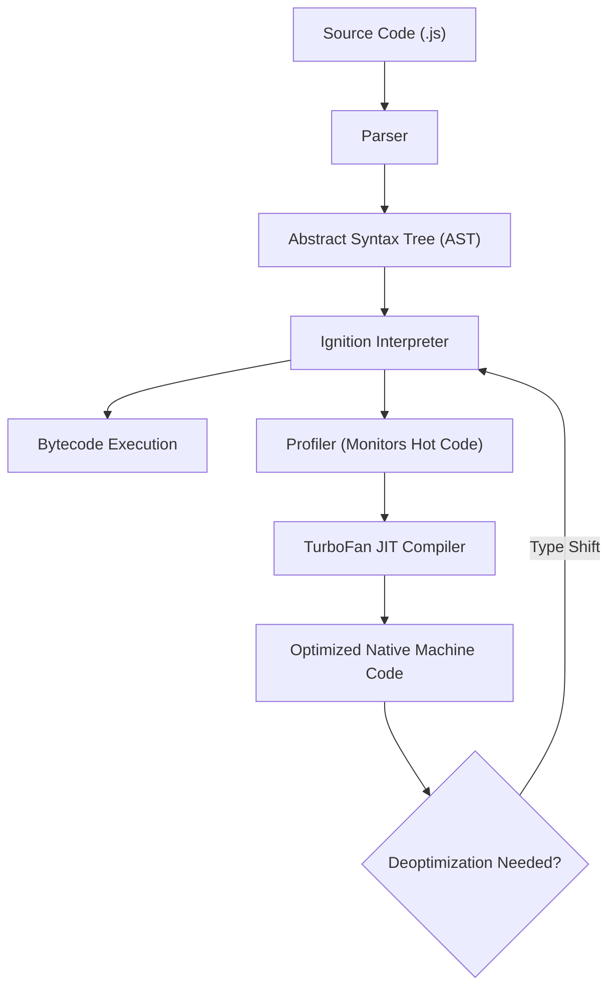

# [ 2026 ] 12+ Hours Complete JS Tutorial for Beginners — Part 01: Core Architecture, JavaScript Engines, Execution Models, Variables & Scoping

> **Source Link**: [YouTube Video](https://www.youtube.com/watch?v=h2aHoOO2kxA&t=24s)  
> **Original Capture File**: [[01_RAW/CAPTURE/2026   12+ Hours Complete JS Tutorial for Beginners.md]]  
> **Channel / Creator**: [[Not Your College]] (Host: NYC Team, Instructor: Devendra)  
> **Segment Covered**: Part 01 (00:00:00 - 01:26:38) — JavaScript Foundations, Engine Mechanics (V8, SpiderMonkey, JavaScriptCore), Compilation Paradigms (Interpreted vs. Compiled vs. JIT), Declaration Keywords (`var`, `let`, `const`), Temporal Dead Zone (TDZ), and Scope Architecture (Global, Function, Block).

---

## 1. Executive Summary (00:00:00 - 01:26:38)

Part 01 sets the foundational groundwork for the entire 12+ hour JavaScript masterclass. Instructor Devendra initiates the course by breaking down the runtime definition of JavaScript: a **dynamically typed, single-threaded, synchronous scripting and programming language** that powers over 85–90% of web frontend applications worldwide.

The lesson inspects the low-level runtime architecture of web browsers, detailing how JavaScript engines (such as Chrome's **V8**, Firefox's **SpiderMonkey**, and Safari's **JavaScriptCore**) execute code. It explores the shift from pure line-by-line interpretation to modern **Just-In-Time (JIT) Compilation**, explaining how source code is transformed into abstract syntax trees (AST), bytecode, and optimized machine code at runtime.

Finally, Part 01 conducts a deep-dive into variable mechanics. It contrasts the legacy `var` keyword against modern ES6 additions (`let` and `const`). Through concrete runtime console tests, it highlights key operational differences: re-declaration permissions, re-assignment mutability, hoisting behaviors, the **Temporal Dead Zone (TDZ)**, and scope boundaries (Global Scope vs. Function Scope vs. Block Scope).

---

## 2. Chronological Section Breakdown

### 2.1 Course Orientation & Not Your College Vision (00:00 - 03:00)
- **Host Intro & Industry Reality**: The "Not Your College" (NYC) team introduces the course as a zero-to-hero comprehensive guide designed to bridge the gap between outdated college syllabi and modern engineering demands.
- **Pedagogical Structure**: Instructor Devendra outlines the course roadmap—progressing from fundamental syntax, data structures, and memory models to synchronous execution contexts, practice problem sets, asynchronous event loops, promises, and DOM manipulation.

---

### 2.2 What is JavaScript? Core Language Characteristics (03:00 - 07:23)

JavaScript is defined through four primary technical characteristics:

```
JavaScript Language Definition = Dynamically Typed + Single-Threaded + Synchronous + Web Scripting Standard
```

1. **Dynamically Typed**:
   - Variables are not bound to static data types at compile time.
   - A single variable identifier can store a number, string, boolean, object, or function without explicit type annotations.
   - Contrast with statically typed languages like C++ or Java (`int x = 10;`).
2. **Single-Threaded**:
   - JavaScript executes code within a single main thread of execution.
   - It possesses exactly **one Call Stack**, meaning only one instruction can be processed at any single instant in time.
3. **Synchronous Execution**:
   - Operations execute sequentially, line-by-line, in top-to-bottom call order.
   - Each statement must complete before the next instruction proceeds (asynchronous tasks utilize Web APIs to delegate long-running operations).
4. **Dominant Web Standard**:
   - Native language of web browsers, commanding ~85-90% client-side web development market share.

---

### 2.3 JavaScript Engines & Browser Architecture (07:23 - 12:41)

#### 1. What is a JavaScript Engine?
- A specialized program or interpreter that executes JavaScript source code inside a browser or server runtime (e.g., Node.js, Deno).
- Unlike Java (requiring JDK installation) or Python (requiring Python interpreter), JavaScript comes pre-packaged within every modern web browser.

#### 2. Major Browser Engines Comparison Matrix

| Browser | Engine Name | Developer / Maintainer | Core Characteristics |
|---|---|---|---|
| **Google Chrome / Node.js / Brave / Edge** | **V8** | Google (C++) | Open-source, high-performance JIT compilation to machine code |
| **Mozilla Firefox** | **SpiderMonkey** | Mozilla Corporation | First JS engine ever built (created by Brendan Eich in 1995) |
| **Apple Safari** | **JavaScriptCore (Nitro)** | Apple Inc. | Highly optimized for Apple silicon architecture and WebKit |

#### 3. Etymology of "V8 Engine" (09:47 - 11:49)
- Google named their engine **V8** after high-performance V8 internal combustion car engines, signifying peak speed and processing performance during Chrome's debut in 2008.

---

### 2.4 History & Origins of JavaScript & ECMAScript (12:41 - 16:40)

#### 1. Historical Origins (1995)
- **Creator**: Brendan Eich at Netscape Communications in May 1995.
- **Development Timeline**: Rapidly prototyped and written in just **10 to 12 days**.
- **Initial Objective**: Built specifically to perform client-side HTML form validation in Netscape Navigator, eliminating unnecessary round-trip server calls for basic input checks.

#### 2. The Naming Strategy ("Java" + "Script")
- Originally named **Mocha**, then renamed to **LiveScript**, and finally branded as **JavaScript**.
- **Marketing Maneuver**: In 1995, Sun Microsystems' Java language was enjoying massive global popularity. Netscape adopted the prefix "Java" as a marketing tactic to leverage Java's market hype, despite JavaScript and Java having entirely distinct language architectures.

#### 3. ECMAScript Standardization (ECMA-262)
- To prevent vendor fragmentation (such as Microsoft's JScript), the standard was handed over to ECMA International.
- **ECMAScript (ES)** defines the official language specification.
- **Key Milestone Versions**:
  - `ES5` (2009): Standardized array methods, strict mode.
  - `ES6 / ES2015` (2015): Game-changing update introducing `let`, `const`, Arrow Functions, Classes, Promises, Modules.
  - `ES2016+`: Annual iteration release schedule.

---

### 2.5 Execution Paradigms: Interpreted vs. Compiled vs. JIT (16:40 - 28:00)

#### 1. Traditional Compilation Models
- **Purely Compiled Languages (C, C++, Rust)**: Source code is pre-compiled ahead-of-time (AOT) into binary machine code by a compiler before execution. Fast runtime performance, slower build phase.
- **Purely Interpreted Languages (Classic Ruby, early Python)**: Source code is read and executed line-by-line by an interpreter at runtime. Slower execution speed, no build step.

#### 2. Modern JavaScript JIT (Just-In-Time) Compilation
Modern JavaScript engines combine interpretation and compilation using **JIT Compilation**:



- **Phase 1: Parsing**: The parser converts source text into tokens and builds an **Abstract Syntax Tree (AST)**.
- **Phase 2: Bytecode Generation (Ignition Interpreter)**: The engine converts the AST into unoptimized bytecode for immediate execution start.
- **Phase 3: Profiling & Optimization (TurboFan Compiler)**: The engine identifies frequently executed code paths ("hot code") and compiles them directly into native machine code for maximum execution speed. If type assumptions change, it safe-fails via **Deoptimization** back to bytecode.

---

### 2.6 Variable Declarations: `var`, `let`, and `const` (28:00 - 01:05:00)

#### 1. Anatomy of a Variable
A variable consists of two discrete operations:
1. **Declaration**: Informing the JavaScript engine to reserve an identifier in memory (`let a;`).
2. **Assignment**: Binding a specific value payload to the declared identifier (`a = 100;`).

```javascript
// Separate Declaration and Assignment
let total;        // Declaration (Initial value defaults to undefined)
total = 500;      // Assignment

// Combined Initialization
let age = 25;     // Declaration + Assignment (Initialization)
```

#### 2. Deep Dive: `var` Keyword Characteristics
- **Function-Scoped / Globally Scoped**: `var` ignores block boundaries (`{}`).
- **Allows Re-declaration**: The same variable identifier can be declared multiple times within the same scope without throwing a syntax error.
- **Allows Re-assignment**: Values can be reassigned freely.
- **Hoisting Behavior**: Initialized to `undefined` during the memory creation phase.

```javascript
// var Re-declaration and Re-assignment
var x = 10;
console.log(x); // Output: 10

var x = 20;     // Re-declared & Re-assigned cleanly (No error!)
console.log(x); // Output: 20

x = 30;         // Re-assigned cleanly
console.log(x); // Output: 30
```

#### 3. Deep Dive: `let` Keyword Characteristics (ES6)
- **Block-Scoped**: Encapsulated within any block bounded by curly braces `{}` (such as `if`, `for`, `while`, or standalone blocks).
- **Prohibits Re-declaration**: Attempting to re-declare a `let` identifier within the same scope throws a `SyntaxError: Identifier 'y' has already been declared`.
- **Allows Re-assignment**: Values can be reassigned freely.
- **Hoisting Behavior & Temporal Dead Zone (TDZ)**: Hoisted to top of scope, but left uninitialized. Accessing before line of declaration throws `ReferenceError: Cannot access 'y' before initialization`.

```javascript
// let Re-declaration Prohibition
let y = 50;
// let y = 100; // Uncaught SyntaxError: Identifier 'y' has already been declared

y = 100;        // Re-assignment is valid!
console.log(y); // Output: 100
```

#### 4. Deep Dive: `const` Keyword Characteristics (ES6)
- **Block-Scoped**: Same block encapsulation as `let`.
- **Mandatory Immediate Initialization**: Must be assigned a value during declaration. Declaring `const z;` throws `SyntaxError: Missing initializer in const declaration`.
- **Prohibits Re-declaration & Re-assignment**: Binding is immutable. Attempting reassignment (`z = 20`) throws `TypeError: Assignment to constant variable`.
- **Object/Array Mutation Exemption**: `const` prevents reassignment of the variable reference, but reference objects/arrays stored inside can have their internal properties mutated!

```javascript
// const Assignment Rules
const PRICE = 99;
// PRICE = 150; // Uncaught TypeError: Assignment to constant variable.

// const Reference Object Mutation (Valid!)
const user = { name: "Devendra", role: "Instructor" };
user.role = "Lead Engineer"; // Valid! Reference remains unchanged, internal property mutates.
console.log(user.role);      // Output: "Lead Engineer"
```

---

### 2.7 Hoisting & The Temporal Dead Zone (TDZ) (50:31 - 01:05:00)

#### 1. What is Hoisting?
Hoisting is JavaScript's default execution behavior where variable and function declarations are allocated in memory before any code line is executed during Phase 1 (Memory Creation Phase).

#### 2. Comparative Hoisting Diagnostics

```javascript
// 1. var Hoisting Behavior
console.log(aVar); // Output: undefined (Memory allocated, initialized to undefined)
var aVar = 100;
console.log(aVar); // Output: 100

// 2. let / const Hoisting Behavior (Temporal Dead Zone)
console.log(bLet); // Uncaught ReferenceError: Cannot access 'bLet' before initialization
let bLet = 200;

// 3. Undeclared Variable Diagnostic
console.log(cUnassigned); // Uncaught ReferenceError: cUnassigned is not defined
```


- **Temporal Dead Zone (TDZ)**: The time span between entering a scope and reaching the line where a `let` or `const` variable is declared and initialized. Accessing the variable while inside the TDZ triggers a fatal `ReferenceError`.

---

### 2.8 Scope Architecture: Global, Function & Block Scope (01:05:00 - 01:26:38)

#### 1. Scope Definitions
- **Global Scope**: Variables accessible anywhere across the entire runtime environment.
- **Function Scope**: Variables declared with `var` inside a function body; accessible only within that function.
- **Block Scope**: Variables declared with `let` or `const` inside curly braces `{}`; inaccessible outside that block.

#### 2. Code Demonstration: Scope Isolation Test

```javascript
// Global Scope
var globalVar = "I am Global";

function testScope() {
  // Function Scope
  var functionVar = "I am Function Scoped";

  if (true) {
    // Block Scope
    var blockVar = "I am var in block"; // Not block scoped! Leaks to function scope.
    let blockLet = "I am let in block"; // Strictly block scoped!
    const blockConst = "I am const in block"; // Strictly block scoped!
    console.log(blockLet); // Output: "I am let in block"
  }

  console.log(blockVar);  // Output: "I am var in block" (Leaked outside block!)
  // console.log(blockLet); // Uncaught ReferenceError: blockLet is not defined
}

testScope();
// console.log(functionVar); // Uncaught ReferenceError: functionVar is not defined
```

---

## 3. Comparative Technical Reference Tables

### Table 1: Declaration Keywords Comparison Matrix (28:00 - 01:05:00)

| Feature | `var` | `let` | `const` |
|---|---|---|---|
| **Scope Type** | Function Scope | Block Scope | Block Scope |
| **Re-declaration** | Allowed in same scope | Prohibited (`SyntaxError`) | Prohibited (`SyntaxError`) |
| **Re-assignment** | Allowed | Allowed | Prohibited (`TypeError`) |
| **Initialization** | Optional | Optional | Mandatory at declaration |
| **Hoisting Initial Value** | `undefined` | Uninitialized (TDZ) | Uninitialized (TDZ) |
| **Access Before Decl.** | Returns `undefined` | Throws `ReferenceError` | Throws `ReferenceError` |

### Table 2: Error Types Diagnostic Reference (51:50 - 56:32)

| Error Name | Cause Trigger | Example Scenario |
|---|---|---|
| `ReferenceError` (Not Defined) | Variable identifier was never declared anywhere in scope | `console.log(nonExistentVar)` |
| `ReferenceError` (TDZ) | Variable declared with `let`/`const` accessed before initialization line | `console.log(a); let a = 10;` |
| `SyntaxError` | Invalid syntax or duplicate `let`/`const` declaration | `let a = 1; let a = 2;` |
| `TypeError` | Reassigning a `const` variable binding | `const x = 5; x = 10;` |

---

## 4. Key Takeaways & Verbatim Quotes

### Notable Technical Quotes
1. **On Language Definition (04:47)**:
   > *"JavaScript is a dynamically typed, single-threaded, synchronous language that dominates web development."* (04:47) — *Devendra*
2. **On Browser Engines (08:32)**:
   > *"You don't need to install external software to run JavaScript. When you buy a laptop and open Chrome, your JavaScript engine—V8—is already sitting inside your browser ready to execute."* (08:32) — *Devendra*
3. **On Temporal Dead Zone (53:51)**:
   > *"When using `let` or `const`, JavaScript knows the variable exists in scope, but accessing it before its line of declaration throws a `Cannot access before initialization` ReferenceError."* (53:51) — *Devendra*

---

## 5. Technical Glossary & Entity Reference

- **Dynamic Typing**: A feature of programming languages where data types are associated with values rather than variable declarations.
- **Single-Threaded**: An execution model executing one command at a time on a single processing thread.
- **Synchronous**: Execution step-by-step in sequential, deterministic order.
- **V8 Engine**: Google's open-source high-performance C++ JavaScript and WebAssembly engine used in Chrome and Node.js.
- **JIT (Just-In-Time) Compilation**: Runtime compilation technique compiling interpreted bytecode to native machine code on the fly.
- **Abstract Syntax Tree (AST)**: A hierarchical tree structure representing the syntactic structure of source code.
- **Hoisting**: The process whereby the interpreter moves variable and function declarations to the top of their scope before code execution.
- **Temporal Dead Zone (TDZ)**: The region of code where a variable declared with `let` or `const` is in scope but cannot be accessed prior to its initialization statement.

---
