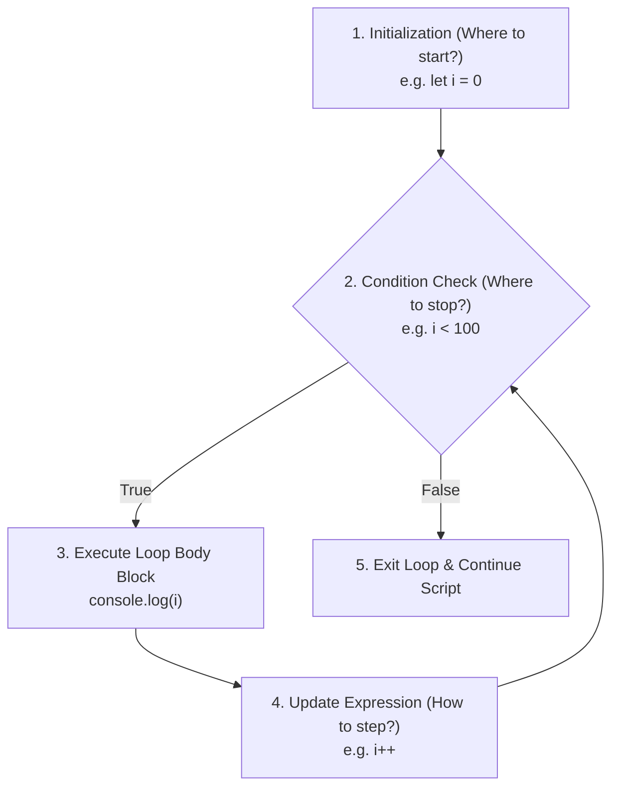
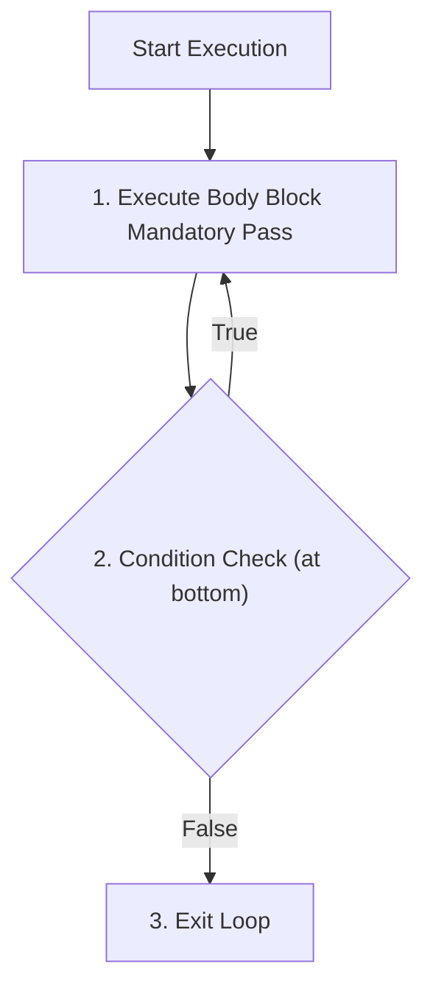

# [ 2026 ] 12+ Hours Complete JS Tutorial for Beginners — Part 04: Iteration Control Flow, Loop Architectures, Break/Continue & Array Traversal

> **Source Link**: [YouTube Video](https://www.youtube.com/watch?v=h2aHoOO2kxA&t=24s)  
> **Original Capture File**: [[01_RAW/CAPTURE/2026   12+ Hours Complete JS Tutorial for Beginners.md]]  
> **Channel / Creator**: [[Not Your College]] (Host: NYC Team, Instructor: Devendra)  
> **Segment Covered**: Part 04 (03:48:00 - 04:46:00) — Loops & Iterative Automation, `for` Loop 3-Statement Architecture, `while` Pre-Test Loops, `do...while` Mandatory Post-Test Loops, Loop Control Interrupts (`break` vs. `continue`), and Array Index Traversal.

---

## 1. Executive Summary (03:48:00 - 04:46:00)

Part 04 explores **Iterative Control Flow and Loop Mechanics** in JavaScript. Instructor Devendra highlights why loop constructs are essential to modern software engineering: computers exist to automate repetitive tasks that humans cannot process efficiently line-by-line.

The lesson details the three core questions required to architect any loop:
1. **Initialization**: Where does execution start? (`let i = 0`)
2. **Condition Predicate**: Where does execution stop? (`i < length`)
3. **Update Expression**: How does state step forward? (`i++`)

The course dissects the execution cycles of three loop constructs: the **`for` loop** (pre-calculated index iterations), the **`while` loop** (condition-driven execution), and the **`do...while` loop** (guaranteeing at least one execution pass before testing condition predicates). Finally, it demonstrates loop control directives (`break` and `continue`) to filter elements during array index traversals.

---

## 2. Chronological Section Breakdown

### 2.1 The Philosophy of Loops & Automation (03:48:00 - 04:04:14)

#### 1. Why Do Loops Exist?
- Software applications handle repetitive data structures (e.g., rendering social media posts, database records, product catalogs).
- Writing static lines of code (`console.log(1); console.log(2); ...`) is impractical. Loops condense thousands of repetitive operations into clean, reusable control blocks.

#### 2. The 3 Structural Pillars of Loop Architecture



1. **Initialization**: Establishes the starting counter or iteration variable state.
2. **Condition Predicate**: Boolean evaluation checked before every pass; loop terminates when condition returns `false`.
3. **Update Expression**: Modifies the counter variable after each iteration pass.

---

### 2.2 The `for` Loop Architecture (04:04:14 - 04:29:59)

The `for` loop packages initialization, condition checking, and update expressions into a single compact header line.

#### 1. Syntax & Execution Lifecycle

```javascript
// for Loop Architecture Syntax
for (initialization; conditionPredicate; updateExpression) {
  // Loop Body Block
}
```

```javascript
// Printing numbers 1 to 5
for (let i = 1; i <= 5; i++) {
  console.log(`Iteration step: ${i}`);
}
// Execution Trace:
// Pass 1: i = 1 (1 <= 5 -> true) -> Logs 1 -> i becomes 2
// Pass 2: i = 2 (2 <= 5 -> true) -> Logs 2 -> i becomes 3
// Pass 3: i = 3 (3 <= 5 -> true) -> Logs 3 -> i becomes 4
// Pass 4: i = 4 (4 <= 5 -> true) -> Logs 4 -> i becomes 5
// Pass 5: i = 5 (5 <= 5 -> true) -> Logs 5 -> i becomes 6
// Pass 6: i = 6 (6 <= 5 -> false) -> Loop Exits!
```

---

### 2.3 The `while` Loop Architecture (04:29:59 - 04:33:06)

The `while` loop checks a condition predicate before executing its loop body. It is used when the number of required iterations is not known ahead of time.

#### 1. Syntax & Infinite Loop Safeguards
- Initialization occurs outside the loop.
- The update expression must be manually included inside the loop body; omitting it creates an **Infinite Loop**, freezing the runtime thread.

```javascript
// while Loop Example
let count = 1; // 1. External Initialization

while (count <= 5) { // 2. Condition Check
  console.log(`Count: ${count}`);
  count++; // 3. Internal Update Expression (Crucial to prevent infinite loops!)
}
```

---

### 2.4 The `do...while` Loop: Guaranteed Initial Execution Pass (04:33:06 - 04:38:48)

The `do...while` loop is a **post-test loop**. It executes the body block **at least once** before evaluating the condition predicate.



#### 1. Comparative Code Demonstration: `while` vs `do...while`

```javascript
let i = 10;

// Standard while Loop (Condition evaluates to FALSE upfront)
while (i < 5) {
  console.log("while loop executed"); // NEVER EXECUTES!
  i++;
}

// do...while Loop (Executes body ONCE before checking condition)
do {
  console.log(`do...while loop executed with i = ${i}`); // EXECUTES ONCE! Output: 10
  i++;
} while (i < 5); // Evaluates 11 < 5 (False) -> Exits!
```

---

### 2.5 Loop Interrupt Directives: `break` vs. `continue` (04:38:48 - 04:46:00)

Loop directives control iteration execution:

- **`break`**: Immediately terminates the entire loop and jumps out of the loop block.
- **`continue`**: Skips the remaining code in the current iteration pass and jumps directly to the next iteration step.

#### Array Index Traversal & Element Filtering Diagnostics

```javascript
const students = ["Rohan", "Naman", "Rohit", "Sarthak", "Rohini", "Naveen", "Sanjay"];

console.log("--- Traversal with 'continue' (Skipping Absent Students) ---");
for (let i = 0; i < students.length; i++) {
  // Skip "Sarthak" and "Rohini" from attendance printing
  if (students[i] === "Sarthak" || students[i] === "Rohini") {
    console.log(`[ABSENT]: Skipping ${students[i]}`);
    continue; // Jumps directly to next iteration step!
  }
  console.log(`[PRESENT]: ${students[i]}`);
}

console.log("\n--- Traversal with 'break' (Terminating on Target Match) ---");
for (let i = 0; i < students.length; i++) {
  if (students[i] === "Sarthak") {
    console.log(`[MATCH FOUND]: Terminating loop at ${students[i]}`);
    break; // Immediately breaks out of loop completely!
  }
  console.log(`Processing student: ${students[i]}`);
}
```

---

## 3. Comparative Technical Reference Tables

### Table 1: Loop Construct Comparison Matrix (04:04:14 - 04:38:48)

| Loop Type | Evaluation Timing | Min. Iteration Pass Count | Primary Use Case |
|---|---|---|---|
| **`for` Loop** | Pre-test (Before body) | `0` passes | Fixed counter range iteration, array index traversal |
| **`while` Loop** | Pre-test (Before body) | `0` passes | Dynamic condition testing, event/flag waiting |
| **`do...while` Loop** | Post-test (After body) | **`1` pass guaranteed** | Operations requiring at least one initial execution pass |

### Table 2: `break` vs. `continue` Directives (04:38:48 - 04:46:00)

| Directive | Execution Impact | Next Step Executed |
|---|---|---|
| **`break`** | Abruptly terminates loop entirely | Statements after the loop block |
| **`continue`** | Skips remaining code in current pass | Update expression / Next loop pass condition check |

---

## 4. Key Takeaways & Verbatim Quotes

### Notable Technical Quotes
1. **On The Purpose of Loops (03:57:43)**:
   > *"Computers and software engines were built specifically for loops. Without loops to automate repetitive tasks, software programming wouldn't exist."* (03:57:43) — *Devendra*
2. **On `do...while` Loops (04:34:26)**:
   > *"A `do...while` loop guarantees at least one execution pass of the loop body regardless of whether the condition evaluates to true or false."* (04:34:26) — *Devendra*
3. **On Break vs. Continue (04:44:08)**:
   > *"Use `continue` when you want to skip a single iteration step and keep looping. Use `break` when you want to terminate the loop entirely."* (04:44:08) — *Devendra*

---

## 5. Technical Glossary & Entity Reference

- **Iterative Control Flow**: The process of repeatedly executing a block of statements until a specified condition is satisfied.
- **Loop Pre-Test**: A loop evaluation model that checks the condition predicate before executing the loop body (`for`, `while`).
- **Loop Post-Test**: A loop evaluation model that executes the loop body before checking the condition predicate (`do...while`).
- **Infinite Loop**: A loop sequence that lacks a valid termination condition or state update, causing endless execution.
- **Array Traversal**: The process of accessing every element in an array sequentially via its index offset.

---
