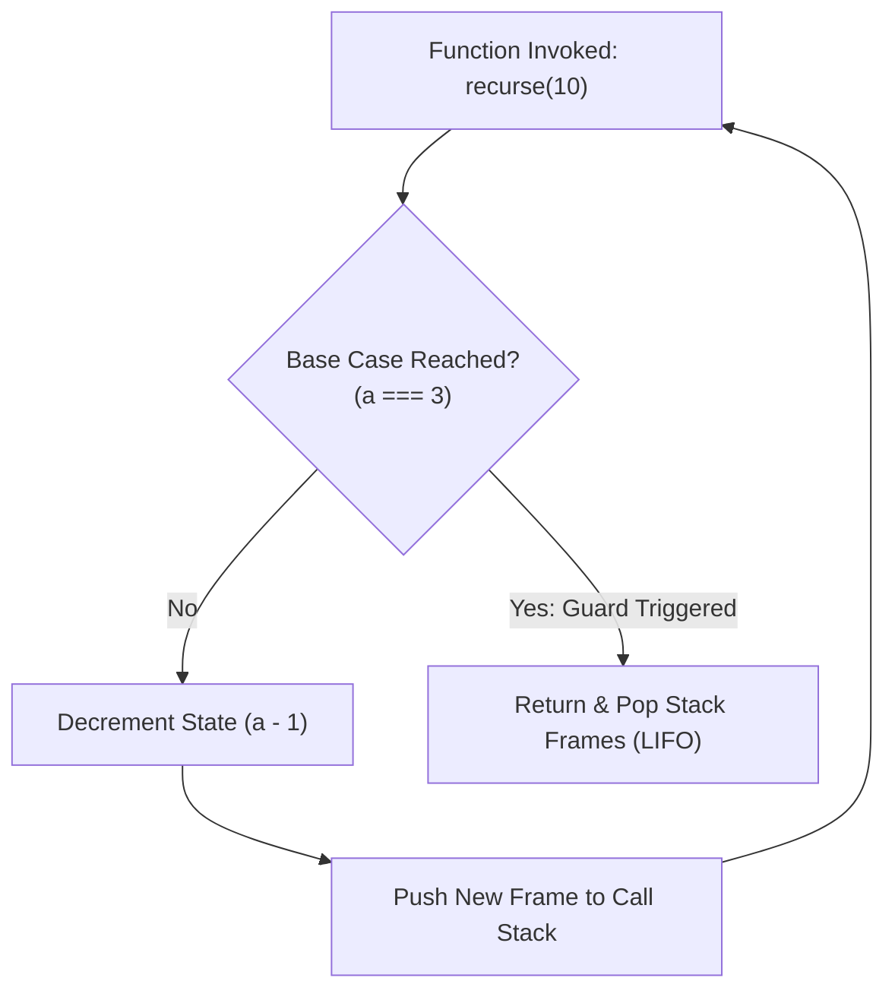
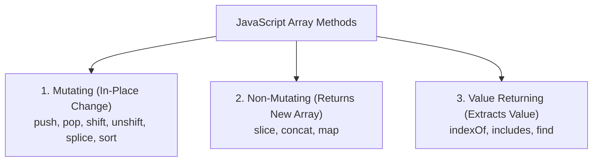

# [ 2026 ] 12+ Hours Complete JS Tutorial for Beginners — Part 06: Higher-Order Functions, Recursion, Array Methods Taxonomy & Function Currying

> **Source Link**: [YouTube Video](https://www.youtube.com/watch?v=h2aHoOO2kxA&t=24s)  
> **Original Capture File**: [[01_RAW/CAPTURE/2026   12+ Hours Complete JS Tutorial for Beginners.md]]  
> **Channel / Creator**: [[Not Your College]] (Host: NYC Team, Instructor: Devendra)  
> **Segment Covered**: Part 06 (06:03:30 - 07:20:16) — Higher-Order Functions (HOF), Call Stack Recursion & Base Case Termination Guards, Array Methods Taxonomy (Mutating vs. Non-Mutating vs. Value Returning), ASCII Comparator Sorting (`a - b`), and Function Currying Patterns.

---

## 1. Executive Summary (06:03:30 - 07:20:16)

Part 06 examines advanced function compositions and structural array manipulations. Instructor Devendra investigates **Higher-Order Functions (HOF)**—functions that accept other functions as arguments or return nested functions—and explores **Recursion Mechanics**, demonstrating how missing base case guards overwhelm the Call Stack and throw `RangeError: Maximum call stack size exceeded`.

The lesson establishes an authoritative **3-Category Array Method Taxonomy**:
1. **Mutating Methods** (`push`, `pop`, `shift`, `unshift`, `splice`, `reverse`, `sort`) modifying original reference arrays in-place.
2. **Non-Mutating Methods** (`slice`, `concat`, `map`) returning new modified array instances while preserving original state.
3. **Value Extraction Methods** (`indexOf`, `includes`, `find`).

Additionally, it demystifies JavaScript's string-coerced sorting algorithm, detailing the numeric comparator pattern `(a, b) => a - b`. Finally, it introduces **Function Currying**, decomposing multi-argument calls `fn(a, b, c)` into chaining single-argument functional streams `fn(a)(b)(c)`.

---

## 2. Chronological Section Breakdown

### 2.1 Higher-Order Functions (HOF) & Functional Returns (06:03:30 - 06:04:57)

A **Higher-Order Function (HOF)** is a function that either:
1. Accepts one or more functions as arguments (Callback functions).
2. Returns a new function instance as its output value.

```javascript
// Higher-Order Function returning a nested function
const outerHOF = () => {
  console.log("Outer HOF Executed");
  return () => {
    console.log("Inner Function Executed");
    return 10;
  };
};

// Invoking HOF using chaining parenthesis syntax: outerHOF()()
const result = outerHOF()(); 
// Output: 
// "Outer HOF Executed"
// "Inner Function Executed"
// result = 10
```

---

### 2.2 Recursion Mechanics & Call Stack Overflow Guards (06:04:57 - 06:10:29)

**Recursion** occurs when a function invokes itself inside its own body block.



#### 1. The Call Stack Overflow Hazard
Without an explicit **Base Case (Exit Guard)**, recursive calls push execution contexts onto the V8 Call Stack indefinitely until memory limits are reached.

```javascript
// Infinite Recursion (Throws RangeError!)
const infiniteRecurse = () => {
  infiniteRecurse(); // Un-guarded self-invocation
};
// Result: Uncaught RangeError: Maximum call stack size exceeded
```

#### 2. Guarded Recursive Decrement Implementation

```javascript
// Guarded Recursion with explicit Base Case Condition
const countdown = (a) => {
  console.log(`Current value: ${a}`);

  // Base Case Guard (Stops recursion when a reaches 3)
  if (a === 3) {
    console.log("[BASE CASE REACHED]: Halting recursion.");
    return;
  }

  // Recursive Step (Passes decremented state)
  countdown(a - 1);
};

countdown(10); 
// Output trace: 10, 9, 8, 7, 6, 5, 4, 3 -> Base Case Reached!
```

---

### 2.3 Comprehensive Array Method Taxonomy (06:10:29 - 06:52:24)

JavaScript array methods are categorized into three distinct operational behaviors:



#### Category 1: Mutating Methods (In-Place Modifications)
Modifies the underlying reference memory heap directly.

```javascript
const numbers = [10, 20, 30];

// push & pop (End operations)
numbers.push(40); // Mutates array -> [10, 20, 30, 40]
numbers.pop();    // Removes last element -> [10, 20, 30]

// unshift & shift (Beginning operations)
numbers.unshift(5); // Adds to front -> [5, 10, 20, 30]
numbers.shift();    // Removes from front -> [10, 20, 30]

// splice(startIndex, deleteCount, ...itemsToAdd)
numbers.splice(1, 1, 25); // Replaces 1 element at index 1 -> [10, 25, 30]
```

#### Category 2: Non-Mutating Methods (Returns New Array Instances)
Preserves original array state, returning a fresh modified copy.

```javascript
const fruits = ["Banana", "Apple", "Grapes", "Watermelon", "Mango"];

// slice(startIndex, endIndexExclusive)
const slicedFruit = fruits.slice(1, 3);
console.log(slicedFruit); // ["Apple", "Grapes"]
console.log(fruits);      // Original array remains untouched!

// concat(array2)
const moreFruits = ["Lychee", "Kiwi"];
const combined = fruits.concat(moreFruits); // Combines arrays without modifying fruits
```

---

### 2.4 The `sort()` ASCII Quirk & Numeric Comparator Algorithm (06:45:56 - 06:52:24)

Default `Array.prototype.sort()` coerces elements to strings and compares their ASCII code point values. This causes unexpected sorting behavior for numbers (e.g., `"10"` comes before `"2"`).

```javascript
// Default String-Based Sorting Bug
const rawNumbers = [10, 20, 2, 1];
rawNumbers.sort(); 
console.log(rawNumbers); // Output: [1, 10, 2, 20] (INCORRECT NUMERIC SORT!)

// Fixed Numeric Sorting via Comparator Callback
// Comparator Returns:
// Negative value (< 0): 'a' placed BEFORE 'b'
// Positive value (> 0): 'b' placed BEFORE 'a'
// Zero (=== 0): No change in relative position

// Ascending Order: (a, b) => a - b
rawNumbers.sort((a, b) => a - b);
console.log(rawNumbers); // Output: [1, 2, 10, 20] (CORRECT ASCENDING!)

// Descending Order: (a, b) => b - a
rawNumbers.sort((a, b) => b - a);
console.log(rawNumbers); // Output: [20, 10, 2, 1] (CORRECT DESCENDING!)
```

---

### 2.5 Function Currying Architecture (07:20:16 - 07:35:15)

**Function Currying** transforms a function requiring multiple arguments `fn(a, b, c)` into a series of nested unary functions `fn(a)(b)(c)`.

#### Step-by-step Curried Meal Order Implementation

```javascript
// Multi-argument function without Currying
const makeMeal = (burger, fries, drink) => {
  return `Meal: ${burger} Burger, ${fries} Fries, ${drink}`;
};

// Curried Version (Nested Single-Argument Functions)
const curriedMeal = (burger) => {
  return (fries) => {
    return (drink) => {
      return `Curried Meal: ${burger} Burger, ${fries} Fries, ${drink}`;
    };
  };
};

// Invoking Curried Function via Chained Parentheses
const finalOrder = curriedMeal("Regular")("Peri-Peri")("Coca-Cola");
console.log(finalOrder); 
// Output: "Curried Meal: Regular Burger, Peri-Peri Fries, Coca-Cola"
```

---

## 3. Comparative Technical Reference Tables

### Table 1: Array Method Mutation Taxonomy (06:10:29 - 06:52:24)

| Method | Category | In-Place Mutation? | Return Value |
|---|---|---|---|
| `push()` / `pop()` | Mutating | **Yes** | New length (`push`) / Removed element (`pop`) |
| `shift()` / `unshift()` | Mutating | **Yes** | Removed element (`shift`) / New length (`unshift`) |
| `splice()` | Mutating | **Yes** | Array of deleted elements |
| `sort()` | Mutating | **Yes** | Reference to mutated original array |
| `slice()` | Non-Mutating | **No** | Fresh Array instance containing extracted slice |
| `concat()` | Non-Mutating | **No** | Fresh Array instance containing merged arrays |
| `map()` | Non-Mutating | **No** | Fresh Array instance with transformed values |

---

## 4. Key Takeaways & Verbatim Quotes

### Notable Technical Quotes
1. **On Call Stack Overflow (06:07:26)**:
   > *"If a recursive function lacks a base case, it pushes stack frames continuously until V8 throws 'Maximum call stack size exceeded'."* (06:07:26) — *Devendra*
2. **On Array Sorting Mechanics (06:45:56)**:
   > *"By default, JavaScript's sort() method coerces numbers to strings and sorts by ASCII. To sort numbers correctly, always supply a comparator callback like `(a, b) => a - b`."* (06:45:56) — *Devendra*
3. **On Function Currying (07:23:44)**:
   > *"Currying transforms a function taking multiple parameters into a sequence of unary functions, allowing step-by-step argument evaluation."* (07:23:44) — *Devendra*

---

## 5. Technical Glossary & Entity Reference

- **Higher-Order Function (HOF)**: A function accepting another function as an argument or returning a function as a result.
- **Recursion**: A computational technique where a function calls itself until a base case guard breaks the loop.
- **Base Case**: The conditional guard in a recursive function that halts further self-invocations.
- **Mutating Method**: An array method that alters the elements of the calling array in place.
- **Function Currying**: The technique of translating an evaluation of a function taking multiple arguments into evaluating a sequence of functions, each with a single argument.

---
