# Build & Sell Claude Code Operating Systems (2+ Hour Course) — Comprehensive Master Study Note

## Overview & Metadata

- **Source Title**: Build & Sell Claude Code Operating Systems (2+ Hour Course)
- **Creator**: [[Nate Herk | AI Automation]]
- **Watch URL**: [YouTube Link](https://www.youtube.com/watch?v=bCljOfCH8Ms)
- **Published Date**: 2026-05-01
- **Duration**: 2 Hours 32 Minutes (152 Minutes)
- **Primary Domain**: AI Automation, Agentic Workflows, System Architecture, Personal AIOS

### Executive Summary

This comprehensive master study note provides an exhaustive, full-scale reference for the 2.5-hour course *"Build & Sell Claude Code Operating Systems"* by Nate Herk (former founder of an AI automation agency scaled to $100k+/month and creator of a 350,000+ member free Skool community). 

The course details the transformation of an individual operator or agency owner from clicking across dozens of disconnected browser tabs into an intelligence-augmented operator managing complete business workflows from a single unified terminal interface (Claude Code inside VS Code, Codex, or Antigravity). 

The operational paradigm is anchored in two foundational frameworks:
1. **The Three Ms of AI**: Mindset (The Default Shift, Function Breakdown, Curiosity Rule), Method (ROI Decision Matrix, Leverage Math, J-Curve Productivity Dip), and Machine (Execution Engine & Tool Infrastructure).
2. **The Four Cs of an AIOS**: Context (Business/Owner profile), Connections (APIs, CLI integrations, databases), Capabilities (Executable skill SOPs), and Cadence (Autonomous cloud routines, background cron loops).

Every technical pipeline, folder schema, terminal setup, API integration (ClickUp REST API V2), CLI tool deployment (`gws` CLI), skill building methodology (6-step framework, progressive context loading, live visual artifact generation), routine engine (Cloud Routines vs. Desktop Tasks vs. native `/loop`), and knowledge architecture (Karpathy's LLM Wiki) is fully documented below.

---

## 1. Introduction & The AI Operating System Concept (0:00 - 3:30)

### 1.1 Context & Speaker Background
- **Creator Background**: Nate Herk spent ~2 years deep in AI automation, scaled his previous AI agency to over $100,000/month before selling it, and currently operates one of the world's largest AI communities (350,000+ members on Skool).
- **Core Problem Statement**: Modern operators waste hours daily on "work about work"—searching for misplaced files across Slack, Google Drive, email, and task boards, context-switching between dozens of open browser tabs, and manually repeating administrative tasks.

### 1.2 Defining an AI Operating System (AIOS)
- **Traditional OS**: Windows, Mac OS, or iOS act as the invisible layer between human users and system hardware/software.
- **AI OS**: An intelligence layer situated directly inside an agentic development environment (such as Claude Code within VS Code). It sits above your local filesystem, communications, task management, and databases.
- Rather than opening individual web apps, the operator interacts with an intelligence layer that reads, analyzes, mutates, and executes workflows across all system interfaces simultaneously.

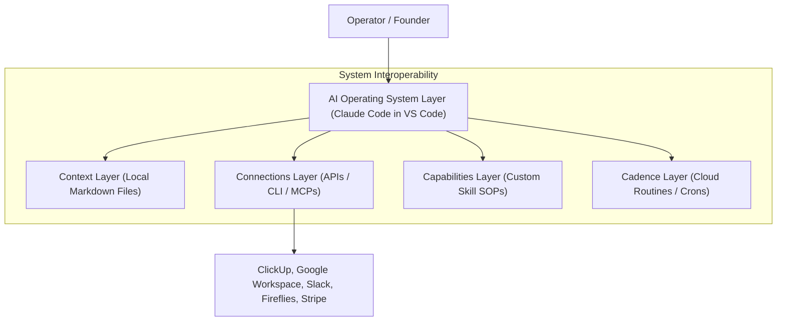

### 1.3 Durable Tool Agnosticism
- **Key Principle**: Software tools, API endpoints, SDKs, and specific LLM models change every 6 months (e.g., transitioning from n8n to Claude Code to Codex or Antigravity).
- **Architecture**: The AIOS is constructed on a **tool-agnostic markdown foundation**. Because all context, skills, decision logs, and references are written in standardized Markdown, moving an entire AIOS from Claude Code to Codex or Antigravity takes under 2 minutes.

> *"When we add intelligence on top of our operating system, we have an AI that can see all of our files, all of our communication, everything important going on in the business... It can find it quicker than you can because you're a human and you use a brain and you forget things."* (1:30)

---

## 2. The Three Ms of AI Framework (3:30 - 11:30)

The Three Ms provide the strategic framework for evaluating, designing, and adopting AI automation across personal operations and team environments: **Mindset**, **Method**, and **Machine**.

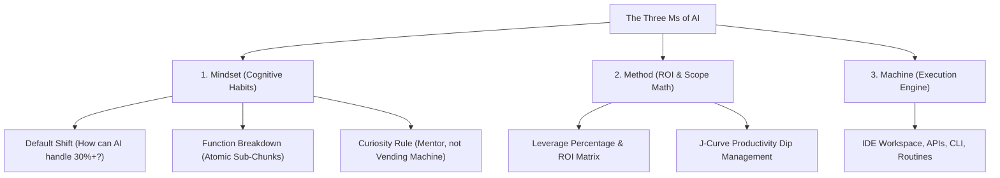

### 2.1 The Mindset Tier (3 Core Habits)

#### Habit 1: The Default Shift
- Before executing any manual task, ask: *"How can AI handle this, or at least handle 30% to 75% of it?"*
- Automation is rarely binary (0% or 100%). Every task possesses a leverage percentage.
- **Real-World Case**: Updating tracking links across 300 YouTube video descriptions.
  - *Old Mindset*: Spending 1+ hours manually clicking each video, editing description text, and saving.
  - *Default Shift*: Spending 5 minutes brainstorming with Claude Code to execute a browser script or API call to batch update all 300 descriptions automatically.

#### Habit 2: The Function Breakdown
- Deconstruct large, overwhelming roles or projects into discrete atomic sub-functions.
- **Example: Automating a YouTube Video Workflow**:
  - Step 1: Topic Ideation (95% automated via trend mining skills)
  - Step 2: Scripting & Outline (75% automated via reference prompts)
  - Step 3: Slide Deck & Visual Asset Generation (80% automated via `gws` CLI and Excalidraw skills)
  - Step 4: Video Packaging, Titles, & Thumbnails (90% automated)
  - Step 5: Description & Tracking Links (100% automated)
  - Step 6: Comment Triage & Audience Insights (85% automated)
- **Reusability**: Sub-chunks (such as slide deck generation) can be unclipped and reused in other workflows (such as meeting prep or client pitches).

#### Habit 3: The Curiosity Rule & Dark Code Prevention
- Treat AI as a mentor, not a vending machine. Vending machines take a coin and spit out an object; mentors ask clarifying questions, challenge assumptions, and sharpen reasoning.
- **Preventing "Dark Code"**: When AI generates code or automated logic, operators must understand *why* the architecture was selected and how edge cases (e.g., an empty invoice submission or API timeout) are handled.

### 2.2 The Method Tier: Productivity Dip & Exponential Learning

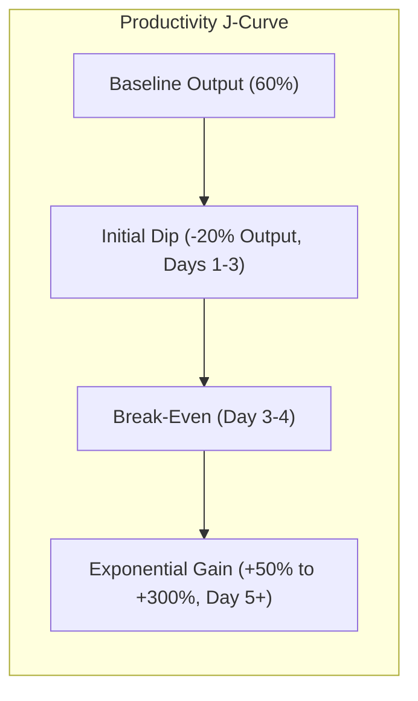

| Metric / Stage | Linear Expectation | Exponential Reality | Operational Strategy |
|---|---|---|---|
| **Days 1–3 (Initial Dip)** | Expected steady gains | Output drops ~20% during setup & adjustment | Accept short-term loss; do not abandon system during initial onboarding gap. |
| **Day 3–4 (Break-Even)** | Linear progress | System breaks even with traditional manual speed | Validate connections and execute initial skill passes. |
| **Day 5+ (Exponential Shift)** | Linear progress | Exponential productivity gains (+50% to 10x output) | Operators complete 1 week of output in 1 day via parallel sub-agents. |

---

## 3. The Four Cs of an AIOS (11:30 - 15:00)

The Four Cs form the sequential construction pipeline for an AI Operating System. Each phase builds upon the previous stage.

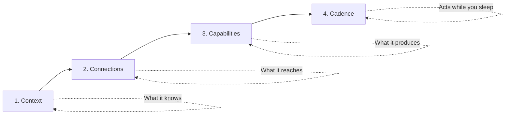

### 3.1 Comprehensive Four Cs Matrix & Diagnostic Pass/Fail Criteria

| Pillar | Core Definition | File / System Manifestation | Pass Benchmark (Pass State) | Fail Benchmark (Remediation Needed) |
|---|---|---|---|---|
| **1. Context** | What the AI knows about you, your business, offer, voice, and quarterly goals. | Core markdown files in `context/` (`about-me.md`, `about-business.md`, `priorities.md`). | AI answers queries like an executive co-founder with full internal memory. | AI responds like a generic stranger who met you 5 seconds ago. |
| **2. Connections** | What external data sources, APIs, and databases the AI can read and write to. | ClickUp REST API V2, Google Workspace CLI (`gws`), Slack, Fireflies, Stripe. | AI retrieves real-time internal business metrics without manual copy-paste. | AI is restricted to public web searches and lacks visibility into private data. |
| **3. Capabilities** | Custom SOPs packaged into executable recipes/skills (`skill.md`). | Executable skills inside `.claude/skills/` (e.g., `/morning-coffee`, `/audit`, `/level-up`). | Complex multi-step operations execute via a single prompt trigger. | Operator must type multi-paragraph prompts and manually manage execution steps. |
| **4. Cadence** | Autonomous background execution and scheduled loops operating without human input. | Cloud Routines, Desktop Scheduled Tasks, native `/loop` crons. | System executes routines, audits CRM, and generates reports while laptop is closed. | System requires continuous human presence and manual initiation for every run. |

---

## 4. Mapping Your Tools (15:00 - 20:30)

Before wiring integrations, operators must map business operations across the **7 Tier-1 Operational Buckets**:

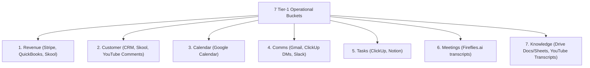

### 4.1 Detailed Tier-1 Tool Taxonomy

| Operational Bucket | Business Function | Nate's Primary Stack | Connection & Integration Protocol |
|---|---|---|---|
| **1. Revenue** | P&L tracking, expense auditing, sales growth, cash flow | Skool, Stripe, QuickBooks | REST APIs / Webhooks / Financial Reports |
| **2. Customer** | User feedback, CRM profile, community engagement | Skool, YouTube Comments | Platform APIs / Community Webhooks |
| **3. Calendar** | Availability, time-blocking, meeting scheduling | Google Workspace (Calendar) | `gws` CLI / Google Calendar API |
| **4. Comms** | Internal team chat & external vendor communications | Gmail, ClickUp Chat, Slack | `gws` CLI / ClickUp API / Slack API |
| **5. Tasks** | Sprint goals, task assignment, deadlines, project management | ClickUp, Notion | ClickUp REST API V2 |
| **6. Meetings** | Call summaries, action items, transcript logs | Fireflies.ai | Fireflies GraphQL / API |
| **7. Knowledge** | SOPs, video transcripts, raw assets, sheets, local files | YouTube Transcripts, Google Drive, Local | Local Filesystem / `gws` CLI |

> **The Executive Assistant Benchmark**: *"If someone wanted to get a hold of me or had a question, they would actually be better off asking my executive assistant AIOS... because it has all the knowledge I have, but a perfect memory and it never sleeps."* (20:20)

---

## 5. Repository Setup & VS Code Architecture (20:30 - 29:00)

### 5.1 Environment Requirements & Setup Steps
1. **IDE Installation**: Download Visual Studio Code (VS Code) or open compatible IDE (Codex, Antigravity).
2. **Claude Code Extension**: Install the official Claude Code extension from the VS Code Marketplace.
3. **Subscription Authentication**: Sign in with a paid Claude subscription (Pro plan at ~$20/mo or scale to Max plan).
4. **Workspace Scaffolding**: Create a root working folder (e.g., `AIOS/`) and open it in VS Code.
5. **Repo Cloning**: Execute `git clone` to pull Nate's template repo into the workspace directory.

### 5.2 Comprehensive System Directory Layout

```text
AIOS-Workspace/
├── .claude/
│   └── skills/                  # Executable custom skills / SOP recipes
│       ├── audit/
│       │   └── skill.md         # Diagnostic audit skill
│       ├── level-up/
│       │   └── skill.md         # Bottleneck level-up skill
│       └── onboard/
│           └── skill.md         # 7-question onboarding skill
├── context/                      # Core business & owner context files
│   ├── about-business.md        # Offer, ICP, pricing, revenue model
│   ├── about-me.md              # Personal style, working habits, pain points
│   └── priorities.md            # Quarterly sprint goals & milestones
├── archives/                     # Deprecated or historical context documents
├── decisions/                    # Immutable log of architectural decisions & choices
├── references/                   # API documentation & reference sheets
│   ├── 3-ms.md                  # Three Ms framework reference sheet
│   └── clickup-api.md           # ClickUp V2 REST API endpoint reference
├── CLAUDE.md                     # Master control prompt & workspace sitemap
└── .env                          # Local secret store (API tokens, API credentials)
```

### 5.3 Master Control File (`CLAUDE.md`)
- `CLAUDE.md` serves as the master prompt loaded by Claude Code on session launch.
- Configures agent identity (*"You are Nate's personal AIOS thought partner"*).
- Maps directory layouts, rules for loading skills, context update protocols, and token optimization guidelines.

---

## 6. The Onboarding Skill (`/onboard`) (29:00 - 36:30)

The `/onboard` skill initiates an interactive 7-question interview scaffold that populates initial Day-1 context files.

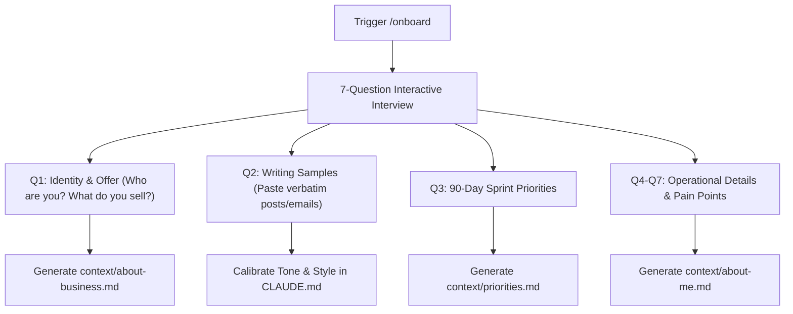

### 6.1 Generated Context Files
1. `context/about-business.md`: Documenting ideal customer profile (ICP), service offerings, pricing structures, and revenue model.
2. `context/about-me.md`: Owner profile, personal communication habits, preferences, and key operational friction points.
3. `context/priorities.md`: Quarterly goals, sprint milestones, and high-impact leverage focus areas.
4. **Voice Dictation Integration**: Nate recommends using fast voice-to-text dictation tools (such as Glaido or Whisper Flow) to input rich multi-paragraph responses effortlessly.

---

## 7. Connecting ClickUp: API vs. MCP Architecture (36:30 - 47:30)

### 7.1 Architecture Comparison: REST API Endpoints vs. MCP Servers

```mermaid
flowchart TD
    subgraph MCP Server Route
        M1["MCP Server"] --> M2["Exposes ALL 100+ Endpoints"]
        M2 --> M3["High Token Overhead on Every Turn"]
    end
    
    subgraph REST API + Reference Sheet Route (Recommended)
        R1["ClickUp REST API V2"] --> R2["Local Reference Doc (references/clickup-api.md)"]
        R2 --> R3["Targeted HTTP Call via Curl/Fetch"]
        R3 --> R4["Low Token Cost & Precise Control"]
    end
```

| Dimension | Model Context Protocol (MCP) | Direct REST API Endpoints (Recommended) |
|---|---|---|
| **Setup Complexity** | Plug-and-play via JSON config | Requires initial API endpoint research crawl |
| **Token Consumption** | **High**: Loads 100+ tool schemas into context window on every turn | **Low**: Reads local `clickup-api.md` reference file only when invoked |
| **Granular Control** | Exposes broad capabilities (risks unintended mutations) | Precise HTTP calls targeted at exact needed endpoints |
| **Security Account Model** | Personal user account API keys | Dedicated service account (`UPP AI` ClickUp user) with scoped permissions |

### 7.2 Integration Step-by-Step
1. **Dedicated Service Account**: Create a dedicated bot user in ClickUp (e.g., `UPP AI`) to restrict AI permissions independently of personal owner credentials.
2. **Secure Token Storage**: Generate a personal API token in ClickUp Settings → API. Store inside `.env` (`CLICKUP_API_TOKEN=...`). Never expose raw API keys in chat history.
3. **Reference File Scaffolding**: Instruct Claude Code to crawl ClickUp API V2 documentation, producing `references/clickup-api.md`.
4. **Validation Snapshot**: Run a test workload call to audit active task assignments across team members.

---

## 8. Health Diagnostics: Audit & Level Up Skills (47:30 - 51:30)

### 8.1 The `/audit` Skill
Executes a four Cs diagnostic audit across the workspace structure, producing a numerical score out of 100 and a prioritized gap report.

```text
Four Cs Baseline Audit Report (Day 1):
- Context: 18 / 25
- Connections: 16 / 25
- Capabilities: 10 / 25
- Cadence: 10.5 / 25
Total Health Score: 54.5 / 100

Top Remediation Gaps:
1. Tier-1 Domain Reach: Only 1 of 7 domains connected (ClickUp).
2. Cadence Gap: Zero recurring background cloud triggers or routines.
3. Capability Gap: Zero custom user-built skills or specialized sub-agents.
```

### 8.2 The `/level-up` Diagnostic Interview
To uncover high-leverage automation targets, `/level-up` executes a 5-question diagnostic interview:

1. **Drudgery Audit**: *"What manual task did you perform 3+ times this past week?"*
2. **Smart Intern Test**: *"What task could a smart intern handle, but you did yourself because explaining it felt too slow?"*
3. **Constraint / Scale Test**: *"If 500 new clients signed up tomorrow, what part of your operations would break first?"*
4. **Growth Lever**: *"What operational process would yield 500 new clients if run on autopilot?"*
5. **System Bottleneck**: *"Where are tasks stalling due to manual handoffs?"*

---

## 9. Google Workspace CLI (`gws`) Deep Dive (51:30 - 1:06:00)

The **Google Workspace Command Line Interface (`gws`)** is a lightweight, open-source CLI developed by Google that exposes Drive, Docs, Sheets, Slides, Gmail, and Calendar through unified terminal commands.

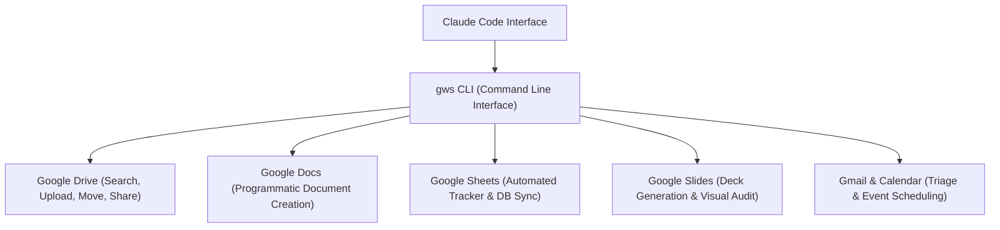

### 9.1 Benefits of `gws` CLI over APIs / MCPs
- **Single Interface**: Replaces 6 separate API integrations with one binary tool.
- **Zero Token Overhead**: Uses native CLI commands instead of polluting LLM context with heavy OpenAPI schemas.
- **Auto-Discovery**: Automatically syncs when Google releases new endpoints without code updates.
- **100+ Built-in Workflow Recipes**: Ships with pre-built multi-step skills (e.g., converting markdown to formatted docs, building sheets from templates).

### 9.2 Real-World Case Studies Demonstrated

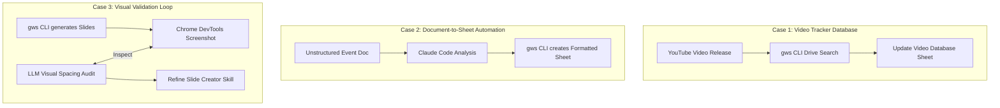

1. **Automated Video Database**: Automatically tracks uploaded YouTube videos, pulling summaries, thumbnail links, and resource files into a master Google Sheet.
2. **Doc-to-Tracker Transformation**: Analyzes raw meeting/event planning documents and programmatically constructs a color-coded Google Sheet with status dropdowns and assignee tags.
3. **Visual Slide Deck Generation & Screenshot Validation**: Generates Google Slides decks programmatically, captures slide screenshots via Chrome DevTools, inspects layout spacing visually, and self-corrects formatting errors automatically.
4. **Unread Email Priority Scorer**: Scores unread Gmail messages 1–10 based on business priorities, marking low-priority emails (<5) as read automatically.

### 9.3 Setup Guide for `gws` CLI
1. **Google Cloud Console Project**: Create a new GCP project (e.g., `claude-code-gws`).
2. **OAuth Consent Screen**: Configure internal/external OAuth credentials.
3. **Credentials Export**: Download OAuth Client ID JSON credentials and place in `~/.config/gws/client_secret.json`.
4. **API Activation**: Enable APIs for Drive, Docs, Sheets, Slides, Gmail, and Calendar.
5. **Authentication**: Execute `gws auth login` to authenticate the CLI locally.

---

## 10. Capabilities & Skill Engineering (1:06:00 - 1:35:30)

### 10.1 Parallel Sub-Agent Execution Demo
Nate demonstrates triggering four independent sub-agents simultaneously in VS Code, executing distinct skills in parallel in 30 seconds:

```mermaid
flowchart TD
    User Prompt --> A1["Agent 1: /morning-coffee"]
    User Prompt --> A2["Agent 2: /pulse-check"]
    User Prompt --> A3["Agent 3: Excalidraw Visualizer"]
    User Prompt --> A4["Agent 4: YouTube Comment Scraper"]
    
    A1 --> O1["Calendar & ClickUp Daily Schedule"]
    A2 --> O2["Quarterly Milestone Status & Follow-ups"]
    A3 --> O3["Editable Excalidraw Architecture Diagram"]
    A4 --> O4["Comment Sentiment & Topic Priority Analysis"]
```

### 10.2 Progressive Context Loading (Token Efficiency)
To prevent context rot and excessive token drain, Claude Code uses a 3-tier loading mechanism:

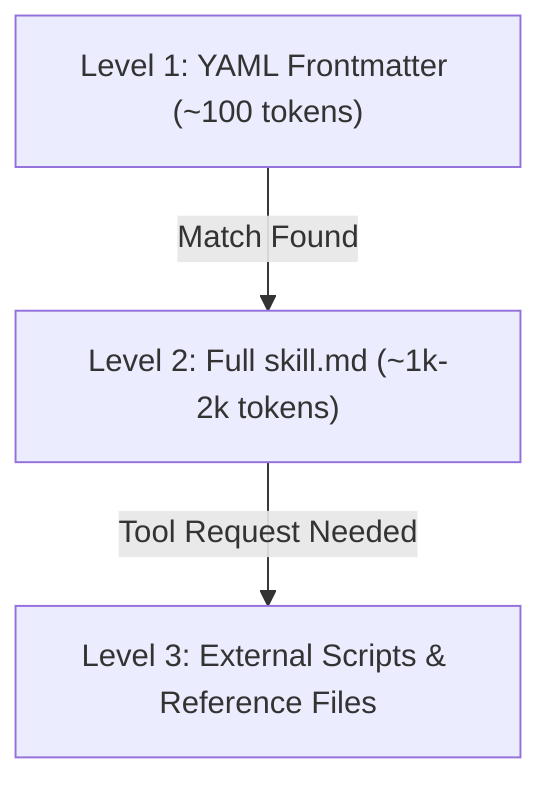

| Level | Scope Loaded | Token Cost | Action Triggered |
|---|---|---|---|
| **Level 1** | Name & Description YAML frontmatter | ~100 tokens | Scanned on every prompt to identify relevant skills. |
| **Level 2** | Full `skill.md` workflow text | ~1,000–2,000 tokens | Loaded only when the skill is explicitly or implicitly invoked. |
| **Level 3** | Associated scripts and reference docs | Variable (On-demand) | Read or executed only when specific workflow steps require them. |

### 10.3 The 6-Step Skill Building Framework

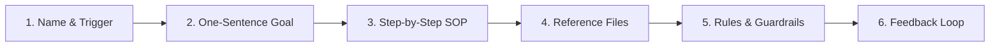

1. **Name & Trigger**: Define canonical skill name and exact natural language / slash command triggers.
2. **One-Sentence Goal**: Specify the exact expected output file or system mutation.
3. **Step-by-Step SOP**: Detail the manual process, decisions, and logic order.
4. **Reference Files**: Attach style guides, brand assets, schemas, and API documentation.
5. **Rules & Guardrails**: Add explicit constraints based on historical failure edge-cases.
6. **Feedback Loop**: Execute, audit output, give feedback, and update `skill.md` iteratively.

### 10.4 Live Skill Build: Educational Infographic Generator
Nate builds a custom `infographic-builder` skill live using the `/skill-builder` meta-skill:
- **Iteration 1**: Image generated via Key.ai NanoBanana API, but logo overlay had a solid background box and wrong aspect ratio.
- **Feedback Pass**: Refined `skill.md` rules enforcing 1:1 aspect ratio and transparent PNG compositing.
- **Iteration 2**: Produced publication-ready 1:1 infographic with correct branding and crisp typography.

### 10.5 Diagnostic Symptom-to-Fix Matrix

| Failure Symptom | Underlying Root Cause | Corrective Action |
|---|---|---|
| Executing wrong steps or incorrect order | Ambiguous workflow phrasing in `skill.md` | Rewrite step-by-step SOP with explicit step numbers. |
| Inconsistent tone, voice, or style | Missing domain style guide | Add reference markdown doc and link in `skill.md`. |
| Repeating same mistake across runs | Missing edge-case guardrail | Add explicit `NEVER` rule in `Rules` section. |
| Excessive API tool searching | LLM re-crawling documentation on every run | Hardcode API endpoints into reference doc or skill file. |
| Skill triggers inappropriately | Overly broad YAML description | Restrict description or set `disable-model-invocation: true`. |

---

## 11. Cadence, Cloud Routines & Native Loops (1:35:30 - 2:05:00)

### 11.1 GitHub Private Repository Sync Architecture

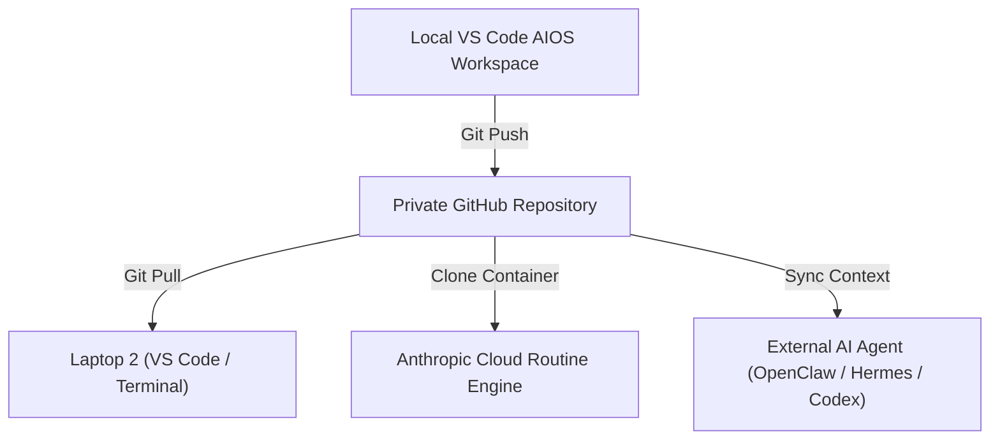

### 11.2 Cloud Routines vs. Desktop Scheduled Tasks vs. Native `/loop`

```mermaid
flowchart TD
    subgraph Local Routines & Loops
        L1["Requires Computer Awake"] --> L2["Runs in Local App / Session"]
        L2 --> L3["Access to Local Files & Browser Session Cookies"]
    end
    
    subgraph Cloud Routines (Remote Containers)
        R1["Runs with Computer OFF (24/7)"] --> R2["Clones Private GitHub Repo"]
        R2 --> R3["Stateless Ephemeral Linux Container (4 vCPU, 16GB RAM)"]
        R3 --> R4["Requires Token / API Header Auth (No Local Cookies)"]
    end
```

### 11.3 Comprehensive Execution Engine Comparison Matrix

| Feature / Dimension | Cloud Routines | Desktop Scheduled Tasks | Native `/loop` Command |
|---|---|---|---|
| **Execution Location** | Anthropic Cloud Container | Local Desktop App | Local VS Code / Terminal Session |
| **Requires Computer Awake?** | **NO** (Runs 24/7) | YES | YES |
| **Persistence Across Restart** | YES | YES | **NO** (Killed on session close) |
| **Local File Access** | NO (GitHub repo only) | YES | YES |
| **Minimum Interval** | 1 Hour | Configurable (down to 1m) | Configurable (down to 1m) |
| **Quota / Plan Limits** | Pro: 5/day<br>Max: 15/day<br>Team: 25/day | Unlimited local runs | Unlimited local runs |
| **Container Hardware** | 4 vCPU, 16 GB RAM, 30 GB Disk | Host machine specs | Host machine specs |
| **Safety Lifecycle** | Ephemeral container | Persistent local state | 3-Day Maximum Expiry |

---

## 12. Karpathy's LLM Wiki & Knowledge Systems (2:05:00 - 2:23:33)

### 12.1 The Concept of an LLM-Maintained Knowledge Base
- Proposed by Andrej Karpathy: Replaces complex vector databases and chunking pipelines with a flat directory of human-readable, cross-linked Markdown files.
- Instead of raw similarity search, the LLM maintains structural `index.md` files, entity relationship pages, and operational `log.md` logs.

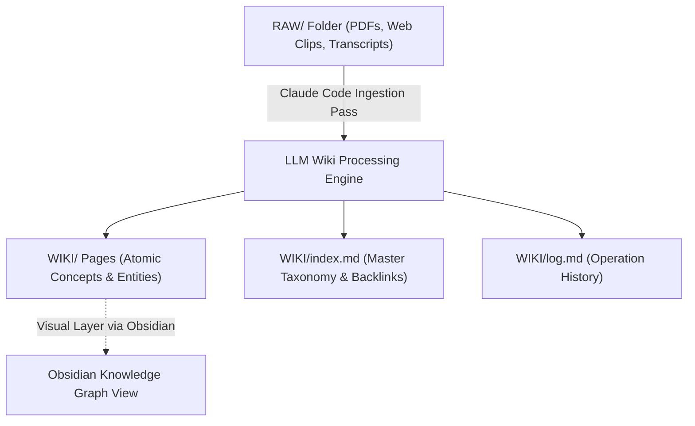

### 12.2 Karpathy LLM Wiki vs. Traditional Vector RAG

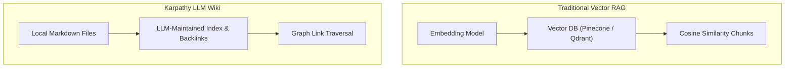

| Dimension | Karpathy LLM Wiki | Traditional Semantic Vector RAG |
|---|---|---|
| **Underlying Infrastructure** | Plain text Markdown files in local directory | Vector DB, embedding models, chunking pipeline |
| **Retrieval Mechanism** | Structural `index.md` traversal & backlink navigation | Cosine similarity matching over text chunks |
| **Token Efficiency** | **95% Token Reduction**: Reads concise index files first | High: Ingests multiple raw chunk embeddings |
| **Maintenance** | Run periodic LLM health check / lint | Re-embed entire corpus when data updates |
| **Scalability Limit** | Optimal for 100s to 1,000s of documents | Scales to millions of enterprise documents |

---

## 13. Dashboards with Artifacts & System KPIs (2:23:33 - 2:32:00)

### 13.1 Live Artifact Dashboards
- Claude Co-Work provides an interactive visual dashboard environment powered by React/HTML artifacts.
- Nate demonstrates real-time visual dashboards connecting to QuickBooks (revenue, net profit, cash on hand, runway analysis), ClickUp commitments (at-risk tasks, completion rates), and Fireflies meeting transcripts.

### 13.2 Proof of Concept (POC) Mindset
- **Rule of POC**: Never build a complex, custom React web app dashboard until you have proven utility using lightweight Claude Artifacts.
- If an operator checks a 5-minute Claude Artifact dashboard four times a day, only then allocate resources to build a dedicated web app dashboard.

### 13.3 Daily & Weekly Execution Loop

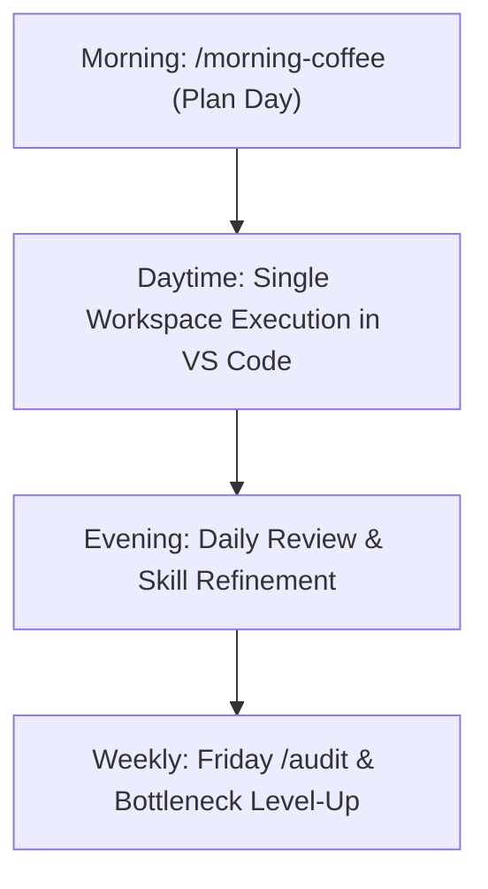

### 13.4 3 Core AIOS Success Criteria (KPIs)
1. **Team Query Shift**: Coworkers reach out directly to your AIOS service account (via ClickUp/Slack) for instant, accurate business answers instead of messaging you.
2. **Tab Consolidation**: The operator works almost exclusively inside VS Code / Claude Code without switching across browser tabs.
3. **Headspace Liberation**: Ideas, meeting notes, and deadlines are offloaded into the system, eliminating mental clutter.

---

## Technical Command Reference

| Command | Purpose | Output / Artifact |
|---|---|---|
| `/onboard` | Executes 7-question initial intake | Populates `context/about-business.md`, `about-me.md`, `priorities.md` |
| `/audit` | Evaluates four Cs health score | Generates health report and gap remediation list |
| `/level-up` | Conducts bottleneck interview | Identifies next custom skill candidate to build |
| `gws auth login` | Authenticates Google Workspace CLI | Enables Drive, Docs, Sheets, Slides terminal automation |
| `/loop` | Schedules session-bound interval or reminder | Spawns `cron_create` job in active terminal |
| `gws drive list` | Searches Google Drive files | Returns JSON list of files matching search query |

---

## Verbatim Master Quotes

- **Tool Agnosticism**: *"Build things to be tool-agnostic because tools change every 6 months... We are building the durable layer that sits underneath all these tools and buzzwords."* (2:26)
- **Mentor vs. Vending Machine**: *"Treat AI as a mentor, not a vending machine. Vending machines take a coin and give you something. Mentors ask questions, push back, and make you sharper."* (8:19)
- **Leverage Defined**: *"With Claude skills or any agent skills for that matter, you have way more leverage than if you were doing this by yourself."* (1:08:39)
- **Token Efficiency of Local Markdown**: *"Processing markdown files for your agent is so much quicker and cheaper than actually making API calls or HTTP requests."* (1:24:59)
- **POC Mindset**: *"Build something that's super easy and lightweight enough that it proves yes or no. Don't waste time investing into something that might not be proven yet."* (2:26:58)

---

## Metadata & File Links

- **Original Capture Source**: `[[01_RAW/SOURCE/Build & Sell Claude Code Operating Systems (2+ Hour Course).md]]`
- **Part 1 Note**: `[[01_RAW/PROCESS/detailed-study-notes-build-sell-claude-code-operating-systems-part-01.md]]`
- **Part 2 Note**: `[[01_RAW/PROCESS/detailed-study-notes-build-sell-claude-code-operating-systems-part-02.md]]`
- **Part 3 Note**: `[[01_RAW/PROCESS/detailed-study-notes-build-sell-claude-code-operating-systems-part-03.md]]`
- **Part 4 Note**: `[[01_RAW/PROCESS/detailed-study-notes-build-sell-claude-code-operating-systems-part-04.md]]`
