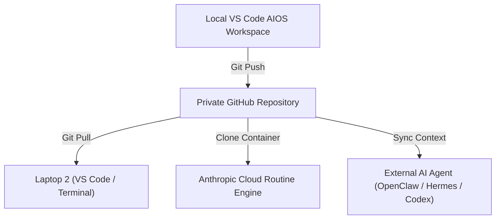
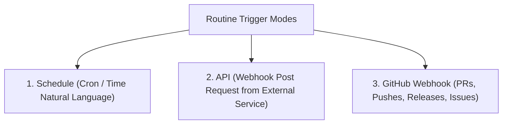
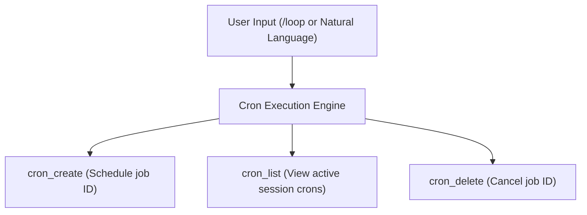

# Build & Sell Claude Code Operating Systems (2+ Hour Course) — Part 3

## Overview

- **Source Title**: Build & Sell Claude Code Operating Systems (2+ Hour Course)
- **Creator**: [[Nate Herk | AI Automation]]
- **Watch URL**: [YouTube Link](https://www.youtube.com/watch?v=bCljOfCH8Ms)
- **Segment Coverage**: Part 3 of 5 (`1:35:30 - 2:05:00`)
- **Primary Focus**: Cadence (The 4th C), GitHub Private Sync, Cloud Routines vs. Local Scheduled Tasks, Security & Network Policies, Native `/loop` & Cron Commands

---

## High-Fidelity Chronological Breakdown

### 1. Cadence & Cloud Routines Architecture (1:35:30 - 1:47:01)

#### 1.1 Cadence Definition
- **Cadence** is the final pillar of the Four Cs framework. It enables the AIOS to execute workflows autonomously while the laptop is closed, running on schedules, triggers, or webhooks.

#### 1.2 GitHub Repository as the Portable Operating System Layer



- Storing the entire AIOS in a private GitHub repository ensures complete multi-device synchronization.
- Any external agent harness (Claude Cloud, OpenClaw, Hermes, Codex) can clone the repo and execute workflows with full context.

#### 1.3 Local Routines vs. Cloud Routines

```mermaid
flowchart TD
    subgraph Local Routines
        L1["Requires Computer Awake"] --> L2["Runs in Local Desktop App"]
        L2 --> L3["Has Access to Local Files & Session Cookies"]
    end
    
    subgraph Cloud Routines (Remote Container)
        R1["Runs with Computer OFF"] --> R2["Clones Private GitHub Repo"]
        R2 --> R3["Stateless Execution (Ephemeral Container)"]
        R3 --> R4["Requires API Keys / Token Auth (No Local Cookies)"]
    end
```

#### 1.4 Critical Gotcha: Stateless Cloud Execution
- Cloud routines run inside isolated ephemeral Linux containers (4 vCPUs, 16 GB RAM, 30 GB disk).
- **Stateless Nature**: After the routine finishes, the container is destroyed. Local browser cookies or stateful session tokens are unavailable.
- **Requirement**: Authenticate all integrations via API tokens or headers stored in environment variables, not local browser sessions.

---

### 2. Deep Dive: Cloud Routines & Security Policies (1:47:01 - 1:56:38)

#### 2.1 Trigger Types



#### 2.2 Security & Outbound Network Rules
- **`trusted` Mode (Default)**: Outbound HTTP requests are strictly limited to Anthropic's pre-approved domain whitelist (GitHub, Google APIs, major cloud providers). Prevents prompt injection data exfiltration.
- **`full` Mode**: Allows unrestricted outbound HTTP connections. Recommended only for private, fully controlled inputs.

#### 2.3 Comprehensive Execution Engine Comparison Matrix

| Feature / Dimension | Cloud Routines | Desktop Scheduled Tasks | Native `/loop` Command |
|---|---|---|---|
| **Execution Location** | Anthropic Cloud Container | Local Desktop App | Local VS Code / Terminal Session |
| **Requires Computer Awake?** | **NO** (Runs 24/7) | YES | YES |
| **Persistence Across Restart** | YES | YES | **NO** (Killed on session close) |
| **Local File Access** | NO (GitHub repo only) | YES | YES |
| **Minimum Interval** | 1 Hour | Configurable (down to 1m) | Configurable (down to 1m) |
| **Quota / Plan Limits** | Pro: 5/day<br>Max: 15/day<br>Team: 25/day | Unlimited local runs | Unlimited local runs |
| **Container Hardware** | 4 vCPU, 16 GB RAM, 30 GB Disk | Host machine specs | Host machine specs |
| **Safety Lifecycle** | Ephemeral container | Persistent local state | 3-Day Maximum Expiry |

---

### 3. Native `/loop` & Cron Reminders (1:56:38 - 2:05:00)

#### 3.1 The `/loop` Skill Capabilities
The native `/loop` command enables operators to schedule recurring tasks or one-time reminders directly inside an active terminal or VS Code session.



#### 3.2 Recurring Intervals vs. One-Time Reminders
- **One-Time Reminder**: `recurring: false` — Triggered at a specific future timestamp (e.g., *"Remind me at 10:23 AM to check project"*), then auto-deletes.
- **Interval Loop**: `recurring: true` — Executes every $N$ minutes/hours (e.g., `every 10m` check ClickUp or review PRs).

#### 3.3 The 3-Day Safety Expiry Rule
- Every session loop enforces an automatic **3-Day Expiry Limit**.
- Prevents accidental infinite background processes from consuming token budgets indefinitely if a session is left open.

---

## Verbatim Quotes & Key Takeaways

- **24/7 Autonomy**: *"Cadence means that because you can now turn off your laptop and things will still run... you have routines that actually happen while you sleep, which is just absolutely awesome."* (1:35:37)
- **Agentic Cloud Execution**: *"Why this beats normal automation: we are actually keeping the agentic framework. In this case, we're keeping the W, the A, and the T all running together."* (1:54:41)
- **Loop vs. Schedule Decision Rule**: *"Do you need help right now on a project, or do you need help with something every day or every week? That's how you decide if you use loop or scheduled tasks."* (2:04:09)

---

## Metadata Links

- **Source File**: `[[01_RAW/SOURCE/Build & Sell Claude Code Operating Systems (2+ Hour Course).md]]`
- **Part 1 Reference**: `[[01_RAW/PROCESS/detailed-study-notes-build-sell-claude-code-operating-systems-part-01.md]]`
- **Part 2 Reference**: `[[01_RAW/PROCESS/detailed-study-notes-build-sell-claude-code-operating-systems-part-02.md]]`
