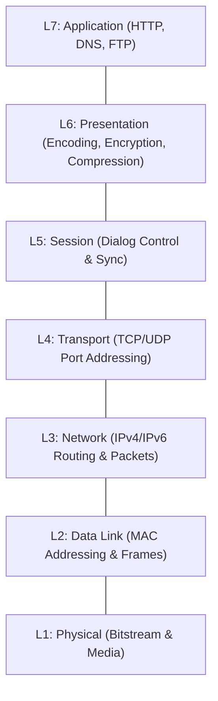
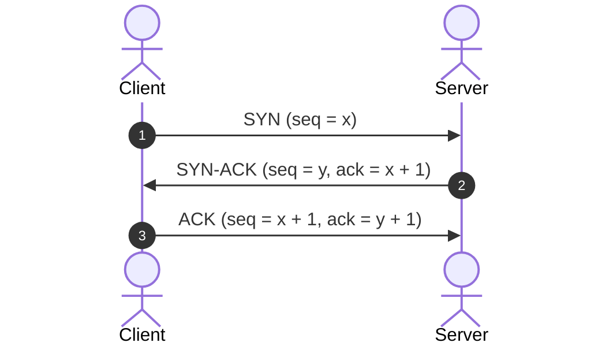

# Complete CN Computer Networks in one shot | Semester Exam | Hindi (Final Master Note)

## Executive Summary & Course Information
- **Source Video**: [Complete CN Computer Networks in one shot \| Semester Exam \| Hindi (YouTube)](https://www.youtube.com/watch?v=q3Z3Qa1UNBA)
- **Creator**: [[KnowledgeGATE by Sanchit Sir]]
- **Total Duration**: 6 hours 18 minutes (100% full coverage across all 5 chapters)
- **Document Nature**: Consolidated Final Master Study Note combining all 6 parts into a single publication-ready reference.

---

## 1. Fundamentals, OSI Model & Network Topologies (`0:00` – `55:30`)

### 1.1 Computer Network Definition & Goals
A **Computer Network** is a telecommunications network allowing autonomous digital devices to exchange data and share hardware/software resources (`2:25`).

#### 5 Primary Network Goals
1. **Communication**: Real-time email, messaging, video conferencing (`5:25`).
2. **Resource Sharing**: Shared hardware (printers) and software/data assets (`6:25`).
3. **Centralized Data Management**: Unified databases and backup recovery (`6:49`).
4. **Cost Efficiency**: Minimizes redundant hardware purchasing.
5. **Reliability & Availability**: Redundant links ensure fault-tolerant operation (`7:07`).

---

### 1.2 Transmission Modes & Components

| Mode | Communication Direction | Example | Timestamp |
|---|---|---|---|
| **Simplex** | Unidirectional | Radio Broadcast, Keyboard | `11:51` |
| **Half-Duplex** | Alternating Bidirectional | Walkie-Talkie | `12:16` |
| **Full-Duplex** | Simultaneous Bidirectional | Telephone, Switch | `13:23` |

---

### 1.3 Physical Topologies Reference Matrix

| Topology | Link Formula ($n$ nodes) | Primary Advantage | Primary Disadvantage | Timestamp |
|---|---|---|---|---|
| **Mesh** | $\frac{n(n-1)}{2}$ | Dedicated bandwidth, high security | High cabling cost & complexity (`18:11`) | `17:49` |
| **Star** | $n$ | Easy installation & reconfiguration | Single point of failure (Hub) (`19:29`) | `18:58` |
| **Bus** | $1 \text{ backbone} + n \text{ drops}$ | Low cabling cost | Single backbone failure crashes network | `20:02` |
| **Ring** | $n$ | Predictable token access | Link break collapses ring (`21:44`) | `21:20` |

---

### 1.4 The OSI 7-Layer Model

---

## 2. Data Link Layer, Error/Flow Control & MAC Protocols (`55:30` – `2:30:00`)

### 2.1 MAC Protocols Comparison

| Protocol | Sensing? | Collision Action | Efficiency ($\eta$) | Key Formula |
|---|---|---|---|---|
| **Pure ALOHA** | No | Backoff retry | $18.4\%$ | $V_{time} = 2 \cdot T_{fr}$ |
| **Slotted ALOHA** | No (Slots) | Retry next slot | $36.8\%$ | $V_{time} = T_{fr}$ |
| **CSMA / CD** | Yes | Jamming + Backoff | $\frac{1}{1 + 6.44a}$ | $T_t \ge 2 \cdot T_p \implies L_{min} = 2 \cdot T_p \cdot B$ |
| **CSMA / CA** | Yes | IFS + Contention Window | Wireless overhead | Standardized in 802.11 Wi-Fi |

---

### 2.2 Sliding Window Protocols (ARQ)

| Protocol | $W_s$ | $W_r$ | Out-of-Order Packets | Efficiency ($\eta$) |
|---|---|---|---|---|
| **Stop-and-Wait** | 1 | 1 | Discarded | $\frac{1}{1 + 2a}$ |
| **Go-Back-N (GBN)** | $2^m - 1$ | 1 | Discarded | $\frac{N}{1 + 2a}$ |
| **Selective Repeat (SR)** | $2^{m-1}$ | $2^{m-1}$ | Buffered | $\frac{W_s}{1 + 2a}$ |

---

### 2.3 Error Detection & Correction Math
- **Hamming Code Redundant Bits ($r$)**: $2^r \ge m + r + 1$
- **CRC Division**: Generator polynomial $G(x)$ of degree $r$ appends $r$ zeros to data; modulo-2 division yields FCS remainder.

---

## 3. Network Layer, Subnetting Math & Routing (`2:30:00` – `3:45:00`)

### 3.1 Classful IPv4 Addressing

| Class | Leading Bits | 1st Octet Range | NetID / HostID Split | Default Subnet Mask | Usable Hosts ($2^n - 2$) |
|---|---|---|---|---|---|
| **A** | `0` | `0 – 127` | 8 / 24 | `255.0.0.0` (`/8`) | $16,777,214$ |
| **B** | `10` | `128 – 191` | 16 / 16 | `255.255.0.0` (`/16`) | $65,534$ |
| **C** | `110` | `192 – 223` | 24 / 8 | `255.255.255.0` (`/24`) | $254$ |
| **D** | `1110` | `224 – 239` | Multicast | N/A | Reserved |
| **E** | `1111` | `240 – 255` | Experimental | N/A | Reserved |

---

### 3.2 Private IPv4 Address Ranges (RFC 1918)
- **Class A Private**: `10.0.0.0/8` (`10.0.0.0` – `10.255.255.255`)
- **Class B Private**: `172.16.0.0/12` (`172.16.0.0` – `172.31.255.255`)
- **Class C Private**: `192.168.0.0/16` (`192.168.0.0` – `192.168.255.255`)

---

### 3.3 Routing Algorithms: DVR vs LSR

| Feature | Distance Vector Routing (DVR) | Link State Routing (LSR) |
|---|---|---|
| **Algorithm** | Bellman-Ford | Dijkstra's Shortest Path First (SPF) |
| **Topology View** | Neighbors only | Global network graph (LSDB) |
| **Metric** | Hop count (max 15) | Cost / Bandwidth |
| **Convergence** | Slow (Count-to-Infinity problem) | Fast |
| **Protocols** | RIP | OSPF, IS-IS |

---

## 4. Transport Layer, TCP/UDP & Congestion Control (`3:45:00` – `5:00:00`)

### 4.1 TCP vs UDP

| Feature | TCP | UDP |
|---|---|---|
| **Connection** | Connection-oriented (3-way handshake) | Connectionless |
| **Reliability** | 100% Reliable (ACKs & Retransmissions) | Unreliable (Best effort) |
| **Data Unit** | Byte Stream | Discrete Datagrams |
| **Header Size** | 20 – 60 bytes | Fixed 8 bytes |

---

### 4.2 TCP 3-Way Handshake & Connection Teardown

---

### 4.3 Traffic Shaping & Congestion Control Algorithms
- **Leaky Bucket Algorithm**: Enforces constant output flow rate (`4:45:12`).
- **Token Bucket Algorithm**: Permits burst traffic up to token capacity.
- **TCP Slow Start Engine**: $cwnd$ doubles every RTT ($cwnd = 2^k$) until $ssthresh$, then grows linearly (Congestion Avoidance).

---

## 5. Application Protocols & Hardware Devices (`5:00:00` – `6:18:20`)

### 5.1 Master Protocol Table

| Protocol | Port | Transport | Purpose |
|---|---|---|---|
| **HTTP / HTTPS** | `80` / `443` | TCP | Web document retrieval & encrypted SSL/TLS transfer (`5:59:48`). |
| **DNS** | `53` | UDP/TCP | Domain Name resolution (`6:01:53`). |
| **FTP** | `20` / `21` | TCP | Dual-channel file transfer (`4:59:01`). |
| **SMTP / POP3 / IMAP** | `25` / `110` / `143` | TCP | Email transmission & mailbox retrieval (`4:59:01`). |
| **Telnet / SSH** | `23` / `22` | TCP | Remote CLI access (`6:05:55`). |

---

### 5.2 Network Devices Reference Table

| Device | Layer | Intelligence | Collision Domains | Broadcast Domains |
|---|---|---|---|---|
| **Repeater** | Layer 1 | Dummy amplifier | 1 | 1 |
| **Hub** | Layer 1 | Multi-port repeater | 1 | 1 |
| **Bridge** | Layer 2 | 2-port MAC filter | 2 | 1 |
| **Switch** | Layer 2 | Multi-port MAC switch | $N$ (1 per port) | 1 |
| **Router** | Layer 3 | IP Routing engine | $N$ | $N$ |
| **Gateway** | Layer 7 | Protocol converter | $N$ | $N$ |
| **Firewall** | Layers 3–7 | Security policy engine | $N$ | $N$ |

---

## Source Provenance & Structural Verification
- Original Raw Source File: `[[01_RAW/SOURCE/Complete CN Computer Networks in one shot  Semester Exam  Hindi.md]]`
- Individual Segment Notes:
  - [[detailed-study-notes-complete-cn-computer-networks-part-01.md|Part 1]]
  - [[detailed-study-notes-complete-cn-computer-networks-part-02.md|Part 2]]
  - [[detailed-study-notes-complete-cn-computer-networks-part-03.md|Part 3]]
  - [[detailed-study-notes-complete-cn-computer-networks-part-04.md|Part 4]]
  - [[detailed-study-notes-complete-cn-computer-networks-part-05.md|Part 5]]
  - [[detailed-study-notes-complete-cn-computer-networks-part-06.md|Part 6]]
