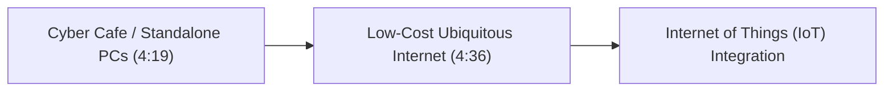
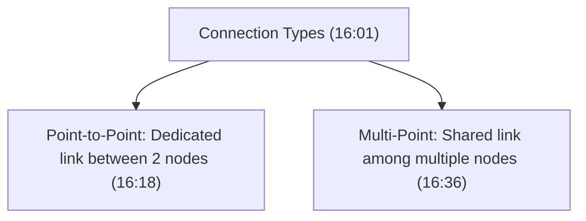
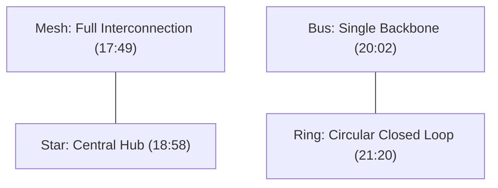
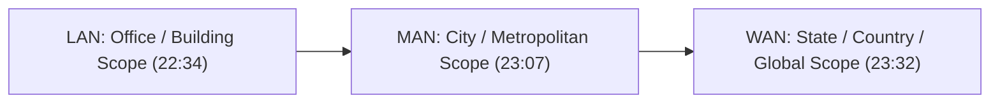

# Complete CN Computer Networks in one shot | Semester Exam | Hindi (Part 1)

## Executive Summary & Metadata
- **Source Video**: [Complete CN Computer Networks in one shot \| Semester Exam \| Hindi (YouTube)](https://www.youtube.com/watch?v=q3Z3Qa1UNBA)
- **Creator**: [[KnowledgeGATE by Sanchit Sir]]
- **Scope**: Part 1 of 6 (Timestamps `0:00` to `45:00`)
- **Key Focus**: Core Computer Networking Foundations, Goals, Applications, Data Communication 5-Component Model, Transmission Modes, Network Performance Criteria, Connection Types (Point-to-Point vs Multi-Point), Physical Topologies (Mesh, Star, Bus, Ring, Hybrid), and Scale Networks (LAN, MAN, WAN).

---

## 1. Computer Networks Definition & Foundational Ecosystem (`0:00` – `5:00`)

### 1.1 Formal Definition
A **Computer Network** is a telecommunications network consisting of autonomous digital devices interconnected to exchange data and share hardware/software resources via wired or wireless transmission media (`2:25`).

Key Characteristics:
- **Autonomous Devices**: Interconnected endpoints operate independently without master-slave hard dependencies (`2:47`).
- **Resource Sharing**: Enables shared hardware (e.g., networked printers) and software/data assets (e.g., cloud drives, centralized databases) (`3:16`).
- **Single Technology Integration**: Heterogeneous hardware/software endpoints communicate via standardized network protocols.

---

### 1.2 The Technological Paradigm & IoT Evolution (`3:43` – `5:00`)
The impact of computer networks evolved through distinct historical phases:
1. **Perimeter Phase (15–20 years ago)**: Internet access was confined to centralized cyber cafes and desktop terminals (`4:19`).
2. **Ubiquitous Phase (Present)**: High-speed, low-cost internet connectivity powers everyday consumer and industrial appliances.
3. **Internet of Things (IoT)**: Integration of embedded sensors, microcontrollers, and appliances into global network fabrics (`4:36`).



---

## 2. Core Goals & Real-World Applications (`5:00` – `9:15`)

### 2.1 The 5 Primary Goals of Computer Networks (`5:00` – `7:07`)

1. **Seamless Communication**: Facilitates real-time email, messaging, VoIP, and video conferencing (`5:25`).
2. **Resource Sharing**: Shared utilization of expensive hardware (servers, storage arrays) and software applications (`6:25`).
3. **Centralized Data Management**: Central databases allow unified data storage, automated backup, and instant remote accessibility (`6:49`).
4. **Cost Efficiency**: Eliminates redundant infrastructure by hosting central application servers accessible to all network nodes.
5. **High Reliability & Fault Tolerance**: Multiple redundant paths and backup nodes ensure high service availability (`7:07`).

---

### 2.2 Sector-Wise Applications (`7:07` – `9:15`)
- **Business & Commerce**: E-commerce portals (Amazon, Flipkart), inventory tracking, financial transactions.
- **Education & E-Learning**: Remote learning platforms, video lectures, collaborative research repositories (`7:53`).
- **Healthcare**: Telemedicine, remote diagnostic imaging, robotic surgery systems.
- **E-Governance**: Digital identity frameworks (Aadhaar, PAN), online tax portals, public service portals (`8:24`).
- **Hospitality & Transport**: Global GDS booking systems for railways, airlines, and hotels (`8:59`).

---

## 3. Data Communication & Transmission Modes (`9:15` – `14:00`)

### 3.1 The 5 Essential Components of Data Communication (`9:15` – `11:35`)

Data communication is the exchange of data between two nodes across a physical or wireless transmission medium.

```mermaid
flowchart LR
    Sender["Sender Node (10:04)"] -->|Message (9:44)| Medium["Transmission Medium (10:26)"]
    Medium --> Receiver["Receiver Node (10:04)"]
    Protocol["Protocols & Rules (10:46)"] -.->|Governs| Sender
    Protocol -.->|Governs| Receiver
```

1. **Message**: The payload or data being transmitted (text, audio, video, binary files) (`9:44`).
2. **Sender**: The node/device that initiates and transmits the data (`10:04`).
3. **Receiver**: The target node/device that receives the transmitted data (`10:04`).
4. **Transmission Medium**: Physical path (Twisted-pair, Coaxial, Fiber Optic) or Wireless channel (Radio waves, Infrared, Microwave) (`10:26`).
5. **Protocols**: Set of governing rules regulating syntax, semantics, and timing of communication (`10:46`).

---

### 3.2 Transmission Modes (`11:35` – `14:00`)

| Transmission Mode | Flow Direction | Technical Mechanics | Real-World Example | Timestamp |
|---|---|---|---|---|
| **Simplex** | Unidirectional | One node is a permanent sender; the other is a permanent receiver. | All India Radio, Keyboard to PC | `11:51` |
| **Half-Duplex** | Bidirectional (Alternating) | Both nodes can send and receive, but only one at a time. | Walkie-Talkies, Narrow mountain roads | `12:16` |
| **Full-Duplex** | Bidirectional (Simultaneous) | Both nodes can send and receive simultaneously over dual channels. | Mobile Phone calls, Full-duplex Ethernet | `13:23` |

---

## 4. Network Evaluation Criteria & Connection Types (`14:00` – `17:05`)

### 4.1 4 Critical Network Evaluation Criteria (`14:00` – `16:01`)

1. **Delivery & Accuracy**: Data must reach the correct destination without frame corruption or loss (`14:45`).
2. **Performance**: Measured by throughput, transmission speed, propagation delay, and bandwidth capacity (`15:14`).
3. **Reliability & Availability**: Frequency of failures, Mean Time To Failure (MTTF), and speed of failure recovery.
4. **Security**: Protecting data against unauthorized interception, tampering, and malicious access (`15:29`).

---

### 4.2 Physical Connection Types (`16:01` – `17:05`)



- **Point-to-Point Connection**: Dedicated physical link strictly between two devices (`16:18`).
- **Multi-Point (Multi-drop) Connection**: Single shared physical medium leveraged by three or more devices simultaneously (`16:36`).

---

## 5. Physical Network Topologies (`17:05` – `22:34`)

Network topology refers to the geometric layout and physical/logical arrangement of nodes and links (`17:05`).



### Detailed Topology Comparison Matrix

| Topology | Geometric Layout | Link Count Formula ($n$ nodes) | Primary Advantages | Primary Disadvantages | Timestamp |
|---|---|---|---|---|---|
| **Mesh** | Every node connects directly to every other node. | $\frac{n(n-1)}{2}$ dedicated links | Dedicated bandwidth, zero traffic congestion, high security, instant fault isolation. | Extremely expensive, excessive wiring, highly complex installation (`18:11`). | `17:49` |
| **Star** | All nodes connect to a central hub/switch. | $n$ links | Easy installation, simple reconfiguration, failure of one node doesn't break network. | Single point of failure (if central hub fails, whole network crashes) (`19:29`). | `18:58` |
| **Bus** | Nodes attach to a single central backbone cable via drop lines. | $1$ main backbone + $n$ drop lines | Low cabling cost, simple deployment for small networks. | Difficult fault isolation; backbone break crashes the entire network (`20:21`). | `20:02` |
| **Ring** | Nodes form a closed circular loop; data flows unidirectionally. | $n$ links | Simple setup; predictable access control via token passing. | Unidirectional delay; single link/node break collapses the whole ring (`21:44`). | `21:20` |
| **Hybrid** | Combination of two or more distinct topologies (e.g., Star-Bus). | Variable | Flexible, scalable for large enterprise networks (`22:34`). | Complex configuration and maintenance. | `22:34` |

---

## 6. Network Scale Classification: LAN, MAN, WAN (`22:34` – `24:00`)



1. **LAN (Local Area Network)**: Covers a small geographical area (home, office building, college lab). High data rates, low delay, private ownership (`22:34`).
2. **MAN (Metropolitan Area Network)**: Covers a city or metropolitan region (e.g., city cable TV network, municipal campus network) (`23:07`).
3. **WAN (Wide Area Network)**: Covers large geographical spans (states, countries, continents). Interconnects multiple LANs via routers and public carriers (e.g., Global Internet) (`23:32`).

---

## Source Provenance & Archival Link
- Original Raw Transcript File: `[[01_RAW/SOURCE/Complete CN Computer Networks in one shot  Semester Exam  Hindi.md]]`
