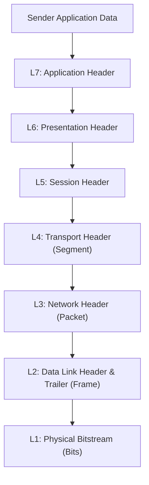
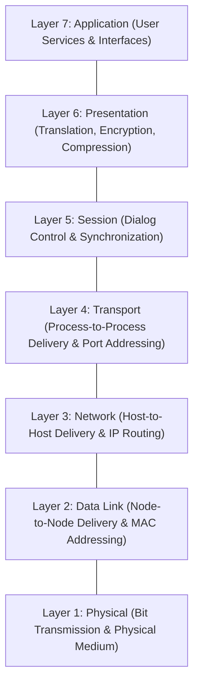
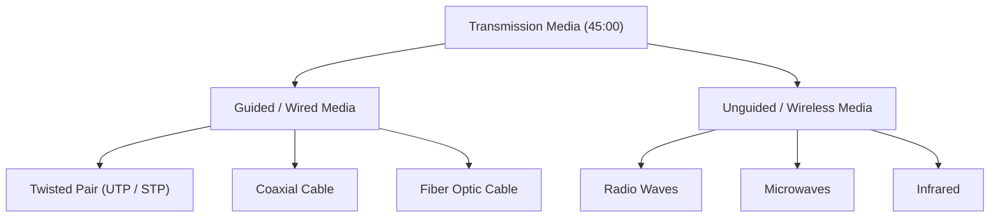
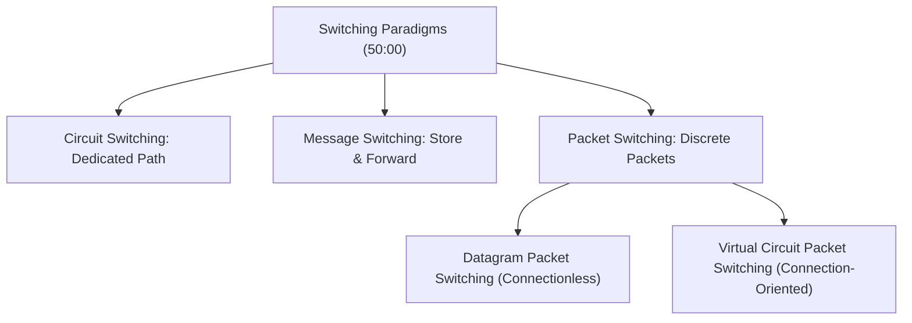

# Complete CN Computer Networks in one shot | Semester Exam | Hindi (Part 2)

## Executive Summary & Metadata
- **Source Video**: [Complete CN Computer Networks in one shot \| Semester Exam \| Hindi (YouTube)](https://www.youtube.com/watch?v=q3Z3Qa1UNBA)
- **Creator**: [[KnowledgeGATE by Sanchit Sir]]
- **Scope**: Part 2 of 6 (Timestamps `45:00` to `1:30:00`)
- **Key Focus**: The OSI 7-Layer Reference Model Architecture, Layer-by-Layer Operational Duties, Encapsulation/Decapsulation Data Flows, Transmission Media (Guided vs Unguided), Switching Paradigms (Circuit, Message, Packet Switching), and ISDN Architecture.
- **Continuity**: Continuation from [[detailed-study-notes-complete-cn-computer-networks-part-01.md|Part 1]].

---

## 1. The OSI 7-Layer Reference Model Architecture (`24:00` – `30:19`)

### 1.1 Architectural Origin & Purpose
Developed by the International Organization for Standardization (ISO), the Open Systems Interconnection (OSI) model decomposes the complex process of networking into seven discrete functional layers (`24:32`).

Key Principles:
- **Abstraction & Decoupling**: Each layer performs specialized tasks and communicates strictly with adjacent layers through standardized interfaces.
- **Layered Encapsulation**: As data moves down the protocol stack at the sender side, each layer prepends a header (and Layer 2 appends a trailer) (`28:27`).

---

## 2. Layer-by-Layer Operational Duties Matrix (`30:38` – `45:00`)

### Comprehensive OSI Layer Duties Reference Table

| Layer # | Layer Name | Data Unit (PDU) | Core Addressing | Primary Duties & Responsibilities | Timestamp |
|---|---|---|---|---|---|
| **7** | **Application** | Data | User Interface | Network virtual terminal, File Transfer (FTP), Email Services (SMTP), Web Services (HTTP), DNS resolution (`42:00`). | `42:00` |
| **6** | **Presentation** | Data | Syntax / Encoding | Data Translation (ASCII/EBCDIC), Encryption/Decryption, Compression/Decompression (`40:00`). | `40:00` |
| **5** | **Session** | Data | Session ID | Dialog Control (half-duplex/full-duplex sessions), Session Synchronization & Checkpointing (`38:00`). | `38:00` |
| **4** | **Transport** | Segment | Port Number (16-bit) | Process-to-Process delivery, Segment reassembly, Connection Control (TCP/UDP), Flow & Error Control (`36:00`). | `36:00` |
| **3** | **Network** | Packet | IP Address (32/128-bit) | Host-to-Host delivery, Logical Addressing, Packet Routing, Congestion Control (`35:05`). | `35:05` |
| **2** | **Data Link** | Frame | MAC Address (48-bit) | Node-to-Node frame delivery, Framing, Physical Addressing, Access Control, Flow & Error Control (`32:56`). | `32:56` |
| **1** | **Physical** | Bit | Physical Pinout | Bit representation (analog/digital conversion), Data Transmission Rate, Line Configuration, Physical Topology (`30:38`). | `30:38` |

---

## 3. Transmission Media Classification (`45:00` – `50:00`)

Transmission media are the physical or wireless channels through which data travels between endpoints.

### 3.1 Guided (Wired) Media
- **Twisted-Pair Cable**: Insulated copper wires twisted together to cancel electromagnetic interference (EMI). Types: Unshielded Twisted Pair (UTP) and Shielded Twisted Pair (STP).
- **Coaxial Cable**: Solid copper core surrounded by an insulating layer, braided metal shield, and outer jacket. Used in cable TV networks.
- **Fiber Optic Cable**: Transmits data as pulses of light through glass/plastic core using Total Internal Reflection. High bandwidth, immune to EMI. Types: Single-mode and Multi-mode.

### 3.2 Unguided (Wireless) Media
- **Radio Waves**: Omnidirectional waves operating between 3 kHz and 1 GHz; penetrate walls easily.
- **Microwaves**: Directional high-frequency waves (1 GHz to 300 GHz); require line-of-sight propagation.
- **Infrared**: Short-range directional signals (300 GHz to 400 THz); cannot penetrate solid walls.

---

## 4. Switching Paradigms: Circuit, Message & Packet Switching (`50:00` – `53:49`)

Switching is the process of forwarding data across intermediate network nodes.

### Detailed Switching Comparison Matrix

| Property | Circuit Switching | Message Switching | Datagram Packet Switching | Virtual Circuit Packet Switching |
|---|---|---|---|---|
| **Path Reservation** | Dedicated physical circuit established prior to data transfer (`50:15`). | None; dynamic node-to-node routing. | None; independent packet routing. | Logical virtual path reserved before transmission (`53:18`). |
| **Data Unit** | Continuous bitstream. | Entire message block. | Discrete fixed/variable packets. | Discrete packets. |
| **Delay** | High initial setup delay; zero propagation variance during transfer. | High store-and-forward delay at intermediate nodes. | Low initial delay; variable per-packet queuing delay. | Moderate setup delay; low per-packet queuing delay. |
| **Bandwidth Utilization** | Inefficient; reserved channel remains idle during pauses. | Efficient; shared link utilization. | Highly efficient; dynamic link sharing. | Efficient; shared Virtual Circuit IDs (VCIs). |
| **Packet Order** | Guaranteed in-order arrival. | Guaranteed in-order arrival. | Out-of-order arrival possible; reassembly required. | Guaranteed in-order arrival. |

---

## 5. Integrated Services Digital Network (ISDN) (`53:49` – `55:30`)

### 5.1 Architecture & Concept
Introduced in the late 1980s, ISDN was an early digital telecommunications standard designed to carry simultaneous voice, video, and data traffic over traditional copper telephone networks (`53:49`).

### 5.2 Channel Types & Service Interfaces
- **B-Channel (Bearer Channel)**: Carries user data/voice at 64 kbps per channel (`54:29`).
- **D-Channel (Delta Channel)**: Carries out-of-band signaling and control data at 16 kbps or 64 kbps.

#### Service Interfaces Table

| Interface Type | Channel Composition | Total Bitrate | Target User | Timestamp |
|---|---|---|---|---|
| **BRI (Basic Rate Interface)** | $2\text{B} + 1\text{D} \text{ (16 kbps)}$ | $144 \text{ kbps}$ | Residential / Small Business | `54:57` |
| **PRI (Primary Rate Interface - US)** | $23\text{B} + 1\text{D} \text{ (64 kbps)}$ | $1.544 \text{ Mbps}$ | Large Enterprises / PBX Systems | `54:57` |
| **PRI (Primary Rate Interface - EU)** | $30\text{B} + 1\text{D} \text{ (64 kbps)}$ | $2.048 \text{ Mbps}$ | European Enterprise Networks | `54:57` |

---

## Source Provenance & Archival Link
- Original Raw Transcript File: `[[01_RAW/SOURCE/Complete CN Computer Networks in one shot  Semester Exam  Hindi.md]]`
- Prerequisites: [[detailed-study-notes-complete-cn-computer-networks-part-01.md|Part 1 Note]]
