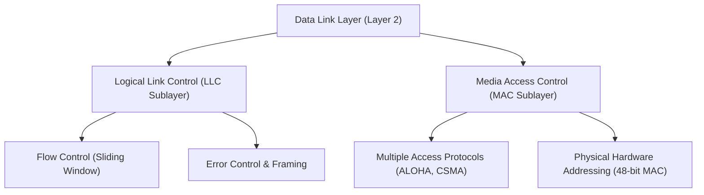
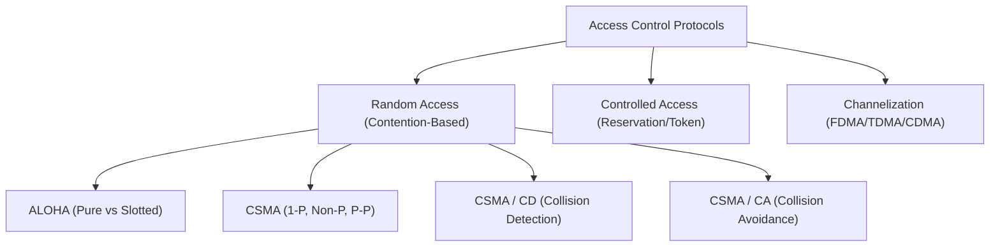
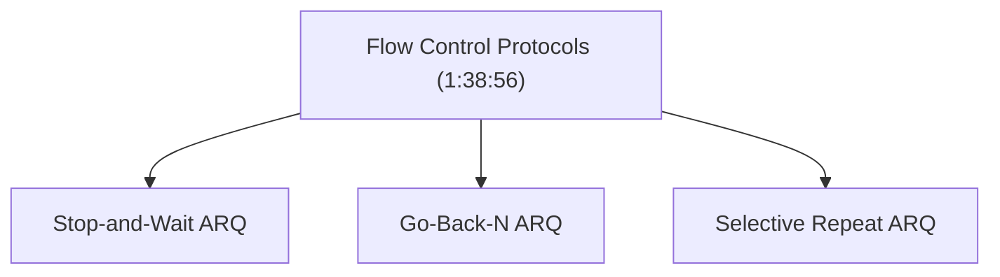

# Complete CN Computer Networks in one shot | Semester Exam | Hindi (Part 3)

## Executive Summary & Metadata
- **Source Video**: [Complete CN Computer Networks in one shot \| Semester Exam \| Hindi (YouTube)](https://www.youtube.com/watch?v=q3Z3Qa1UNBA)
- **Creator**: [[KnowledgeGATE by Sanchit Sir]]
- **Scope**: Part 3 of 6 (Timestamps `1:30:00` to `2:30:00`)
- **Key Focus**: Data Link Layer Architecture (MAC vs LLC), Random Access Protocols (ALOHA, Slotted ALOHA, CSMA, CSMA/CD, CSMA/CA), Channel Efficiency Formulas, Sliding Window Protocols (Stop-and-Wait, Go-Back-N ARQ, Selective Repeat ARQ), and Error Detection/Correction Techniques (Parity, Checksum, CRC, Hamming Code).
- **Continuity**: Continuation from [[detailed-study-notes-complete-cn-computer-networks-part-02.md|Part 2]].

---

## 1. Data Link Sublayer Architecture: MAC vs LLC (`55:30` – `57:00`)

The Data Link Layer is divided into two distinct functional sublayers:

1. **LLC Sublayer (Logical Link Control)**: Upper half (`56:21`). Handles flow control (sliding window protocols), error detection/correction mechanisms, and framing protocol multiplexing.
2. **MAC Sublayer (Media Access Control)**: Lower half (`55:52`). Manages medium access control over shared media, collision handling algorithms, physical MAC addressing (48-bit), and Ethernet frame formatting.

---

## 2. Multiple Access Protocols Tree & Performance (`57:00` – `1:38:56`)

### 2.1 Protocol Taxonomy Tree
Access control protocols resolve transmission contention on shared broadcast channels (`57:00`).

---

### 2.2 Detailed Comparison Matrix of Random Access Protocols

| Protocol | Sensing Required? | Collision Handling | Efficiency Formula | Key Condition / Formula | Timestamp |
|---|---|---|---|---|---|
| **Pure ALOHA** | No sensing (`1:05:33`) | Backoff timer retry | $\eta = G \cdot e^{-2G} \implies \mathbf{18.4\%}$ max | Vulnerable time $= 2 \cdot T_{fr}$ | `1:05:02` |
| **Slotted ALOHA** | Synchronized slots | Retry at next slot | $\eta = G \cdot e^{-G} \implies \mathbf{36.8\%}$ max | Vulnerable time $= T_{fr}$ | `1:05:33` |
| **CSMA / CD** | Sense before + during sents (`1:30:14`) | Jamming signal + Truncated Binary Exponential Backoff | $\eta = \frac{1}{1 + 6.44a}$ where $a = \frac{T_p}{T_t}$ | $T_t \ge 2 \cdot T_p \implies L_{min} = 2 \cdot T_p \cdot B$ | `1:31:39` |
| **CSMA / CA** | Sense before send (`1:35:27`) | Avoidance via IFS, Contention Window, ACK | High overhead in wireless networks | Leveraged in IEEE 802.11 Wi-Fi | `1:35:58` |

---

### 2.3 Critical CSMA/CD Minimum Frame Length Equation
To reliably detect a collision before frame transmission finishes:
$$T_t \ge 2 \cdot T_p$$
Where:
- $T_t = \frac{\text{Length of Frame } (L)}{\text{Bandwidth } (B)}$
- $T_p = \frac{\text{Distance } (d)}{\text{Propagation Speed } (v)}$

Thus, Minimum Frame Size ($L_{min}$):
$$L_{min} = 2 \cdot T_p \cdot B$$

---

## 3. Flow & Error Control: Sliding Window Protocols (`1:38:56` – `1:46:37`)

Sliding window protocols ensure that a fast sender does not overwhelm a slow receiver.

### Detailed ARQ Protocol Performance & Window Matrix

| Protocol Property | Stop-and-Wait ARQ | Go-Back-N (GBN) ARQ | Selective Repeat (SR) ARQ |
|---|---|---|---|
| **Sender Window Size ($W_s$)** | $1$ | $N = 2^m - 1$ | $2^{m-1}$ |
| **Receiver Window Size ($W_r$)** | $1$ | $1$ | $W_s = 2^{m-1}$ |
| **Out-of-Order Packets** | Discarded | Discarded | Buffered by receiver |
| **Retransmission Scope** | Only lost frame | Entire window of $N$ unACKed frames | Only specific corrupted/lost frame |
| **Acknowledgement Type** | Cumulative / Individual | Cumulative ACK | Selective / Individual ACK |
| **Channel Efficiency ($\eta$)** | $\eta = \frac{1}{1 + 2a}$ | $\eta = \frac{N}{1 + 2a}$ | $\eta = \frac{W_s}{1 + 2a}$ |

Where $a = \frac{T_p}{T_t}$.

---

## 4. Error Detection & Correction Techniques (`1:46:37` – `2:30:00`)

### 4.1 4 Primary Error Detection Techniques

1. **Single-Bit Parity Check**: Appends a parity bit to achieve even/odd total 1s. Detects single-bit errors.
2. **2D Block Parity**: Organizes bits into a grid and computes row and column parities. Detects burst errors up to 2 bits.
3. **Checksum**: Sums $k$-bit data words using 1's complement arithmetic and appends the inverted sum.
4. **Cyclic Redundancy Check (CRC)**: Polynomial binary division using XOR operations.
   - Generator Polynomial $G(x)$ of degree $r$ appends $r$ zero bits to data payload.
   - Remainder after modulo-2 division is appended as Frame Check Sequence (FCS).

---

### 4.2 Error Correction: Hamming Code Math

Hamming code places $r$ redundant parity bits at bit positions corresponding to powers of 2 ($1, 2, 4, 8, \dots, 2^k$).

Formula for required redundant bits ($r$) given data length ($m$):
$$2^r \ge m + r + 1$$

- **Error Detection Capacity**: Can detect up to $d$ errors if minimum Hamming distance $d_{min} \ge d + 1$.
- **Error Correction Capacity**: Can correct up to $t$ errors if minimum Hamming distance $d_{min} \ge 2t + 1$.

---

## Source Provenance & Archival Link
- Original Raw Transcript File: `[[01_RAW/SOURCE/Complete CN Computer Networks in one shot  Semester Exam  Hindi.md]]`
- Prerequisites: [[detailed-study-notes-complete-cn-computer-networks-part-02.md|Part 2 Note]]
