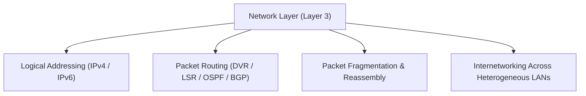
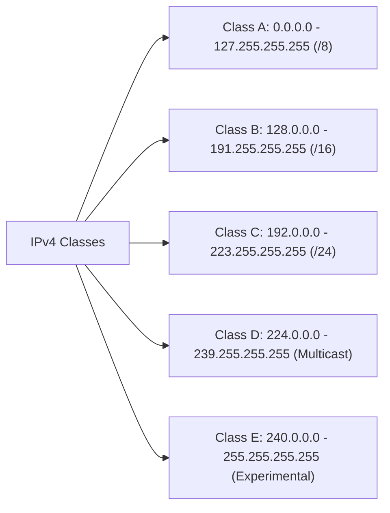
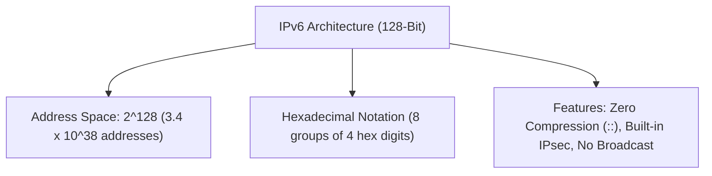
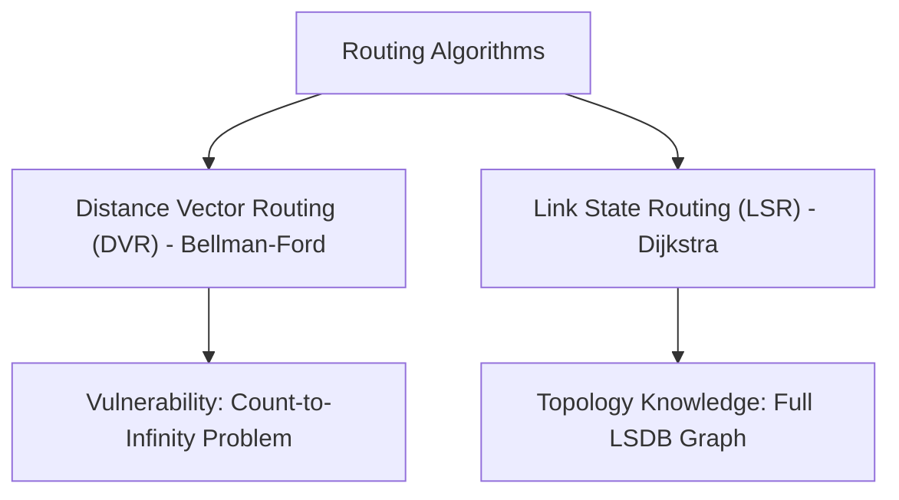

# Complete CN Computer Networks in one shot | Semester Exam | Hindi (Part 4)

## Executive Summary & Metadata
- **Source Video**: [Complete CN Computer Networks in one shot \| Semester Exam \| Hindi (YouTube)](https://www.youtube.com/watch?v=q3Z3Qa1UNBA)
- **Creator**: [[KnowledgeGATE by Sanchit Sir]]
- **Scope**: Part 4 of 6 (Timestamps `2:30:00` to `3:45:00`)
- **Key Focus**: Network Layer Architecture, IPv4 Addressing, Classful vs Classless (CIDR) Subnetting Math, RFC 1918 Private Ranges, Usable Hosts Formula ($2^n - 2$), IPv6 128-bit Architecture, and Routing Algorithms (Distance Vector Routing DVR vs Link State Routing LSR).
- **Continuity**: Continuation from [[detailed-study-notes-complete-cn-computer-networks-part-03.md|Part 3]].

---

## 1. Network Layer Responsibilities & Logical Addressing (`2:30:00` – `2:45:00`)

### 1.1 Core Network Layer Duties
The Network Layer (Layer 3) handles host-to-host delivery across disparate networks.

1. **Logical Addressing**: Provides globally unique IP addresses to endpoints.
2. **Routing**: Selects optimal transmission paths across routers via routing algorithms.
3. **Fragmentation & Reassembly**: Splits large IP packets exceeding MTU (Maximum Transmission Unit).
4. **Internetworking**: Connects diverse physical and data link layer networks.

---

## 2. IPv4 Addressing & Subnetting Architecture (`2:45:00` – `3:15:00`)

### 2.1 IPv4 Address Format
- **Address Space**: 32-bit binary number ($2^{32} \approx 4.29 \times 10^9$ total addresses).
- **Dotted-Decimal Notation**: 4 octets separated by dots (e.g., `192.168.1.1`).

---

### 2.2 Classful Addressing Architecture Matrix

| Class | Leading Bits | 1st Octet Range | Network / Host Split | Default Subnet Mask | Max Networks | Max Hosts per Network |
|---|---|---|---|---|---|---|
| **A** | `0` | `0 – 127` | 8 bits NetID / 24 bits HostID | `255.0.0.0` (`/8`) | $128$ ($2^7$) | $16,777,214$ ($2^{24} - 2$) |
| **B** | `10` | `128 – 191` | 16 bits NetID / 16 bits HostID | `255.255.0.0` (`/16`) | $16,384$ ($2^{14}$) | $65,534$ ($2^{16} - 2$) |
| **C** | `110` | `192 – 223` | 24 bits NetID / 8 bits HostID | `255.255.255.0` (`/24`) | $2,097,152$ ($2^{21}$) | $254$ ($2^8 - 2$) |
| **D** | `1110` | `224 – 239` | Multicast Group ID | N/A | Reserved | N/A |
| **E** | `1111` | `240 – 255` | Experimental / R&D | N/A | Reserved | N/A |

---

### 2.3 RFC 1918 Private IPv4 Ranges Table

| Class | Private Address Range | Subnet Mask | Total Private Addresses |
|---|---|---|---|
| **Class A** | `10.0.0.0` to `10.255.255.255` | `255.0.0.0` (`/8`) | $16,777,216$ |
| **Class B** | `172.16.0.0` to `172.31.255.255` | `255.240.0.0` (`/12`) | $1,048,576$ |
| **Class C** | `192.168.0.0` to `192.168.255.255` | `255.255.0.0` (`/16`) | $65,536$ |

---

### 2.4 Subnetting & CIDR Calculation Formulas
- **Usable Hosts Formula**: $N_{usable} = 2^n - 2$ (where $n$ is number of host bits).
  - Subtract 1 for Network Address (all host bits 0).
  - Subtract 1 for Directed Broadcast Address (all host bits 1).
- **Subnet Mask to CIDR Conversion**: Count number of continuous `1`s from MSB.

---

## 3. IPv6 Architecture (`3:15:00` – `3:25:00`)

### Key Differences: IPv4 vs IPv6

| Feature | IPv4 | IPv6 |
|---|---|---|
| **Address Length** | 32 bits (4 bytes) | 128 bits (16 bytes) |
| **Address Space** | $\sim 4.3 \times 10^9$ | $\sim 3.4 \times 10^{38}$ |
| **Format** | Dotted-decimal (e.g., `192.168.1.1`) | Colon-hexadecimal (e.g., `2001:db8::1`) |
| **Broadcast Support** | Yes (Broadcast) | Replaced by Multicast & Anycast |
| **Header Size** | Variable (20–60 bytes) | Fixed 40 bytes (faster routing) |
| **Security** | IPsec optional | IPsec natively integrated |

---

## 4. Routing Algorithms: DVR vs LSR (`3:25:00` – `3:45:00`)

Routing algorithms determine optimal packet transmission paths across autonomous systems.

### Detailed Routing Algorithm Comparison Matrix

| Property | Distance Vector Routing (DVR) | Link State Routing (LSR) |
|---|---|---|
| **Underlying Algorithm** | Bellman-Ford Algorithm | Dijkstra's Shortest Path First (SPF) |
| **Topology View** | Knows neighbors only ("routing by rumor"). | Complete global network topology graph. |
| **Metric** | Hop Count (typically max 15 hops). | Cost / Bandwidth / Delay. |
| **Update Frequency** | Periodic full routing table exchanges. | Event-triggered Link State Advertisements (LSAs). |
| **Convergence Speed** | Slow convergence. | Fast convergence. |
| **Known Vulnerability** | **Count-to-Infinity Problem** (Mitigated by Split Horizon & Poison Reverse). | High memory/CPU utilization for LSDB graph calculations. |
| **Real-World Protocols** | RIP (Routing Information Protocol). | OSPF (Open Shortest Path First), IS-IS. |

---

## Source Provenance & Archival Link
- Original Raw Transcript File: `[[01_RAW/SOURCE/Complete CN Computer Networks in one shot  Semester Exam  Hindi.md]]`
- Prerequisites: [[detailed-study-notes-complete-cn-computer-networks-part-03.md|Part 3 Note]]
