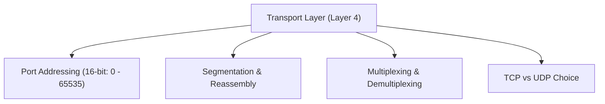
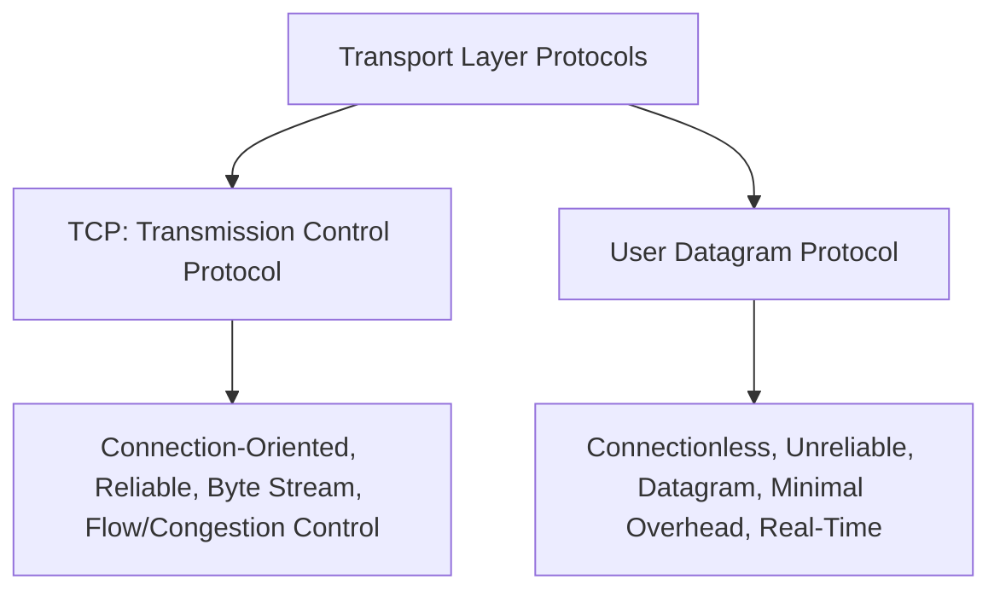
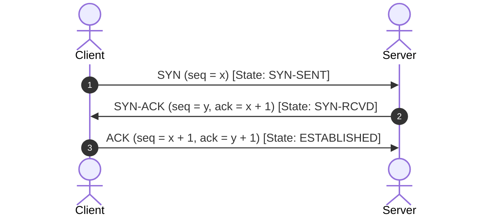
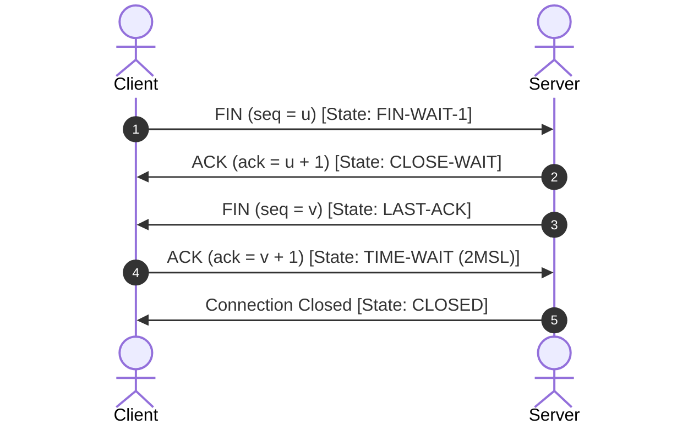
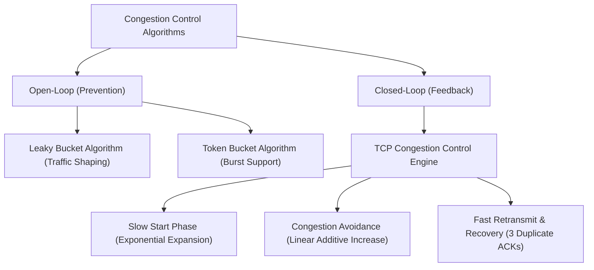

# Complete CN Computer Networks in one shot | Semester Exam | Hindi (Part 5)

## Executive Summary & Metadata
- **Source Video**: [Complete CN Computer Networks in one shot \| Semester Exam \| Hindi (YouTube)](https://www.youtube.com/watch?v=q3Z3Qa1UNBA)
- **Creator**: [[KnowledgeGATE by Sanchit Sir]]
- **Scope**: Part 5 of 6 (Timestamps `3:45:00` to `5:00:00`)
- **Key Focus**: Transport Layer Architecture, Process-to-Process Delivery, 16-bit Port Addressing, TCP vs UDP Protocol Analysis, TCP 3-Way Handshake, Connection Termination, TCP State Machine, Congestion Control (Leaky Bucket, Token Bucket, Slow Start, Congestion Avoidance, Fast Retransmit/Recovery), and Socket Programming.
- **Continuity**: Continuation from [[detailed-study-notes-complete-cn-computer-networks-part-04.md|Part 4]].

---

## 1. Transport Layer Architecture & Port Addressing (`3:45:00` – `4:00:00`)

The Transport Layer (Layer 4) provides process-to-process communication.

### Port Address Space Classification
- **Well-Known Ports (0 – 1023)**: Reserved for system processes and core network services (HTTP: 80, HTTPS: 443, FTP: 20/21, SSH: 22, DNS: 53).
- **Registered Ports (1024 – 49151)**: Allocated for specific user/vendor applications.
- **Dynamic/Ephemeral Ports (49152 – 65535)**: Assigned dynamically by client operating systems for temporary connection sessions.

---

## 2. TCP vs UDP Protocol Comparison Matrix (`4:00:00` – `4:20:00`)

### Comprehensive Protocol Comparison Matrix

| Property | TCP (Transmission Control Protocol) | UDP (User Datagram Protocol) |
|---|---|---|
| **Connection Type** | Connection-oriented (3-way handshake) (`4:05:12`). | Connectionless (no setup/teardown). |
| **Reliability** | 100% Reliable (ACKs, Retransmissions). | Unreliable (Best-effort delivery). |
| **Data Flow Unit** | Continuous Byte Stream. | Discrete Independent Datagrams. |
| **Header Overhead** | Variable 20 to 60 bytes. | Fixed 8 bytes. |
| **Flow Control** | Yes (Sliding Window / Receiver Window `rwnd`). | None. |
| **Congestion Control** | Yes (Congestion Window `cwnd`, Slow Start). | None. |
| **Transmission Speed** | Slower (higher processing overhead). | Fast (minimal latency). |
| **Typical Protocols** | HTTP/HTTPS, FTP, SSH, SMTP, Telnet. | DNS, DHCP, VoIP, Streaming Video, TFTP. |

---

## 3. TCP Connection Lifecycle & State Machine (`4:20:00` – `4:40:00`)

### 3.1 TCP 3-Way Handshake Connection Establishment

---

### 3.2 TCP Connection Teardown (4-Way Waveform)

---

## 4. Congestion Control Algorithms (`4:40:00` – `5:00:00`)

Congestion occurs when aggregate input traffic to network routers exceeds physical channel link capacities.

### 4.1 Traffic Shaping: Leaky Bucket vs Token Bucket

| Traffic Shaping Algorithm | Mechanism | Burst Support? | Key Application |
|---|---|---|---|
| **Leaky Bucket** | Regulates bursty traffic into a constant, fixed output flow rate (`4:45:12`). | No; excess packets overflowing bucket are dropped. | Traffic policing and smoothing. |
| **Token Bucket** | Tokens accumulate in bucket at rate $r$. Transmission requires consuming 1 token per byte/packet. | Yes; permits burst transmissions up to bucket capacity $B$. | High-speed quality-of-service (QoS) shaping. |

---

### 4.2 TCP Congestion Control Engine Mechanics
- **Slow Start Phase**: Starts with $cwnd = 1 \text{ MSS}$. For every received ACK, $cwnd$ doubles every Round Trip Time ($cwnd = 2^k$).
- **Slow Start Threshold ($ssthresh$)**: When $cwnd \ge ssthresh$, TCP transitions from Slow Start to Congestion Avoidance.
- **Congestion Avoidance Phase**: $cwnd$ grows linearly by $1 \text{ MSS}$ per RTT (Additive Increase).
- **Timeout Event**: Upon packet loss timeout, $ssthresh = \frac{cwnd}{2}$ and $cwnd$ drops to $1 \text{ MSS}$ (Multiplicative Decrease).
- **3 Duplicate ACKs Event (Fast Retransmit)**: Retransmits missing segment immediately; sets $ssthresh = \frac{cwnd}{2}$ and $cwnd = ssthresh + 3 \text{ MSS}$ (Fast Recovery).

---

## Source Provenance & Archival Link
- Original Raw Transcript File: `[[01_RAW/SOURCE/Complete CN Computer Networks in one shot  Semester Exam  Hindi.md]]`
- Prerequisites: [[detailed-study-notes-complete-cn-computer-networks-part-04.md|Part 4 Note]]
