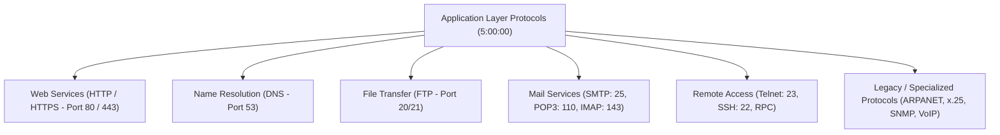
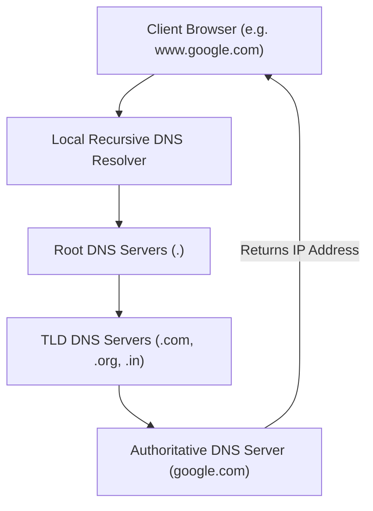
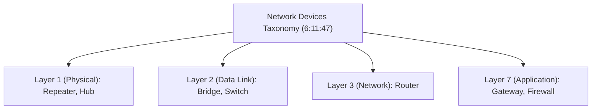

# Complete CN Computer Networks in one shot | Semester Exam | Hindi (Part 6)

## Executive Summary & Metadata
- **Source Video**: [Complete CN Computer Networks in one shot \| Semester Exam \| Hindi (YouTube)](https://www.youtube.com/watch?v=q3Z3Qa1UNBA)
- **Creator**: [[KnowledgeGATE by Sanchit Sir]]
- **Scope**: Part 6 of 6 (Timestamps `5:00:00` to `6:18:20`)
- **Key Focus**: Application Layer Protocols (HTTP/HTTPS, DNS Hierarchy, FTP, SMTP, POP3, IMAP, Telnet, ARPANET, x.25, SNMP, VoIP, RPC) and Interconnection Network Devices (Firewall, Repeater, Hub, Bridge, Switch, Router, Gateway).
- **Continuity**: Continuation from [[detailed-study-notes-complete-cn-computer-networks-part-05.md|Part 5]].

---

## 1. Application Layer Protocols Architecture (`5:00:00` – `6:11:47`)

The Application Layer (Layer 7) provides direct software interfaces for end-user applications and services.

---

### 1.1 Master Application Layer Protocol Reference Table

| Protocol Name | Full Name | Port Number | Underlying Transport | Primary Function & Characteristics | Timestamp |
|---|---|---|---|---|---|
| **HTTP** | HyperText Transfer Protocol | `80` | TCP | Web document retrieval; Stateless protocol; HTTP/1.0 (Non-persistent) vs HTTP/1.1 (Persistent) (`5:59:48`). | `5:59:48` |
| **HTTPS** | HTTP Secure | `443` | TCP | HTTP over SSL/TLS encryption for privacy and integrity (`6:01:21`). | `6:01:21` |
| **DNS** | Domain Name System | `53` | UDP & TCP | Domain name to IP address resolution (`6:01:53`). | `6:01:53` |
| **FTP** | File Transfer Protocol | `20` (Data), `21` (Control) | TCP | Dual-connection reliable file transfer protocol (`4:59:01`). | `4:59:01` |
| **SMTP** | Simple Mail Transfer Protocol | `25` | TCP | Push protocol for sending email between mail servers. | `4:59:01` |
| **POP3** | Post Office Protocol v3 | `110` | TCP | Mail retrieval protocol; downloads and deletes emails from server. | `4:59:01` |
| **IMAP** | Internet Message Access Protocol | `143` | TCP | Mail retrieval protocol; synchronizes email across multiple devices. | `4:59:01` |
| **Telnet** | Telecommunication Network | `23` | TCP | Unencrypted remote CLI terminal access (`6:05:55`). | `6:05:55` |
| **ARPANET** | Advanced Research Projects Agency Network | N/A | Packet Switched | First WAN packet-switched network created in 1969 by US DoD (`6:07:21`). | `6:07:21` |
| **x.25** | ITU-T x.25 Standard | N/A | Virtual Circuit | Legacy 1970s WAN protocol for low-speed lines (ATM/Credit cards) (`6:08:18`). | `6:08:18` |
| **SNMP** | Simple Network Management Protocol | `161` / `162` | UDP | Remote network device monitoring and management (`6:08:57`). | `6:08:57` |
| **VoIP** | Voice over IP | Variable | UDP (RTP/SIP) | Voice and video calling over IP networks (`6:09:28`). | `6:09:28` |
| **RPC** | Remote Procedure Call | `135` | TCP/UDP | Executes subroutine/procedure on a remote server (`6:10:56`). | `6:10:56` |

---

### 1.2 DNS Resolution Hierarchy Architecture (`6:01:53` – `6:05:39`)

1. **Root DNS Servers**: 13 root server clusters worldwide managing top-level domain pointers (`6:03:57`).
2. **Top-Level Domain (TLD) Servers**: Manage generic TLDs (`.com`, `.org`, `.edu`) and country code TLDs (`.in`, `.us`, `.uk`) (`6:04:20`).
3. **Authoritative DNS Servers**: Hold canonical mapping records (`A`, `AAAA`, `CNAME`, `MX`) for specific domains (`6:04:53`).

---

## 2. Interconnection Network Hardware Devices (`6:11:47` – `6:18:20`)

Network devices operate at specific OSI layers to interconnect and control data flow.

### Comprehensive Network Devices Comparison Matrix

| Device Name | Primary OSI Layer | Hardware Intelligence | Traffic Handling | Collision Domains | Broadcast Domains | Timestamp |
|---|---|---|---|---|---|---|
| **Repeater** | Layer 1 (Physical) | Dummy signal amplifier (`6:12:34`). | Regenerates degraded signals; no packet inspection. | 1 | 1 | `6:12:34` |
| **Hub** | Layer 1 (Physical) | Multi-port repeater (`6:13:24`). | Broadcasts incoming frames to ALL other ports. | 1 | 1 | `6:13:24` |
| **Bridge** | Layer 2 (Data Link) | 2-port MAC filter (`6:13:51`). | Filters traffic using MAC address table. | 2 | 1 | `6:13:51` |
| **Switch** | Layer 2 (Data Link) | Multi-port intelligent bridge (`6:14:07`). | Micro-segmented unicast forwarding using CAM table. | $N$ (1 per port) | 1 | `6:14:07` |
| **Router** | Layer 3 (Network) | IP routing engine (`6:15:13`). | Forwards packets between different networks using Routing Tables. | $N$ (1 per port) | $N$ (1 per port) | `6:15:13` |
| **Gateway** | Layer 7 (Application) | Multi-protocol converter (`6:15:49`). | Protocol conversion across disparate system architectures. | $N$ | $N$ | `6:15:49` |
| **Firewall** | Layers 3 – 7 | Security policy engine (`6:11:47`). | Filters incoming/outgoing traffic based on IP/port rules. | $N$ | $N$ | `6:11:47` |

---

## 3. Course Summary & Final Review (`6:16:33` – `6:18:20`)
This single-shot computer networking course provides 100% comprehensive coverage of semester exam requirements:
1. **Basics & Topologies**: Fundamentals, OSI 7-Layer Model, Physical Topologies, Transmission Modes.
2. **Data Link Layer**: Framing, Error Detection/Correction (Parity, Hamming Code, CRC, Checksum), Flow Control (Sliding Window ARQ), MAC Protocols (ALOHA, CSMA/CD, CSMA/CA).
3. **Network Layer**: IPv4 Classful/Classless (CIDR) Subnetting, IPv6, Routing Algorithms (DVR vs LSR).
4. **Transport Layer**: TCP vs UDP, TCP 3-Way Handshake, TCP State Diagram, Congestion Control (Leaky Bucket, Token Bucket, Slow Start).
5. **Application Layer & Hardware**: Protocol Matrix (HTTP, DNS, FTP, SMTP), Network Devices (Firewall, Switch, Router, Gateway).

---

## Source Provenance & Archival Link
- Original Raw Transcript File: `[[01_RAW/SOURCE/Complete CN Computer Networks in one shot  Semester Exam  Hindi.md]]`
- Prerequisites: [[detailed-study-notes-complete-cn-computer-networks-part-05.md|Part 5 Note]]
