# Complete Networking Tutorial 2026 | Beginner to Advanced (Cybersecurity Focus)

> **Creator**: [[WsCube Cyber Security]] (Presenter: Pawli Sharma)  
> **Source Link**: [YouTube](https://www.youtube.com/watch?v=ewtDKmovou4)  
> **Source Type**: YouTube Masterclass Transcript  

---

## 📖 Overview

Computer networking constitutes the indispensable operational foundation for cybersecurity, ethical hacking, cloud architecture (AWS, Azure), DevOps engineering, network administration, and modern software development. This comprehensive masterclass provides a complete end-to-end technical grounding in computer networking—progressing systematically from core internet principles and hardware topology to advanced protocol mechanics, stateful handshakes, cryptographic controls, web traffic analysis, and anonymity networks.

All explanations originally delivered in code-switched Hinglish have been translated into precise, technical English prose without losing any architectural rigor, empirical metrics, or mathematical calculations.

---

## 📌 Detailed Section Breakdown

### 1. Introduction & Universal Relevance of Networking (00:00 - 01:40)

Network infrastructure governs every digital exchange on the internet—from sending instant messages on WhatsApp to streaming video streams on YouTube (00:00). Understanding how data packets are constructed, routed, and delivered across global networks is a prerequisite for all advanced IT domains:

- **Ethical Hacking & Penetration Testing** (00:33): Before attacking or auditing a target system, a practitioner must systematically map its internal and perimeter network structure.
- **Cybersecurity & Threat Detection** (00:33): Detecting intrusive attacks, anomalous behavioral patterns, and data exfiltration requires deep packet-level traffic analysis.
- **Cloud Computing & DevOps** (01:03): Architecting resilient environments in AWS or Azure demands robust knowledge of Virtual Private Clouds (VPCs), subnets, routing tables, and security groups.
- **Network Engineering & Systems Development** (01:03): Managing core hardware infrastructure (routers, switches, firewalls) and building socket-level applications requires mastery over fundamental protocols.

---

### 2. Networking Fundamentals & Historical Evolution (01:40 - 12:20)

**Networking Definition**: Networking is the interconnectivity of computing systems to enable seamless data communication and resource sharing through standardized protocols and structured addressing schemes (07:19).


#### Historical Milestones of Networking (02:43 - 04:34)

| Epoch / Year | Milestone / Invention | Core Description & Impact (Timestamp) |
|---|---|---|
| **1960s** | ARPANET | Created by the US Department of Defense (DARPA); connected 4 universities in the first computer network (02:43). |
| **1970s** | TCP/IP Protocol Suite | Inception of the fundamental protocol model that governs modern internet packet communications (03:15). |
| **1980s** | DNS (Domain Name System) | Invention of the hierarchical system mapping human-readable domain names to IP addresses (03:48). |
| **1990s** | World Wide Web (WWW) | Inception of WWW; internet opened for public and commercial utilization worldwide (03:58). |
| **2000s** | Mainstream Wi-Fi | Widespread deployment of wireless networking standards across residential and corporate environments (04:11). |
| **2010s** | Cloud Computing | Massive explosion of centralized cloud infrastructure and video/data streaming over high-speed networks (04:22). |
| **2020s** | 5G & IoT Ecosystem | Rollout of ultra-low latency 5G cellular infrastructure and pervasive Internet of Things (IoT) connectivity (04:34). |

**Internet of Things (IoT)** (04:59): Encompasses any physical device equipped with sensors, processing ability, and network interface cards connected to the internet. Examples include CCTV security cameras, smart home appliances, mobile phones, laptops, and smartwatches (05:17).

#### Primary Network Security Attack Vectors (07:32 - 12:04)

1. **Packet Sniffing & Traffic Analysis** (07:44): An attacker placed on a shared or unencrypted network segment intercepts raw data packets. If plaintext traffic is intercepted, sensitive credentials or data are compromised. If encrypted (ciphertext), attackers attempt cryptanalysis or traffic flow analysis to uncover structural vulnerabilities (08:40).
2. **Protocol Exploitation** (09:47): Flaws or inherent design assumptions in network protocols (e.g., TCP, UDP, DNS, ARP) are exploited to execute session hijacking, ARP spoofing, or DNS cache poisoning (10:07).
3. **Network Reconnaissance** (10:16): Automated scanning of target IP spaces using tools like Nmap to enumerate active live hosts, open TCP/UDP ports, operating system fingerprints, and running service versions (10:59).
4. **Firewall Evasion** (11:12): Bypassing perimeter security rulesets by manipulating IP packet headers, leveraging fragmentation, or using covert tunnels to penetrate protected internal networks (12:04).

---

### 3. Types of Networks & Global Subsea Infrastructure (12:20 - 18:00)

Networks are categorized according to their geographic reach, administrative ownership, and security containment boundaries:

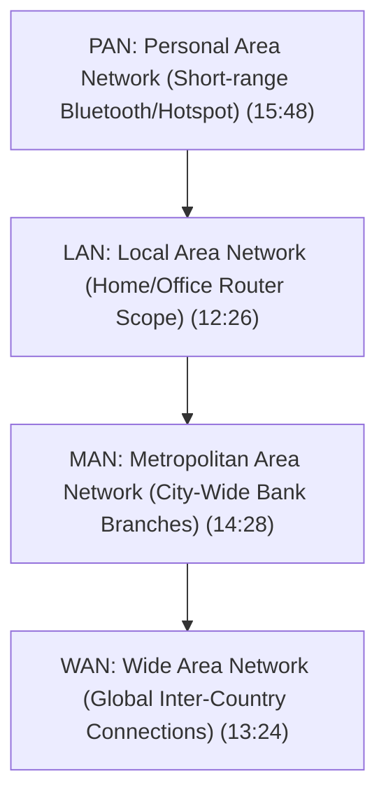

| Network Type | Full Form | Geographic Coverage Scope | Primary Use Case & Security Profile (Timestamp) |
|---|---|---|---|
| **LAN** | Local Area Network | Small (Single home, office floor, or building) | Connects local endpoints via Wi-Fi or Ethernet switches. Highly secure due to restricted physical range (12:26). |
| **MAN** | Metropolitan Area Network | Medium (Across a municipality or city) | Connects multiple corporate/banking branches across a city via dedicated leased lines for heightened security (14:28). |
| **WAN** | Wide Area Network | Large (Across states, countries, and continents) | Global inter-network connecting millions of discrete LANs together. Utilizes public/private gateway routers (13:24). |
| **PAN** | Personal Area Network | Micro (Within 10 meters of an individual) | Short-range personal device coupling (e.g., smartphone tethered to a laptop, Bluetooth headphones) (15:48). |

**Undersea Fiber Optic Submarine Cables** (16:26): Global wireless connectivity is a common misconception. Wireless links operate only between local end-user client devices and nearby Wi-Fi routers or cellular cell towers (16:56). All inter-city, cross-border, and inter-continental WAN communications rely on high-capacity fiber optic cable systems submerged across ocean floors (17:29).

---

### 4. Core Network Interconnection Hardware (18:00 - 23:25)

Network hardware devices operate across specific layers of the OSI model to route, switch, filter, and modulate network traffic:

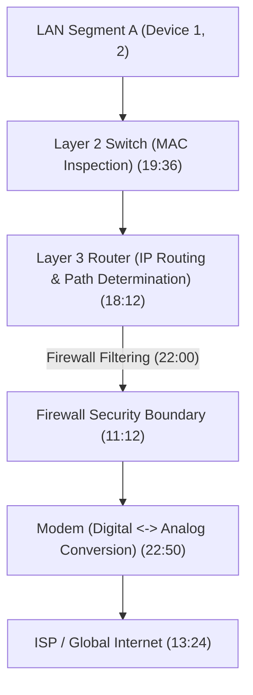

| Network Device | Primary Layer | Core Operational Functionality (Timestamp) | Key Distinction / Characteristics |
|---|---|---|---|
| **Router** | Layer 3 (Network) | Forwards data packets between distinct LANs using logical IP addresses. Performs dynamic path determination (18:12). | Interconnects different subnets/networks (18:41). |
| **Switch** | Layer 2 (Data Link) | Connects endpoints within a single LAN. Inspects frames and selectively forwards traffic using MAC address tables (19:36). | Intelligent intra-network delivery; eliminates packet collisions (20:04). |
| **Hub** | Layer 1 (Physical) | Legacy device that retransmits incoming raw electrical signals to all connected physical ports (20:22). | Non-intelligent broadcasting; causes traffic congestion & security leaks; deprecated (21:37). |
| **Firewall** | Layers 3–7 | Filters incoming and outgoing network traffic based on predefined access control rulesets (22:00). | Guards against unauthorized external network access (22:30). |
| **Modem** | Layer 1 / Physical | Converts digital computer signals (0s and 1s) into analog signals for ISP transmission line media and vice versa (22:50). | Essential for broad-area internet connectivity (23:07). |
| **Access Point (AP)** | Layer 2 / Physical | Transmits and receives wireless radio frequency signals to connect Wi-Fi client endpoints to a wired LAN (23:07). | Extends local network reach wirelessly without physical cables. |

---

### 5. Logical IP Addressing vs Physical MAC Addressing (23:25 - 27:00)

Every network endpoint relies on two distinct addressing identification formats:

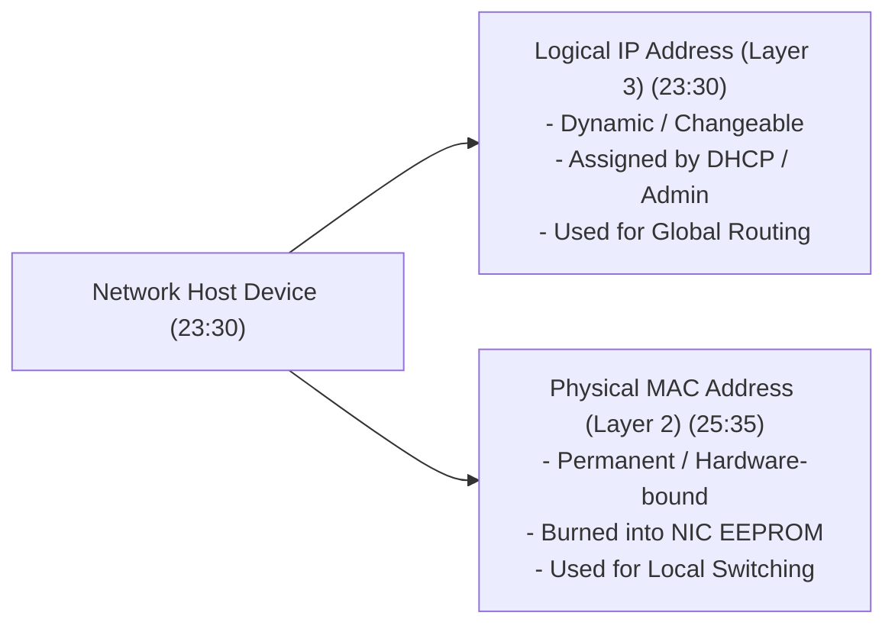

| Attribute | IP Address (Internet Protocol) | MAC Address (Media Access Control) |
|---|---|---|
| **Address Type** | Logical Address (23:30) | Physical Hardware Address (25:35) |
| **Permanence** | Dynamic / Variable across networks (23:53) | Permanent / Burned into NIC hardware (26:08) |
| **Assignment** | Assigned by Network Admin or DHCP (25:08) | Assigned by Hardware Manufacturer at factory (26:08) |
| **Scope of Use** | Inter-network routing across WAN / Internet (25:22) | Intra-network switching within local LAN (26:37) |
| **Format** | Dotted-decimal (IPv4) / Hexadecimal (IPv6) | 48-bit Hexadecimal notation (e.g., `00:1A:2B:3C:4D:5E`) |

---

### 6. IPv4 vs IPv6 Architectural Deep Dive (27:00 - 35:55)

The Internet Protocol has evolved through two primary operational standards:

| Parameter / Feature | IPv4 (Internet Protocol Version 4) | IPv6 (Internet Protocol Version 6) |
|---|---|---|
| **Bit Length** | 32 Bits (27:44) | 128 Bits (29:07) |
| **Notation Format** | Dotted-decimal (4 Octets separated by dots) (28:02) | Colon-separated Hexadecimal (8 blocks of 4 hex digits) (29:38) |
| **Address Space Size** | \(2^{32} \approx 4.29 \times 10^9\) (~4.29 Billion) (28:40) | \(2^{128} \approx 3.4 \times 10^{38}\) (Virtually unlimited) (29:07) |
| **Numerical Range** | Each octet ranges from `0` to `255` (29:58) | Each block uses `0–9` and `A–F` (29:38) |
| **Sample Address** | `192.168.10.11` (27:44) | `2001:0db8:85a3:0000:0000:8a2e:0370:7334` (29:07) |

#### Local Verification Command (30:24)
To inspect the active network interface IP configurations on a Windows operating system, execute:
```cmd
ipconfig
```
This output reveals the local IPv4 Address, IPv6 Address, Subnet Mask, and Default Gateway interface addresses (30:42).

#### The IPv4 Exhaustion Crisis (31:47)
With a global human population exceeding 8 billion and individuals owning multiple connected devices (smartphones, laptops, smartwatches, IoT nodes), the 4.29 billion IPv4 address limit is mathematically insufficient (32:21). IPv6 solves this limitation entirely. However, IPv4 remains widely deployed due to legacy infrastructure compatibility and mitigation mechanisms like NAT (Network Address Translation) (33:38).

---

### 7. Public vs Private IP Addressing & Static vs Dynamic IP Assignment (35:55 - 42:40)

#### Public vs Private IP Taxonomy (35:55 - 39:45)

- **Public IP Address** (36:03): Globally unique, publicly routable across the internet. Assigned by Internet Service Providers (ISPs) to router WAN interfaces and public servers (e.g., web servers). Verifiable via `whatismyip.com` (38:06).
- **Private IP Address** (36:46): Non-routable across the public internet. Used exclusively within local networks (LANs) to identify internal hosts.
- **Fundamental Communication Rule** (37:09): Private IP endpoints can communicate directly only with other private IP endpoints within the same LAN. Public IP endpoints communicate directly only across public networks. Routers using NAT bridge private LAN endpoints to public internet endpoints (39:34).

#### Static vs Dynamic IP Allocation (39:45 - 42:40)

| Allocation Type | Assignment Mechanism | Permanence & Cost | Primary Operational Use Case (Timestamp) |
|---|---|---|---|
| **Static IP** | Manually configured by Network Administrator | Fixed, permanent, non-changing; expensive to lease (40:04). | Public web servers (e.g., Google DNS `8.8.8.8`), corporate infrastructure, local printers (40:41). |
| **Dynamic IP** | Automatically allocated by DHCP server | Temporary, lease-based, subject to renewal/change (41:16). | End-user consumer devices (smartphones, personal laptops, home workstations) (41:32). |

---

### 8. Classful IPv4 Addressing Architecture (42:40 - 49:35)

IPv4 addresses comprise two logical components: a **Network Portion** (identifying the parent network) and a **Host Portion** (identifying the specific host device on that network) (43:15).

```text
IPv4 Octet Structure: [ Octet 1 ] . [ Octet 2 ] . [ Octet 3 ] . [ Octet 4 ]
                      |----------- Network / Host Division ------------|
```

| Class | First Octet Numerical Range | Network Bits | Host Bits | Default Subnet Mask | Usable Host Capacity per Network (Timestamp) | Primary Scope |
|---|---|---|---|---|---|---|
| **Class A** | `1` – `126` | 8 Bits (1 Octet) | 24 Bits (3 Octets) | `255.0.0.0` | \(2^{24} - 2 \approx 16,777,214\) (45:13) | Extremely large enterprise / ISP networks |
| **Class B** | `128` – `191` | 16 Bits (2 Octets) | 16 Bits (2 Octets) | `255.255.0.0` | \(2^{16} - 2 = 65,534\) (45:42) | Medium-sized corporate networks |
| **Class C** | `192` – `223` | 24 Bits (3 Octets) | 8 Bits (1 Octet) | `255.255.255.0` | \(2^8 - 2 = 254\) (46:13) | Small business and residential LANs (46:54) |
| **Class D** | `224` – `239` | N/A | N/A | N/A | Multicast Only (47:33) | Reserved for Multicast Traffic groups |
| **Class E** | `240` – `255` | N/A | N/A | N/A | Experimental Only (47:49) | Reserved for Research and Future R&D |

*Note*: The first octet value `127` (`127.0.0.0/8`) is strictly reserved for local host loopback testing (e.g., `127.0.0.1`).

---

### 9. CIDR (Classless Inter-Domain Routing) & Subnetting (49:35 - 56:38)

#### Inefficiency of Classful Addressing & CIDR Solution (48:44 - 51:51)
Classful addressing wastes millions of IP addresses (e.g., an organization requiring 300 hosts would be forced to take a Class B network with 65,534 hosts, wasting over 65,000 addresses) (49:15). **CIDR (Classless Inter-Domain Routing)** eliminates fixed class boundaries by explicitly appending a prefix length (`/N`) to denote the exact number of network bits (49:35).

- `/24` Prefix: `255.255.255.0` -> 24 Network Bits, 8 Host Bits (254 hosts) (50:01).
- `/16` Prefix: `255.250.0.0` -> 16 Network Bits, 16 Host Bits (65,534 hosts) (50:27).
- `/26` Prefix: `255.255.255.192` -> 26 Network Bits, 6 Host Bits (62 usable hosts per subnet) (52:21).
- `/30` Prefix: `255.255.255.252` -> 30 Network Bits, 2 Host Bits (2 usable hosts; ideal for point-to-point router links) (53:21).

#### Subnetting Mechanics (53:29 - 56:08)
Subnetting partitions a single broad network block into smaller, isolated subnets to enhance network security, reduce broadcast domain noise, and improve administrative management (54:21).

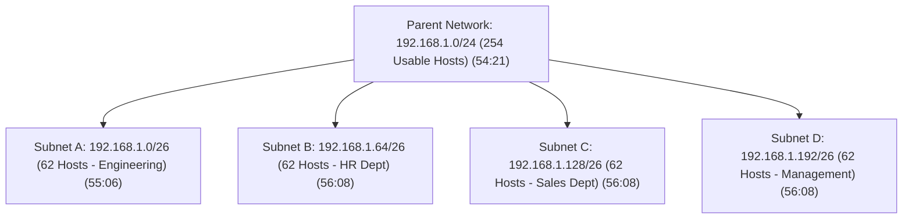

---

### 10. Network Address Translation (NAT) Operational Mechanics (56:38 - 01:02:20)

NAT enables private LAN devices (using non-routable private IPs like `192.168.x.x`) to access public internet resources through a single public IP address assigned to the gateway router (56:38).

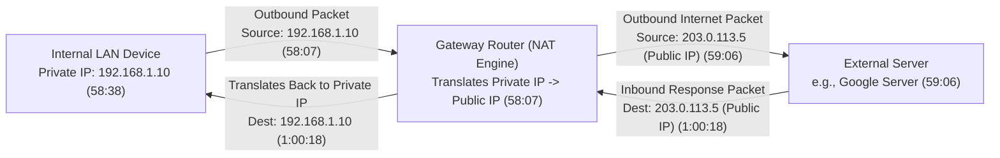

**Dual Benefits of NAT** (01:00:41):
1. **IPv4 Preservation**: Hundreds of internal corporate endpoint devices share one single public IP address (01:01:23).
2. **Perimeter Security Masking**: Internal IP addresses remain hidden from external public reconnaissance.

---

### 11. Protocols and Port Numbers (01:02:20 - 01:08:00)

- **Protocol Definition**: Standardized set of rules and governing specifications that dictate how data is formatted, transmitted, and processed across interconnected systems (01:03:15).
- **Port Definition**: A logical channel/door inside an operating system that routes incoming packet data to a specific software application process running on that host (01:04:15). IP addresses route data to the host device; Port numbers route data to the target application (01:04:44).

#### Virtual Port Ranges (01:06:05 - 01:07:37)
Every network interface supports **65,535 virtual ports** categorized into three standard ranges:

1. **Well-Known Ports** (`0 – 1023`): Reserved for core system protocols (e.g., HTTP 80, HTTPS 443, SSH 22, DNS 53) (01:06:39).
2. **Registered Ports** (`1024 – 49151`): Assigned to specific vendor applications or services (01:07:09).
3. **Dynamic / Ephemeral / Private Ports** (`49152 – 65535`): Temporarily allocated by the client OS as source ports when initiating outbound connections (01:07:37).

---

### 12. OSI 7-Layer Model vs TCP/IP 4-Layer Architecture (01:08:00 - 01:16:40)

The **OSI (Open Systems Interconnection)** model is a conceptual 7-layer framework for understanding network protocol communications (01:08:13). The **TCP/IP** suite is the practical, commercial 4-layer protocol model implemented across the global internet (01:14:16).

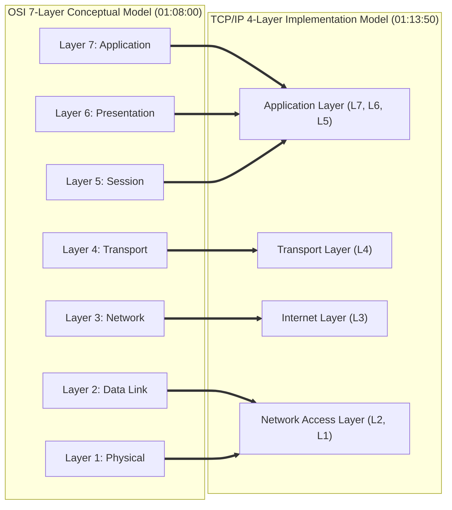

#### Layer-by-Layer Architectural Breakdown (01:08:45 - 01:13:37)

| OSI Layer | Name | Core Responsibilities & Data Unit (Timestamp) | Associated Protocols & Hardware |
|---|---|---|---|
| **Layer 7** | Application | Provides user interface interfaces and network service entry points (01:08:45). *Data Unit: Data* | HTTP, HTTPS, FTP, DNS, SSH, SMTP (01:09:11) |
| **Layer 6** | Presentation | Formats, translates, encrypts/decrypts, and compresses data (01:09:31). *Data Unit: Data* | SSL/TLS, ASCII, JPEG, MPEG (01:09:51) |
| **Layer 5** | Session | Establishes, manages, synchronizes, and terminates inter-application sessions (01:10:08). *Data Unit: Data* | NetBIOS, RPC, Sockets |
| **Layer 4** | Transport | Manages end-to-end data transmission, segmentation, flow control, and error recovery (01:10:26). *Data Unit: Segment* | TCP, UDP (01:10:51) |
| **Layer 3** | Network | Manages logical IP addressing, packet routing, and optimal path selection (01:12:36). *Data Unit: Packet* | IPv4, IPv6, ICMP, IPsec, Routers (01:12:36) |
| **Layer 2** | Data Link | Handles physical MAC addressing, frame encapsulation, and node-to-node hop transfer (01:13:06). *Data Unit: Frame* | Ethernet, ARP, Switches, NICs (01:13:06) |
| **Layer 1** | Physical | Transmits raw binary bitstreams over physical media (electrical, optical, RF) (01:13:37). *Data Unit: Bit* | Fiber Optic, Copper Cables, Hubs (01:13:37) |

---

### 13. TCP vs UDP Protocols Comparison (01:16:40 - 01:21:30)

Transport Layer communications rely on two contrasting protocol mechanics:

| Operational Feature | TCP (Transmission Control Protocol) | UDP (User Datagram Protocol) |
|---|---|---|
| **Connection State** | Connection-oriented (Requires 3-way handshake prior to data transfer) (01:17:42) | Connectionless (Sends datagrams immediately without handshake) (01:19:51) |
| **Delivery Reliability** | Guaranteed delivery via ACK packets and retransmissions (01:18:14) | Best-effort delivery; no delivery guarantee or ACKs (01:20:21) |
| **Data Ordering** | Strict packet sequencing and reordering (01:18:46) | No packet sequencing; packets may arrive out of order (01:20:56) |
| **Error Checking** | Extensive error detection and packet recovery (01:18:14) | Minimal checksum validation; corrupted packets dropped (01:20:21) |
| **Speed & Overhead** | Slower transmission due to header overhead and state tracking (01:18:14) | Ultra-fast transmission with minimal header overhead (01:19:51) |
| **Primary Use Cases** | Web traffic (HTTP/HTTPS), Email (SMTP), File Transfers (FTP/SFTP) (01:19:18) | Online multiplayer gaming, Live video streaming, VoIP, DNS queries (01:20:56) |

---

### 14. TCP State Handshakes & Control Flags (01:21:30 - 01:28:48)

#### TCP 3-Way Handshake (Connection Setup) (01:21:30 - 01:24:44)
Before TCP transmits application payload data, a connection state must be established:

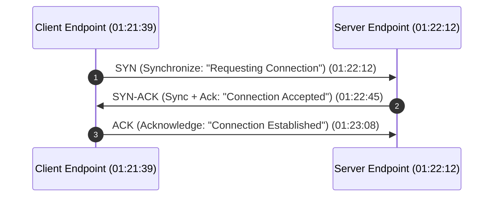

#### TCP 4-Way Handshake (Connection Termination) (01:24:50 - 01:26:30)
When a TCP session completes, the connection is gracefully closed:

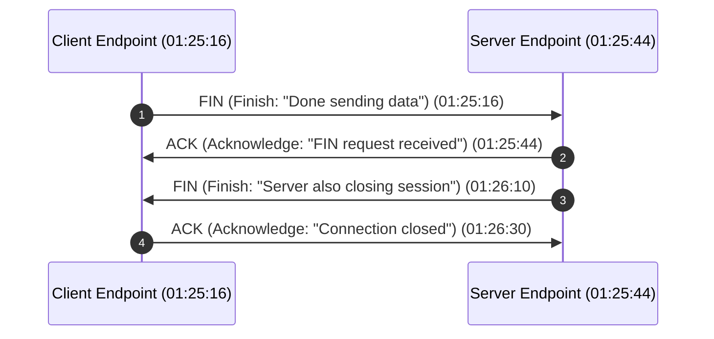

#### Core TCP Control Flags (01:27:40 - 01:28:48)

- **`SYN` (Synchronize)**: Initiates connection sequence numbers during handshake (01:27:52).
- **`ACK` (Acknowledge)**: Confirms receipt of previously transmitted data segments (01:27:52).
- **`FIN` (Finish)**: Initiates graceful session termination (01:27:52).
- **`RST` (Reset)**: Forcefully aborts an unstable or unauthorized connection (01:28:19).
- **`PSH` (Push)**: Instructs receiving buffer to immediately flush data to application layer (01:28:19).
- **`URG` (Urgent)**: Signals that segment contains high-priority data processing requirements (01:29:18).

---

### 15. Key Core Protocols & Port Directory (01:29:18 - 01:36:10)

| Protocol | Full Name | Standard Port | Operational Transport Layer | Functional Purpose & Security Note (Timestamp) |
|---|---|---|---|---|
| **HTTP** | Hypertext Transfer Protocol | `80` | TCP | Web traffic transmission; unencrypted plaintext vulnerability (01:29:40). |
| **HTTPS** | Hypertext Transfer Protocol Secure | `443` | TCP | Secure web traffic encrypted via SSL/TLS cryptographic tunnels (01:30:35). |
| **FTP** | File Transfer Protocol | `20 / 21` | TCP | File transfer management; unencrypted control and data channels (01:32:00). |
| **SFTP** | SSH File Transfer Protocol | `22` | TCP | Secure file transfer operating over an SSH cryptographic tunnel (01:32:17). |
| **SSH** | Secure Shell | `22` | TCP | Encrypted remote command-line administration (01:32:37). |
| **Telnet** | Teletype Network | `23` | TCP | Legacy remote CLI access; unencrypted plaintext (superseded by SSH) (01:32:37). |
| **DNS** | Domain Name System | `53` | UDP / TCP | Resolves human domain names to machine-readable IP addresses (01:33:11). |
| **DHCP** | Dynamic Host Configuration Protocol | `67 / 68` | UDP | Dynamically assigns IP parameters to new network clients (01:35:04). |
| **SMTP** | Simple Mail Transfer Protocol | `25` | TCP | Transmits outbound emails between mail servers (01:35:23). |
| **POP3** | Post Office Protocol v3 | `110` | TCP | Legacy email retrieval; downloads mail locally from server (01:35:48). |
| **IMAP** | Internet Message Access Protocol | `143` | TCP | Modern email retrieval; synchronizes mail across multiple devices (01:36:10). |
| **RDP** | Remote Desktop Protocol | `3389` | TCP | Graphical remote desktop management in Windows environments (01:36:27). |

---

### 16. Encryption, Decryption, & Cryptographic Paradigms (01:36:40 - 01:49:30)

Cryptographic protection ensures data confidentiality and integrity across untrusted public networks (01:36:40).

- **Plaintext**: Original, unencrypted, human-readable data (01:37:00).
- **Ciphertext**: Unreadable, scrambled data generated by applying an encryption algorithm and key to Plaintext (01:37:28).

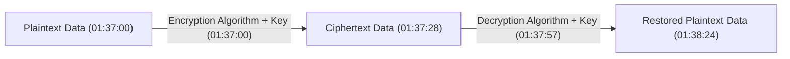

#### Symmetric vs Asymmetric Cryptography (01:40:25 - 01:41:54)

| Cryptographic Attribute | Symmetric Encryption | Asymmetric Encryption |
|---|---|---|
| **Key Architecture** | Single shared secret key for both encryption and decryption (01:40:25). | Pair of mathematically linked keys: Public Key (encrypts) & Private Key (decrypts) (01:41:36). |
| **Processing Performance** | Extremely fast and computationally efficient (01:40:54). | Slower due to complex mathematical operations (01:41:36). |
| **Primary Use Case** | Bulk data payload encryption (01:41:11). | Key exchange negotiation, digital signatures, TLS handshakes (01:41:54). |
| **Sample Algorithms** | AES, 3DES, Blowfish (01:38:53). | RSA, ECC, Diffie-Hellman (01:38:53). |

#### Address Resolution Protocol (ARP) (01:45:44)
Within a LAN, devices use IP addresses for logical destination mapping, but require MAC addresses for actual frame delivery across physical switches. ARP dynamically resolves known IP addresses into target MAC addresses by broadcasting ARP Requests across the local subnet (01:46:00).

---

### 17. Web Protocols, HTTP Cycle, & TLS Handshake (01:49:30 - 01:57:55)

#### HTTP Request & Response Cycle (01:49:30)
1. **HTTP Methods**:
   - `GET`: Retrieves data from web server (01:52:05).
   - `POST`: Submits payload data to server for processing.
   - `PUT`: Replaces or updates targeted server resources.
   - `DELETE`: Removes targeted resource from server.
2. **HTTP Status Code Categories** (01:54:10):
   - `1xx` (Informational): Request received, protocol processing continuing.
   - `2xx` (Success): Action successfully received and accepted (e.g., `200 OK`).
   - `3xx` (Redirection): Further client action required (e.g., `301 Moved Permanently`).
   - `4xx` (Client Error): Faulty client request (e.g., `400 Bad Request`, `403 Forbidden`, `404 Not Found`).
   - `5xx` (Server Error): Server failure to fulfill valid request (e.g., `500 Internal Server Error`, `503 Service Unavailable`).

#### HTTPS & TLS Handshake Cryptography (01:56:05)
HTTPS combines HTTP with TLS (Transport Layer Security) encryption (01:31:28). During a TLS handshake, the client authenticates the server's X.509 digital certificate, negotiates cipher suites, and uses asymmetric encryption (RSA/ECC) to establish a shared symmetric session key (AES) for high-speed encrypted payload transmission.

---

### 18. Anonymity & Privacy Technologies: VPN, Proxy, & TOR (01:57:55 - 02:00:00)

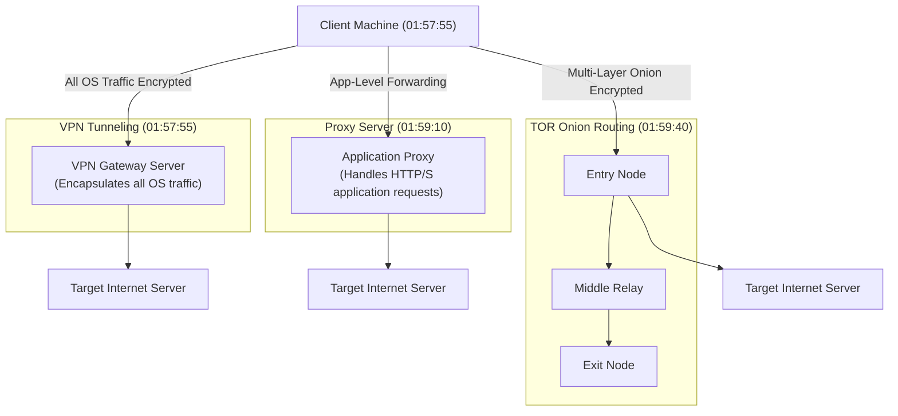

1. **VPN (Virtual Private Network)** (01:57:55): Establishes a secure, encrypted tunnel between the client OS and a remote VPN server. All device network traffic passes through this tunnel, concealing the client's true public IP address from ISP tracking and public eavesdroppers.
2. **Proxy Server** (01:59:10): Functions as an intermediary application-level forwarder. Handles HTTP/HTTPS web requests on behalf of clients, masking the client IP at the application level for caching, filtering, or geo-unblocking.
3. **TOR (The Onion Router)** (01:59:40): Provides anonymized multi-layered onion routing. Encrypts traffic in multiple layers and routes packets through three random volunteer nodes (Entry Node, Middle Relay, Exit Node), ensuring no single node knows both the origin and destination.

---

### 19. Cybersecurity Toolkit & Career Mastery Roadmap (02:00:00 - 02:09:31)

#### Core Hands-on Analysis Toolkit (02:06:59 - 02:08:21)

| Tool Name | Tool Primary Function (Timestamp) | Practical Use Case in Networking & Security |
|---|---|---|
| **Wireshark** | Deep Packet Inspection & Traffic Analysis (02:06:59) | Capturing live interface traffic, inspecting TCP 3-way/4-way handshakes, analyzing TLS negotiations, and diagnosing packet loss. |
| **Nmap** | Network Reconnaissance & Security Scanning (02:07:57) | Port scanning host discovery, OS fingerprinting, vulnerability mapping, and auditing exposed services. |
| **Burp Suite** | Web Application Security Testing Proxy (02:07:57) | Intercepting, analyzing, and manipulating HTTP/HTTPS requests/responses before reaching target web servers. |
| **Cisco Packet Tracer** | Network Topographic Simulation (02:08:21) | Modeling complex enterprise networks, configuring routers/switches, implementing subnets, and testing routing rules. |

#### Advanced Career Progression Roadmap (02:08:39 - 02:09:00)

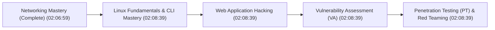

---

## 🔗 Metadata & Graph Source Links

- **Original Captured Transcript**: [[01_RAW/SOURCE/Complete Networking Tutorial 2026 🚀  Beginner to Advanced (Cybersecurity Focus).md]]
- **Parent Index**: [[📺 YouTube Map of Content]]
