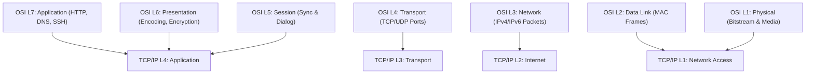
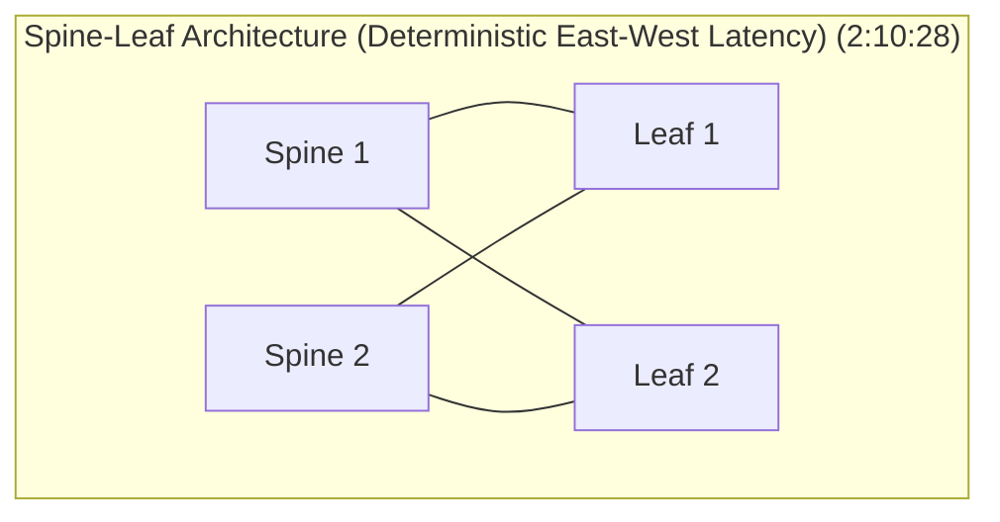

# Complete Networking Tutorial for Beginners to Advanced 2026 | Deep dive for Cyber security (Final Master Note)

## Executive Summary & Master Metadata
- **Source Video**: [Complete Networking Tutorial for Beginners to Advanced 2026 \| Deep dive for Cyber security (YouTube)](https://www.youtube.com/watch?v=FNj8jMTOfnA)
- **Creator**: [[Sheryians Cyber School ™]] (Presenter: Abhishek Chaurasiya)
- **Total Duration**: 2 hours 43 minutes (100% full coverage across all modules)
- **Document Nature**: Consolidated Final Master Study Note combining all 3 parts into a single publication-ready reference.

---

## 1. Fundamentals, Performance Metrics & Topologies (`0:00` – `12:53`)

### 1.1 Cyber Attack & Defense Foundations
Network infrastructure governs all digital communications (`0:21`). Operational cybersecurity tasks—such as ethical hacking, penetration testing, SOC threat detection, incident response, and cloud security (AWS/Azure)—require deep mastery over network traffic flow and protocol mechanics (`0:33`).

---

### 1.2 Performance Metrics Reference Matrix

| Metric | Technical Definition | Impact on Network Operations |
|---|---|---|
| **Latency** | Total time required for data to travel from source to destination ($T_p + T_t$). | Critical for real-time exploit execution & C2 telemetry. |
| **Bandwidth** | Maximum theoretical data capacity of a channel (bps). | Determines maximum throughput volume for exfiltration/DDoS. |
| **Throughput** | Measured rate of successful data delivery over a channel. | Real-world network delivery efficiency indicator. |
| **Jitter** | Variance in packet arrival delay across consecutive packets. | Degrades real-time VoIP streams and C2 heartbeats. |

---

### 1.3 Physical Topologies & Architectures
- **Star Topology**: Nodes connect to a central switch/hub (`09:59`). Easy setup; vulnerable to central switch failure.
- **Bus Topology**: Shared central backbone cable (`10:05`). Backbone failure crashes entire network segment.
- **Ring Topology**: Sequential closed loop (`10:34`). Link break halts ring data flow.
- **Mesh Topology**: Full redundant interconnection between nodes (`11:13`). Maximum fault tolerance for military/critical infrastructure.

---

## 2. OSI & TCP/IP Reference Models, Framing & Switching (`12:53` – `32:38`)

### 2.1 Switching Logic & CAM Table Mechanics (`26:19`)
1. **Learning**: Switch inspects incoming frame's Source MAC address and maps it to the ingress port in its CAM table.
2. **Flooding**: If Destination MAC is unknown (or broadcast `FF:FF:FF:FF:FF:FF`), switch floods the frame out all active ports except the ingress port.
3. **Forwarding**: If Destination MAC is present in CAM table, switch forwards the frame directly out the specific mapped egress port.
4. **VLANs & 802.1Q**: VLANs segment switches into isolated broadcast domains (`29:43`). IEEE 802.1Q tags 4-byte VLAN headers on trunk ports (`56:44`).

---

## 3. IP Addressing, Subnetting, ARP & NAT (`32:38` – `1:03:19`)

### 3.1 Classful IPv4 Addressing Matrix

| Class | 1st Octet Range | NetID / HostID Split | Default Subnet Mask | Usable Hosts ($2^n - 2$) |
|---|---|---|---|---|
| **A** | `0 – 127` | 8 / 24 | `255.0.0.0` (`/8`) | $16,777,214$ |
| **B** | `128 – 191` | 16 / 16 | `255.255.0.0` (`/16`) | $65,534$ |
| **C** | `192 – 223` | 24 / 8 | `255.255.255.0` (`/24`) | $254$ |
| **D** | `224 – 239` | Multicast | Reserved | N/A |
| **E** | `240 – 255` | Experimental | Reserved | N/A |

- **RFC 1918 Private Ranges**: `10.0.0.0/8`, `172.16.0.0/12`, `192.168.0.0/16`.
- **ARP Spoofing Attack**: Attacker broadcasts unsolicited ARP replies binding their MAC address to the victim's default gateway IP address, establishing a Man-in-the-Middle (MitM) position (`48:11`).
- **NAT vs PAT**: Static NAT (1:1), Dynamic NAT (1:N pool), PAT (NAT Overload - multiple private IPs to 1 public IP using unique transport ports) (`1:01:20`).

---

## 4. Routing Protocols & Administrative Distance (`1:03:19` – `1:42:01`)

### 4.1 Administrative Distance (AD) Master Reference Table

| Route Source / Protocol | Default AD | Metric Basis |
|---|---|---|
| **Directly Connected** | `0` | Interface Link Status |
| **Static Route** | `1` | Manual Config |
| **eBGP** | `20` | AS Path Length & Attributes |
| **EIGRP (Internal)** | `90` | Composite Metric (Bandwidth + Delay) |
| **OSPF** | `110` | Cost = $\frac{10^8}{\text{Bandwidth}}$ |
| **IS-IS** | `115` | Administrative Cost |
| **RIP** | `120` | Hop Count (Max 15) |
| **iBGP** | `200` | AS Path & Local Preference |

---

### 4.2 Diagnostic & MPLS Mechanics
- **ICMP Traceroute**: Increments TTL ($1, 2, 3, \dots$) to trigger ICMP Time Exceeded (Type 11) responses from intermediate routers (`1:29:33`).
- **MPLS (Multiprotocol Label Switching)**: Appends 20-bit short labels to skip Layer 3 IP routing table lookups (`1:33:56`). Key roles: LSR (Label Switching Router), LER (Label Edge Router) (`1:36:27`).

---

## 5. Transport Layer, VPNs, Cloud & Automation (`1:42:01` – `2:43:12`)

### 5.1 IPsec & VPN Architecture (`1:53:36`)
- **AH (Authentication Header)**: Origin authentication & integrity without encryption (`2:04:17`).
- **ESP (Encapsulating Security Payload)**: Full AES encryption + integrity + authentication (`2:04:36`).
- **Transport vs Tunnel Mode**: Transport mode encrypts payload only; Tunnel mode encrypts full IP packet with a new outer IP header for Site-to-Site routing (`1:58:32`).

---

### 5.2 Data Center Spine-Leaf & Cloud Security Groups vs NACLs

| Security Control | Security Groups (SG) | Network Access Control Lists (NACL) |
|---|---|---|
| **Level** | Instance / ENI Level | Subnet Boundary Level |
| **Statefulness** | Stateful (Return traffic auto-allowed) | Stateless (Return traffic must be explicitly allowed) |
| **Rules** | Allow rules only (Implicit Deny) | Explicit Allow and Deny rules (Numerical order) |

---

### 5.3 Network Automation & IaC
- **gNMI (gRPC Network Management Interface)**: High-speed gRPC telemetry interface replacing legacy CLI scraping (`2:35:42`).
- **IaC (Infrastructure as Code)**: Programmatic network management using Terraform, Ansible, and Python Netmiko/Nornir (`2:39:25`).

---

## Source Provenance & Archival Link
- Original Raw Transcript File: `[[01_RAW/SOURCE/Complete Networking Tutorial for Beginners to Advanced 2026  Deep dive for Cyber security.md]]`
- Individual Segment Notes:
  - [[detailed-study-notes-complete-networking-tutorial-beginners-to-advanced-part-01.md|Part 1]]
  - [[detailed-study-notes-complete-networking-tutorial-beginners-to-advanced-part-02.md|Part 2]]
  - [[detailed-study-notes-complete-networking-tutorial-beginners-to-advanced-part-03.md|Part 3]]
