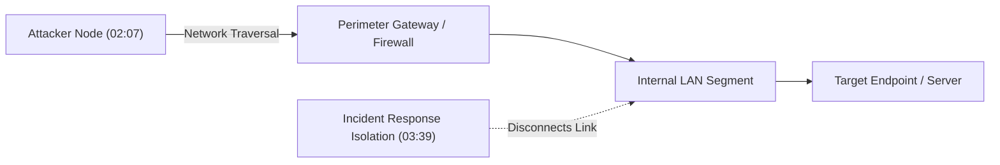
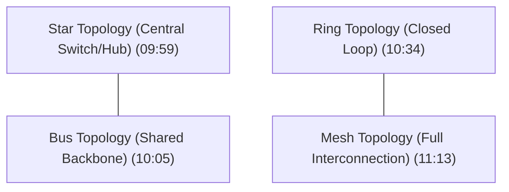
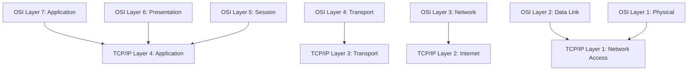
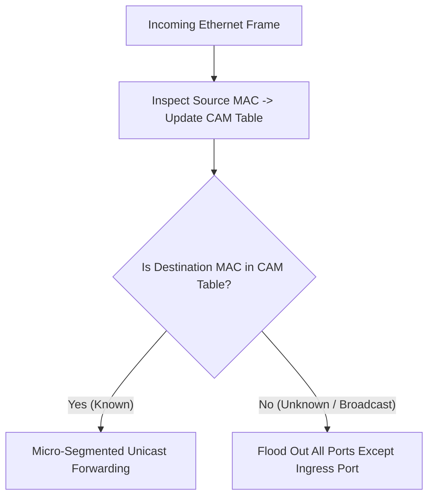
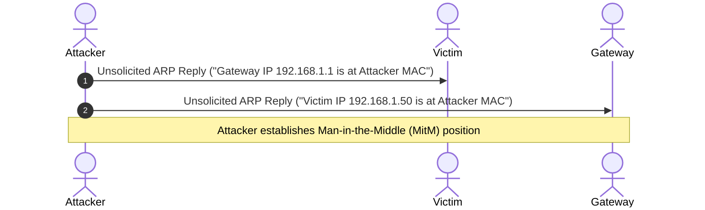

# Complete Networking Tutorial for Beginners to Advanced 2026 | Deep dive for Cyber security (Part 1)

## Executive Summary & Metadata
- **Source Video**: [Complete Networking Tutorial for Beginners to Advanced 2026 \| Deep dive for Cyber security (YouTube)](https://www.youtube.com/watch?v=FNj8jMTOfnA)
- **Creator**: [[Sheryians Cyber School ™]] (Presenter: Abhishek Chaurasiya)
- **Scope**: Part 1 of 3 (Timestamps `0:00` to `55:00`)
- **Key Focus**: Core Networking Foundations, Attack & Defense Prereqs, ARPANET Evolution, Performance Metrics (Latency, Bandwidth, Throughput, Jitter), Physical Topologies, OSI vs TCP/IP Models, Media & Cabling (Copper vs Fiber vs Aux, RJ45, SFP, PoE, Cat5/Cat6), Ethernet Frame Format, Switching Logic (CAM Table Learning & Flooding), STP, VLANs 802.1Q Tagging, Collision/Broadcast Domains, IP Addressing, Subnetting, ARP & ARP Spoofing.

---

## 1. Introduction & Cyber Attack/Defense Relevance (`0:00` – `04:55`)

### 1.1 Why Networking Matters in Cybersecurity
Networking is the foundational prerequisite for ethical hacking, penetration testing, threat detection, incident response, and cloud security (`0:21`).

Key Operational Justifications:
1. **Attack Path Understanding**: Every cyber attack traverses a physical or logical network path (`02:07`).
2. **Perimeter Defense**: Protecting enterprise assets requires securing network ingress and egress points (`02:36`).
3. **Network Visibility**: Complete mapping of ISP connections, active IP address allocations, open ports, and live network devices (`03:06`).
4. **Effective Incident Response (IR)**: Rapidly isolating compromised nodes (e.g., infected with ransomware) to prevent lateral spread across LAN segments (`03:39`).



---

## 2. History, Scale & Performance Metrics (`04:55` – `12:16`)

### 2.1 History of Networking (ARPANET)
- **1960s ARPANET**: Created by the US Department of Defense (DARPA) to enable reliable resource sharing and inter-system communication (`05:14`).
- **IP Allocation Governing Bodies**: Early ARPANET frameworks evolved into modern Internet Registries (IANA, RIRs) managing global IP address spaces (`05:38`).

---

### 2.2 Network Scale Classification
- **PAN (Personal Area Network)**: Short-range device interconnections (Bluetooth, personal hotspots) (`08:08`).
- **LAN (Local Area Network)**: Restricted scope (office building, home router) (`07:05`).
- **MAN (Metropolitan Area Network)**: City-wide interconnection (municipal networks, bank branch meshes) (`07:22`).
- **WAN (Wide Area Network)**: Global interconnected network of networks (the Internet) (`07:44`).

---

### 2.3 Performance Metrics Definition Matrix

| Metric Name | Technical Definition | Impact on Cyber Operations | Timestamp |
|---|---|---|---|
| **Latency** | Time taken for a data packet to travel from source to destination ($T_p + T_t$). | Critical for real-time exploit execution & C2 telemetry. | `08:44` |
| **Bandwidth** | Maximum theoretical data capacity of a channel per unit time (bps). | Limits maximum throughput of data exfiltration or DDoS volumes. | `08:44` |
| **Throughput** | Actual measured rate of successful data delivery over a channel. | Real-world network efficiency indicator (`fast.com` / `speedtest`). | `09:02` |
| **Jitter** | Variance in packet arrival delay across consecutive packets. | Degradation of real-time VoIP streams and C2 heartbeats. | `09:18` |

---

## 3. Physical Topologies & Architectural Paradigms (`09:39` – `12:53`)



- **Star Topology**: Nodes connect to a central hub/switch (`09:59`). Easy setup; vulnerable to central switch failure.
- **Bus Topology**: Nodes connect to a single central backbone cable (`10:05`). Simple; backbone break crashes network.
- **Ring Topology**: Sequential ring connection (`10:34`). Single directional flow; break halts ring.
- **Mesh Topology**: Redundant direct connections between nodes (`11:13`). Extremely resilient; used in military and critical infrastructure.
- **Client-Server Architecture**: Dedicated server fulfills client requests (e.g., web/database servers) (`12:16`).
- **Peer-to-Peer (P2P) Architecture**: Every node acts as both client and server (e.g., BitTorrent) (`12:16`).

---

## 4. OSI & TCP/IP Reference Models (`12:53` – `16:35`)



### Encapsulation & Decapsulation
- **Encapsulation**: Prepending layer-specific headers (and Layer 2 trailer) as data moves down the stack (`14:40`).
- **Decapsulation**: Stripping headers at the receiving end as data moves up the stack to the application (`15:02`).

---

## 5. Media, Cabling & Hardware Standards (`16:35` – `24:50`)

### 5.1 Cable Types & Performance

| Cable Type | Max Distance | Speed Range | Susceptibility to EMI | Timestamp |
|---|---|---|---|---|
| **Copper Twisted Pair** | 100 meters | 10 Mbps – 10 Gbps | High EMI susceptibility | `16:35` |
| **Fiber Optic (Single/Multi)** | 10 km – 100+ km | 1 Gbps – 100+ Gbps | Immune to EMI | `16:57` |
| **Coaxial / Aux Cable** | Variable | 10 Mbps – 1 Gbps | Moderate EMI protection | `17:26` |

- **Connectors**: RJ45 for copper Ethernet cables; SFP / SFP+ transceivers for fiber optic switch links (`19:00`).
- **Power over Ethernet (PoE)**: Transmits electrical power along with data over Ethernet cabling (IEEE 802.3af/at/bt) to supply IP cameras, VoIP phones, and wireless APs (`20:32`).
- **Cabling Standards**: Cat5 (100 Mbps), Cat5e (1 Gbps), Cat6 (10 Gbps up to 55m), Cat6a (10 Gbps up to 100m) (`21:30`).

---

## 6. Ethernet Framing, Switching Logic & VLANs (`24:50` – `32:38`)

### 6.1 Ethernet Frame Structure (IEEE 802.3)
```text
[Preamble (7B)] [SFD (1B)] [Dest MAC (6B)] [Src MAC (6B)] [Type/Length (2B)] [Payload Data (46-1500B)] [FCS (4B)]
```

---

### 6.2 Switching Logic & CAM Table Mechanics (`26:19`)
1. **Learning**: Switch inspects incoming frame's Source MAC address and maps it to the ingress port in its Content Addressable Memory (CAM) table.
2. **Flooding**: If Destination MAC is unknown (or broadcast `FF:FF:FF:FF:FF:FF`), switch floods the frame out all active ports except the ingress port.
3. **Forwarding**: If Destination MAC is present in CAM table, switch forwards the frame directly out the specific mapped egress port.



---

### 6.3 Spanning Tree Protocol (STP & 802.1Q VLANs) (`29:09`)
- **Spanning Tree Protocol (STP - 802.1D)**: Prevents Layer 2 switching loops in redundant topologies by blocking redundant link ports (`29:09`).
- **VLANs (Virtual LANs)**: Logically segment a single physical switch into multiple isolated broadcast domains (`29:43`).
- **IEEE 802.1Q Tagging**: Appends a 4-byte VLAN tag into the Ethernet header for trunk links connecting switches (`29:43`).

---

## 7. IP Addressing, ARP & ARP Spoofing Attacks (`32:38` – `55:00`)

### 7.1 ARP Resolution & Link Resolution (`44:45`)
Address Resolution Protocol (ARP) maps a known 32-bit IPv4 address to its unknown 48-bit physical MAC address.
- **ARP Request**: Broadcast (`FF:FF:FF:FF:FF:FF`) asking "Who has IP X.X.X.X? Tell Y.Y.Y.Y".
- **ARP Reply**: Unicast response from target node declaring "I have IP X.X.X.X, my MAC is AA:BB:CC:DD:EE:FF".

---

### 7.2 ARP Spoofing / Poisoning Attack Mechanics (`48:11`)
An attacker transmits unsolicited, forged ARP replies to a target node and default gateway, binding the attacker's MAC address to the victim's IP address.



---

## Source Provenance & Archival Link
- Original Raw Transcript File: `[[01_RAW/SOURCE/Complete Networking Tutorial for Beginners to Advanced 2026  Deep dive for Cyber security.md]]`
