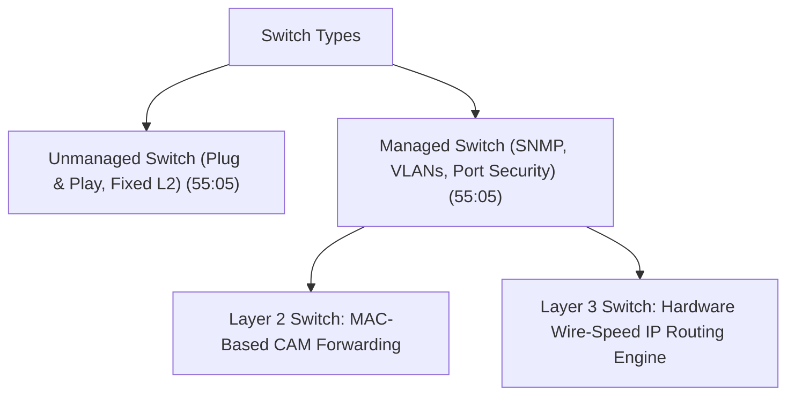
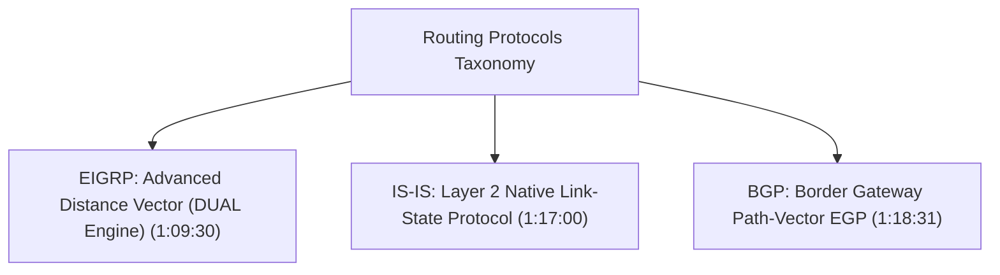
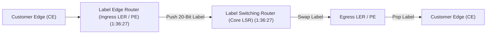

# Complete Networking Tutorial for Beginners to Advanced 2026 | Deep dive for Cyber security (Part 2)

## Executive Summary & Metadata
- **Source Video**: [Complete Networking Tutorial for Beginners to Advanced 2026 \| Deep dive for Cyber security (YouTube)](https://www.youtube.com/watch?v=FNj8jMTOfnA)
- **Creator**: [[Sheryians Cyber School ™]] (Presenter: Abhishek Chaurasiya)
- **Scope**: Part 2 of 3 (Timestamps `55:00` to `1:42:00`)
- **Key Focus**: Switch & Router Architectures (Managed vs Unmanaged, Layer 2/3, Access vs Trunk Ports), NAT & PAT Address Translation, Routing Fundamentals, Administrative Distance & Metrics, EIGRP, IS-IS, BGP (Border Gateway Protocol), Packet Delivery & Fragmentation, TTL, MTU, ICMP Diagnostic Mechanics, Network Isolation, MPLS (Label Switching Routers LSR/LER), Segment Routing (SR-MPLS / SRv6), and Cast Modes (Unicast, Multicast, Broadcast).
- **Continuity**: Continuation from [[detailed-study-notes-complete-networking-tutorial-beginners-to-advanced-part-01.md|Part 1]].

---

## 1. Switching & Router Architecture Mechanics (`55:05` – `1:03:19`)

### 1.1 Managed vs Unmanaged & Layer 2 vs Layer 3 Switches



- **Unmanaged Switch**: Fixed configuration, zero management interface (`55:05`).
- **Managed Switch**: Supports VLAN configuration, 802.1Q tagging, SNMP monitoring, Port Security, and Spanning Tree Protocol control (`55:05`).
- **Layer 2 vs Layer 3 Switch**: Layer 2 switches forward based purely on 48-bit MAC addresses. Layer 3 switches integrate hardware ASIC routing engines to perform inter-VLAN routing at wire speed (`55:05`).

---

### 1.2 Access Ports vs Trunk Ports (`56:44`)
- **Access Port**: Assigned to a single VLAN. Forwards untagged standard Ethernet frames to end-user endpoints (`56:44`).
- **Trunk Port**: Carries traffic across multiple VLANs simultaneously between switches using IEEE 802.1Q 4-byte frame tags (`56:44`).

---

### 1.3 NAT (Network Address Translation) & PAT (Port Address Translation) (`59:40` – `1:03:19`)

```mermaid
flowchart LR
    PrivateNode["Private Host 192.168.1.50:50123"] --> NATDevice["NAT/PAT Gateway / Router"]
    NATDevice -- "PAT Translation" --> PublicNet["Public Internet Target 8.8.8.8:80"]
    Note over NATDevice: Maps 192.168.1.50:50123 -> Public IP 203.0.113.5:10254
```

- **Static NAT (1:1)**: Maps a single private IP address to a single static public IP address.
- **Dynamic NAT (1:N Pool)**: Maps private IP addresses to a pool of available public IP addresses.
- **PAT (Port Address Translation / NAT Overload)**: Maps multiple internal private IP addresses to a single public IP address using distinct high-order transport layer port numbers (`1:01:20`).

---

## 2. Routing Protocols & Administrative Distance (`1:03:19` – `1:26:10`)

### 2.1 Administrative Distance (AD) Reference Table
Administrative Distance rates the trustworthiness of a routing information source (`1:06:42`). Lower AD values indicate higher preference.

| Route Source / Protocol | Default Administrative Distance (AD) | Routing Metric Basis | Timestamp |
|---|---|---|---|
| **Directly Connected Interface** | `0` | Hardware Link Status | `1:06:42` |
| **Static Route** | `1` | Manually Configured | `1:05:00` |
| **eBGP (External BGP)** | `20` | AS Path Length & BGP Path Attributes | `1:18:31` |
| **EIGRP (Internal)** | `90` | Composite Metric (Bandwidth + Delay) | `1:09:30` |
| **OSPF** | `110` | Cost = $\frac{10^8}{\text{Bandwidth (bps)}}$ | `1:09:59` |
| **IS-IS** | `115` | Administrative Interface Cost | `1:17:00` |
| **RIP** | `120` | Hop Count (Max 15) | `1:06:11` |
| **iBGP (Internal BGP)** | `200` | AS Path & Local Preference | `1:18:31` |

---

### 2.2 Advanced Enterprise Routing Protocols



1. **EIGRP (Enhanced Interior Gateway Routing Protocol)**: Cisco advanced distance-vector/hybrid protocol. Uses DUAL (Diffusing Update Algorithm) for rapid loop-free convergence (`1:09:30`).
2. **IS-IS (Intermediate System to Intermediate System)**: Link-state routing protocol operating directly over Layer 2 datagrams; widely deployed in global telecom backbones (`1:17:00`).
3. **BGP (Border Gateway Protocol - BGP4)**: Path-Vector Exterior Gateway Protocol (EGP) powering inter-domain routing between Autonomous Systems (AS) across the global Internet (`1:18:31`). Uses TCP port 179.

---

## 3. Packet Delivery, MTU, TTL & ICMP Mechanics (`1:26:10` – `1:33:56`)

### 3.1 Packet Delivery Parameters
- **MTU (Maximum Transmission Unit)**: Maximum frame payload size (typically 1500 bytes for standard Ethernet) (`1:28:14`). Packets exceeding MTU are fragmented unless the Don't Fragment (DF) bit is set.
- **TTL (Time To Live)**: 8-bit IPv4 header field decremented by 1 at every router hop (`1:28:14`). Prevents infinite routing loops.

---

### 3.2 ICMP Diagnostic Mechanics (`1:29:33`)
Internet Control Message Protocol (ICMP) delivers network diagnostic and error reporting messages.
- **Ping (ICMP Echo Request Type 8 / Echo Reply Type 0)**: Tests basic IP reachability and measures RTT (`1:29:33`).
- **Traceroute**: Exploits TTL expiration. Sends packets with incremental TTL values ($1, 2, 3, \dots$), recording router ICMP Time Exceeded (Type 11) responses to map the path (`1:29:33`).

---

## 4. MPLS & Segment Routing Architecture (`1:33:56` – `1:39:49`)

### 4.1 Multiprotocol Label Switching (MPLS)
MPLS accelerates packet forwarding by appending short 20-bit fixed-length labels to packets, bypassing complex Layer 3 IP routing table lookups (`1:33:56`).



### Key MPLS Components
- **LSR (Label Switching Router)**: Core router performing high-speed label swapping (`1:36:27`).
- **LER (Label Edge Router) / PE**: Ingress/Egress router pushing or popping MPLS labels (`1:36:27`).
- **Segment Routing (SR-MPLS / SRv6)**: Modern control-plane evolution steering traffic using ordered lists of segment identifiers (SIDs) embedded directly in packet headers (`1:37:45`).

---

## Source Provenance & Archival Link
- Original Raw Transcript File: `[[01_RAW/SOURCE/Complete Networking Tutorial for Beginners to Advanced 2026  Deep dive for Cyber security.md]]`
- Prerequisites: [[detailed-study-notes-complete-networking-tutorial-beginners-to-advanced-part-01.md|Part 1 Note]]
