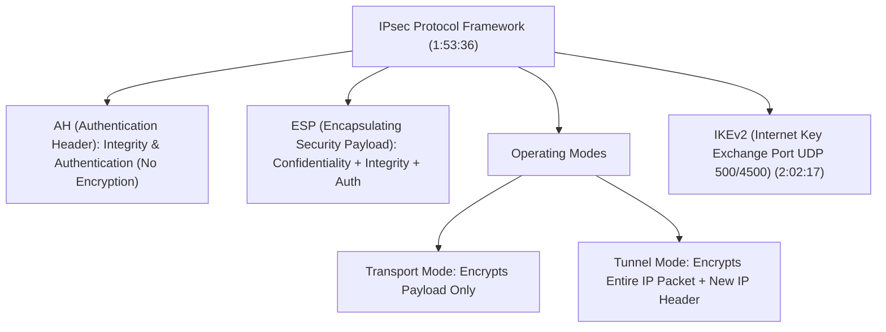
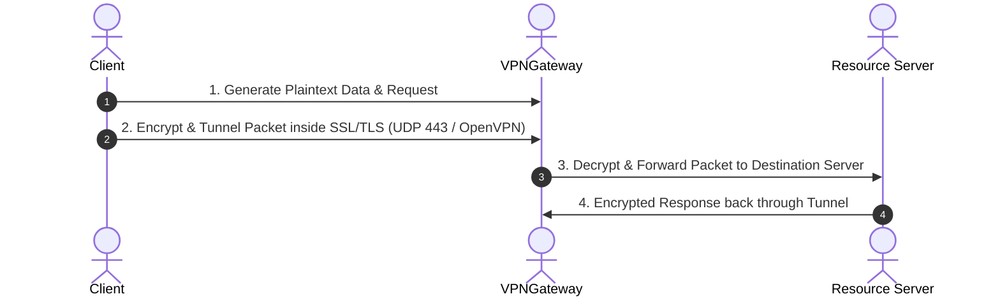
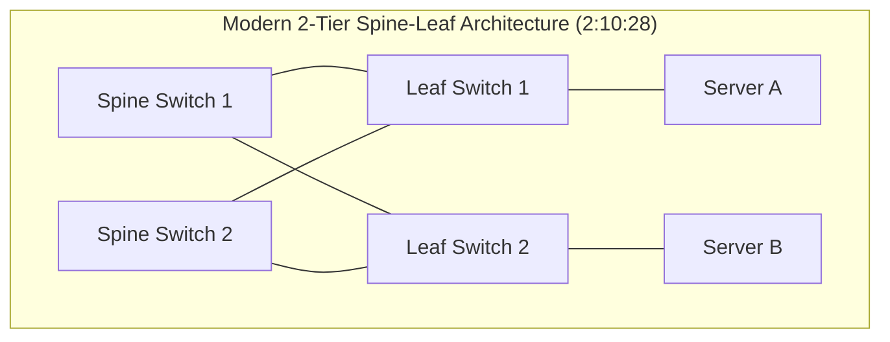

# Complete Networking Tutorial for Beginners to Advanced 2026 | Deep dive for Cyber security (Part 3)

## Executive Summary & Metadata
- **Source Video**: [Complete Networking Tutorial for Beginners to Advanced 2026 \| Deep dive for Cyber security (YouTube)](https://www.youtube.com/watch?v=FNj8jMTOfnA)
- **Creator**: [[Sheryians Cyber School ™]] (Presenter: Abhishek Chaurasiya)
- **Scope**: Part 3 of 3 (Timestamps `1:42:00` to `2:43:12`)
- **Key Focus**: Transport Layer Mechanics (TCP vs UDP, Sliding Window, Congestion Control, Port Multiplexing), Quality of Service (DiffServ vs IntServ), Traffic Engineering, VPN Tunnels & IPsec (AH, ESP, IKEv2), SSL/TLS Architecture, Encrypted Tunneling Flows, Data Center Networking (Legacy 3-Tier vs Spine-Leaf Architecture, East-West vs North-South Traffic), Microsegmentation, Overlay Virtualization (VXLAN, EVPN), Cloud Virtual Networks (VPC/VNet, Subnets, Route Tables, Security Groups vs NACLs), Network Programmability (APIs, gNMI), and Infrastructure as Code (IaC).
- **Continuity**: Continuation from [[detailed-study-notes-complete-networking-tutorial-beginners-to-advanced-part-02.md|Part 2]].

---

## 1. Transport Layer Mechanics & QoS (`1:42:01` – `1:53:36`)

### 1.1 TCP vs UDP Protocol Comparison

| Protocol Attribute | TCP (Transmission Control Protocol) | UDP (User Datagram Protocol) | Timestamp |
|---|---|---|---|
| **Connection State** | Connection-Oriented (3-Way Handshake) | Connectionless | `1:42:01` |
| **Reliability** | Guaranteed (ACKs, Retransmissions, Sequence Numbers) | Best Effort (No ACKs) | `1:42:01` |
| **Flow & Congestion Control** | Dynamic Sliding Window & Congestion Engines | None | `1:45:22` |
| **Header Overhead** | 20 – 60 Bytes | Fixed 8 Bytes | `1:46:21` |
| **Primary Use Cases** | Web (HTTP/HTTPS), SSH, FTP, Mail (SMTP/IMAP) | DNS, Streaming, VoIP, Gaming | `1:47:35` |

---

### 1.2 Quality of Service (QoS) Architectures (`1:49:26`)
- **IntServ (Integrated Services - RFC 1633)**: Micro-flow level resource reservation using RSVP (Resource Reservation Protocol) (`1:51:07`). Hard guarantees; non-scalable across large WAN backbones.
- **DiffServ (Differentiated Services - RFC 2474)**: Class-based traffic prioritization (`1:49:26`). Uses 6-bit DSCP (Differentiated Services Code Point) in the IP header to classify packets at network ingress; highly scalable.

---

## 2. VPNs, IPsec & SSL/TLS Cryptographic Tunneling (`1:53:36` – `2:09:03`)

### 2.1 IPsec Protocol Architecture

- **Authentication Header (AH)**: Guarantees connection origin authentication and packet data integrity; does NOT provide data confidentiality/encryption (`2:04:17`).
- **Encapsulating Security Payload (ESP)**: Provides full payload encryption (AES-256), data integrity, and authentication (`2:04:36`).
- **Tunnel Mode vs Transport Mode**: Transport mode encrypts only the transport payload. Tunnel mode encrypts the entire original IP packet and prepends a new outer IP header for Site-to-Site routing (`1:58:32`).

---

### 2.2 SSL / TLS & Encrypted Tunneling Flow (`2:05:20` – `2:08:59`)

---

## 3. Data Center Networking Architecture & Overlays (`2:09:03` – `2:26:20`)

### 3.1 Legacy 3-Tier vs Modern Spine-Leaf Architecture

- **Legacy 3-Tier (Core - Distribution - Access)**: Designed primarily for North-South client-to-server traffic. Suffers from oversubscription bottlenecks during heavy server-to-server traffic (`2:10:28`).
- **Spine-Leaf Architecture**: 2-tier architecture where every Leaf switch connects to every Spine switch (`2:10:28`). Provides predictable single-hop latency for East-West server-to-server microservice traffic.

---

### 3.2 Traffic Directions & Overlays
- **North-South Traffic**: Data moving into or out of the data center perimeter (e.g., Internet client accessing a web app) (`2:10:28`).
- **East-West Traffic**: Data moving between servers inside the data center (e.g., API gateway communicating with microservices or database clusters) (`2:10:28`).
- **VXLAN (Virtual Extensible LAN)**: Layer 2 over Layer 3 overlay encapsulation protocol using UDP port 4789 (`2:22:25`). Expands VLAN limits from 4,096 to 16.7 million 24-bit VXLAN Network Identifiers (VNIs).
- **EVPN (Ethernet VPN)**: BGP control-plane for VXLAN overlays, eliminating data-plane flood-and-learn (`2:22:25`).
- **Microsegmentation**: Granular zero-trust security isolation enforced at the virtual machine / container interface level (`2:19:53`).

---

## 4. Cloud Virtual Networking & Automation (`2:26:20` – `2:43:12`)

### 4.1 Cloud Virtual Networking (VPC / VNet)
- **VPC (Virtual Private Cloud) / VNet**: Logically isolated virtual network space in cloud platforms (AWS, Azure, GCP) (`2:27:35`).
- **Subnets**: Public (route to Internet Gateway) vs Private (route to NAT Gateway only) (`2:27:35`).

---

### 4.2 Security Groups vs Network Access Control Lists (NACLs)

| Feature / Property | Security Groups (SG) | Network Access Control Lists (NACL) | Timestamp |
|---|---|---|---|
| **Level of Operation** | Instance / ENI Interface Level | Subnet Level Boundary | `2:29:18` |
| **Statefulness** | Stateful (Return traffic automatically allowed) | Stateless (Return traffic must be explicitly allowed) | `2:29:18` |
| **Rule Evaluation** | All rules evaluated before granting access | Ordered numerical rule evaluation (100, 200, ...) | `2:29:18` |
| **Supported Actions** | Allow rules only (Implicit Deny) | Explicit Allow and Deny rules | `2:29:18` |

---

### 4.3 Network Programmability, gNMI & Infrastructure as Code (IaC) (`2:33:05` – `2:42:08`)
- **gNMI (gRPC Network Management Interface)**: Modern gRPC-based network management protocol replacing legacy SNMP and CLI scraping (`2:35:42`). Supports streaming telemetry and structured JSON/YANG data models.
- **Infrastructure as Code (IaC)**: Provisioning and managing network infrastructure programmatically using code frameworks (Terraform, Ansible, Python Netmiko/Nornir) (`2:39:25`).

---

## Source Provenance & Archival Link
- Original Raw Transcript File: `[[01_RAW/SOURCE/Complete Networking Tutorial for Beginners to Advanced 2026  Deep dive for Cyber security.md]]`
- Prerequisites:
  - [[detailed-study-notes-complete-networking-tutorial-beginners-to-advanced-part-01.md|Part 1 Note]]
  - [[detailed-study-notes-complete-networking-tutorial-beginners-to-advanced-part-02.md|Part 2 Note]]
