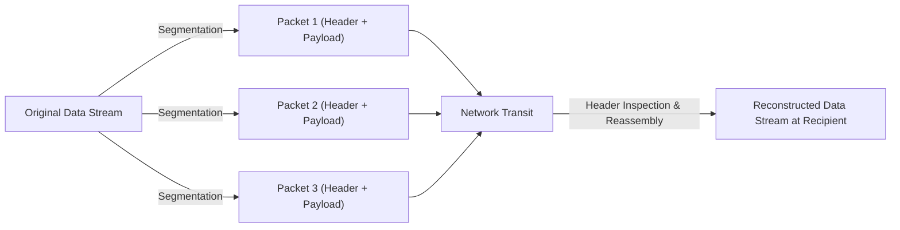
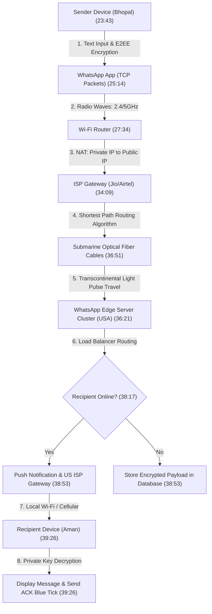
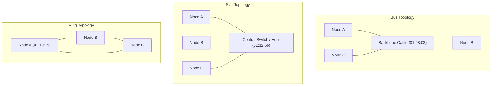

# Computer Networking Full Course — Internet Explained Step by Step (Real-Life Examples)

## Overview & Source Metadata

- **Title**: Computer Networking Full Course - Internet Explained Step by Step (Real-Life Examples)
- **Instructor / Creator**: Sarthak Sharma ([[Sheryians Coding School]])
- **Published Date**: April 14, 2025
- **Source Link**: [YouTube Video](https://www.youtube.com/watch?v=RY32wSQDekE)
- **Local Source Capture**: [[01_RAW/SOURCE/Computer Networking Full Course - Internet Explained Step by Step (Real-Life Examples).md]]
- **Target Audience**: Computer science students (especially 1st-year undergraduates), aspiring software developers, web engineers, and candidates preparing for university examinations and technical placement interviews.
- **Pedagogical Approach**: Concept-first breakdown using real-life analogies (postal letters, apartment numbers, Zomato order flows, WhatsApp cross-border messaging) combined with technical depth (OSI 7-Layer traversal, packet switching, TCP 3-way handshake, NAT translation, subsea optical fiber routing, DNS hierarchy).

---

## 1. How the Internet Works (05:24 - 10:32)

### Core Definition & Intuition (05:34)
The Internet is not a mysterious abstract cloud; it is a worldwide, physical and logical system of interconnected computer networks and electronic devices that communicate with one another using established sets of standardized rules called **protocols**. 

> *"At its core, the Internet is simply an interconnected network of computers and electronic devices built to transfer information reliably from one machine to another following set rules."* (05:34) — **Sarthak Sharma**

### Data Transmission & Packetization (06:06 - 07:40)
Data is never sent across the Internet as a single massive chunk of bytes. Instead, messages are segmented into small units called **data packets**.

- **Packet Anatomy & Headers**: Every packet is wrapped in a digital envelope (header metadata) containing:
  - **Source IP Address**: Location identifier of the sender device.
  - **Destination IP Address**: Location identifier of the receiving device.
  - **Sequence Number**: Integer ordering tag used to reassemble packets in correct sequence at the destination.
  - **Time-To-Live (TTL)**: Hop count limit preventing lost packets from circulating indefinitely.
- **The Postal Letter Analogy**: Sending data over the Internet operates exactly like posting physical mail. Writing a letter is not enough; you must place it inside an envelope stamped with the sender's return address and the recipient's destination address. If a long document is split into multiple envelopes, each envelope carries sequence numbers and addresses to ensure complete and ordered delivery.



### Network Diagnostics & Inspection Tools (08:09 - 09:15)
- **CLI Diagnostics (`ping`)**: Running `ping sheryians.com` in a terminal sends ICMP Echo Request packets to test server reachability.
  - *Output Metrics*: Displays payload size (e.g., 64 bytes), response latency in milliseconds (`time=...`), ICMP sequence numbers, and `TTL` (Time-To-Live) values.
- **Browser Developer Tools (Network Panel)**: Inspecting HTTP transactions live in Google Chrome / Firefox:
  - **HTTP Status Codes**:
    - `2xx` (200 OK): Request succeeded, payload returned.
    - `3xx` (301/302 Redirect): Resource moved to a new URI.
    - `4xx` (404 Not Found / 403 Forbidden): Client-side error or missing resource.
    - `5xx` (500 Internal Server Error): Server-side execution failure.
  - **Metrics Panel**: Displays initiator scripts, resource types (document, script, stylesheet, fetch/xhr), individual asset payload sizes (in bytes/KB), and execution timelines.

### Fundamental Transmission Paradigms: TCP vs UDP (09:40 - 10:22)
- **TCP (Transmission Control Protocol)**: Prioritizes **guaranteed delivery and accuracy** over raw speed. Uses packet sequence numbers and acknowledgments (ACKs) to re-transmit lost units.
- **UDP (User Datagram Protocol)**: Prioritizes **ultra-low latency and speed** over absolute reliability. Packets are streamed without waiting for arrival confirmations. Used in live video streaming (YouTube Live, Twitch) and multiplayer gaming, where dropping a minor video frame is preferable to pausing the stream.

---

## 2. History of the Internet (10:32 - 22:42)

### Geopolitical Roots: World War II & Cold War Space Race (10:51 - 12:25)
The Internet was created as a direct byproduct of the Cold War geopolitical conflict between two opposing superpowers: the USA (capitalist framework) and the USSR (communist framework).

- **Sputnik Shock (1957)**: The USSR launched **Sputnik 1**, the world's first artificial satellite. Fearing technological defeat, the United States Department of Defense established **ARPA** (Advanced Research Projects Agency, later **DARPA**).
- **Vulnerability of Centralized Systems**: Early military communication networks relied on centralized mainframe data centers. US defense analysts realized that a single Soviet nuclear strike on a primary data center could completely obliterate nationwide military command infrastructure. ARPA was commissioned to design a resilient, decentralized network without any central point of failure.

### Distributed Architecture & Packet Switching (13:46 - 15:18)
- **Paul Baran's Distributed Network Concept**: Computer scientist Paul Baran proposed splitting centralized networks into a distributed matrix of autonomous nodes. If one node were destroyed in an attack, surviving nodes could dynamically re-route traffic around the damage.
- **ARPANET Birth (1969)**: ARPA linked computing centers at four founding universities:
  1. University of California, Los Angeles (UCLA)
  2. Stanford Research Institute (SRI)
  3. University of California, Santa Barbara (UCSB)
  4. University of Utah
- **The Historic First Message (`"LO"`) (14:28 - 15:18)**: On October 29, 1969, researchers at UCLA attempted to send the command `"LOGIN"` to a computer at Stanford. 
  - They successfully transmitted `"L"`, followed by `"O"`.
  - Upon typing `"G"`, the system crashed.
  - Thus, `"LO"` became the very first message ever transmitted over the precursor to the Internet.

```mermaid
flowchart TD
    subgraph Centralized Network (Vulnerable)
        C1["Node A"] --- CC["Central Master Data Center"]
        C2["Node B"] --- CC
        C3["Node C"] --- CC
        style CC fill:#ff9999,stroke:#333,stroke-width:2px
    end
    subgraph Distributed Network (ARPANET - Resilient)
        D1["UCLA (13:04)"] <--> D2["Stanford"]
        D2 <--> D3["UCSB"]
        D3 <--> D4["University of Utah"]
        D4 <--> D1
        D1 <--> D3
        style D1 fill:#99ff99,stroke:#333
        style D2 fill:#99ff99,stroke:#333
        style D3 fill:#99ff99,stroke:#333
        style D4 fill:#99ff99,stroke:#333
    end
```

### Standardization & Web Invention (15:48 - 19:44)
- **TCP/IP Protocol Suite (1983)**: Vint Cerf and Bob Kahn created the TCP/IP protocol suite, introducing a universal standard for routing and reassembling packetized data across heterogeneous networks. NSFNET later expanded access to academic institutions.
- **Sir Tim Berners-Lee & World Wide Web (1990)**: At CERN in Switzerland, British scientist Sir Tim Berners-Lee invented three core technologies that transformed the Internet from a military/academic text network into a public global hypermedia network:
  1. **WWW (World Wide Web)**: Global universe of network-accessible documents.
  2. **HTTP (HyperText Transfer Protocol)**: Application-layer protocol facilitating document requests and server responses.
  3. **HTML (HyperText Markup Language)**: Structuring language formatted for web browser rendering.
- **DNS Evolution (20:39 - 22:09)**: As hosts multiplied globally, remembering numerical IP addresses became humanly impossible. The **Domain Name System (DNS)** was introduced to translate human-friendly domain names into IP addresses.

---

## 3. How Data is Transferred Over the Internet (22:42 - 41:32)

### Real-World Case Study: Cross-Border WhatsApp Message Flow
To understand physical and logical data transfer, consider sending an encrypted WhatsApp text message (`"Hey"`) from Bhopal, India (Sarthak) to a friend in the USA (Aman).



### Detailed Step-by-Step Data Journey

1. **Application Layer & End-to-End Encryption (23:43 - 26:08)**:
   - The WhatsApp client applies **End-to-End Encryption (E2EE)**. Plaintext `"Hey"` is converted into ciphertext using public/private cryptographic keys. Neither WhatsApp nor intermediate ISPs can read the contents.
   - The payload is split into TCP packets. Headers containing source IP, destination IP, source port, and destination port are appended to each packet.

2. **Wireless Transmission (Radio Waves) (27:34 - 28:36)**:
   - The smartphone's Wi-Fi chip converts binary data into radio signals transmitted to the wireless router:
     - **2.4 GHz Spectrum**: Longer coverage range, superior wall penetration, but lower transfer speeds and higher radio interference.
     - **5.0 GHz Spectrum**: Shorter physical range, but significantly higher throughput speeds and lower latency.

3. **Router Operations & NAT (29:43 - 32:57)**:
   - The router catches radio signals via its antennas and executes **Network Address Translation (NAT)**.
   - **NAT Function**: Converts the device's unroutable **Private IP Address** (e.g., `192.168.1.15`) into a single routable **Public IP Address** (e.g., `49.36.21.104`) assigned by the ISP, keeping track of active internal sessions via unique port mappings.

4. **ISP & Subsea Fiber Backbone (34:09 - 38:17)**:
   - Packets travel via Digital Subscriber Lines (DSL) or local fiber optic cables to the Internet Service Provider (ISP, e.g., Reliance Jio / Airtel).
   - ISP routers run shortest-path algorithms (such as Dijkstra's Algorithm) to determine optimal routing paths.
   - Packets enter **Submarine Optical Fiber Cables** laid across ocean beds:
     - Cables contain hair-thin glass strands transmitting binary data as light pulses via total internal reflection.
     - *Scale Examples*: The **Apollo Cable** spans 4,600 km across the Atlantic; Asia-Europe cables extend over 25,000 km. In India, landing stations are managed by major telecommunication entities such as **Tata Communications**.

5. **Server Processing, Load Balancing & Delivery ACK (38:17 - 40:32)**:
   - Packets land at WhatsApp's data centers in the USA, where **Load Balancers** distribute incoming packets across server clusters.
   - If the recipient is active, packets forward immediately; if offline, encrypted payloads persist in storage until a **Push Notification** wakes the target device.
   - Upon successful receipt and decryption by the destination device, an acknowledgment (`ACK`) packet travels back along the reverse path, updating the sender's client interface with double checkmarks (blue ticks).

---

## 4. IP Address and Port Number Explained (41:32 - 56:51)

### IP Address Fundamentals (41:40 - 45:13)
An **IP (Internet Protocol) Address** is a unique logical identifier assigned to every device connected to a computer network.

#### Architectural Comparison: IPv4 vs IPv6

| Parameter | IPv4 (Internet Protocol Version 4) | IPv6 (Internet Protocol Version 6) |
|---|---|---|
| **Bit Size** | 32-bit (4 bytes) | 128-bit (16 bytes) |
| **Address Space** | $2^{32} \approx 4.3 \text{ billion}$ unique addresses | $2^{128} \approx 3.4 \times 10^{38}$ unique addresses |
| **Format Notation** | 4 decimal octets separated by dots (`192.168.0.1`) | 8 hexadecimal fields separated by colons (`2001:0db8:85a3::8a2e:0370:7334`) |
| **Character Set** | Digits `0 - 9` | Alphanumeric (`0 - 9` and `A - F`) |
| **Current Status** | Depleted due to global smartphone & IoT device explosion | Modern replacement providing near-infinite address allocations |

### Port Numbers & Application Identification (45:33 - 47:30)
If an IP address acts as a building's physical address, a **Port Number** acts as the specific apartment or room number inside that building. It identifies which application process should receive incoming network packets.

- **Total Port Space**: $65,536$ total available ports ($0$ to $65535$).

#### Port Range Allocations

| Category | Port Range | Description & Standard Examples |
|---|---|---|
| **Well-Known / System Ports** | $0 - 1023$ | Reserved for core OS services and standardized network protocols.<br>• HTTP: `80`<br>• HTTPS: `443`<br>• FTP: `20 / 21`<br>• SSH: `22` |
| **Registered / Application Ports** | $1024 - 49151$ | Allocated to user applications, software frameworks, and developer servers.<br>• Node.js / Next.js: `3000`<br>• VS Code Live Server: `5500`<br>• Vite Dev Server: `5732` |
| **Dynamic / Private / Ephemeral Ports** | $49152 - 65535$ | Automatically allocated by client OS as short-lived outbound source ports. |

### Domain Name System (DNS) Mechanics (47:46 - 55:10)
DNS acts as the phonebook of the Internet. Just as humans save phone numbers under contact names, DNS maps human-readable domain names (e.g., `sheryians.com`) to numerical IP addresses (e.g., `142.250.193.206`).

```text
       Subdomain       Second-Level Domain (SLD)    Top-Level Domain (TLD)
      ┌─────────┐      ┌───────────────────────┐   ┌─────────────────────┐
        courses    .          sheryians         .            com
```

- **Domain Hierarchy**:
  - **Top-Level Domain (TLD)**:
    - *gTLD (Generic)*: `.com` (commercial), `.org` (organization), `.net` (network).
    - *ccTLD (Country Code)*: `.in` (India), `.us` (USA), `.uk` (United Kingdom).
    - *Niche TLDs*: `.dev` (software tools), `.ai` (artificial intelligence), `.app` (mobile apps).
  - **Second-Level Domain (SLD)**: Unique brand or entity name (e.g., `sheryians`).
  - **Subdomain**: Specific division or application instance (e.g., `courses`).
- **Governance**: Managed by **ICANN** (Internet Corporation for Assigned Names and Numbers), a global non-profit organization that coordinates IP and DNS root zones. Authorized **Registrars** (e.g., GoDaddy, Hostinger) lease domain names to individuals and businesses.

---

## 5. Types of Networks (56:51 - 01:07:37)

Networks are classified according to their physical coverage radius, administrative boundaries, and deployment scope.

### Comprehensive Network Classification Matrix

| Network Type | Full Name | Coverage Radius | Typical Environment | Key Advantages | Primary Disadvantages |
|---|---|---|---|---|---|
| **PAN** | Personal Area Network (57:02) | $1 - 10 \text{ meters}$ | Bluetooth devices (earbuds, smartwatches, keyboards, wireless mice). | Zero infrastructure cost, rapid pairing, low power consumption. | Extremely limited distance; easily disrupted by local physical obstacles. |
| **LAN** | Local Area Network (58:26) | $< 1 \text{ km}$ | Homes, school computer labs, single office floors. | High transfer speeds, ultra-low latency, full local access control. | Geographically constrained; requires physical switches and cabling. |
| **CAN** | Campus Area Network (01:02:05) | $1 - 5 \text{ km}$ | University campuses (e.g., IITs, RGPV), corporate headquarters complexes. | Interconnects multiple LANs across buildings; high bandwidth backbone. | Expensive multi-building fiber cabling and central switch infrastructure. |
| **MAN** | Metropolitan Area Network (59:36) | $5 - 50 \text{ km}$ | City-wide cable TV networks, municipal Wi-Fi, regional bank branches. | Covers entire cities; higher bandwidth than WANs. | High setup costs; subject to municipal right-of-way cabling regulations. |
| **WAN** | Wide Area Network (01:00:36) | Global / Country-wide | Multinational enterprises, global banking networks, the global Internet. | Unlimited geographical reach; enables global resource sharing. | Lower throughput speeds relative to LANs; complex routing; security vulnerabilities. |
| **VPN** | Virtual Private Network (01:05:32) | Virtual Overlay | Remote corporate access, public Wi-Fi encryption, IP geographical masking. | Encrypts transit data; hides real IP; bypasses regional content filters. | Introduces routing latency overhead; relies on VPN provider integrity. |

---

## 6. Network Topology Explained (01:07:37 - 01:24:58)

**Network Topology** defines the structural and logical layout of nodes, switches, and physical connections in a communication network.



### In-Depth Breakdown of 6 Primary Topologies

#### 1. Bus Topology (01:08:03 - 01:09:49)
- **Architecture**: All network devices connect to a single shared central cable known as the **Backbone Cable**.
- **Pros**: Inexpensive to deploy; requires minimal total cable length.
- **Cons**: Single point of failure (if the backbone cable cuts, the entire network fails); frequent packet collisions as node density increases.

#### 2. Ring Topology (01:10:15 - 01:12:27)
- **Architecture**: Devices are connected sequentially in a circular ring. Signals travel unidirectionally (or bidirectionally in dual-ring systems) from node to node.
- **Pros**: Eliminates packet collisions; predictable performance under moderate network loads.
- **Cons**: High vulnerability—a single node crash or broken segment breaks the loop; adding or removing nodes requires taking down the network.

#### 3. Star Topology (01:12:56 - 01:15:13)
- **Architecture**: Peripheral nodes connect independently to a central **Hub or Switch**.
- **Pros**: Exceptional fault isolation—if one node cable fails, all other nodes continue operating normally; easy to expand and troubleshoot.
- **Cons**: Critical dependency on the central node (if the hub/switch fails, all connected devices lose network access); higher total cable deployment cost than Bus topology.

#### 4. Mesh Topology (01:15:38 - 01:17:38)
- **Architecture**: Every node connects directly to every other node in the network (**Full Mesh** formula: $\frac{N(N-1)}{2}$ links for $N$ nodes).
- **Pros**: Maximum reliability, redundancy, and performance; complete elimination of traffic bottlenecks; data privacy between node pairs.
- **Cons**: Extremely expensive due to massive cabling and port hardware demands; complex setup and maintenance.

#### 5. Tree Topology (01:18:01 - 01:22:26)
- **Architecture**: Hierarchical structure combining Bus and Star topologies. Star networks serve as branch departments connected to a central trunk cable.
- **Pros**: Highly scalable for multi-department organizations (e.g., separating Development, Editing, and Marketing teams); branch isolation prevents localized failures from impacting other departments.
- **Cons**: Heavy reliance on the primary trunk cable; complex network management.

#### 6. Hybrid Topology (01:22:26 - 01:24:01)
- **Architecture**: Custom combination of two or more distinct topologies (e.g., Star-Ring or Star-Bus).
- **Pros**: Highly flexible; tailored to match complex enterprise office layouts.
- **Cons**: Expensive, complex layout architecture requiring specialized network engineers.

---

## 7. OSI Model and Its 7 Layers (01:24:58 - 02:04:05)

### Origins & Purpose (01:25:14 - 01:28:57)
Created by the **International Organization for Standardization (ISO)** in 1984, the **Open Systems Interconnection (OSI) Model** is a 7-layer architectural reference model.

- **The Problem It Solved**: Prior to 1984, computer vendors used proprietary closed networks (e.g., IBM networks could not talk to Apple or Microsoft systems). The OSI model established open universal rules, allowing equipment from any vendor to interoperate seamlessly.
- **Conceptual Nature**: The OSI model is a reference concept, not a physical piece of software. It defines clear modular boundaries for network functions.

### Encapsulation & Traversal Directions (01:30:14 - 01:31:42)
- **Sender Side**: Data flows **Top-to-Bottom** (Layer 7 $\rightarrow$ Layer 1). Each layer prepends its own header metadata (**Encapsulation**).
- **Receiver Side**: Data flows **Bottom-to-Top** (Layer 1 $\rightarrow$ Layer 7). Each layer strips off its corresponding header (**Decapsulation**).

```mermaid
flowchart TD
    subgraph Sender Side (Encapsulation: L7 to L1)
        S7["7. Application Layer"] --> S6["6. Presentation Layer"]
        S6 --> S5["5. Session Layer"]
        S5 --> S4["4. Transport Layer (Segments)"]
        S4 --> S3["3. Network Layer (Packets)"]
        S3 --> S2["2. Data Link Layer (Frames)"]
        S2 --> S1["1. Physical Layer (Bits)"]
    end
    S1 -->|Raw Bits via Physical Medium| R1
    subgraph Receiver Side (Decapsulation: L1 to L7)
        R1["1. Physical Layer (Bits)"] --> R2["2. Data Link Layer (Frames)"]
        R2 --> R3["3. Network Layer (Packets)"]
        R3 --> R4["4. Transport Layer (Segments)"]
        R4 --> R5["5. Session Layer"]
        R5 --> R6["6. Presentation Layer"]
        R6 --> R7["7. Application Layer"]
    end
```

### Layer-by-Layer Detailed Analysis

#### Layer 7: Application Layer (01:33:40 - 01:37:19)
- **Function**: Entry point providing network services directly to user-facing applications (web browsers, email clients). *Note*: The web browser itself is not Layer 7; Layer 7 consists of the network protocols the browser calls.
- **Protocols**: `HTTP`, `HTTPS`, `SMTP`, `FTP`, `DNS`.
- **Analogy**: The waiter in a restaurant who takes a customer's order and delivers responses from the kitchen.

#### Layer 6: Presentation Layer (01:37:45 - 01:40:49)
- **Function**: Handles data translation, syntax formatting, compression, and encryption/decryption.
- **Key Duties**:
  1. *Translation*: Converts encoding formats (ASCII, Unicode, UTF-8).
  2. *Compression*: Shrinks payload size for faster transmission (JPEG, MP3, ZIP).
  3. *Encryption*: Applies cryptographic security protocols (`SSL/TLS`).
- **Analogy**: A multilingual translator converting foreign speech into your native language.

#### Layer 5: Session Layer (01:41:47 - 01:47:58)
- **Function**: Opens, manages, synchronizes, and closes persistent session dialogs between host applications.
- **Checkpoints & Recovery**: Inserts validation checkpoints into data streams. If a 2 GB download drops at 50%, the session resumes from the last validated checkpoint instead of restarting from zero bytes.
- **Protocols**: `NetBIOS`, `RPC`, `PPTP`.

#### Layer 4: Transport Layer (01:48:50 - 01:51:24)
- **Function**: Manages end-to-end transport, segmentation, flow control, and error recovery between host applications.
- **Key Duties**: Breaks continuous data streams into discrete **segments**, attaches sequence numbers, and manages flow speeds so fast senders do not overwhelm slow receivers.
- **Protocols**: `TCP` (connection-oriented, reliable), `UDP` (connectionless, fast).

#### Layer 3: Network Layer (01:51:58 - 01:53:51)
- **Function**: Manages logical addressing (IP addresses) and routes packets across multiple intermediate networks.
- **Key Duties**: Determines optimal path routing from source IP to destination IP using dynamic routing protocols.
- **Protocols**: `IPv4`, `IPv6`, `ICMP`, `RIP`.
- **Analogy**: A GPS navigation system calculating optimal highway paths through city traffic interchanges.

#### Layer 2: Data Link Layer (01:54:23 - 01:55:52)
- **Function**: Handles physical node-to-node frame transfer within the same local network segment.
- **Key Duties**: Encapsulates network packets into **frames**, managing hardware addresses (**MAC Addresses** — Media Access Control) and performing local error detection using Cyclic Redundancy Checks (CRC).
- **Analogy**: Finding a specific flat inside an apartment building once you have arrived at the building's street address.

#### Layer 1: Physical Layer (01:56:26 - 01:58:27)
- **Function**: Transmits unstructured binary bitstreams ($0$s and $1$s) across physical transmission media.
- **Physical Media**: Copper twisted-pair cables (electrical pulses), fiber optic cables (light pulses), radio spectrum (wireless radio waves).

---

## 8. Client-Server vs Peer-to-Peer Architectures (02:04:05 - 02:16:19)

Networks follow distinct structural architecture models based on resource distribution and administrative control.

```mermaid
flowchart TD
    subgraph Client-Server Architecture (Centralized)
        C1["Client Device 1"] -->|HTTP Order Request| CS["Central Application Server (Zomato) (02:07:49)"]
        C2["Client Device 2"] -->|HTTP Request| CS
        CS -->|JSON/HTML Response| C1
        CS -->|Order Dispatched Notification| C2
    end
    subgraph Peer-to-Peer Architecture (Decentralized)
        P1["Peer Node A (Client/Server)"] <-->|Direct File Swarm Chunk Exchange| P2["Peer Node B (Client/Server)"]
        P2 <--> P3["Peer Node C (Client/Server)"]
        P3 <--> P1
    end
```

### Real-Life Architecture Breakdown: The Zomato Order Flow (03:30 - 04:00)
1. **Client Request**: User opens Zomato app (Client) and orders biryani.
2. **Central Processing**: The order payload travels to Zomato's central application servers.
3. **Database & Merchant Notification**: Server updates database state and dispatches order details to the specific restaurant's merchant dashboard and nearest delivery partner.
4. **Response**: Status updates return to the client device. This represents a classic **Client-Server Architecture**.

### Structural Comparison

| Feature | Client-Server Architecture (02:04:42) | Peer-to-Peer (P2P) Architecture (02:11:20) |
|---|---|---|
| **Centralization** | Centralized; clients depend on dedicated servers. | Fully decentralized; zero central master server required. |
| **Node Roles** | Clear separation: Clients request, Servers respond. | Every node acts simultaneously as both Client and Server. |
| **Server Anatomy** | High-performance headless systems (CPU, RAM, Storage) running 24/7 in data centers without monitors/keyboards. | Standard user hardware (laptops, PCs) participating in a network swarm. |
| **Scalability & Load** | Server performance degrades under heavy traffic unless load balancers scale hardware. | Network capacity and download speeds increase as more active peers join the swarm. |
| **Single Point of Failure** | High vulnerability if central server clusters crash. | Extremely fault-tolerant; if one peer drops offline, others serve file chunks. |
| **Primary Use Cases** | Web applications, e-commerce, banking, Zomato, Instagram. | BitTorrent file sharing, Blockchain networks (Bitcoin, Ethereum). |

---

## 9. Internet Protocols Explained (02:16:19 - 02:36:59)

### Protocol Definition (02:16:32)
A **Protocol** is an agreed-upon set of rules governing data formatting, timing, sequencing, and verification across network communications. Without protocols, hardware devices cannot interpret received signal payloads.

### HTTP vs HTTPS (02:20:50 - 02:27:08)
- **HTTP (HyperText Transfer Protocol)**: Application-layer protocol running on **Port 80**. Transmits data in plain text. Highly vulnerable to packet sniffing and Man-in-the-Middle (MitM) eavesdropping.
- **HTTPS (HTTP Secure)**: Application-layer protocol running on **Port 443**. Wraps HTTP traffic inside an **SSL/TLS (Secure Sockets Layer / Transport Layer Security)** encrypted tunnel, ensuring confidentiality and data integrity.

### Transport Protocols: TCP 3-Way Handshake (02:28:52 - 02:36:26)
Before TCP transmits any data, it establishes a reliable logical connection using a 3-step synchronization handshake:

```text
  Client Device                                      Server Device
        │                                                  │
        │ ─── 1. SYN (Synchronize Sequence Number) ──────► │ (02:35:13)
        │                                                  │
        │ ◄── 2. SYN-ACK (Acknowledge & Sync Back) ─────── │
        │                                                  │
        │ ─── 3. ACK (Acknowledge Connection Established) ►│
        │                                                  │
   [ Connection Established — Reliable Data Stream Begins ]
```

> *"TCP is like the Virat Kohli of networking protocols — extremely reliable, dependable, and guarantees that every single packet reaches its destination safely."* (02:28:52) — **Sarthak Sharma**

### Master Protocol Comparison Matrix

| Attribute | TCP (Transmission Control Protocol) | UDP (User Datagram Protocol) | HTTP | HTTPS | IP (Internet Protocol) |
|---|---|---|---|---|---|
| **OSI Layer** | Transport Layer (L4) | Transport Layer (L4) | Application Layer (L7) | Application Layer (L7) | Network Layer (L3) |
| **Connection Type** | Connection-Oriented (3-Way Handshake) | Connectionless | Connectionless (Request/Response) | Connectionless (Encrypted Tunnel) | Connectionless |
| **Reliability** | High (Guaranteed delivery & re-transmission) | Low (No arrival guarantees; packet loss tolerated) | High (Relies on TCP transport) | High (Relies on TCP transport) | Best-effort (No built-in retry) |
| **Speed / Latency** | Moderate (Handshake & ACK overhead) | Ultra-Fast (Zero handshake/ACK overhead) | High | Moderate (TLS handshake overhead) | High |
| **Default Port** | Transport Header Field | Transport Header Field | Port `80` | Port `443` | Network Layer Header |
| **Use Cases** | Web pages, file downloads, banking transactions, emails. | Live video streams, online gaming, VoIP calls. | Public unencrypted web browsing. | Secure web applications, e-commerce, logins. | Routing packets across networks. |

---

## 10. Key Takeaways & Verified Quotations (02:36:59 - 02:37:25)

### Core Summary Principles
1. **Layered Abstraction**: The Internet operates via decoupled layers (OSI and TCP/IP). Physical hardware, IP routing algorithms, and web applications evolve independently without breaking global interoperability.
2. **Speed vs Reliability Trade-off**: Network protocols represent fundamental design choices: TCP guarantees data integrity at the expense of latency, whereas UDP prioritizes ultra-low latency over packet loss.
3. **Decentralized Infrastructure**: Built to withstand single-point infrastructure failures, packet-switched IP networks automatically reroute data across alternative physical paths (subsea optical cables, routers).

### Direct Speaker Quotations
> *"Internet is basically a world-wide system of interconnected computer networks and electronic devices that communicate with each other using an established set of protocols."* (06:31) — **Sarthak Sharma**

> *"TCP is like the Virat Kohli of all networking protocols — extremely reliable, highly dependable, and ensures that data packets reach their destination accurately."* (02:28:52) — **Sarthak Sharma**

---

## Technical Glossary

- **ARPANET (Advanced Research Projects Agency Network)** (16:46): The pioneer packet-switching network created by DARPA in 1969, serving as the foundational precursor to the modern Internet.
- **DNS (Domain Name System)** (47:46): The distributed hierarchical database system mapping human-readable domain names to numerical IP addresses.
- **E2EE (End-to-End Encryption)** (24:18): A cryptographic security method ensuring data is encrypted on the sender's device and decrypted only by the intended recipient.
- **ICANN (Internet Corporation for Assigned Names and Numbers)** (48:55): The global non-profit organization coordinating IP address allocations and DNS root zone management.
- **IP Address (Internet Protocol Address)** (41:40): A unique numerical label assigned to every device connected to a computer network using the Internet Protocol.
- **MAC Address (Media Access Control Address)** (01:54:38): A unique 48-bit hardware identifier assigned to a Network Interface Card (NIC) for local Data Link Layer framing.
- **NAT (Network Address Translation)** (32:34): A method enabling routers to translate private internal IP addresses into a single public IP address across transit packets.
- **OSI Model (Open Systems Interconnection)** (01:25:14): A 7-layer conceptual reference framework established by ISO in 1984 to standardize computer network communication functions.
- **Packet Switching** (14:12): A data transmission method where long messages are segmented into discrete packets, routed independently across networks, and reassembled at the destination.
- **Port Number** (45:33): A 16-bit numerical identifier in transport headers directing network traffic to specific application processes running on a host.
- **TCP Three-Way Handshake** (02:35:01): The 3-step synchronization process (`SYN` $\rightarrow$ `SYN-ACK` $\rightarrow$ `ACK`) used by TCP to establish a reliable logical connection prior to data transfer.
- **TTL (Time-To-Live)** (08:09): An integer hop-count field in IP headers limiting packet lifespan to prevent infinite network loops.
