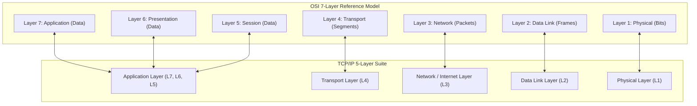
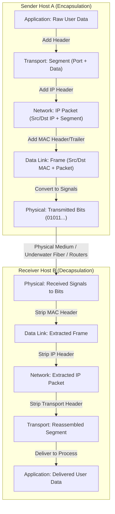
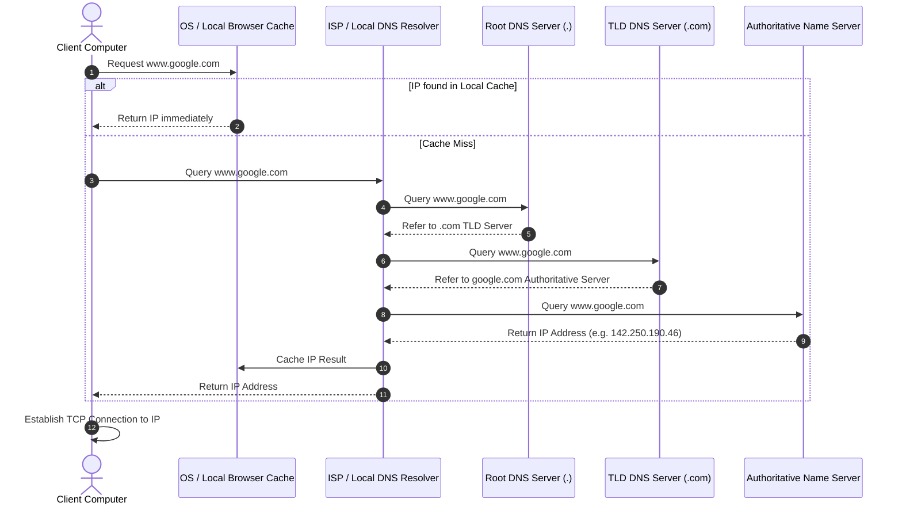
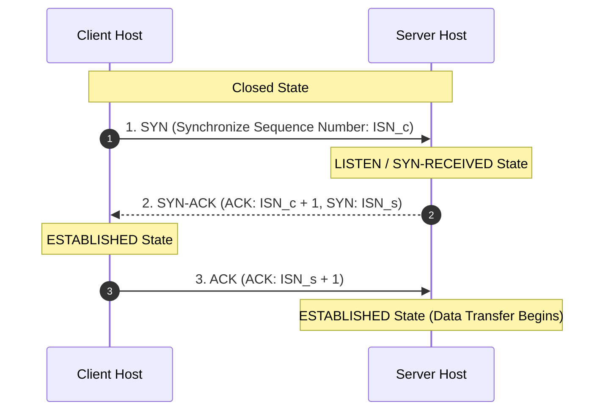
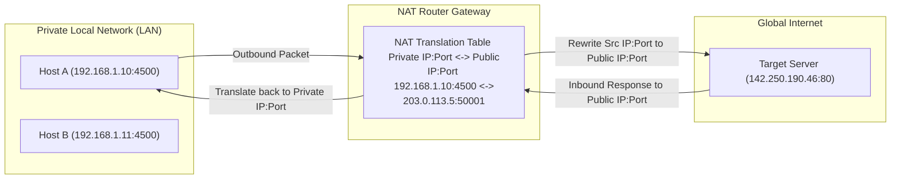
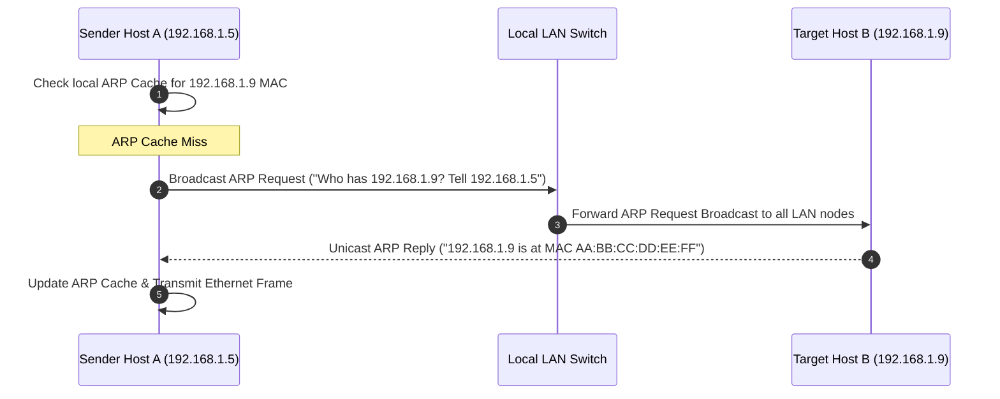

# Detailed Study Notes — Computer Networking Full Course - OSI Model Deep Dive with Real Life Examples

## 📖 Ingestion Overview

This note represents a comprehensive, high-fidelity distillation of the YouTube video titled **"Computer Networking Full Course - OSI Model Deep Dive with Real Life Examples"** presented by **Kunal Kushwaha** ([YouTube Watch Link](https://www.youtube.com/watch?v=IPvYjXCsTg8)).

The video delivers an end-to-end foundation and deep technical dive into computer networking. It covers the historical origins of the internet (ARPANET and WWW), core architectural paradigms (Client-Server, P2P), physical and logical addressing (IP addresses, Port numbers, MAC addresses), the 7-layer OSI Reference Model and 5-layer TCP/IP Protocol Suite, application layer protocols (HTTP, SMTP, DNS), transport layer mechanics (TCP, UDP, multiplexing, sequence numbers, checksums, timers, 3-way handshake), network layer routing, IP packet structures, NAT, and data link layer frames and ARP.

---

## 📜 Section 1: Historical Evolution of Networking & the Internet (00:00 - 17:38)

### 1.1 Fundamental Definitions & Core Concepts (00:04 - 04:50)
- **Computer Network (02:34)**: An interconnected collection of independent computing devices capable of sharing data and resources.
- **The Internet (03:25)**: A global "network of networks" spanning cities, regions, and continents. It connects diverse local networks into a unified worldwide communications infrastructure.
- **Motivation for Learning (00:04 - 02:10)**: Understanding network internals—how data travels from client browser to server and back—is vital for software engineering, web and mobile development, cloud computing, and DevOps engineering.

### 1.2 Genesis of the Internet: Cold War, ARPANET, and TCP/IP (04:50 - 10:54)
- **Space Race & ARPA (05:12 - 06:07)**: Following the Soviet Union's launch of Sputnik in 1957, the US Department of Defense established ARPA (Advanced Research Projects Agency) to foster scientific and technological breakthroughs in computing and defense communications.
- **ARPANET (06:24 - 07:18)**: Launched as the precursor to the modern internet. Initially connected four major node locations:
  1. Massachusetts Institute of Technology (MIT)
  2. Stanford University
  3. University of California, Los Angeles (UCLA)
  4. University of Utah
- **Protocol Foundations (07:18 - 10:23)**: ARPANET introduced early standardization protocols, eventually adopting Transmission Control Protocol / Internet Protocol (TCP/IP) as its universal data-exchange standard.

### 1.3 The World Wide Web (WWW) & Hyperlink Web (10:54 - 15:21)
- **The Problem of Research Document Sharing (10:54 - 12:24)**: Early ARPANET allowed file transfers, but lacked automated hyperlinking between documents across different institutions.
- **Invention of WWW (12:24 - 13:55)**: Tim Berners-Lee developed the World Wide Web project at CERN. WWW introduced Uniform Resource Locators (URLs), Hypertext Transfer Protocol (HTTP), and Hypertext Markup Language (HTML) to link and retrieve interlinked web pages across server nodes.
- **Rise of Search Engines (14:21 - 15:21)**: As web pages scaled beyond static link browsing, search engines (such as early engines like Yahoo! and later Google) emerged to index and query information across the web.

### 1.4 Internet Governance, RFCs, and Standards (15:21 - 17:38)
- **Internet Society (ISOC) & IETF (16:19 - 17:20)**: Internet standards, protocols, and architectural policies are governed globally by open bodies including the Internet Society and Internet Engineering Task Force (IETF).
- **Request for Comments (RFC) (16:50 - 17:20)**: Official document series detailing network protocols, methods, research, and technical specifications. Protocol standards (such as IP, TCP, HTTP) are published and refined through RFC proposals.

---

## 🏗️ Section 2: Architectural Paradigms & Fundamental Constructs (17:38 - 1:01:34)

### 2.1 Client-Server vs. Peer-to-Peer Architecture (17:38 - 22:00, 1:30:20 - 1:39:52)
- **Client-Server Architecture (17:49 - 19:59)**:
  - **Client**: Requests services, pages, or data resources (e.g., web browser, mobile client).
  - **Server**: Dedicated high-availability system that processes incoming client requests and returns appropriate responses (HTML, JSON, media streams).
  - *Local Host*: A single machine can simultaneously act as both client and server (e.g., `localhost:8080`).
- **Peer-to-Peer (P2P) Architecture (1:38:18 - 1:39:52)**:
  - Decentralized network model where nodes (peers) act as both clients and servers without requiring a central authority. Peers share workload and bandwidth directly (e.g., BitTorrent, blockchain networks).

### 2.2 IP Addressing: Local vs. Global Addresses (24:20 - 34:23)
- **IP Address Purpose (25:43 - 27:01)**: Logical numerical identifier assigned to every device on a TCP/IP network, functioning like a postal code or telephone number for routing packets.
- **Dotted-Decimal IPv4 Format (27:01)**: 32-bit address split into four 8-bit octets (`X.X.X.X`), where each octet ranges from `0` to `255`.
- **Global vs. Local (Private) IP Addresses (28:42 - 31:04)**:
  - **Global (Public) IP**: Assigned by Internet Service Providers (ISPs) to modem/router gateways; uniquely identifiable across the entire global internet.
  - **Local (Private) IP**: Assigned inside local networks (LANs) to individual user devices (laptops, phones, smart TVs) behind the router.
- **Dynamic Host Configuration Protocol (DHCP) (29:47 - 30:11)**: Network management protocol used by routers to automatically dynamically allocate private IP addresses to devices joining the local network.

### 2.3 Port Numbers & Socket Abstraction (34:23 - 42:25, 1:50:22 - 1:51:10)
- **Port Number Purpose (32:54 - 34:11)**: 16-bit numerical identifier ($0 \text{ to } 65,535$) used to route data packets to the correct application or process running on a host device.
  $$\text{Total Ports} = 2^{16} = 65,536$$
- **Port Categories (35:40 - 38:00)**:

| Category | Port Range | Description & Examples |
| :--- | :--- | :--- |
| **Well-Known Ports** | `0` – `1023` | System/standard protocol ports reserved by IANA.  • HTTP: `80`  • HTTPS: `443`  • SSH: `22`  • FTP: `21` |
| **Registered Ports** | `1024` – `49151` | Reserved for specific user applications/databases.  • MySQL: `3306`  • PostgreSQL: `5432`  • MongoDB: `27017`  • SQL Server: `1433` |
| **Dynamic / Private Ports** | `49152` – `65535` | Ephemeral ports assigned dynamically by OS for outbound client connections. |

- **Socket Abstraction (1:50:22 - 1:51:10)**: The operational endpoint combining an IP address and Port number (`IP:Port`), establishing a dual-ended communication channel between client and server processes.

### 2.4 Physical Infrastructure: Submarine Fiber Optics & Transmission Media (42:25 - 48:00)
- **Undersea Optical Fiber Cables (42:27 - 45:58)**: Transcontinental internet traffic travels predominantly through high-capacity submarine fiber-optic cables buried on the ocean floor rather than satellite links due to vastly superior bandwidth and significantly lower latency.
- **Guided vs. Unguided Media (41:29 - 47:17)**:
  - **Guided Media**: Physical conductors (coaxial cable, twisted-pair Ethernet, optical fiber).
  - **Unguided Media**: Wireless electromagnetic transmissions (Wi-Fi, Bluetooth, 4G/5G LTE, satellite radio waves).

### 2.5 Network Classifications & Topologies (48:00 - 1:01:34)
- **Scale Classifications (48:09 - 51:03)**:
  - **LAN (Local Area Network)**: Covers small geographic areas (homes, offices, schools).
  - **MAN (Metropolitan Area Network)**: Spans across a city or municipality.
  - **WAN (Wide Area Network)**: Connects multiple LANs across states, countries, or globally.
- **Network Topologies (55:47 - 1:01:34)**:

| Topology | Description | Advantage | Disadvantage |
| :--- | :--- | :--- | :--- |
| **Bus** | Single central backbone cable connecting all nodes. | Simple, low cabling cost. | Single point of failure (cable break halts network). |
| **Ring** | Nodes connected in a circular closed loop. | Equal access, predictable token flow. | One broken node breaks loop connection. |
| **Star** | All nodes connect independently to a central hub/switch. | Easy troubleshooting, single link failure doesn't affect others. | High dependency on central switch hub. |
| **Tree** | Hierarchical combination of star and bus topologies. | Scalable for large enterprise setups. | Complex configuration and maintenance. |
| **Mesh** | Direct point-to-point connections between all nodes. | Maximum redundancy, fault tolerance. | Extremely expensive, cabling complexity ($N(N-1)/2$). |

---

## 🧅 Section 3: Layered Architectural Models: OSI & TCP/IP Deep Dive (1:01:34 - 1:30:20)

### 3.1 The 7-Layer OSI Reference Model (1:01:34 - 1:28:49)
Developed by ISO, the Open Systems Interconnection (OSI) reference model establishes a standardized 7-layer framework for understanding host-to-host communications:

1. **Layer 7 — Application Layer (1:09:10)**: Provides direct network interface to end-user software applications (HTTP, SMTP, FTP, DNS).
2. **Layer 6 — Presentation Layer (1:11:46)**: Handles data syntax translation, encoding/decoding, data compression (lossy/lossless), and cryptographic encryption/decryption (SSL/TLS).
3. **Layer 5 — Session Layer (1:12:48)**: Establishes, manages, synchronizes, and terminates active communication sessions between hosts; handles authentication and authorization checkpoints.
4. **Layer 4 — Transport Layer (1:14:25)**: Ensures end-to-end process-to-process delivery, segmentation, flow control, error control (checksums), retransmission timers, and port multiplexing (TCP, UDP).
5. **Layer 3 — Network Layer (1:17:36)**: Manages logical IP addressing, packet creation, subnetting, load balancing, and routing across heterogeneous networks (IP, ICMP, ARP).
6. **Layer 2 — Data Link Layer (1:20:34)**: Organizes packets into physical frames, handles physical hardware (MAC) addressing, error detection (CRC), and Media Access Control (ARP).
7. **Layer 1 — Physical Layer (1:24:32)**: Transmits raw unstructured binary bitstreams ($0\text{s and } 1\text{s}$) over physical transmission media (cables, optical pulses, radio frequencies).

### 3.2 OSI Model vs. TCP/IP Protocol Suite Comparison (1:29:00 - 1:30:20)

| Layer Metric / Level | OSI 7-Layer Reference Model | TCP/IP 5-Layer Protocol Suite | Protocol Data Unit (PDU) | Core Protocols / Standards |
| :--- | :--- | :--- | :--- | :--- |
| **Upper Layers** | Layer 7: Application  Layer 6: Presentation  Layer 5: Session | Application Layer | **Data** | HTTP, HTTPS, SMTP, DNS, FTP, SSH, TLS/SSL |
| **Transport Layer** | Layer 4: Transport | Transport Layer | **Segment** (TCP) / **Datagram** (UDP) | TCP, UDP |
| **Network Layer** | Layer 3: Network | Internet / Network Layer | **Packet** | IPv4, IPv6, ICMP, BGP, OSPF |
| **Data Link Layer** | Layer 2: Data Link | Data Link Layer | **Frame** | Ethernet, Wi-Fi (802.11), ARP, MAC |
| **Physical Layer** | Layer 1: Physical | Physical Layer | **Bits** | Copper wire, Fiber Optics, Radio waves |

### 3.3 End-to-End Encapsulation & Decapsulation Pipeline (1:25:54 - 1:28:49)
When a message travels from Client Host A to Server Host B, data undergoes encapsulation down the stack on Host A, physical transmission over network media, and decapsulation up the stack on Host B:

---

## 🌐 Section 4: Application Layer Protocols & Domain Name System (1:43:05 - 2:32:24)

### 4.1 HTTP Protocol Mechanics, Verbs, Status Codes & Cookies (1:53:12 - 2:11:00)
- **HTTP (Hypertext Transfer Protocol) (1:53:12)**: Application-layer protocol governing communications between web clients and web servers via request-response cycles.
- **HTTP Methods / Verbs (2:00:00)**:
  - `GET`: Retrieve web pages, documents, or data resources.
  - `POST`: Submit new data to server (form submissions, file uploads).
  - `PUT`: Replace or update an existing resource on server.
  - `DELETE`: Remove a resource from server.
- **HTTP Status Codes (2:04:44)**:
  - `1xx (Informational)`: Request received, protocol processing.
  - `2xx (Success)`: Action successfully received and accepted (e.g., `200 OK`, `201 Created`).
  - `3xx (Redirection)`: Further action needed to complete request (e.g., `301 Moved Permanently`).
  - `4xx (Client Error)`: Request contains bad syntax or cannot be fulfilled (e.g., `400 Bad Request`, `404 Not Found`).
  - `5xx (Server Error)`: Server failed to fulfill an apparently valid request (e.g., `500 Internal Server Error`, `503 Service Unavailable`).
- **Cookies & State Management (2:06:30)**: HTTP is stateless by design. Web applications use HTTP Cookies (stored in client browsers) to maintain user sessions, authentication tokens, and preferences across requests.

### 4.2 Email Transmission Architecture: SMTP, IMAP & POP3 (2:11:00 - 2:19:00)
- **SMTP (Simple Mail Transfer Protocol)**: Protocol used by mail clients and servers to push and relay outbound emails across networks.
- **IMAP vs. POP3**:
  - **IMAP (Internet Message Access Protocol)**: Synchronizes email state directly on server, allowing multiple devices to manage the same inbox.
  - **POP3 (Post Office Protocol v3)**: Downloads emails from server to client device and typically deletes them from server.

### 4.3 Domain Name System (DNS) Resolution Architecture (2:19:00 - 2:32:24)
Human-readable domain names (e.g., `www.google.com`) are converted into machine-routable IP addresses via the hierarchical DNS database system.

- **DNS Hierarchy Structure (2:23:09 - 2:27:09)**:
  1. **Root DNS Servers (`.`)**: 13 canonical root server clusters maintaining top-level domain metadata.
  2. **Top-Level Domain (TLD) Servers**: Manage extensions such as `.com`, `.org`, `.edu`, `.io`, and country-code TLDs (`.in`, `.uk`). Maintained under ICANN governance.
  3. **Authoritative Name Servers**: Hold authoritative IP records (A, AAAA, CNAME, MX) for specific registered domains.
- **Resolution Step-by-Step Flow (2:27:45 - 2:30:43)**:

---

## 🚚 Section 5: Transport Layer Mechanics: TCP vs. UDP (2:32:24 - 3:13:40)

### 5.1 Core Responsibilities & Multiplexing / Demultiplexing (2:32:24 - 2:46:14)
- **Transport Layer Domain**: Provides process-to-process communication within endpoints, abstracting network routing from applications.
- **Multiplexing (2:41:11)**: Host gathers data from multiple socket application ports, attaches transport headers (source/destination port numbers), and passes combined segments down to network layer.
- **Demultiplexing (2:41:57)**: Receiving host transport layer examines segment headers and directs payload to correct application socket port (e.g., routing HTTP response to browser vs. Discord voice packet to gaming socket).

### 5.2 Reliability & Error Control Mechanisms (2:46:14 - 2:54:00)
- **Checksums (2:47:35)**: Mathematical hash value appended to headers to detect bit corruption during transit. Sender computes checksum over header and data; receiver recomputes checksum. If checksums mismatch, segment is discarded.
- **Retransmission Timers (2:49:26)**: Sender starts a timer upon transmitting a segment. If acknowledgment (ACK) is not received before timer expiration, sender assumes segment loss and triggers retransmission.
- **Sequence Numbers & Duplication Prevention (2:52:40)**: Unique integer sequence numbers assigned to each packet enable receiver to reorder out-of-order segments and identify/discard duplicate retransmissions.

### 5.3 User Datagram Protocol (UDP) (2:54:00 - 3:02:05)
- **UDP Characteristics (2:54:56 - 2:56:33)**: Lightweight, connectionless, unreliable transport protocol. Provides minimal overhead without connection handshakes, delivery guarantees, retransmissions, or flow/congestion control.
- **UDP Header Layout (2:57:36 - 2:59:39)**: Fixed 8-byte header structure:
  - Source Port (2 bytes)
  - Destination Port (2 bytes)
  - Datagram Length (2 bytes)
  - Checksum (2 bytes)
- **UDP Use Cases (3:00:38)**: Real-time applications prioritizing speed over lossless delivery: video conferencing, online multiplayer gaming, live streaming, DNS queries, VoIP.

### 5.4 Transmission Control Protocol (TCP) & 3-Way Handshake (3:02:05 - 3:13:40)
- **TCP Characteristics (3:02:05)**: Connection-oriented, highly reliable, byte-stream transport protocol ensuring ordered, error-free, lossless data delivery with built-in flow control and congestion control.
- **TCP 3-Way Handshake Connection Establishment (3:09:10)**:

---

## 🗺️ Section 6: Network Layer, IP Addressing & Middleboxes (3:13:40 - 3:55:40)

### 6.1 Logical Addressing & Routing Mechanics (3:13:40 - 3:24:30)
- **Network Layer Function**: Moves packets end-to-end across multiple intermediate networks and routers from source host to destination host.
- **Control Plane vs. Data (Forwarding) Plane (3:21:50)**:
  - **Data Plane (Forwarding)**: Local router hardware action executing high-speed transfer of incoming packet from input port to output port based on routing table.
  - **Control Plane (Routing)**: Network-wide logic (routing algorithms like Dijkstra, BGP, OSPF) determining optimal paths and building forwarding tables.

### 6.2 IP Packet Structure, IPv4 vs. IPv6 (3:24:30 - 3:49:50)
- **IP Packet Header Fields (3:38:45)**: IP version, Header Length, Type of Service (ToS/QoS), Total Packet Length, Time to Live (TTL), Protocol Identifier (TCP/UDP), Header Checksum, Source IP Address, Destination IP Address.
- **IPv4 vs. IPv6 Feature Comparison (3:41:42)**:

| Feature Metric | IPv4 (Internet Protocol Version 4) | IPv6 (Internet Protocol Version 6) |
| :--- | :--- | :--- |
| **Address Length** | 32 bits (4 bytes) | 128 bits (16 bytes) |
| **Address Space** | $2^{32} \approx 4.3 \text{ billion addresses}$ | $2^{128} \approx 3.4 \times 10^{38} \text{ addresses}$ |
| **Format Representation** | Dotted-decimal (`192.168.1.1`) | Hexadecimal colon-separated (`2001:0db8:85a3::8a2e:0370:7334`) |
| **Configuration** | Manual or via DHCP server | Stateless Auto-configuration (SLAAC) or DHCPv6 |
| **NAT Requirement** | Essential due to IPv4 exhaustion | Unnecessary (every device receives public global IP) |

### 6.3 Middleboxes & Network Address Translation (NAT) (34:23, 3:49:50 - 3:55:40)
- **NAT Purpose (3:52:32)**: Solves public IPv4 address exhaustion by mapping multiple local private IP addresses inside a LAN to a single public IP address assigned to router gateway.
- **NAT Translation Process**:

---

## 🔗 Section 7: Data Link & Physical Layers (3:55:40 - 4:06:52)

### 7.1 Data Link Layer Frames, MAC Addressing & ARP (3:55:40 - 4:03:42)
- **Data Link Function**: Responsible for hop-to-hop frame transmission across a shared local physical media link between directly connected network interface cards (NICs).
- **MAC Address (Media Access Control) (4:00:59 - 4:03:10)**: 48-bit (12-character hexadecimal) permanent hardware address burned into network interface hardware (e.g., `00:1A:2B:3C:4D:5E`).
- **Address Resolution Protocol (ARP) (3:59:52 - 4:01:00)**: Maps logical Layer 3 IP addresses to physical Layer 2 MAC addresses within a local subnet.

### 7.2 Physical Layer Transmission & Conclusion (4:03:42 - 4:06:52)
- **Physical Layer Duties (4:04:11)**: Converts data link frames into physical binary bitstreams and modulates electrical voltage signals, light pulses (fiber optics), or radio waves (Wi-Fi) over media.
- **Summary Conclusion (4:05:24 - 4:06:52)**: Mastering computer networking fundamental concepts—from OSI model layer boundaries and TCP/IP protocol mechanics to DNS, sockets, packets, frames, and routing—is essential for software development, cloud infrastructure, and DevOps engineering.

---

## 📌 Section 8: Key Takeaways & Summary Matrix

> **"Understanding how data flows through layers, ports, IP routing, and physical infrastructure provides the core mental model required to build, scale, and debug modern web applications and cloud architecture." (01:14)**

### Core Architectural Summary Matrix

| Network Concept | Layer Level | Primary Identifier | Unit of Data | Key Protocols / Tech | Core Responsibilities |
| :--- | :--- | :--- | :--- | :--- | :--- |
| **Application Services** | OSI L7-L5 / TCP/IP L5 | URL / URI | User Data | HTTP, HTTPS, DNS, SMTP | User interface, state management, resource retrieval, domain lookup. |
| **Transport Delivery** | OSI L4 / TCP/IP L4 | Port Number ($0-65535$) | Segment (TCP) / Datagram (UDP) | TCP, UDP | Process-to-process delivery, multiplexing, reliability, flow control. |
| **Network Routing** | OSI L3 / TCP/IP L3 | IP Address (IPv4 / IPv6) | Packet | IP, ICMP, NAT, BGP | Logical addressing, packet creation, router forwarding, path selection. |
| **Link Switching** | OSI L2 / TCP/IP L2 | MAC Address (48-bit Hex) | Frame | Ethernet, Wi-Fi, ARP | Hardware hop-to-hop frame delivery, local subnet access control. |
| **Physical Media** | OSI L1 / TCP/IP L1 | Signals / Voltage / Frequencies | Bits ($0$s and $1$s) | Submarine Cables, RF | Binary signal transmission over optical, copper, or wireless media. |

---

## 🔗 Related & Source Metadata

- **Source Captured File**: `[[01_RAW/SOURCE/Computer Networking Full Course - OSI Model Deep Dive with Real Life Examples.md]]`
- **Primary MOC**: `[[03_MOC/General MOC|General MOC]]`
