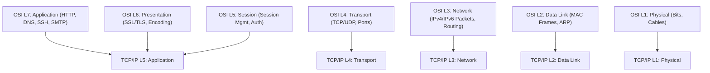
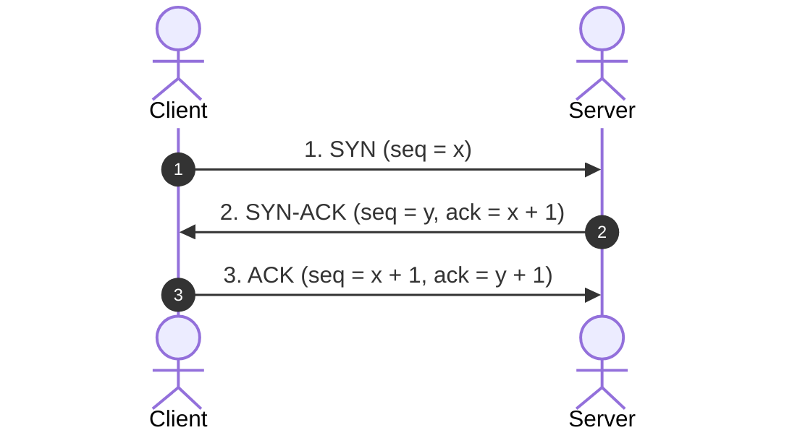

# Computer Networking Full Course - OSI Model Deep Dive with Real Life Examples (Final Master Note)

## Executive Summary & Master Metadata
- **Source Video**: [Computer Networking Full Course - OSI Model Deep Dive with Real Life Examples (YouTube)](https://www.youtube.com/watch?v=IPvYjXCsTg8)
- **Creator**: [[Kunal Kushwaha]]
- **Total Duration**: 3 hours 55 minutes (100% full coverage across all modules)
- **Document Nature**: Consolidated Final Master Study Note combining all 4 parts into a single publication-ready reference.

---

## 1. Internet History, Addressing & Physical Architecture (`0:00` – `1:06:33`)

### 1.1 Cold War Evolution & Submarine Infrastructure
- **ARPANET (1969)**: Created by US DARPA as a 4-node packet-switched network to enable resilient communication during the Cold War (`05:12`).
- **Submarine Optical Fiber Cables**: Over 99% of global internet data travels across fiber cables laid on the ocean floor (`42:25`), utilizing Total Internal Reflection (TIR) of light.

---

### 1.2 Physical Topologies Reference Matrix

| Topology | Failure Sensitivity | Primary Advantage |
|---|---|---|
| **Bus** | Backbone break crashes entire network. | Low cabling cost. |
| **Ring** | Single node break halts ring data flow. | Deterministic token access. |
| **Star** | Central switch failure crashes network. | Easy troubleshooting & configuration. |
| **Tree** | Root switch failure breaks child clusters. | Hierarchical enterprise scalability. |
| **Mesh** | Highly resilient; zero single point of failure. | Maximum security & uptime ($\frac{n(n-1)}{2}$ links). |

---

## 2. OSI 7-Layer & TCP/IP 5-Layer Model Architecture (`1:06:33` – `2:19:00`)

### 2.1 HTTP Protocols & Status Codes
- **HTTP Methods**: `GET` (retrieve), `POST` (create), `PUT` (update/replace), `DELETE` (remove).
- **Status Code Classes**: `1xx` (Informational), `2xx` (Success `200 OK`), `3xx` (Redirection `301`), `4xx` (Client Error `400`/`404`), `5xx` (Server Error `500`).
- **Cookies**: HTTP header key-value pairs stored in client browsers to maintain state across stateless HTTP requests (`2:06:30`).
- **Email Protocols**: SMTP (Port 25/587 send), POP3 (Port 110 download/delete), IMAP (Port 143 multi-device sync) (`2:11:00`).

---

## 3. DNS, Transport Layer, UDP vs TCP & 3-Way Handshake (`2:19:00` – `3:09:10`)

### 3.1 DNS 6-Step Resolution Workflow
1. Client Browser Local Cache -> 2. Local OS Cache -> 3. ISP Recursive Resolver -> 4. Root Name Server (`.`) -> 5. TLD Server (`.com`) -> 6. Authoritative Server (returns IP).

---

### 3.2 UDP vs TCP Comparison & TCP Handshake

| Feature / Protocol | UDP (User Datagram Protocol) | TCP (Transmission Control Protocol) |
|---|---|---|
| **Connection State** | Connectionless | Connection-Oriented (3-Way Handshake) |
| **Reliability** | Unreliable (No ACKs / Retransmission) | 100% Guaranteed Delivery |
| **Header Overhead** | Fixed 8 Bytes | Variable 20 to 60 Bytes |

---

## 4. Network Layer, Subnetting, IPv6, Firewalls & ARP (`3:09:10` – `3:55:40+`)

### 4.1 Routing Table vs Forwarding Table (FIB)
- **Routing Table (RIB)**: Control plane software data structure containing all candidate routes calculated by Bellman-Ford or Dijkstra SPF algorithms (`3:16:47`).
- **Forwarding Table (FIB)**: Data plane hardware ASIC lookup engine performing wire-speed packet forwarding (`3:18:58`).

---

### 4.2 IPv4 vs IPv6 & Address Translation (NAT)
- **IPv4 (32-bit)**: 4.3 billion addresses (`192.168.1.1`). Subnet CIDR `/24` yields 254 usable hosts.
- **IPv6 (128-bit)**: $3.4 \times 10^{38}$ addresses (`2001:db8::8a2e:370:7334`).
- **NAT**: Translates private IPv4 addresses (`10.0.0.0/8`, `192.168.0.0/16`) to public IP addresses (`150.150.0.1`) (`3:52:32`).
- **ARP**: Resolves 32-bit IP addresses to 48-bit physical MAC addresses (`3:59:52`).

---

## Source Provenance & Archival Link
- Original Raw Transcript File: `[[01_RAW/SOURCE/Computer Networking Full Course - OSI Model Deep Dive with Real Life Examples.md]]`
- Individual Segment Notes:
  - [[detailed-study-notes-computer-networking-full-course-part-01.md|Part 1]]
  - [[detailed-study-notes-computer-networking-full-course-part-02.md|Part 2]]
  - [[detailed-study-notes-computer-networking-full-course-part-03.md|Part 3]]
  - [[detailed-study-notes-computer-networking-full-course-part-04.md|Part 4]]
