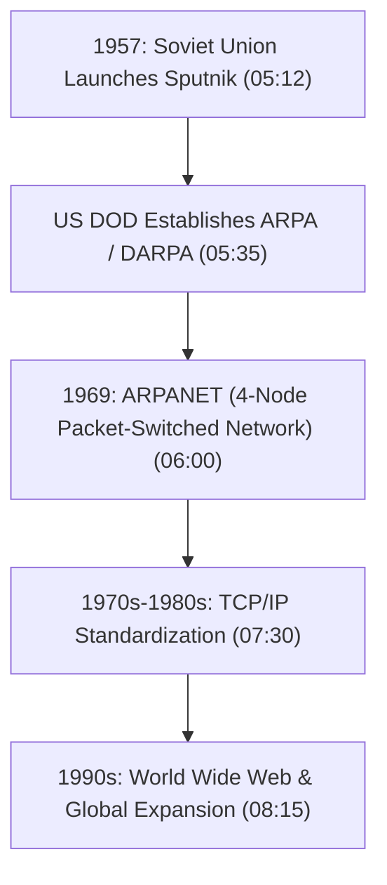
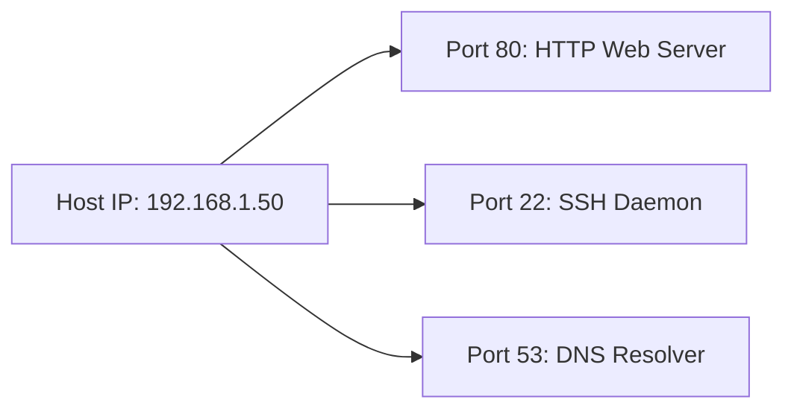
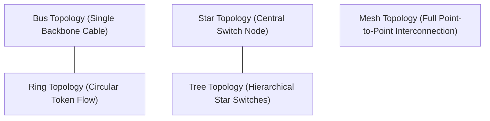

# Computer Networking Full Course - OSI Model Deep Dive with Real Life Examples (Part 1)

## Executive Summary & Metadata
- **Source Video**: [Computer Networking Full Course - OSI Model Deep Dive with Real Life Examples (YouTube)](https://www.youtube.com/watch?v=IPvYjXCsTg8)
- **Creator**: [[Kunal Kushwaha]]
- **Scope**: Part 1 of 4 (Timestamps `0:00` to `1:06:33`)
- **Key Focus**: Historical Origin of the Internet (Cold War, Sputnik 1957, DARPA ARPANET), Fundamental Definitions, Client-Server vs Distributed Communication, Protocol Foundations, IP Addressing & Port Allocation, Submarine Fiber Optic Infrastructure, LAN/MAN/WAN Boundaries, Hardware Devices (Modem vs Router), Topologies (Bus, Ring, Star, Tree, Mesh), and Network Hierarchical Structure.

---

## 1. Historical Evolution of Computer Networking (`0:00` – `17:38`)

### 1.1 Cold War Origins & ARPANET
The modern Internet originated during the Cold War space-race rivalry between the United States and the Soviet Union (`04:50`).

Key Historical Milestones:
1. **Sputnik 1 (1957)**: Prompted the US Department of Defense to create DARPA (Defense Advanced Research Projects Agency) (`05:12`).
2. **ARPANET (1969)**: The world's first operational packet-switched network connecting UCLA, Stanford, UC Santa Barbara, and University of Utah (`06:00`).
3. **Decentralized Resilient Architecture**: Designed so that if any individual communication node or military command center were destroyed, network traffic would dynamically re-route around the outage (`07:15`).

---

## 2. Core Concepts: IP Addressing, Ports & Global Infrastructure (`17:38` – `48:00`)

### 2.1 Client-Server Communication & Protocols
- **Client**: Endpoint host initiating requests (e.g., web browser, mobile application) (`17:38`).
- **Server**: Remote host listening for incoming connections and servicing requested resources (`17:38`).
- **Protocol**: A standardized set of rules governing syntax, semantics, and synchronization of communication between network entities (`22:00`).

---

### 2.2 Addressing & Transport Identifiers
- **IP Address**: Unique logical identifier assigned to every network interface card (IPv4 32-bit or IPv6 128-bit) to route data packets across global networks (`24:20`).
- **Port Number**: 16-bit numerical identifier (`0` to `65535`) identifying a specific application process or service running on a host (`34:23`).

---

### 2.3 Submarine Optical Fiber Cable Infrastructure (`42:25`)
Over 99% of international inter-continental data traffic travels over submarine fiber-optic cables laid on the ocean floor (`42:25`).
- **Fiber Optic Transmission**: Uses Total Internal Reflection (TIR) of light pulses inside glass fibers to achieve near-light-speed data transfer across oceans (`43:10`).
- **Landing Stations**: Coastal facilities where submarine cables terminate and connect to national terrestrial fiber backbones (`45:00`).

---

## 3. Network Scale Classification, Modems & Topologies (`48:00` – `1:06:33`)

### 3.1 Network Scale Classifications
- **LAN (Local Area Network)**: Private high-speed network confined to a single home, office building, or university campus (`48:00`).
- **MAN (Metropolitan Area Network)**: Spans a city or metropolitan region (`49:30`).
- **WAN (Wide Area Network)**: Global network spanning multiple countries and continents (e.g., the Internet) (`51:00`).

---

### 3.2 Modem vs Router Hardware Distinction (`52:20`)

| Device | Primary Layer / Function | Core Operational Duty | Timestamp |
|---|---|---|---|
| **Modem** | Layer 1 / Modulation | Converts analog ISP signals (cable/DSL/fiber light) into digital binary bits and vice versa. | `52:20` |
| **Router** | Layer 3 / Packet Routing | Directs digital data packets between different IP networks and performs local IP allocation (DHCP/NAT). | `52:20` |

---

### 3.3 Physical Topologies Reference Matrix (`55:47`)

| Topology Name | Connection Architecture | Failure Impact | Primary Advantage | Timestamp |
|---|---|---|---|---|
| **Bus** | Single central backbone cable. | Backbone break crashes entire network. | Low cabling cost. | `55:47` |
| **Ring** | Nodes connected in a closed circle. | Single node break halts ring. | Deterministic token access. | `57:10` |
| **Star** | All nodes connect to central switch. | Switch break crashes network; single line break affects 1 host. | Easy troubleshooting. | `58:20` |
| **Tree** | Hierarchical star topologies linked together. | Root switch failure breaks child clusters. | Highly scalable enterprise setup. | `59:40` |
| **Mesh** | Redundant direct point-to-point links ($\frac{n(n-1)}{2}$). | Extremely fault tolerant; zero single point of failure. | Maximum security & uptime. | `1:00:15` |

---

## Source Provenance & Archival Link
- Original Raw Transcript File: `[[01_RAW/SOURCE/Computer Networking Full Course - OSI Model Deep Dive with Real Life Examples.md]]`
