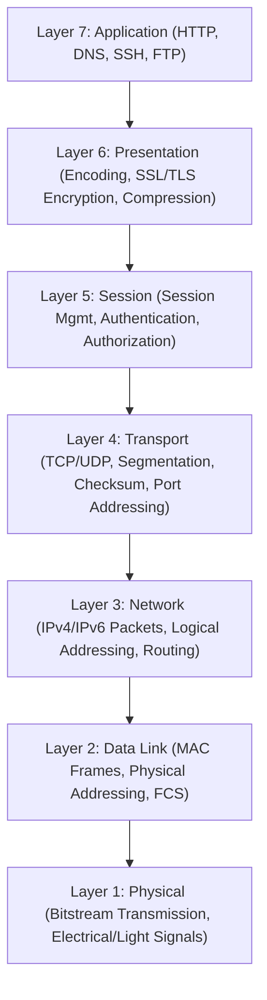
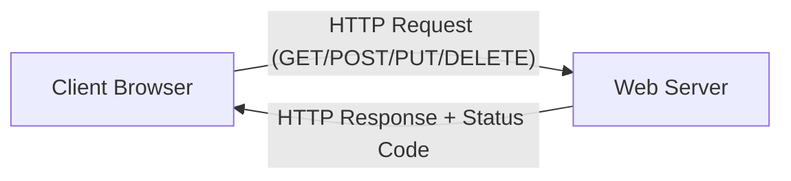
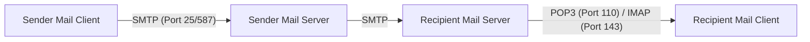

# Computer Networking Full Course - OSI Model Deep Dive with Real Life Examples (Part 2)

## Executive Summary & Metadata
- **Source Video**: [Computer Networking Full Course - OSI Model Deep Dive with Real Life Examples (YouTube)](https://www.youtube.com/watch?v=IPvYjXCsTg8)
- **Creator**: [[Kunal Kushwaha]]
- **Scope**: Part 2 of 4 (Timestamps `1:06:33` to `2:19:00`)
- **Key Focus**: OSI 7-Layer Reference Model Architecture, Layer Duties & Data Encapsulation, TCP/IP 5-Layer Model, Client-Server vs Peer-to-Peer (P2P), Networking Hardware Devices (Repeater, Hub, Bridge, Switch, Router, Gateway), Sockets & Ephemeral Ports, HTTP/HTTPS Protocol Mechanics, HTTP Request Methods & Status Codes, HTTP Cookies, and Email Architecture (SMTP, POP3, IMAP).
- **Continuity**: Continuation from [[detailed-study-notes-computer-networking-full-course-part-01.md|Part 1]].

---

## 1. OSI 7-Layer Reference Model Architecture (`1:06:33` – `1:29:00`)

### 1.1 Detailed OSI Layer Duties

| Layer Number & Name | Primary Operational Duties | Core Protocol Data Unit (PDU) | Key Protocols / Technologies | Timestamp |
|---|---|---|---|---|
| **Layer 7: Application** | Software application interface for human users. | Data Message | HTTP, HTTPS, DNS, FTP, SMTP, SSH | `1:08:45` |
| **Layer 6: Presentation** | ASCII/EBCDIC translation, SSL/TLS encryption, data compression. | Formatted Data | SSL/TLS, JPEG, MPEG, ASCII | `1:09:55` |
| **Layer 5: Session** | Session setup, maintenance, dialog control, authentication/authorization. | Session Data | NetBIOS, RPC, SOCKS | `1:12:48` |
| **Layer 4: Transport** | End-to-end reliability, segmentation, sequence numbers, flow/error control. | Segment (TCP) / Datagram (UDP) | TCP, UDP | `1:14:25` |
| **Layer 3: Network** | Logical IP addressing, packet formation, shortest-path routing, ICMP. | Packet | IPv4, IPv6, ICMP, OSPF, BGP | `1:17:36` |
| **Layer 2: Data Link** | Physical MAC addressing, frame creation, MAC sublayer media access, FCS. | Frame | Ethernet 802.3, Wi-Fi 802.11, ARP | `1:20:34` |
| **Layer 1: Physical** | Bitstream modulation over physical copper, fiber, or wireless media. | Bit (`0` / `1`) | UTP Copper, Fiber Optic, Radio Waves | `1:24:32` |

---

### 1.2 OSI vs TCP/IP Model Mapping (`1:29:00`)
The TCP/IP Model (5-layer or 4-layer architecture) merges OSI Layers 5, 6, and 7 into a single unified **Application Layer**, while maintaining Transport, Network, Data Link, and Physical layers (`1:29:36`).

---

## 2. Hardware Devices, Sockets & Port Mechanics (`1:39:52` – `1:53:12`)

### 2.1 Networking Hardware Devices Comparison

| Device | Layer | Physical Ports | Filtering / Intelligence | Collision Domain | Broadcast Domain | Timestamp |
|---|---|---|---|---|---|---|
| **Repeater** | Layer 1 | 2 Ports | Dummy signal regenerator (No amplification). | 1 | 1 | `1:40:13` |
| **Hub** | Layer 1 | Multi-Port | Multi-port repeater; floods incoming data to all ports. | 1 | 1 | `1:40:33` |
| **Bridge** | Layer 2 | 2 Ports | Filters traffic by inspecting Source/Destination MAC addresses. | 2 | 1 | `1:41:26` |
| **Switch** | Layer 2 | Multi-Port | Multi-port intelligent bridge; forwards frames using CAM table. | $N$ (1 per port) | 1 | `1:41:52` |
| **Router** | Layer 3 | Multi-Port | Packet forwarding engine between different IP networks. | $N$ | $N$ | `1:42:19` |
| **Gateway** | Layer 7 | Multi-Port | Multi-protocol converter joining disparate networks. | $N$ | $N$ | `1:42:43` |

---

### 2.2 Sockets & Ephemeral Ports (`1:50:22` – `1:53:12`)
- **Socket**: The software abstraction interface joining an IP address and Port number (`IP:Port`) (`1:50:36`).
- **Ephemeral Ports**: Dynamic short-lived ports (`49152` – `65535`) automatically assigned by a client operating system for outbound connections (`1:51:38`). Once the connection completes, the port is released back to the OS.

---

## 3. HTTP Protocol, Status Codes & Email Architecture (`1:53:12` – `2:19:00`)

### 3.1 HTTP Request Methods & Status Codes

| HTTP Method | Operational Semantics | Safe / Idempotent |
|---|---|---|
| **GET** | Retrieves resource payload without side effects. | Safe & Idempotent |
| **POST** | Submits new data to create a new resource on the server. | Neither |
| **PUT** | Replaces or updates an existing resource entirely. | Idempotent |
| **DELETE** | Removes the specified target resource from the server. | Idempotent |

#### HTTP Response Status Code Classes (`2:04:44`)
- **1xx (Informational)**: Request received, continuing process (`100 Continue`).
- **2xx (Success)**: Action successfully received and accepted (`200 OK`, `201 Created`).
- **3xx (Redirection)**: Further action required (`301 Moved Permanently`, `302 Found`).
- **4xx (Client Error)**: Request contains bad syntax or cannot be fulfilled (`400 Bad Request`, `401 Unauthorized`, `403 Forbidden`, `404 Not Found`).
- **5xx (Server Error)**: Server failed to fulfill an apparently valid request (`500 Internal Server Error`, `502 Bad Gateway`, `503 Service Unavailable`).

---

### 3.2 HTTP State Management: Cookies (`2:06:30`)
HTTP is a stateless protocol. **Cookies** are small key-value data headers sent via `Set-Cookie` from web servers and stored by the client browser to maintain session state across HTTP requests (`2:06:30`).

---

### 3.3 Email Protocols Architecture (`2:11:00`)

- **SMTP (Simple Mail Transfer Protocol)**: Push protocol used to send email from client to server and between mail servers (Port 25 / 587) (`2:11:00`).
- **POP3 (Post Office Protocol v3)**: Pull protocol downloading emails from server to local client and deleting them from the server (Port 110) (`2:14:00`).
- **IMAP (Internet Message Access Protocol)**: Pull protocol synchronizing emails across multiple client devices while keeping master copies on the server (Port 143) (`2:14:00`).

---

## Source Provenance & Archival Link
- Original Raw Transcript File: `[[01_RAW/SOURCE/Computer Networking Full Course - OSI Model Deep Dive with Real Life Examples.md]]`
- Prerequisites: [[detailed-study-notes-computer-networking-full-course-part-01.md|Part 1 Note]]
