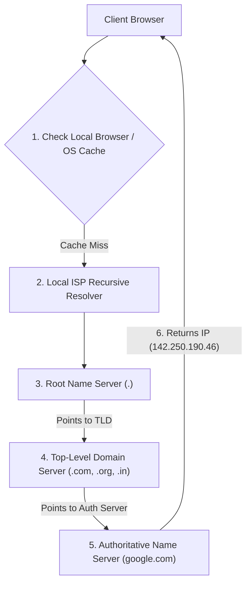
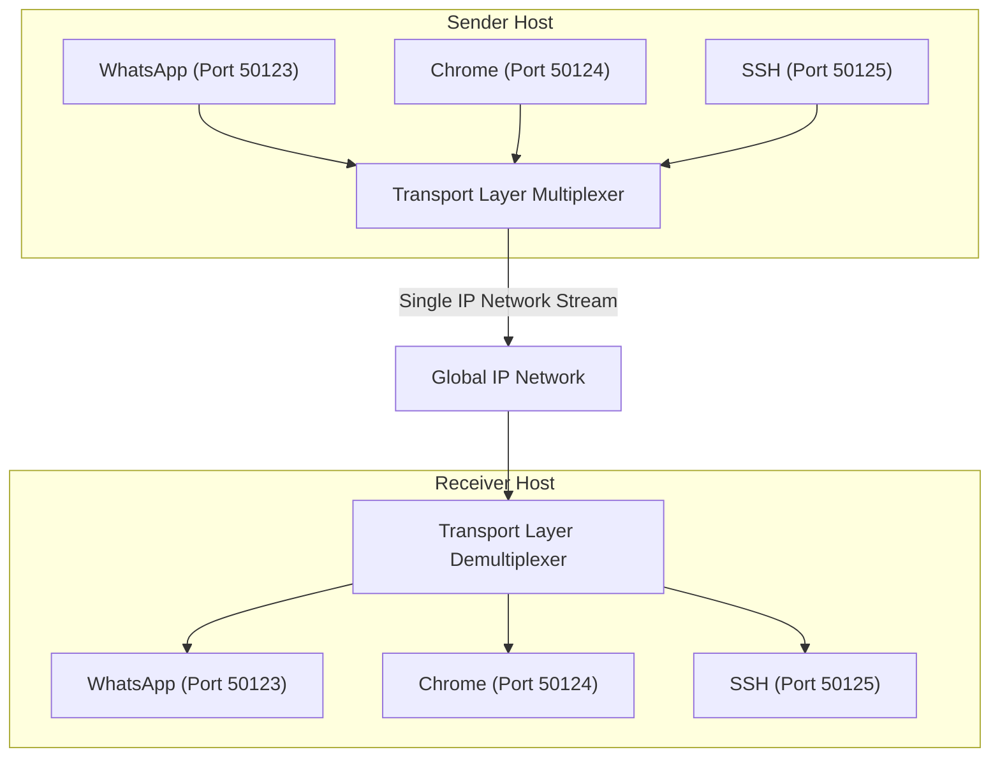
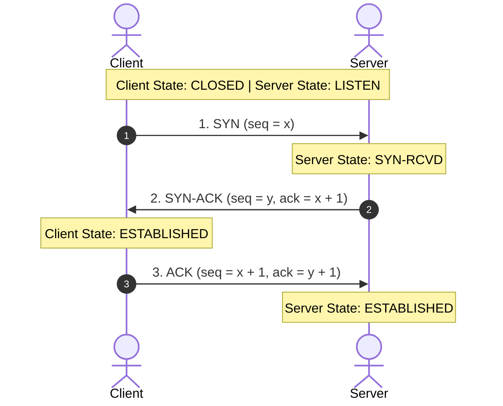

# Computer Networking Full Course - OSI Model Deep Dive with Real Life Examples (Part 3)

## Executive Summary & Metadata
- **Source Video**: [Computer Networking Full Course - OSI Model Deep Dive with Real Life Examples (YouTube)](https://www.youtube.com/watch?v=IPvYjXCsTg8)
- **Creator**: [[Kunal Kushwaha]]
- **Scope**: Part 3 of 4 (Timestamps `2:19:00` to `3:09:10`)
- **Key Focus**: Domain Name System (DNS Architecture & 6-Step Resolution Workflow), Transport Layer Multiplexing & Demultiplexing, Checksum Error Detection Math, Retransmission Timers & Sequence Numbers, UDP Datagram Mechanics (8-Byte Header), TCP Reliable Stream Mechanics (20-60 Byte Header), and TCP 3-Way Handshake Connection Engine.
- **Continuity**: Continuation from [[detailed-study-notes-computer-networking-full-course-part-02.md|Part 2]].

---

## 1. Domain Name System (DNS) Architecture (`2:19:00` – `2:32:24`)

### 1.1 DNS Hierarchical Resolution Tree



### 1.2 DNS Resolution Steps
1. **Local System Cache Check**: Inspects local browser cache and OS hosts file (`hosts`).
2. **Recursive Resolver Query**: Contacts local ISP or public recursive resolver (`8.8.8.8` / `1.1.1.1`) (`2:28:39`).
3. **Root Name Server Query (`.`)**: 13 root server clusters direct query to the appropriate TLD server (`2:29:11`).
4. **TLD Name Server Query (`.com`)**: Governed by ICANN; returns authoritative name server pointers (`2:29:55`).
5. **Authoritative Name Server Query**: Holds canonical zone file records (`A`, `AAAA`, `CNAME`, `MX`, `TXT`) (`2:30:28`).
6. **CLI Diagnostic Tools**: `dig` (Domain Information Grouper) and `nslookup -type=mx domain.com` (`2:31:29`).

---

## 2. Transport Layer Multiplexing, Error Control & Timers (`2:32:24` – `2:54:00`)

### 2.1 Transport Multiplexing & Demultiplexing



---

### 2.2 Error Control & Retransmission Timers (`2:47:35` – `2:54:00`)
- **Checksum Calculation**: 16-bit 1's complement sum computed over pseudo-header, transport header, and payload data (`2:47:44`). If the receiver's computed sum contains zero-bit mismatches, the packet is flagged as corrupted.
- **Retransmission Timers**: Started when a sender transmits a segment (`2:49:26`). If no Acknowledgement (`ACK`) is received before the timer expires, the segment is retransmitted.
- **Sequence Numbers**: Prevents duplicate packet processing when retransmissions or out-of-order network arrivals occur (`2:52:58`).

---

## 3. UDP vs TCP Protocol Deep Dive (`2:54:00` – `3:09:10`)

### 3.1 UDP (User Datagram Protocol) Header Structure
UDP provides lightweight, connectionless datagram transport without guarantees (`2:54:01`).

```text
 0                   16                  31 bits
+-------------------+-------------------+
|    Source Port    | Destination Port  | (Bytes 0-3)
+-------------------+-------------------+
|      Length       |     Checksum      | (Bytes 4-7)
+-------------------+-------------------+
|               Payload Data            |
+---------------------------------------+
```

Fixed UDP Header Overhead: **8 Bytes** (`2:57:36`).

---

### 3.2 TCP (Transmission Control Protocol) Header Structure
TCP provides 100% reliable, connection-oriented byte stream transport (`3:02:05`).

```text
 0                   16                  31 bits
+-------------------+-------------------+
|    Source Port    | Destination Port  | (4 Bytes)
+-------------------+-------------------+
|           Sequence Number             | (4 Bytes)
+---------------------------------------+
|        Acknowledgement Number         | (4 Bytes)
+-------+-------+---+-------------------+
|Offset |Reservd|Flg|    Window Size    | (4 Bytes)
+-------+-------+---+-------------------+
|     Checksum      |  Urgent Pointer   | (4 Bytes)
+-------------------+-------------------+
|        Options (0 - 40 Bytes)         |
+---------------------------------------+
```

Variable TCP Header Overhead: **20 to 60 Bytes** (`3:02:05`).

---

### 3.3 TCP 3-Way Handshake Connection Engine (`3:09:10`)



---

## Source Provenance & Archival Link
- Original Raw Transcript File: `[[01_RAW/SOURCE/Computer Networking Full Course - OSI Model Deep Dive with Real Life Examples.md]]`
- Prerequisites:
  - [[detailed-study-notes-computer-networking-full-course-part-01.md|Part 1 Note]]
  - [[detailed-study-notes-computer-networking-full-course-part-02.md|Part 2 Note]]
