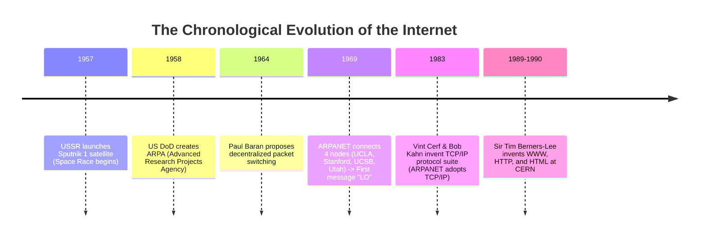
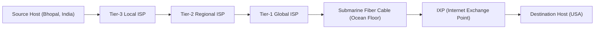

# Computer Networking Full Course - Internet Explained Step by Step (Part 1)

## Executive Summary & Metadata
- **Source Video**: [Computer Networking Full Course - Internet Explained Step by Step (YouTube)](https://www.youtube.com/watch?v=RY32wSQDekE)
- **Creator**: [[Sheryians Coding School]] (Instructor: Sarthak Sharma)
- **Scope**: Part 1 of 3 (Timestamps `00:00` to `56:51`)
- **Key Focus**: Fundamental Definition of the Internet, Cold War Historical Timeline (Sputnik 1957, ARPA/DARPA 1958, Paul Baran Packet Switching, ARPANET 1969 First Message `LO`, Vint Cerf & Bob Kahn TCP/IP 1983, Tim Berners-Lee WWW/HTTP/HTML 1989-1990), Submarine Optical Fiber Cable Physical Infrastructure, Total Internal Reflection (TIR), ISP Hierarchy (Tiers 1, 2, 3), IXPs (Internet Exchange Points), Packet Switching vs Circuit Switching, IPv4 32-bit vs IPv6 128-bit Architecture, Public vs Private IPs, and Port Number Allocations.

---

## 1. What is the Internet & Historical Evolution (`00:00` – `22:42`)

### 1.1 Definition of the Internet
The Internet is a global, decentralized system of interconnected computer networks and electronic devices that communicate with each other using standardized protocol suites (TCP/IP) (`06:31`).

---

### 1.2 Historical Evolution Timeline

- **Cold War Geopolitics**: Following USSR's Sputnik 1 launch in 1957, the US Department of Defense established ARPA (later DARPA) to build a resilient, non-centralized communication network (`11:57`).
- **Packet Switching vs Centralized Nodes**: Paul Baran designed a distributed network where data is broken into discrete packet units (`14:12`). If one node or central server is destroyed, remaining nodes re-route traffic automatically.
- **The First ARPANET Message (Oct 29, 1969)**: UCLA attempted to send the command `LOGIN` to Stanford. The system transmitted `L` and `O` before crashing. Thus, the first message delivered over ARPANET was `LO` (`15:00`).

---

## 2. Physical Data Transfer Infrastructure (`22:42` – `41:32`)

### 2.1 Submarine Optical Fiber Cable Infrastructure

- **Physical Media**: Over $99\%$ of international internet traffic travels through undersea fiber optic cables laid across ocean floors (`22:42`), utilizing **Total Internal Reflection (TIR)** to transmit light pulses at nearly the speed of light.
- **ISP Hierarchy**:
  1. **Tier-1 ISPs**: Global backbone operators (AT&T, Tata Communications, Lumen) owning global fiber networks and peering with each other without paying transit fees.
  2. **Tier-2 ISPs**: Regional service providers purchasing bandwidth from Tier-1 ISPs and selling to consumer ISPs.
  3. **Tier-3 ISPs**: Local consumer ISPs (Airtel, Jio, local broadband) delivering connection to end-user homes.
- **IXP (Internet Exchange Point)**: Physical infrastructure locations where ISPs exchange Internet traffic between their networks via mutual peering agreements (`35:00`).

---

## 3. IP Addressing, Public vs Private & Port Numbers (`41:32` – `56:51`)

### 3.1 IP Addressing Architecture

| Address Type | Format / Structure | Total Address Space | Example Notation |
|---|---|---|---|
| **IPv4** | 32-bit (4 octets, 0–255) | $2^{32} \approx 4.3 \text{ Billion}$ | `192.168.1.1` |
| **IPv6** | 128-bit (8 hex blocks) | $2^{128} \approx 3.4 \times 10^{38}$ | `2001:0db8:85a3::8a2e:0370:7334` |

- **Public IP vs Private IP**:
  - **Public IP**: Globally unique address assigned by IANA/ISPs, routable on the public Internet.
  - **Private IP**: Internal network address (`192.168.x.x`, `10.x.x.x`) used within local LANs, translated to a single Public IP via NAT (`46:12`).

---

### 3.2 Port Numbers & Sockets (`52:00`)
- **Port Number (16-bit Integer)**: Identifies specific software processes or services running on a host (`0` to `65535`).
- **Socket**: The logical endpoint of a network connection, formed by combining an IP address and a Port Number (`IP:Port`).

---

## Source Provenance & Archival Link
- Original Raw Transcript File: `[[01_RAW/SOURCE/Computer Networking Full Course - Internet Explained Step by Step (Real-Life Examples).md]]`
