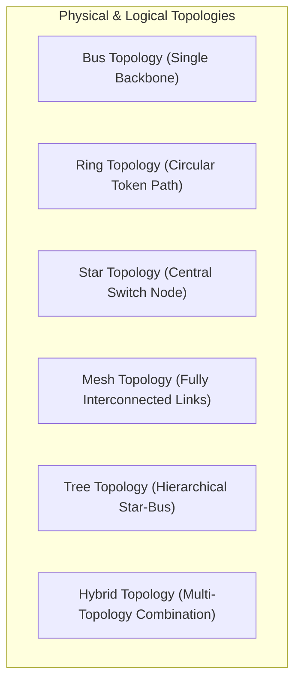

# Computer Networking Full Course - Internet Explained Step by Step (Part 2)

## Executive Summary & Metadata
- **Source Video**: [Computer Networking Full Course - Internet Explained Step by Step (YouTube)](https://www.youtube.com/watch?v=RY32wSQDekE)
- **Creator**: [[Sheryians Coding School]] (Instructor: Sarthak Sharma)
- **Scope**: Part 2 of 3 (Timestamps `56:51` to `01:24:58`)
- **Key Focus**: The 6 Fundamental Network Scale Categories (PAN, LAN, CAN, MAN, WAN, SAN) and Physical & Logical Topologies (Bus, Ring, Star, Mesh, Tree, Hybrid) with detailed trade-off analysis, security implications, and fault-tolerance comparisons.
- **Continuity**: Continuation from [[detailed-study-notes-computer-networking-sheryians-part-01.md|Part 1]].

---

## 1. Categorization of Computer Networks by Scale (`56:51` – `01:07:37`)

### 1.1 Network Types Comparison Matrix

| Network Type | Full Form | Geographic Coverage | Primary Transmission Medium | Typical Real-World Scenario |
|---|---|---|---|---|
| **PAN** | Personal Area Network | $\approx 10 \text{ meters}$ | Bluetooth, Zigbee, USB | Smartphone paired with wireless earbuds. |
| **LAN** | Local Area Network | Single room / building | Twisted Pair Ethernet, Wi-Fi 802.11 | Home Wi-Fi, University Computer Lab. |
| **CAN** | Campus Area Network | Multiple adjacent buildings | Fiber optic backbone, Gigabit Ethernet | College campus, Corporate headquarters. |
| **MAN** | Metropolitan Area Network | City-wide ($\approx 5–50 \text{ km}$) | Optical Fiber, Cable TV coaxial | Cable TV network, Smart city surveillance. |
| **WAN** | Wide Area Network | Country / Global | Submarine fiber, Satellite, Leased lines | The Internet, Multi-national enterprise WAN. |
| **SAN** | Storage Area Network | Server Room / Data Center | Fibre Channel (FC), iSCSI | High-speed block storage access for servers. |

---

## 2. Network Topologies & Architectural Trade-offs (`01:07:37` – `01:24:58`)

### 2.1 Topologies Architectural Comparison

### 2.2 Detailed Topology Matrix

| Topology | Physical Layout & Structure | Primary Advantage | Major Vulnerability / Failure Mode | Link Formula |
|---|---|---|---|---|
| **Bus** | All nodes connect to a single central coaxial/fiber backbone cable. | Lowest cabling cost; simple installation. | Backbone cable break crashes the entire network segment. | $N + 1$ links |
| **Ring** | Nodes connected in a closed circular loop; data flows in one direction via tokens. | No collisions; deterministic performance under heavy load. | Single node or cable failure halts entire ring token passing. | $N$ links |
| **Star** | All individual nodes connect directly to a central switch or hub. | High isolation; single node failure does not affect other nodes. | Central switch failure crashes the entire network segment. | $N$ links |
| **Mesh** | Every node has a dedicated point-to-point physical link to every other node. | Maximum fault tolerance; zero single point of failure. | Highest cabling cost and complex installation. | $\frac{N(N-1)}{2}$ links |
| **Tree** | Hierarchical structure combining Star clusters connected to a central Bus backbone. | Scalable for large enterprise departments. | Failure of main root backbone breaks inter-branch traffic. | Hierarchical |
| **Hybrid** | Combination of two or more distinct topologies (e.g., Star-Ring). | Tailored flexibility for complex enterprise needs. | High architectural complexity and configuration cost. | Custom |

---

## Source Provenance & Archival Link
- Original Raw Transcript File: `[[01_RAW/SOURCE/Computer Networking Full Course - Internet Explained Step by Step (Real-Life Examples).md]]`
- Prerequisites: [[detailed-study-notes-computer-networking-sheryians-part-01.md|Part 1 Note]]
