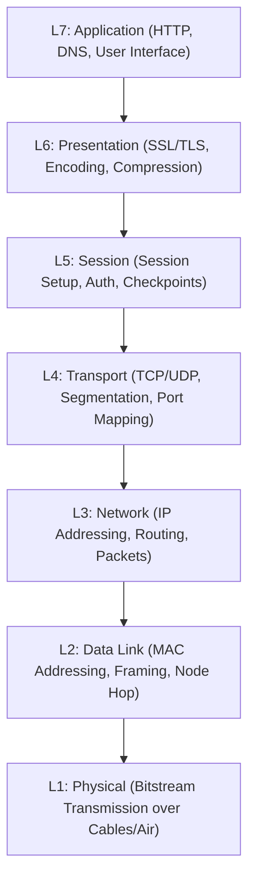
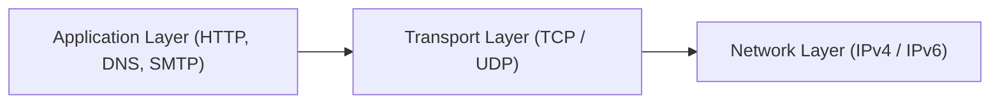

# Computer Networking Full Course - Internet Explained Step by Step (Part 3)

## Executive Summary & Metadata
- **Source Video**: [Computer Networking Full Course - Internet Explained Step by Step (YouTube)](https://www.youtube.com/watch?v=RY32wSQDekE)
- **Creator**: [[Sheryians Coding School]] (Instructor: Sarthak Sharma)
- **Scope**: Part 3 of 3 (Timestamps `01:24:58` to `02:36:59`)
- **Key Focus**: The OSI 7-Layer Reference Model (Application down to Physical, Real-Life Zomato Order Execution Flow, Data Encapsulation PDU), Client-Server vs Peer-to-Peer (P2P) Architecture, and the Core Internet Protocol Suite (IP, TCP vs UDP, HTTP/HTTPS, Email SMTP/POP3/IMAP, FTP, DNS).
- **Continuity**: Continuation from [[detailed-study-notes-computer-networking-sheryians-part-02.md|Part 2]].

---

## 1. The OSI 7-Layer Reference Model & Real-Life Workflow (`01:24:58` – `02:04:05`)

### 1.1 OSI Model Architecture
Developed by ISO in 1984, the OSI model defines a conceptual 7-layer framework for system-to-system network communication (`01:25:42`).

---

### 1.2 Real-Life Analogy: Zomato Food Order Execution
1. **Application Layer (L7)**: User places a food order via Zomato app interface.
2. **Presentation Layer (L6)**: Order payload is encrypted (`HTTPS`) and serialized to JSON.
3. **Session Layer (L5)**: Authentication session is maintained with Zomato servers.
4. **Transport Layer (L4)**: Payload broken into segments; TCP assigns port numbers (`443`).
5. **Network Layer (L3)**: Routers assign source/destination IP addresses and route packets across ISPs.
6. **Data Link Layer (L2)**: Local switch uses MAC addresses to forward frames within local subnet.
7. **Physical Layer (L1)**: Bitstream converted to electrical/optical signals over fiber cables.

---

## 2. Client-Server vs Peer-to-Peer (P2P) Architecture (`02:04:05` – `02:16:19`)

### 2.1 Architectural Comparison

| Architectural Model | Request / Response Mechanism | Centralized Dependence | Examples |
|---|---|---|---|
| **Client-Server** | Client initiates request; dedicated central server returns response (HTML/CSS/JS). | High (server failure crashes service). | Web Browsing, Instagram, Zomato. |
| **Peer-to-Peer (P2P)** | Nodes act simultaneously as both clients (leechers) and servers (seeders). | Zero (decentralized mesh distribution). | BitTorrent, IPFS, Blockchain nodes. |

---

## 3. Core Internet Protocol Suite (`02:16:19` – `02:36:59`)

### 3.1 Protocols Overview

- **IP (Internet Protocol)**: Handles logical host addressing and hop-by-hop packet forwarding (`02:16:19`).
- **TCP vs UDP**:
  - **TCP**: Connection-oriented, guaranteed delivery, 3-way handshake (`02:16:19`).
  - **UDP**: Connectionless, fast datagram delivery without ACKs (ideal for live video streaming and gaming).
- **HTTP / HTTPS**: Web protocol for resource retrieval; HTTPS adds SSL/TLS security.
- **Email Protocols**: `SMTP` (port 25/587 send), `POP3` (port 110 download/delete), `IMAP` (port 143 sync).
- **DNS**: Hierarchical resolution mapping domain names (`sheryians.com`) to IP addresses.

---

## Source Provenance & Archival Link
- Original Raw Transcript File: `[[01_RAW/SOURCE/Computer Networking Full Course - Internet Explained Step by Step (Real-Life Examples).md]]`
- Prerequisites:
  - [[detailed-study-notes-computer-networking-sheryians-part-01.md|Part 1 Note]]
  - [[detailed-study-notes-computer-networking-sheryians-part-02.md|Part 2 Note]]
