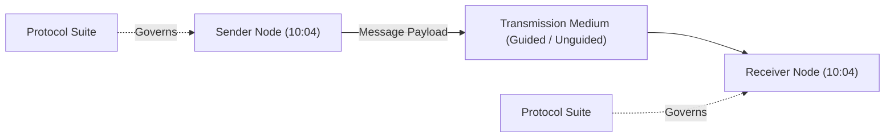
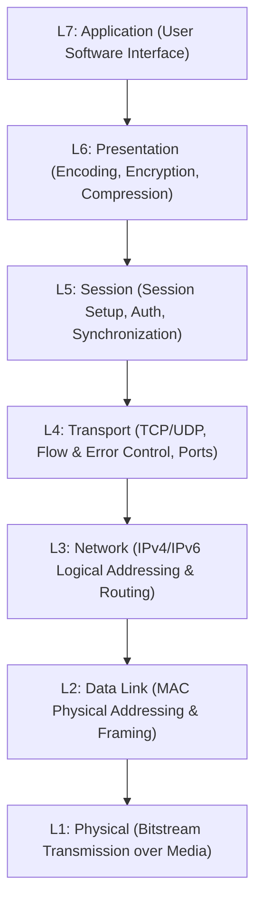
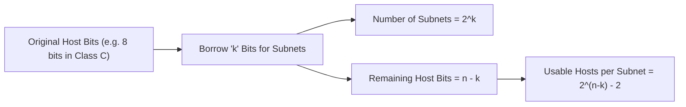

# Computer Networking Fundamentals Course | freeCodeCamp (Part 1)

## Executive Summary & Metadata
- **Source Video**: [Computer Networking Fundamentals Course (freeCodeCamp YouTube)](https://www.youtube.com/watch?v=fQbBPa0ADvs)
- **Creator**: [[freeCodeCamp.org]] (Instructor: Kshitij Sharma / Shweta Sharma)
- **Scope**: Part 1 of 4 (Timestamps `00:00` to `3:30:00`)
- **Key Focus**: Core Networking Stack, 5 Components of Data Communication, Effectiveness Metrics (Delivery, Accuracy, Timeliness, Jitter), Simplex vs Half-Duplex vs Full-Duplex, Physical Topologies (Mesh, Star, Bus), OSI 7-Layer Reference Model, Binary & Octet Math Conversions, IPv4 Logical Addressing, Classful (Classes A–E) vs Classless (CIDR) Addressing, Loopback Troubleshooting, Subnetting & Bit Borrowing Math, and Subnet Mask Design.

---

## 1. Fundamentals of Data Communication (`00:00` – `28:36`)

### 1.1 The 5 Essential Components of Data Communication



1. **Message**: The payload data being communicated (Text, Audio, Video, Image) (`09:55`).
2. **Sender**: The originating host device generating and transmitting the message (`09:55`).
3. **Receiver**: The target host device receiving the message (`09:55`).
4. **Transmission Medium**: The physical path over which data travels (Twisted Pair, Coaxial, Fiber Optic, Radio Waves) (`09:55`).
5. **Protocol**: The set of governing rules controlling data transmission syntax, semantics, and timing (`09:55`).

---

### 1.2 Data Communication Effectiveness Metrics (`11:40`)
- **Delivery**: The system must deliver data to the correct target destination.
- **Accuracy**: Data must be delivered accurately without bit corruption.
- **Timeliness**: Data must be delivered in a timely manner (critical for real-time video/audio streams).
- **Jitter**: Variation in packet arrival times. High jitter causes choppy audio and lagging video playback.

---

### 1.3 Transmission Modes Matrix (`14:14`)

| Transmission Mode | Communication Direction | Channel Capacity Usage | Real-World Example | Timestamp |
|---|---|---|---|---|
| **Simplex** | Strictly Unidirectional | 100% directional flow | Keyboard to PC, Television Broadcast | `14:14` |
| **Half-Duplex** | Bidirectional (One direction at a time) | 50% alternating capacity | Walkie-Talkie radios | `14:14` |
| **Full-Duplex** | Simultaneous Bidirectional | 100% bidirectional capacity | Telephone call, Switch link | `14:14` |

---

### 1.4 Physical Network Topologies (`19:55`)
- **Mesh Topology**: Dedicated point-to-point links between every pair of nodes. Requires $\frac{n(n-1)}{2}$ physical duplex links (`19:55`). High fault tolerance and security; expensive cabling.
- **Star Topology**: Each node connects to a central switch/hub via a dedicated point-to-point link (`19:55`). Easy setup; vulnerable to central switch failure.
- **Bus Topology**: Multipoint topology where all nodes connect to a single central backbone cable (`19:55`). Low cabling cost; single backbone break crashes the entire network.

---

## 2. The OSI 7-Layer Model Architecture (`28:36` – `34:37`)



---

## 3. IPv4 Logical Addressing, Classes & Subnetting Math (`34:37` – `3:30:00`)

### 3.1 Binary & Octet Conversion Math (`34:37`)
An IPv4 address consists of **32 bits** divided into **4 octets** (8 bits per octet), separated by dots (`x.x.x.x`). Each octet represents a decimal value between `0` and `255`.

$$\text{Decimal Value} = \sum_{i=0}^{7} b_i \cdot 2^i = b_7 \cdot 128 + b_6 \cdot 64 + b_5 \cdot 32 + b_4 \cdot 16 + b_3 \cdot 8 + b_2 \cdot 4 + b_1 \cdot 2 + b_0 \cdot 1$$

---

### 3.2 Classful IPv4 Addressing Architecture (`55:17` – `1:10:56`)

```text
Class A: [0]  [ 7 Bits NetID ] [ 24 Bits HostID ]
Class B: [10] [ 14 Bits NetID ] [ 16 Bits HostID ]
Class C: [110][ 21 Bits NetID ] [ 8 Bits HostID ]
```

| Class | First Octet Binary | 1st Octet Range | NetID / HostID Split | Default Subnet Mask | Usable Hosts ($2^n - 2$) |
|---|---|---|---|---|---|
| **Class A** | `0-------` | `1 – 126` | 8 / 24 | `255.0.0.0` (`/8`) | $2^{24} - 2 = 16,777,214$ |
| **Class B** | `10------` | `128 – 191` | 16 / 16 | `255.255.0.0` (`/16`) | $2^{16} - 2 = 65,534$ |
| **Class C** | `110-----` | `192 – 223` | 24 / 8 | `255.255.255.0` (`/24`) | $2^8 - 2 = 254$ |
| **Class D** | `1110----` | `224 – 239` | Multicast Group | Reserved | N/A |
| **Class E** | `1111----` | `240 – 255` | Experimental / R&D | Reserved | N/A |

---

### 3.3 Reserved IPv4 Addresses & Loopback (`1:18:43`)
- **Loopback Address Range**: `127.0.0.0/8` (specifically `127.0.0.1` - `Localhost`). Used to test internal host TCP/IP stack functionality without sending traffic onto physical network media (`1:18:43`).
- **Network ID**: All host bits set to `0` (`192.168.1.0`). Identifies the network segment.
- **Direct Broadcast Address (DBA)**: All host bits set to `1` (`192.168.1.255`). Targets all hosts on the specific subnet.

---

### 3.4 Subnetting & Bit Borrowing Mathematics (`2:15:55` – `2:52:25`)
Subnetting divides a large network into smaller, manageable subnets by **borrowing bits** from the Host ID portion and adding them to the Network ID portion.



#### Subnetting Equations
1. **Number of Subnets Created**: $2^k$ (where $k$ is the number of borrowed bits).
2. **Usable Hosts per Subnet**: $2^{n-k} - 2$ (where $n-k$ is the remaining host bits; subtract 2 for Network ID and Broadcast ID).
3. **Block Size / Jump Value**: $256 - \text{Subnet Octet Value}$.

---

## Source Provenance & Archival Link
- Original Raw Transcript File: `[[01_RAW/SOURCE/Computer Networking Fundamentals Course.md]]`
