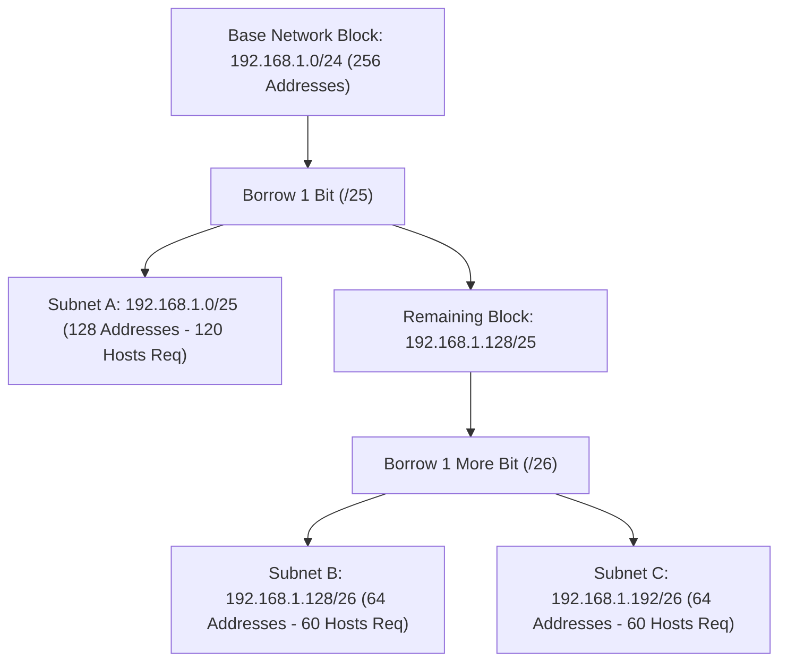
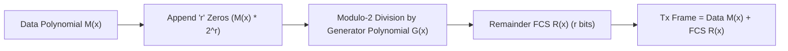

# Computer Networking Fundamentals Course | freeCodeCamp (Part 2)

## Executive Summary & Metadata
- **Source Video**: [Computer Networking Fundamentals Course (freeCodeCamp YouTube)](https://www.youtube.com/watch?v=fQbBPa0ADvs)
- **Creator**: [[freeCodeCamp.org]] (Instructor: Kshitij Sharma / Shweta Sharma)
- **Scope**: Part 2 of 4 (Timestamps `3:30:00` to `6:30:00`)
- **Key Focus**: Advanced Subnetting (VLSM Strategy, Bit Borrowing Trees, Direct Broadcast Addresses DBA), CIDR Routing Tables & Supernetting (Route Summarization), Error Detection & Correction Mathematics (Hamming Distance $d_{min}$, Hamming Code $2^r \ge m + r + 1$, 1D & 2D Parity, CRC Modulo-2 Polynomial Division, 16-Bit Checksum), and Network Delay Performance Math ($T_t = L/B, T_p = d/v$).
- **Continuity**: Continuation from [[detailed-study-notes-computer-networking-fundamentals-part-01.md|Part 1]].

---

## 1. Advanced Subnetting, VLSM & Supernetting (`3:05:24` – `4:19:56`)

### 1.1 VLSM (Variable Length Subnet Masking) Strategy
VLSM permits assigning subnets of variable mask lengths (`/25`, `/26`, `/27`) to eliminate IP address waste when subnets have different host population requirements (`3:05:24`).

---

### 1.2 CIDR Supernetting (Route Summarization) (`4:05:50`)
Supernetting combines multiple contiguous smaller networks (e.g., four `/24` Class C networks) into a single summary route entry (a `/22` block) to reduce routing table size.

$$\text{4 Contiguous Class C Networks: } 192.168.0.0/24, 192.168.1.0/24, 192.168.2.0/24, 192.168.3.0/24$$
$$\implies \text{Summarized Supernet Block: } 192.168.0.0/22 \text{ (Subnet Mask } 255.255.252.0\text{)}$$

---

## 2. Error Detection & Correction Mathematics (`4:19:56` – `5:43:07`)

### 2.1 Error Types & Hamming Distance
- **Single-Bit Error**: Exactly 1 bit in a data unit is flipped (`4:19:56`).
- **Burst Error**: $k$ contiguous bits in a data unit are flipped (`4:19:56`).
- **Hamming Distance ($d_{min}$)**: The minimum number of bit positions in which two valid binary codewords differ (`4:39:26`).

#### Hamming Error Bound Formulas
1. **To Detect $e$ Errors**: $d_{min} \ge e + 1$
2. **To Correct $t$ Errors**: $d_{min} \ge 2t + 1$

---

### 2.2 Hamming Code Parity Equation (`4:39:26`)
To correct single-bit errors in an $m$-bit data payload, $r$ redundant parity bits are added such that:

$$2^r \ge m + r + 1$$

Parity bits are placed at power-of-two positions ($1, 2, 4, 8, 16, \dots$). Each parity bit calculates even/odd parity for specific bit positions whose binary representation has a 1 in that position.

---

### 2.3 CRC (Cyclic Redundancy Check) Polynomial Modulo-2 Division (`5:14:32`)

#### CRC Division Steps
1. Given generator polynomial $G(x)$ of degree $r$, append $r$ zeros to data $M(x)$.
2. Perform binary Modulo-2 division (XOR operations) of $M(x) \cdot 2^r$ by $G(x)$.
3. The resulting $r$-bit remainder $R(x)$ is the Frame Check Sequence (FCS).
4. The receiver divides the incoming frame by $G(x)$; a zero remainder indicates no errors.

---

## 3. Transmission vs Propagation Delays Mathematics (`5:43:07` – `6:10:25`)

### 3.1 Delay Definitions & Mathematical Equations

| Delay Component | Symbol | Mathematical Equation | Physical Meaning |
|---|---|---|---|
| **Transmission Delay** | $T_t$ | $T_t = \frac{L}{B}$ | Time required to push all packet bits ($L$) onto the medium at bandwidth ($B$). |
| **Propagation Delay** | $T_p$ | $T_p = \frac{d}{v}$ | Time required for 1 bit to travel distance ($d$) at medium propagation speed ($v \approx 2 \cdot 10^8 \text{ m/s}$). |
| **Queueing Delay** | $T_{queue}$ | Variable | Time spent waiting in router output buffers. |
| **Processing Delay** | $T_{proc}$ | Variable | Time required by router CPU to inspect packet headers and check FCS. |

$$\text{Total Network Delay} = T_t + T_p + T_{queue} + T_{proc}$$

$$\text{Propagation Ratio } a = \frac{T_p}{T_t}$$

---

## Source Provenance & Archival Link
- Original Raw Transcript File: `[[01_RAW/SOURCE/Computer Networking Fundamentals Course.md]]`
- Prerequisites: [[detailed-study-notes-computer-networking-fundamentals-part-01.md|Part 1 Note]]
