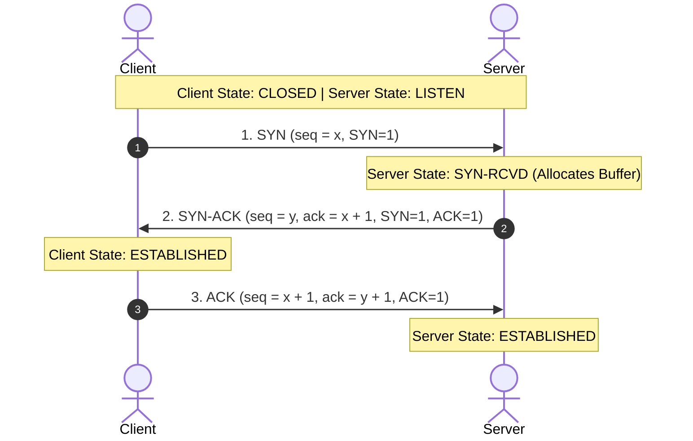
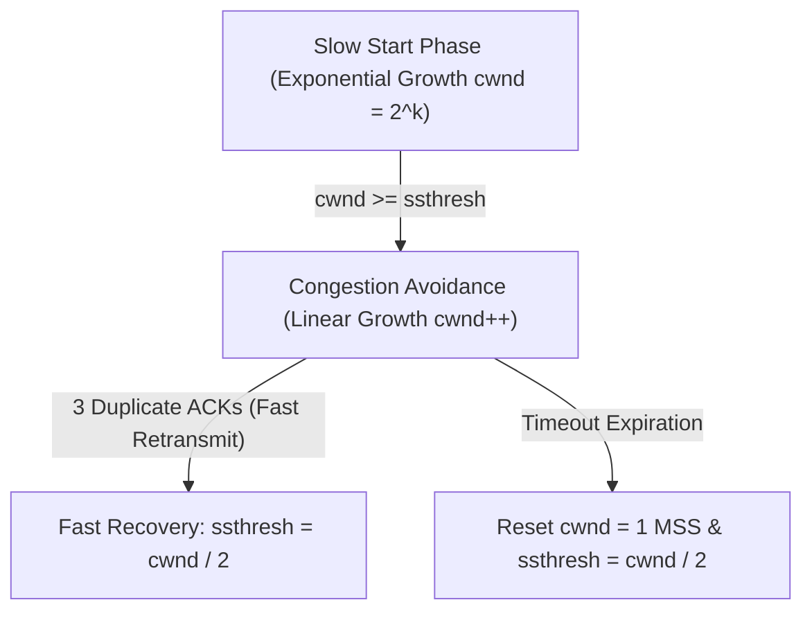

# Computer Networking Fundamentals Course | freeCodeCamp (Part 4)

## Executive Summary & Metadata
- **Source Video**: [Computer Networking Fundamentals Course (freeCodeCamp YouTube)](https://www.youtube.com/watch?v=fQbBPa0ADvs)
- **Creator**: [[freeCodeCamp.org]] (Instructor: Kshitij Sharma / Shweta Sharma)
- **Scope**: Part 4 of 4 (Timestamps `9:40:48` to `12:15:06`)
- **Key Focus**: TCP Control Flags, TCP 3-Way Handshake & 4-Way Teardown, SYN Flooding DoS Attacks, TCP Congestion Control (Slow Start, Congestion Avoidance, Fast Retransmit), TCP/UDP Timers, ALOHA & CSMA Methods, CSMA/CD Collision Detection Minimum Frame Equation ($L_{min} = 2 \cdot T_p \cdot B$), Polling & Token Passing, Distance Vector vs Link State Routing, Circuit vs Packet Switching, Email Architecture (SMTP, POP3, IMAP), DNS Hierarchy, FTP, HTTP, ARP, ICMP, and Master OSI Stack Summary.
- **Continuity**: Continuation from [[detailed-study-notes-computer-networking-fundamentals-part-03.md|Part 3]].

---

## 1. TCP Connection Mechanics, Security & Congestion Control (`9:40:48` – `10:30:10`)

### 1.1 TCP Control Flags & 3-Way Handshake Engine (`9:40:48`)

- **Control Flags (6 Bits)**: `URG` (Urgent Pointer valid), `ACK` (Acknowledgement valid), `PSH` (Push buffer immediately), `RST` (Reset connection), `SYN` (Synchronize sequence numbers), `FIN` (Finish connection) (`9:40:48`).
- **SYN Flooding Security Attack**: An attacker floods a server with `SYN` requests while spoofing source IP addresses, never completing the final `ACK` (`9:58:10`). Server resources are exhausted in the `SYN_RCVD` state. Mitigated using **SYN Cookies**.

---

### 1.2 TCP Congestion Control Engine (`10:02:19`)
TCP manages network congestion dynamically using a Congestion Window ($cwnd$):
1. **Slow Start**: $cwnd$ starts at 1 MSS and doubles every RTT ($cwnd = 1, 2, 4, 8, \dots$) until reaching $ssthresh$.
2. **Congestion Avoidance**: When $cwnd \ge ssthresh$, growth switches to linear additive increase ($cwnd = cwnd + 1$ per RTT).
3. **Multiplicative Decrease**: Upon packet loss detection (timeout or 3 duplicate ACKs), $ssthresh = \frac{cwnd}{2}$.

---

## 2. MAC Access Protocols & CSMA/CD Mathematics (`10:30:10` – `11:25:03`)

### 2.1 ALOHA & CSMA Protocol Comparison

| Protocol | Sensing? | Collision Handling | Max Efficiency ($\eta$) | Vulnerable Time |
|---|---|---|---|---|
| **Pure ALOHA** | No | Backoff retry | $18.4\%$ ($\frac{1}{2e}$) | $V_{time} = 2 \cdot T_{fr}$ |
| **Slotted ALOHA** | No (Slots) | Retry next slot | $36.8\%$ ($\frac{1}{e}$) | $V_{time} = T_{fr}$ |
| **CSMA / CD** | Yes | Jamming + Backoff | $\frac{1}{1 + 6.44a}$ | $2 \cdot T_p$ |

---

### 2.2 CSMA/CD Minimum Frame Equation (`11:06:07`)
For a sender to detect a collision while still transmitting a frame over a medium of propagation delay $T_p$:

$$\text{Transmission Time } T_t \ge 2 \cdot T_p$$

$$\frac{L_{min}}{B} \ge 2 \cdot \frac{d}{v} \implies L_{min} = 2 \cdot T_p \cdot B$$

Where $L_{min}$ is the minimum Ethernet frame length, $B$ is channel bandwidth, and $T_p$ is propagation delay. Standard Ethernet (10 Mbps) specifies $L_{min} = 64 \text{ bytes (512 bits)}$.

---

## 3. Routing Protocols & Switching Architecture (`11:25:03` – `11:48:47`)

### 3.1 Distance Vector vs Link State Routing

| Feature | Distance Vector Routing (DVR) | Link State Routing (LSR) |
|---|---|---|
| **Algorithm** | Bellman-Ford | Dijkstra Shortest Path First (SPF) |
| **Knowledge Domain** | Neighboring routers only | Global network topology map (LSDB) |
| **Convergence** | Slow (Count-to-Infinity problem) | Fast convergence |
| **Protocols** | RIP (Routing Information Protocol) | OSPF, IS-IS |

---

### 3.2 Circuit Switching vs Packet Switching (`11:36:16`)
- **Circuit Switching**: Dedicated physical end-to-end circuit reserved before data transfer (e.g., traditional PSTN telephone networks). Guaranteed bandwidth; inefficient resource utilization.
- **Packet Switching**: Data divided into independent packets routed dynamically over shared media using statistical multiplexing (e.g., the Internet). High resource efficiency.

---

## 4. Application Layer Protocols & Final OSI Summary (`11:48:47` – `12:15:06`)

### 4.1 Application Layer Protocols Reference Table

| Protocol | Port | Transport | Primary Operational Role | Timestamp |
|---|---|---|---|---|
| **HTTP / HTTPS** | `80` / `443` | TCP | Web document retrieval & SSL/TLS encryption. | `12:01:21` |
| **DNS** | `53` | UDP & TCP | Domain name to IP address resolution hierarchy. | `11:57:10` |
| **FTP** | `20` (Data), `21` (Control) | TCP | Dual-connection file transfer protocol. | `12:01:21` |
| **SMTP** | `25` / `587` | TCP | Push protocol for sending email between servers. | `11:48:47` |
| **POP3 / IMAP** | `110` / `143` | TCP | Pull protocols for downloading/syncing email. | `11:48:47` |
| **ARP** | N/A | Layer 2/3 | Maps 32-bit IPv4 address to 48-bit MAC address. | `12:01:21` |
| **ICMP** | N/A | Layer 3 | Diagnostic IP reporting (Ping Type 8/0, Traceroute Type 11). | `12:01:21` |

---

## Source Provenance & Archival Link
- Original Raw Transcript File: `[[01_RAW/SOURCE/Computer Networking Fundamentals Course.md]]`
- Prerequisites:
  - [[detailed-study-notes-computer-networking-fundamentals-part-01.md|Part 1 Note]]
  - [[detailed-study-notes-computer-networking-fundamentals-part-02.md|Part 2 Note]]
  - [[detailed-study-notes-computer-networking-fundamentals-part-03.md|Part 3 Note]]
