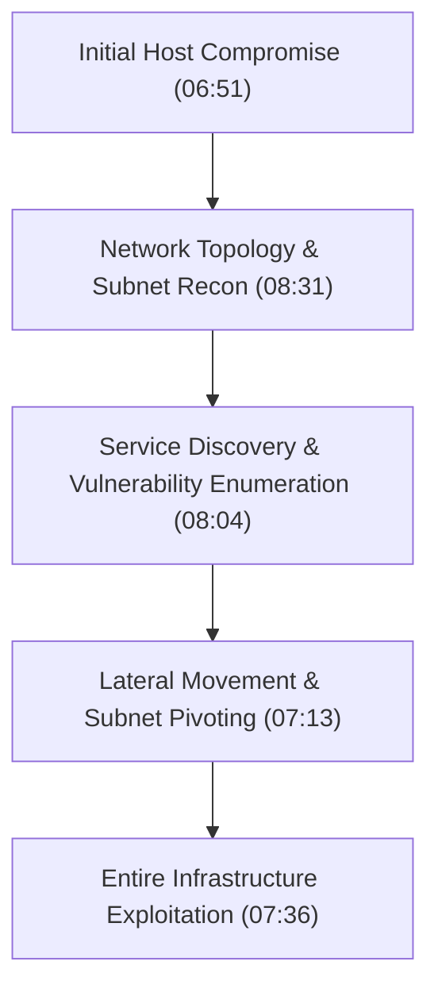
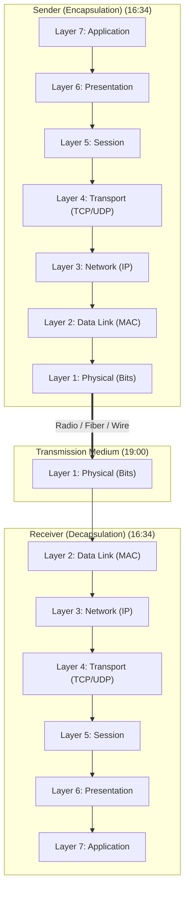
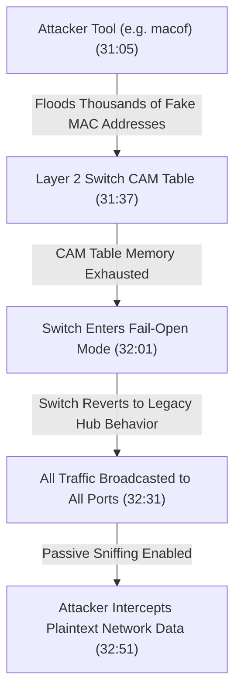
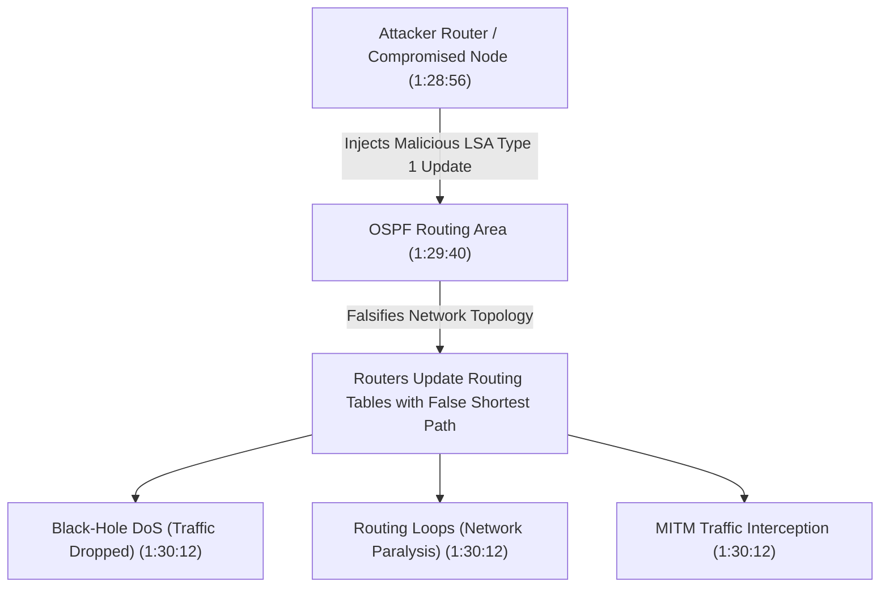
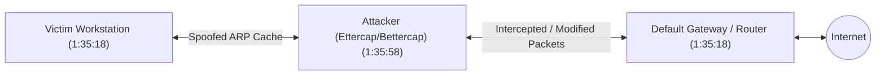

# Detailed Study Notes: Networking for Hackers Full Course — Zero to Expert

## Executive Summary & Source Metadata (0:00 - 4:36)

- **Course Title**: Networking for Hackers Full Course — Zero to Expert in One Video 2026
- **Creator / Instructor**: Cyber Mind Space (Almadad Ali)
- **Source Video URL**: [YouTube Video](https://www.youtube.com/watch?v=IGVcbu1I7Hg)
- **Primary Focus**: Comprehensive computer networking tailored specifically for offensive cybersecurity, ethical hacking, and penetration testing. Unlike standard theoretical networking courses, this course skips generic historical trivia (e.g., origin of ARPANET) to focus strictly on actionable network mechanisms, protocols, attack vectors, and defensive controls.
- **Resource Materials Referenced**:
  - Course curriculum covering 13 structured modules.
  - *Networking Basics for Hackers: Three Books in One* (Comprehensive exploration of networks, ethical hacking techniques, and next-generation security threats).
  - *Networking Basics for Hackers* by Occupy The Web (OTW).

---

## Module 1: Networking Fundamentals & The Hacker's Perspective (4:37 - 9:34)

### Core Definition (5:04 - 5:45)
Networking is defined as the practice of connecting computers, devices, and systems to share resources, data, and services. A network consists of two or more interconnected hosts communicating across physical or wireless media.

### Why Networking is the Foundation of Ethical Hacking (6:13 - 9:11)
Generic networking focuses on data delivery, whereas ethical hacking analyzes how data transport mechanisms can be observed, manipulated, bypassed, or exploited. The instructor outlines five core security pillars:

1. **Attack Surface Identification (6:35)**: Networked environments expose multiple entry points (open ports, misconfigured services, unpatched protocols) that attackers leverage for initial access.
2. **Lateral Movement & Pivoting (6:51 - 7:36)**: Once a single host inside a network is compromised, an attacker can leverage horizontal privilege escalation and pivoting to traverse subnets and compromise adjacent critical infrastructure.
3. **Data Interception (7:36 - 8:04)**: Sensitive credentials and data in transit across unencrypted or weakly encrypted communication channels can be captured using Man-in-the-Middle (MITM) techniques.
4. **Service Discovery (8:04 - 8:31)**: Network scanning exposes active services, software versions, and known vulnerabilities (CVEs) across target systems.
5. **Infrastructure Mapping (8:31 - 9:11)**: Mapping network topology, subnet masks, and routing paths allows attackers to model attack paths and select optimal exploitation vectors.

---

## Module 2: OSI 7-Layer Model & Hacker Attack Vectors (9:35 - 31:21)

The Open Systems Interconnection (OSI) model standardizes network communication into seven distinct layers. For ethical hackers, each layer represents a specific attack surface and set of exploitation techniques.

### Comprehensive OSI Model Layer & Attack Vector Matrix (12:00 - 20:00)

| Layer # | Layer Name | Primary Protocol Examples | Primary Function | Hacker Attack Vectors (MM:SS) | Primary Security Tools |
|---|---|---|---|---|---|
| **7** | **Application** | HTTP, HTTPS, FTP, SSH, DNS | Interface between applications and network services | Web App Attacks (SQLi, XSS, Command Injection) (13:04) | Burp Suite, Nmap, SQLmap |
| **6** | **Presentation** | SSL/TLS, AES-256, JPEG, ASCII | Data encoding, encryption, compression, formatting | SSL Stripping, Certificate Spoofing, HTTPS Downgrade (14:17) | SSLstrip, Bettercap |
| **5** | **Session** | NetBIOS, RPC, Session Tokens | Establishes, manages, and terminates session connections | Session Hijacking, Session Fixation (16:04) | Wireshark, Cookie Cadger |
| **4** | **Transport** | TCP, UDP | End-to-end communication, segmentation, reliability | TCP SYN Flooding, Port Scanning, UDP Flood (17:07) | Hping3, Nmap, Masscan |
| **3** | **Network** | IP (IPv4/IPv6), ICMP, ARP | Logical addressing, routing, packet forwarding | IP Spoofing, Route Hijacking, BGP Poisoning (17:52) | Scapy, Nmap |
| **2** | **Data Link** | Ethernet, Wi-Fi (802.11), MAC | Physical address delivery (MAC), frame switching | ARP Poisoning/Spoofing, MAC Flooding, Deauth (18:37) | Ettercap, Aircrack-ng |
| **1** | **Physical** | Ethernet Cable, Fiber, Radio Waves | Physical transmission of raw bits over medium | Cable Tapping, RF Jamming, Signal Interception (19:00) | Hardware Tap, HackRF |

### Data Flow & Transmission Direction (16:34 - 17:00)
- **Sender Path**: Data moves encapsulation-style down from Layer 7 (Application) to Layer 1 (Physical).
- **Receiver Path**: Data moves decapsulation-style up from Layer 1 (Physical) to Layer 7 (Application).

### Protocol Mechanics: TCP vs. UDP (17:07 - 17:31)
- **TCP (Transmission Control Protocol)**: Connection-oriented protocol utilizing a strict 3-Way Handshake (`SYN` -> `SYN-ACK` -> `ACK`) before data transmission to guarantee packet delivery and ordering.
- **UDP (User Datagram Protocol)**: Connectionless, lightweight protocol without handshake overhead; optimized for real-time media streaming and DNS queries where speed takes precedence over packet delivery guarantees.

---

## Module 3: Network Hardware & Devices (31:22 - 39:02)

### 1. Switches vs. Hubs (31:22 - 34:42)
- **Switch (Layer 2)**: Intelligent network device that maintains a Content Addressable Memory (CAM) / MAC address table mapping physical MAC addresses to specific physical ports. Traffic received on a port is forwarded *only* to the destination port matching the destination MAC address.
- **Hub (Layer 1 Legacy)**: Unintelligent device that broadcasts all incoming frames across *every* connected port regardless of destination MAC address. Analogy provided in transcript: "Like a neighborhood gossip broadcasting private conversations to the entire street."

### 2. CAM Table Overflow Attack Mechanics (31:05 - 32:51 & 35:59 - 36:14)
When a hacker floods a Layer 2 switch with thousands of fake MAC addresses:
1. The switch's CAM table memory becomes completely full.
2. The switch enters a failure/fallback state ("fail-open").
3. The switch degrades into a legacy **Hub**, broadcasting all incoming traffic across all ports.
4. An attacker connected to any port can passively capture/sniff all network traffic passing through the switch.

### 3. Firewalls (34:42 - 35:45 & 1:33:13 - 1:34:10)
Digital security barrier enforcing traffic control based on pre-defined security rules:
- **Stateless Firewall**: Inspects individual packets independently without tracking connection state. Vulnerable to packet fragmentation attacks.
- **Stateful Firewall**: Maintains a connection state table to track established sessions.
- **Next-Generation Firewall (NGFW)**: Integrates deep packet inspection (DPI), application awareness, and integrated IPS.
- **Web Application Firewall (WAF)**: Filters Layer 7 HTTP/HTTPS traffic to block web exploits (SQLi, XSS).

### 4. IDS vs. IPS (35:45 - 36:14 & 1:40:33 - 1:41:20)
- **IDS (Intrusion Detection System)**: Passively monitors network traffic and generates security alerts upon detecting signature matches or anomalies.
- **IPS (Intrusion Prevention System)**: Placed inline with traffic; detects malicious patterns and actively blocks or drops non-compliant packets.

### 5. Proxies & Load Balancers (36:32 - 39:02)
- **Proxies (Forward, Reverse, Transparent)**: Intermediate servers routing client traffic to anonymize origin, filter content, or inspect payloads.
- **Load Balancers**: Distribute heavy incoming web traffic across multiple backend servers. Attack vectors include session persistence bypass and SSL termination exploits.

---

## Module 4: IP Addressing, Subnetting & CIDR Calculation (39:03 - 1:14:34)

### IPv4 Structure & Address Space (39:03 - 44:28)
- **IPv4 Address**: 32-bit logical address formatted as 4 octets (8 bits per octet) separated by dots (e.g., `192.168.10.34`).
- **Bit Math**: Each octet ranges from `0` to `255` (\(2^8 = 256\) values). Total theoretical IPv4 pool:
  $$2^{32} = 4,294,967,296 \text{ addresses } (\approx 4.3 \text{ Billion})$$
- Due to global device proliferation exceeding 4.3 billion, Network Address Translation (NAT) and IPv6 (128-bit addresses) were introduced.

### IP Address Classes & Transmission Types (44:28 - 48:47)

| Class | IP Address Range | Default Subnet Mask | Default CIDR | Network / Host Bits | Max Hosts per Network | Primary Use Case |
|---|---|---|---|---|---|---|
| **Class A** | `1.0.0.0` – `126.255.255.255` | `255.0.0.0` | `/8` | 8 Net / 24 Host | 16,777,214 | Massive enterprise networks |
| **Class B** | `128.0.0.0` – `191.255.255.255` | `255.255.0.0` | `/16` | 16 Net / 16 Host | 65,534 | Medium to large organizations |
| **Class C** | `192.0.0.0` – `223.255.255.255` | `255.255.255.0` | `/24` | 24 Net / 8 Host | 254 | Small LANs / Home networks |
| **Class D** | `224.0.0.0` – `239.255.255.255` | N/A | N/A | Multicast Group | N/A | Multicast streaming & routing protocols |
| **Class E** | `240.0.0.0` – `255.255.255.255` | N/A | N/A | Experimental | N/A | Research & experimental reservations |

#### Transmission Modes (45:31 - 46:19):
- **Unicast**: 1-to-1 communication (Single sender to single receiver).
- **Multicast**: 1-to-Group communication (Class D addresses; single sender to subscribed group).
- **Broadcast**: 1-to-All communication (Single sender to all devices on local subnet).

### Core Subnetting Math & Formulas (1:01:06 - 1:07:04)

1. **Total IPs per Subnet Formula**:
   $$\text{Total IPs} = 2^n \quad \text{where } n = 32 - \text{CIDR}$$
2. **Usable Hosts per Subnet Formula**:
   $$\text{Usable Hosts} = 2^n - 2$$
   *(Subtract 2 reserved addresses: Network IP [First] and Broadcast IP [Last]).*
3. **Magic Number (Subnet Increment) Formula**:
   $$\text{Magic Number} = 256 - \text{Subnet Mask Octet Value}$$

### Quick Subnet Reference Table (1:06:27)

| CIDR Prefix | Host Bits (\(n\)) | Subnet Mask | Subnet Block Size (Total IPs) | Usable Hosts (\(2^n - 2\)) |
|---|---|---|---|---|
| **/24** | 8 | `255.255.255.0` | 256 | 254 |
| **/25** | 7 | `255.255.255.128` | 128 | 126 |
| **/26** | 6 | `255.255.255.192` | 64 | 62 |
| **/27** | 5 | `255.255.255.224` | 32 | 30 |
| **/28** | 4 | `255.255.255.240` | 16 | 14 |
| **/29** | 3 | `255.255.255.248` | 8 | 6 |
| **/30** | 2 | `255.255.255.252` | 4 | 2 |

### Step-by-Step Practical Subnetting Worked Examples (1:02:42 - 1:13:38)

#### Example 1: `192.168.10.34/27`
- **Class**: Class C (`192.x.x.x`).
- **Host Bits**: \(n = 32 - 27 = 5\).
- **Total IPs**: \(2^5 = 32\).
- **Usable Hosts**: \(32 - 2 = 30\).
- **Magic Number / Increment**: 32.
- **Subnet Ranges**:
  - Subnet 0: `192.168.10.0` – `192.168.10.31`
  - Subnet 1: `192.168.10.32` – `192.168.10.63`
- **Target IP Location (`.34`)**: Falls into Subnet 1 (`.32` to `.63`).
  - **Network IP**: `192.168.10.32`
  - **Broadcast IP**: `192.168.10.63`
  - **Usable Host Range**: `192.168.10.33` – `192.168.10.62`

#### Example 2: `192.168.11.130/26`
- **Host Bits**: \(n = 32 - 26 = 6\).
- **Total IPs**: \(2^6 = 64\). Usable: \(64 - 2 = 62\).
- **Subnet Mask**: `255.255.255.192`.
- **Subnet Ranges**:
  - `192.168.11.0` – `.63`
  - `192.168.11.64` – `.127`
  - `192.168.11.128` – `.191`
- **Target IP Location (`.130`)**:
  - **Network IP**: `192.168.11.128`
  - **Broadcast IP**: `192.168.11.191`
  - **Usable Range**: `192.168.11.129` – `192.168.11.190`

### IPv6 Advantages for Ethical Hackers (1:13:38 - 1:14:18)
- 128-bit address space represented in hexadecimals.
- **Security Relevance**: IPv6 is frequently enabled by default on dual-stack corporate networks but often unmonitored by legacy security tools. Hackers exploit IPv6 to bypass IPv4 firewalls, perform NAT traversal, establish SSH/DNS tunnels, and execute DNS spoofing via SLAAC/DHCPv6.

---

## Module 5: Core Network Protocols & Attack Matrix (1:14:35 - 1:19:21)

### Critical Port & Protocol Attack Reference (1:17:46 - 1:19:21)

| Port # | Transport | Service Protocol | Core Functionality | Primary Attack Vectors (MM:SS) |
|---|---|---|---|---|
| **21** | TCP | **FTP** | File Transfer Protocol (Plaintext) | Anonymous login, Brute force, FTP bounce attacks (1:15:57) |
| **22** | TCP | **SSH** | Secure Shell (Encrypted remote CLI) | Credential brute force, SSH local/remote port forwarding (1:15:38) |
| **23** | TCP | **Telnet** | Unencrypted Remote Terminal | Plaintext credential sniffing, Session interception (1:17:46) |
| **25** | TCP | **SMTP** | Simple Mail Transfer Protocol | Open mail relay abuse, Email spoofing, Spear phishing (1:16:27) |
| **53** | UDP/TCP | **DNS** | Domain Name System | DNS cache poisoning, DNS tunneling, DNS amplification DDoS (1:15:07) |
| **80** | TCP | **HTTP** | Unencrypted Web Transport | HTTP request smuggling, Plaintext sniffing, Web app exploits (1:14:35) |
| **110** | TCP | **POP3** | Post Office Protocol v3 | Plaintext mail credential sniffing, Brute force (1:16:27) |
| **139 / 445**| TCP | **SMB** | Server Message Block (File sharing) | EternalBlue (CVE-2017-0144/MS17-010), Pass-the-Hash, SMB relay (1:17:30) |
| **143** | TCP | **IMAP** | Internet Message Access Protocol | Mail retrieval credential harvesting, Brute force (1:16:27) |
| **161** | UDP | **SNMP** | Simple Network Management Protocol | Community string guessing (`public`/`private`), Network enum (1:18:55) |
| **389** | TCP/UDP | **LDAP** | Lightweight Directory Access Protocol| Active Directory enumeration, Anonymous bind, LDAP injection (1:18:55) |
| **443** | TCP | **HTTPS** | Encrypted Web Transport (SSL/TLS) | SSL stripping downgrade to HTTP, TLS cert spoofing (1:14:35) |
| **3389**| TCP | **RDP** | Remote Desktop Protocol | BlueKeep exploit (CVE-2019-0708), Credential stuffing, MITM (1:17:30) |

---

## Module 6: Network Topologies & Routing Protocol Attacks (1:19:22 - 1:33:12)

### Topologies (1:19:22 - 1:20:00)
Networks are structured logically and physically in Bus, Star, Ring, Mesh, or Hybrid topologies.

### Routing Protocols & Exploits (1:28:56 - 1:30:41)
- **BGP (Border Gateway Protocol)**: Core protocol managing routing across autonomous systems on the global Internet.
  - **BGP Hijacking**: Malicious routers advertise unauthorized IP prefix routes, redirecting worldwide internet traffic through attacker-controlled AS nodes.
- **OSPF (Open Shortest Path First)**: Link-state interior gateway protocol.
  - **OSPF Attack Vectors**: Attackers inject malicious Link State Advertisements (LSA Type 1 updates) to falsify network topology, causing routing loops, traffic diversion, black-hole DoS, and network paralysis (Referenced BlackHat USA 2013).

---

## Module 7: Firewalls, VPNs, Proxies & Evasion Techniques (1:33:13 - 1:34:34)

### Evasion Techniques
- **Firewall Bypass**: Packet fragmentation (`nmap -f`), decoy address scanning (`nmap -D`), source port manipulation (`nmap --source-port 53`), payload obfuscation, HTTP request smearing/chunking.
- **Covert Tunneling**: Packaging unauthorized traffic inside legitimate protocol streams:
  - **DNS Tunneling**: Encapsulating data inside DNS `TXT` or `A` record queries to bypass captive portals and restrictive firewalls.
  - **SSH Tunneling**: Encapsulating arbitrary TCP connections over encrypted SSH ports.
  - **ICMP Tunneling**: Hiding payloads inside ICMP `Echo Request/Reply` packets (`ping`).

---

## Module 8: Wireless & IoT Security (1:34:35 - 1:35:17)

- **WEP Cracking**: Exploiting weak Initialization Vector (IV) reuse using `aircrack-ng`.
- **WPA2 Cracking**: Sniffing the 4-Way Handshake (`EAPOL`) during client connection, followed by offline dictionary/GPU hash cracking.
- **Deauthentication (Deauth) Attack**: Sending spoofed deauth frames to disconnect targets and force re-authentication to capture handshakes.
- **Evil Twin Attack**: Deploying a rogue Access Point (AP) clone with matching SSID to trick victim devices into connecting and revealing credentials.
- **WPS Pixie Dust Attack**: Exploiting weak seed generation in Wi-Fi Protected Setup (WPS) PINs to recover WPA2 pre-shared keys offline in seconds.

---

## Module 9: Network Attacks & Man-in-the-Middle (MITM) (1:35:18 - 1:36:28)

### Primary MITM Attack Vectors
1. **ARP Poisoning / Spoofing (1:35:18)**: Sending forged ARP response packets to a target host and gateway, corrupting their ARP caches so that local network traffic routes directly through the attacker's machine.
2. **DNS Spoofing (1:35:39)**: Injecting fake DNS response packets to redirect victim domain lookup queries to malicious IP addresses.
3. **TCP SYN Flood Attack (1:35:39)**: Sending rapid streams of TCP `SYN` requests with spoofed source IPs to exhaust the target server's backlog queue, preventing legitimate connection setup.
4. **SSL/TLS Stripping (1:35:39)**: Intercepting HTTP-to-HTTPS redirects and forcing client browser communication down to unencrypted HTTP.
5. **MITM Tooling**: `Ettercap`, `Bettercap`, `Hping3`, `Firesheep`, `Metasploit`.

---

## Module 10: Advanced Hacker Techniques — Pivoting & Tunneling (1:36:29 - 1:37:34)

### Pivoting Mechanics (1:36:29 - 1:37:16)
Once an attacker gains an initial foothold on a dual-homed host (connected to both public and internal subnets):
- **SSH Local Port Forwarding**: `ssh -L <local_port>:<target_ip>:<target_port> user@pivot_host`
- **SSH Remote Port Forwarding**: Exposes internal pivot services back to attacker C2.
- **Dynamic SOCKS Proxy**: `ssh -D 1080 user@pivot_host` paired with `proxychains` to route arbitrary tools (Nmap, Metasploit) through the compromised host into isolated internal subnets.

---

## Module 11: Network Reconnaissance & Penetration Testing Tools (1:37:35 - 1:39:29)

### Comprehensive Tooling Suite Reference

- **Port Scanners**: `Nmap` (network discovery & vulnerability scanning), `Masscan` (ultra-high-speed Internet-scale port scanner), `ZMap`.
- **Packet Analyzers / Sniffers**: `Wireshark` (GUI packet analysis), `TShark` (CLI Wireshark), `TCPDump` (`tcpdump -i eth0 -w capture.pcap`).
- **MITM & Exploitation Suites**: `Ettercap`, `Bettercap`, `Hping3` (custom packet crafting & DoS testing), `Metasploit Framework`.
- **Wireless Exploitation**: `Aircrack-ng` suite (`airmon-ng`, `airodump-ng`, `aireplay-ng`, `aircrack-ng`).
- **Relay & Networking Utilities**: `Netcat` (`nc`), `Socat` (multipurpose relay).

---

## Module 12: Real-World Case Studies & Exploitation History (1:39:30 - 1:40:32)

1. **WannaCry Ransomware (1:39:30)**: Global outbreak exploiting SMBv1 vulnerability (`MS17-010 / EternalBlue`, CVE-2017-0144) to automatically self-propagate across unpatched internal subnets without user interaction.
2. **Cloud Misconfigurations (1:39:49)**: Unsecured public AWS S3 buckets and Azure storage blobs exposing sensitive enterprise database backups and credentials.
3. **BGP Hijacking 2018 (1:39:49)**: Malicious BGP route advertisement that redirected Amazon Route 53 DNS traffic to steal cryptocurrency credentials.
4. **Mirai IoT Botnet 2016 (1:40:10)**: Malware that scanned the Internet for IoT devices (IP cameras, home routers) using default factory credentials, enrolling millions of nodes to launch massive record-breaking DDoS attacks.

---

## Module 13: Defense, Detection & Hardening (1:40:33 - 1:43:22)

### IDS/IPS Rules & SIEM (1:40:33 - 1:40:53)
Deploying rule-based detection engines such as **Snort**, **Suricata**, and **Zeek** to flag malicious behaviors (e.g., detecting ARP spoofing patterns, unusual DNS `TXT` payload lengths indicating tunneling, or SMB exploit signatures).

### Essential Network Security Defense Checklist (1:41:09 - 1:41:38)

- [ ] **System Patching**: Maintain rigid patch management cycles for critical network vulnerabilities (e.g., MS17-010, BlueKeep).
- [ ] **Disable Unsecure Legacy Protocols**: Explicitly disable Telnet, FTP, HTTP, SNMPv1, and SMBv1 across all hosts.
- [ ] **Network Segmentation & VLANs**: Isolate critical server subnets, IoT devices, and corporate users into separate VLANs with restricted inter-VLAN routing.
- [ ] **Credential Policies**: Enforce strong, non-default passwords, SSH key authentication, and mandatory Multi-Factor Authentication (MFA).
- [ ] **SIEM & Centralized Logging**: Collect and continuously audit system and firewall logs via SIEM monitoring.
- [ ] **Deploy IDS/IPS**: Implement inline IPS engines (Snort/Suricata) with regularly updated signature bases.
- [ ] **Routing Security**: Enforce BGP Route Filtering and RPKI (Resource Public Key Infrastructure) validation.
- [ ] **Wireless Security**: Upgrade wireless infrastructure to WPA3 Enterprise; completely disable WPS on all Access Points.
- [ ] **Strict Firewall Policies**: Implement Default Deny All rules; whitelist explicitly approved protocols and ports only.
- [ ] **Incident Response**: Maintain active Incident Response (IR) plans and execute regular red/blue team security drills.

---

## Key Direct Quotes with Timestamps

> *"Networking is the backbone of cybersecurity. If you understand networking deeply, you will discover entry points and mechanisms that others completely overlook."* **(00:56)** — *Cyber Mind Space*

> *"The network is a battlefield. You must know it better than the defender."* **(04:37)** — *Cyber Mind Space*

> *"A Hub operates like a neighborhood gossip — tell it a secret, and it broadcasts it to every single person on the block."* **(33:01)** — *Cyber Mind Space*

> *"CAM Table Overflow attacks force a switch to exhaust its memory and fail open into a legacy hub, turning targeted network traffic into open broadcast streams."* **(31:05)** — *Cyber Mind Space*

---

## Technical Terms & Concepts Glossary

- **ARP (Address Resolution Protocol)**: Layer 2/3 protocol mapping logical IP addresses to physical MAC addresses on local subnets.
- **BGP (Border Gateway Protocol)**: Exterior gateway routing protocol routing traffic across autonomous systems on the global Internet.
- **CAM Table (Content Addressable Memory)**: High-speed memory table on Layer 2 switches mapping physical ports to host MAC addresses.
- **CIDR (Classless Inter-Domain Routing)**: Notation representing network prefixes (e.g., `/24`) to allow flexible IP allocation beyond traditional classful boundaries.
- **Decapsulation**: Process by which receiving hosts strip headers layer-by-layer from Physical (Layer 1) up to Application (Layer 7).
- **Encapsulation**: Process by which sending hosts wrap data with protocol headers layer-by-layer from Application (Layer 7) down to Physical (Layer 1).
- **Evil Twin**: Rogue wireless access point broadcasting a cloned SSID to intercept client credentials and session traffic.
- **IDS/IPS (Intrusion Detection / Prevention System)**: Security hardware/software monitoring or blocking network traffic based on attack signatures.
- **Lateral Movement**: Techniques attackers use to navigate across an internal network after initial host access.
- **MAC Address (Media Access Control)**: Unique 48-bit physical identifier assigned to Network Interface Cards (NICs).
- **OSPF (Open Shortest Path First)**: Interior gateway link-state routing protocol for routing within single autonomous systems.
- **Pivoting**: Routing attacker traffic through a compromised host to access previously unreachable internal subnets.
- **SLAAC (Stateless Address Autoconfiguration)**: IPv6 mechanism allowing devices to auto-configure addresses without a central DHCP server.
- **Subnet Mask**: 32-bit mask separating the network portion of an IP address from the host portion.
- **WAF (Web Application Firewall)**: Security filter tailored to Layer 7 HTTP/HTTPS web application traffic.
