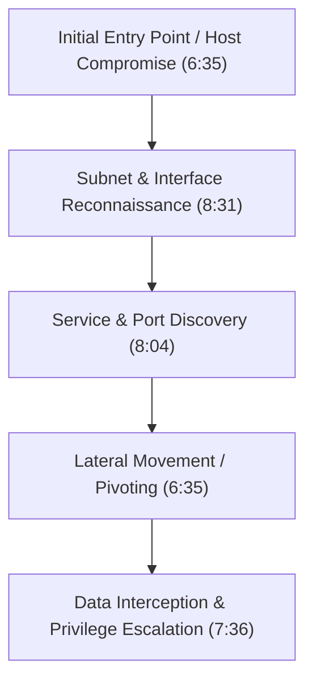
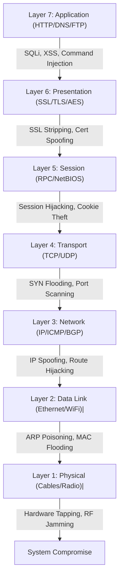
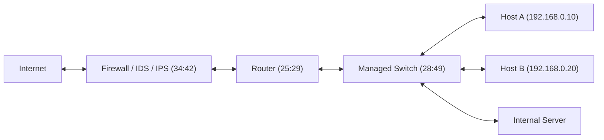
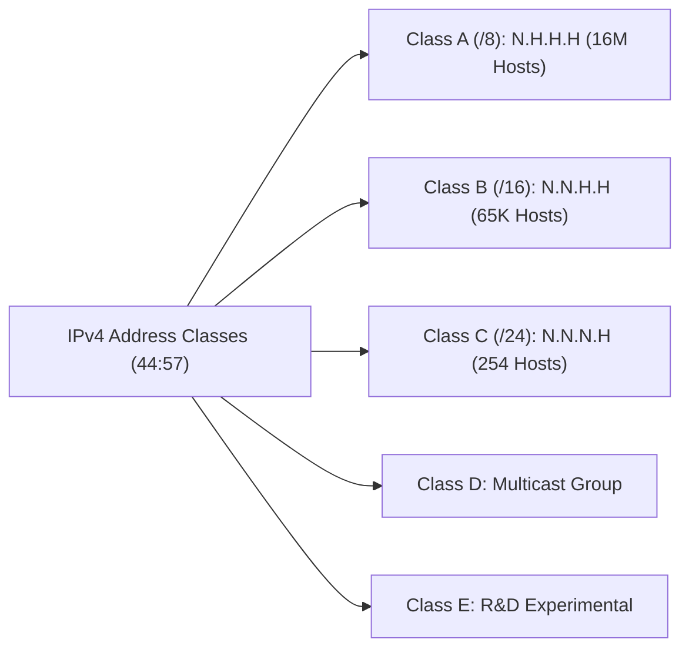
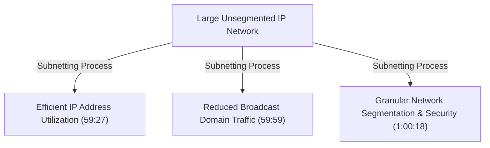
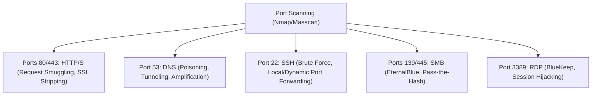
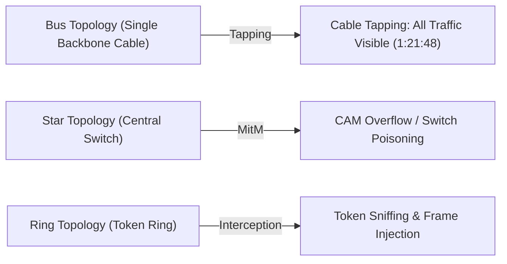
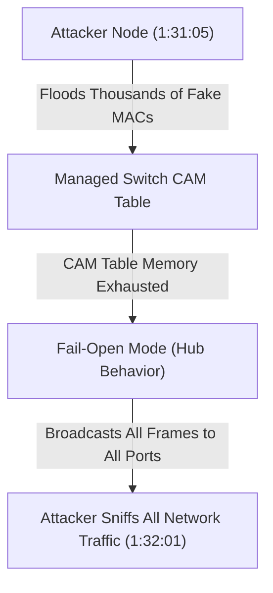

# Networking for Hackers Full Course — Zero to Expert in One Video 2026

## Executive Summary & Metadata
- **Source Video**: [Networking for Hackers Full Course — Zero to Expert in One Video 2026 (YouTube)](https://www.youtube.com/watch?v=IGVcbu1I7Hg)
- **Creator**: [[Cyber Mind Space]] (Almadad Ali)
- **Duration**: ~1 Hour 43 Minutes (`0:00` to `1:43:22`)
- **Key Focus**: End-to-end practical networking tailored exclusively for ethical hackers, penetration testers, and cyber security engineers. Focuses on protocol exploitation, layer-by-layer OSI attack mappings, subnetting mechanics, routing/switching attacks, wireless hacking, pivoting, case studies, and defense checklists.
- **Reference Literature**: *Networking Basics for Hackers: Three Books in One* and *Networking Basics for Hackers* by OccupyTheWeb.

---

## 1. Course Overview & Hacker Mindset (`0:00` – `4:37`)

### 1.1 Mission & Methodology
Traditional networking courses focus heavily on administrative setups or historical context (such as the origins of ARPANET or fiber optic wave physics). This course rejects filler content and focuses strictly on offensive and defensive networking mechanisms required by security professionals (`1:11`).

> *"Networking is the backbone of cyber security. If you are studying for cyber security or want to become an ethical hacker or penetration tester, networking is non-negotiable."* (0:56) — *Almadad Ali*

### 1.2 Master Course Curriculum
The course covers 13 core modules:
1. Networking Fundamentals
2. Types of Networks (LAN, WAN, WLAN, MAN, SDN, Cloud)
3. Network Devices & Security Implementations
4. IP Addressing, Subnetting & CIDR Notation
5. Core Network Protocols (TCP, UDP, DNS, ARP, DHCP, HTTP/S)
6. Packet Analysis & Wireshark (Hands-on)
7. Firewalls, VPNs, Proxies & Evasion
8. Wireless & IoT Security
9. Network Attacks & Man-in-the-Middle (MitM)
10. Advanced Hacker Techniques (Pivoting, Tunneling, C2)
11. Network Penetration Testing Toolkits (Nmap, Masscan, Ettercap, Bettercap)
12. Real-World Case Studies (WannaCry, BGP Hijacking, Mirai Botnet)
13. Defense & Detection Mechanisms (IDS/IPS, Snort, Suricata, Zeek)

---

## 2. Module 1: Networking Fundamentals for Ethical Hackers (`4:37` – `22:11`)

### 2.1 Formal Definition
Networking is defined as the practice of interconnecting computers, devices, and systems to share resources, data, and services (`5:25`).

### 2.2 Why Networking is the Foundation of Ethical Hacking (`5:45` – `8:48`)

Standard networking explains how connections establish; hacker networking explains how connection mechanisms fail or can be exploited.

| Pillar | Technical Mechanism | Hacker Objective | Timestamp |
|---|---|---|---|
| **Attack Surface ID** | Identification of listening ports, exposed services, and active interfaces | Locate primary vectors of entry into a target system | `5:45` |
| **Lateral Movement** | Internal routing, subnets, and trust relationships | Pivot from an initial compromised node across internal networks (horizontal/vertical escalation) | `6:35` |
| **Data Interception** | Transmission of data across unencrypted or weakly encrypted channels | Sniff sensitive transit data (credentials, session tokens, plain text) | `7:36` |
| **Service Discovery** | Querying network sockets and daemon banners | Map specific software versions and known vulnerabilities (CVEs) | `8:04` |
| **Infrastructure Mapping**| Reconstructing network topology and routing paths | Understand perimeter defenses, gateways, and trust boundaries | `8:31` |



---

### 2.3 The OSI 7-Layer Model: Hacker Attack Mapping (`12:00` – `20:31`)

The Open Systems Interconnection (OSI) model standardizes network communication into seven distinct layers. For ethical hackers, each layer represents a specific attack surface with specialized exploitation techniques and tools.



#### Detailed OSI Layer & Security Analysis Table

| Layer # | Layer Name | Core Protocols & Services | Primary Hacker Attacks | Standard Security Tools | Timestamp |
|---|---|---|---|---|---|
| **7** | **Application** | HTTP, HTTPS, FTP, SSH, DNS, SMTP | Web application attacks (SQLi, XSS, Command Injection, SSRF) | Burp Suite, OWASP ZAP, SQLmap | `12:31` |
| **6** | **Presentation** | SSL/TLS, AES, JPEG, MIME, Compression | SSL/TLS Stripping (HTTPS to HTTP downgrade), Certificate Spoofing | `sslstrip`, Ettercap, Mitmproxy | `13:31` |
| **5** | **Session** | NetBIOS, RPC, Sockets, Session IDs | Session Hijacking, Session Fixation, Token Theft | Cookiecadger, Wireshark | `15:31` |
| **4** | **Transport** | TCP (3-way handshake), UDP | SYN Flood (DoS/DDoS), UDP Flooding, TCP Port Scanning | Nmap, Hping3, Masscan | `16:34` |
| **3** | **Network** | IP (IPv4/IPv6), ICMP, BGP, IPsec | IP Address Spoofing, ICMP Redirect, BGP Route Hijacking | Scapy, Hping3, Wireshark | `17:31` |
| **2** | **Data Link** | Ethernet, Wi-Fi (802.11), ARP, PPP | ARP Poisoning/Spoofing, MAC Table Flooding, Deauth Attacks | Arpspoof, Bettercap, Aircrack-ng | `18:37` |
| **1** | **Physical** | Ethernet Cable (Cat6), Fiber, Radio Waves | Cable Tapping, RF Jamming, Hardware Keyloggers | Wi-Fi Pineapple, Rubber Ducky | `19:00` |

> *"Do not just memorize OSI layer names for an interview. Understand which exact attack happens at which layer. When someone asks where SSL Stripping occurs, you must know it targets the Presentation Layer."* (15:05) — *Almadad Ali*

### 2.4 Industry Certification & Career Pathways (`20:31` – `22:11`)
- **Cisco Pathway**: CCNA (Cisco Certified Network Associate) $\rightarrow$ CCNP (Cisco Certified Network Professional) $\rightarrow$ CCIE (Cisco Certified Internetwork Expert).
- **Target Roles**: Network Engineer, System Administrator, Network Security Architect, Penetration Tester.
- **Hacker Pruning Rule**: Security professionals need deep operational knowledge of routing, switching, and packet flows, but should avoid getting bogged down in endless vendor-specific administration drills (e.g., complex static DHCP setups) (`21:35`).

---

## 3. Module 2: Types of Networks & Attack Vectors (`22:11` – `25:29`)

Networks are categorized by geographical scale and architectural design. Each network type introduces distinct security boundaries.

| Network Type | Full Name & Description | Specific Attack Vectors | Timestamp |
|---|---|---|---|
| **LAN** | **Local Area Network**: High-speed network covering a small physical area (home/office). | ARP Poisoning, Man-in-the-Middle (MitM), VLAN Hopping | `22:11` |
| **WAN** | **Wide Area Network**: Telecommunication network spanning cities or global regions. | BGP Route Hijacking, MPLS Infiltration, Transit Interception | `24:07` |
| **WLAN** | **Wireless LAN**: IEEE 802.11 wireless network operating via radio frequencies. | WPA/WPA2 Handshake Cracking, Evil Twin Access Points, Deauth Attacks | `24:33` |
| **MAN** | **Metropolitan Area Network**: Infrastructure spanning an entire city or municipality. | Fiber Optic Tapping, Rogue Infrastructure Interception | `24:42` |
| **SDN** | **Software-Defined Network**: Architecture decoupling control plane from data plane. | SDN Controller Compromise, Southbound API Exploitation | `24:50` |
| **Cloud** | **Cloud Networks**: Virtualized cloud infrastructure (Public/Private/Hybrid). | AWS S3 Bucket Misconfigurations, Exposed Security Groups, IAM Escalation | `25:00` |

---

## 4. Module 3: Network Devices & Security Implementations (`25:29` – `39:03`)

### 4.1 Topology & Device Flow
In an enterprise network architecture, packets flow across multiple inline security and routing devices:



---

### 4.2 Comprehensive Device & Security Breakdown

#### 1. Router (`25:29` – `28:49`)
- **Layer**: Layer 3 (Network Layer).
- **Core Function**: Interconnects distinct logical networks and routes IP packets using routing tables based on destination IP addresses.
- **Analogy**: A traffic police officer directing vehicle flows across major road intersections (`26:28`).
- **Hacker Attacks**:
  - **Route Hijacking**: Injecting false routing updates to divert traffic to attacker-controlled nodes.
  - **Firmware Exploitation**: Exploiting unpatched router OS vulnerabilities to achieve persistent execution.
  - **Default Credentials**: Accessing management portals using default usernames/passwords (`admin`/`admin`).
- **Local Diagnostics**: Standard default gateway addresses (e.g., `192.168.0.1` or `192.168.1.1`). Diagnostic command in Windows shell:
  ```cmd
  ipconfig
  ```
  *(Look for `Default Gateway` field to identify the local router IP address).*

#### 2. Switch (`28:49` – `32:50`)
- **Layer**: Layer 2 (Data Link Layer).
- **Core Function**: Forwards Ethernet frames between devices within the *same* local network segment using a Content Addressable Memory (CAM) / MAC Address Table.
- **Mechanism**: Dynamically maps physical switch ports to device MAC addresses (`30:33`).
- **Hacker Attacks**:
  - **CAM Table Overflow / MAC Flooding (`31:05`)**: Flooding the switch with thousands of fake MAC addresses until memory limits are reached.
  - **Switch-to-Hub Failover**: Once the CAM table is full, the switch enters failopen/failover mode, acting like a legacy hub and broadcasting all frames to every port, enabling network sniffing (`32:01`).
  - **VLAN Hopping**: Crafting double-tagged 802.1Q frames to jump across isolated Virtual LANs.

#### 3. Hub (`32:50` – `34:42`)
- **Layer**: Layer 1 (Physical Layer).
- **Core Function**: Legacy network device that blindly repeats incoming signals to all connected physical ports.
- **Analogy**: A neighborhood gossip ("gally ki aunty") who hears a private secret and broadcasts it to everyone in the neighborhood (`33:01`).
- **Security Risk**: Zero traffic isolation; any node on a hub can run a sniffer (e.g., Wireshark) in promiscuous mode and capture all network traffic.

#### 4. Firewall (`34:42` – `35:45`)
- **Layer**: Layer 3 to Layer 7.
- **Core Function**: Inspects and filters network traffic based on predefined security access control lists (ACLs).
- **Firewall Types**:
  - **Stateless Firewall**: Filters packets based on individual headers without tracking connection state.
  - **Stateful Firewall**: Maintains a connection state table to verify valid bidirectional flows.
  - **Next-Generation Firewall (NGFW)**: Integrates deep packet inspection (DPI), application awareness, and inline threat detection.
  - **Web Application Firewall (WAF)**: Operates at Layer 7 to block HTTP/S attacks (e.g., SQLi, XSS).
- **Hacker Evasion Techniques**: Packet fragmentation, decoy scanning (`nmap -D`), payload obfuscation, HTTP request smuggling, encrypted SSL/TLS tunneling.

#### 5. IDS & IPS (`35:45` – `36:30`)
- **IDS (Intrusion Detection System)**: Passive sensor monitoring traffic for signature matches or anomalies and raising security alerts.
- **IPS (Intrusion Prevention System)**: Active inline device capable of dropping malicious packets and severing TCP connections.
- **Hacker Evasion Techniques**: IP fragmentation evasion, payload encoding, polymorphic shellcode, timing-based delays (e.g., slow scanning).

#### 6. Proxy Server & Load Balancer (`36:30` – `39:03`)
- **Proxy Server**: Intermediary server making network requests on behalf of client devices (Forward, Reverse, Transparent Proxy).
- **Load Balancer**: Distributes incoming client traffic across multiple backend servers (`37:41`). Attacks include session persistence bypassing, SSL termination exploitation, and HTTP request smuggling (`38:26`).

---

## 5. Module 4: IP Addressing (IPv4) & Classful Architecture (`39:03` – `57:02`)

### 5.1 Technical Structure of IPv4
An Internet Protocol Version 4 (IPv4) address is a 32-bit logical identifier formatted as four decimal octets (8 bits per octet), separated by periods (`40:45`).

$$\text{IPv4 Format: } \text{Octet 1} . \text{Octet 2} . \text{Octet 3} . \text{Octet 4}$$
$$\text{Bit Size: } 8 \text{ bits} + 8 \text{ bits} + 8 \text{ bits} + 8 \text{ bits} = 32 \text{ bits (4 Bytes)}$$

- **Octet Decimal Range**: $0$ to $255$ per octet.
- **Total Address Space**: $2^{32} \approx 4,294,967,296$ (~$4.3 \text{ billion}$) unique addresses (`43:36`).
- **Global Exhaustion & IPv6**: Because global internet-connected devices exceed the ~4.3 billion IPv4 address pool, IPv6 (128-bit) and Network Address Translation (NAT) were introduced to mitigate address exhaustion (`44:28`).

---

### 5.2 Transmission Modes (`45:52`)

| Mode | Communication Scope | Technical Mechanics | Use Case |
|---|---|---|---|
| **Unicast** | Point-to-Point | Single sender $\rightarrow$ Single receiver | Standard web browsing, SSH |
| **Broadcast** | One-to-All | Single sender $\rightarrow$ All nodes on subnet (`255.255.255.255`) | ARP Requests, DHCP Discover |
| **Multicast** | One-to-Many Group | Single sender $\rightarrow$ Specific subscribed device group | Video streaming, Routing protocols (OSPF) |

---

### 5.3 Classful IPv4 Architecture Matrix (`44:57` – `57:02`)

IPv4 addresses are divided into five distinct classes based on leading bits, defining the ratio of Network ID bits ($N$) to Host ID bits ($H$).



#### Detailed IPv4 Class Breakdown Table

| Class | IP Range (First Octet) | Default CIDR / Subnet Mask | Structure ($N$: Network, $H$: Host) | Networks Available | Max Hosts per Network | Primary Use Case | Timestamp |
|---|---|---|---|---|---|---|---|
| **Class A** | `1.0.0.0` – `127.255.255.255` | `/8` (`255.0.0.0`) | `N.H.H.H` | $127$ | $2^{24} - 2 = 16,777,214$ | Massive ISPs, Enterprise Backbones | `49:33` |
| **Class B** | `128.0.0.0` – `191.255.255.255` | `/16` (`255.255.0.0`) | `N.N.H.H` | $16,384$ | $2^{16} - 2 = 65,534$ | Medium-Sized Organizations, Universities | `52:01` |
| **Class C** | `192.0.0.0` – `223.255.255.255` | `/24` (`255.255.255.0`) | `N.N.N.H` | $2,097,152$ | $2^{8} - 2 = 254$ | Local Area Networks (LAN), Home Routers | `54:10` |
| **Class D** | `224.0.0.0` – `239.255.255.255` | N/A | Multicast | N/A | N/A | Video Multicasting, Routing Feeds | `56:32` |
| **Class E** | `240.0.0.0` – `255.255.255.255` | N/A | Reserved | N/A | N/A | Future R&D, Experimental | `56:32` |

> *"When looking at a Class C IP like `192.168.10.67`, the first three octets (`192.168.10`) identify the Network, while the final octet (`67`) identifies the specific Host."* (54:56) — *Almadad Ali*

---

### 5.4 RFC 1918 Private IPv4 Address Ranges

Private IP addresses are non-routable on the public internet and are used inside isolated local networks behind NAT:
- **Class A Private**: `10.0.0.0` to `10.255.255.255` (`10.0.0.0/8`)
- **Class B Private**: `172.16.0.0` to `172.31.255.255` (`172.16.0.0/12`)
- **Class C Private**: `192.168.0.0` to `192.168.255.255` (`192.168.0.0/16`)

---

## 6. Module 5: Subnetting, CIDR & Network Calculations (`57:02` – `1:12:11`)

### 6.1 Why Subnetting Matters (`59:00` – `1:00:47`)
Subnetting borrows bits from the host portion of an IP address and converts them into network bits.



---

### 6.2 Key Subnetting Definitions & Mathematical Rules (`1:01:06`)

1. **CIDR (Classless Inter-Domain Routing) Notation**: Denoted by a trailing slash (e.g., `/24`, `/27`). Indicates the number of contiguous network bits ($1$s) in the subnet mask.
2. **Network Address**: The first IP address in a subnet (`1:01:06`). Represents the subnet itself and cannot be assigned to hosts.
3. **Broadcast Address**: The last IP address in a subnet (`1:01:06`). Used to send data to all devices on the subnet and cannot be assigned to hosts.
4. **Usable Host Formula**:
   $$\text{Usable Host IPs} = 2^{n} - 2$$
   where $n$ is the number of remaining Host Bits ($n = 32 - \text{CIDR}$). The $-2$ accounts for the Network Address and Broadcast Address (`1:01:53`).

---

### 6.3 Step-by-Step Subnet Calculation Example (`1:02:42` – `1:06:02`)

#### Target Input: `192.168.10.34 /27`

1. **Calculate Host Bits ($n$)**:
   $$n = 32 - 27 = 5 \text{ bits}$$
2. **Calculate Total IPs per Subnet**:
   $$\text{Total IPs} = 2^{5} = 32 \text{ IP addresses}$$
3. **Calculate Usable Hosts**:
   $$\text{Usable Hosts} = 2^{5} - 2 = 30 \text{ hosts}$$
4. **Calculate Subnet Block Size & Subnet Mask**:
   $$\text{Subnet Mask Octet} = 256 - 32 = 224 \implies \text{Subnet Mask: } 255.255.255.224$$
5. **Enumerate Subnet Block Ranges (Increments of 32)**:
   - Subnet 0: `192.168.10.0` to `192.168.10.31`
   - Subnet 1: `192.168.10.32` to `192.168.10.63`  $\leftarrow$ *(Target IP `34` falls here)*
   - Subnet 2: `192.168.10.64` to `192.168.10.95`
6. **Extract Subnet Properties for Target IP (`192.168.10.34`)**:
   - **Network Address**: `192.168.10.32`
   - **Broadcast Address**: `192.168.10.63`
   - **Usable Host Range**: `192.168.10.33` – `192.168.10.62` (30 Usable Hosts)

---

### 6.4 Subnetting Quick Reference Matrix (`1:06:27`)

| CIDR Prefix | Subnet Mask | Total IPs | Usable Hosts ($2^n - 2$) | Block Size (Magic Number) | Common Application |
|---|---|---|---|---|---|
| **/24** | `255.255.255.0` | $256$ | $254$ | $256$ | Standard Office LAN Segment |
| **/25** | `255.255.255.128` | $128$ | $126$ | $128$ | Half Class C Subnet |
| **/26** | `255.255.255.192` | $64$ | $62$ | $64$ | Departmental Isolation (Finance, HR) |
| **/27** | `255.255.255.224` | $32$ | $30$ | $32$ | Small Workgroup / DMZ |
| **/28** | `255.255.255.240` | $16$ | $14$ | $16$ | Micro Subnet / Security Appliances |
| **/29** | `255.255.255.248` | $8$ | $6$ | $8$ | Small Infrastructure Clusters |
| **/30** | `255.255.255.252` | $4$ | $2$ | $4$ | Point-to-Point Router Links |

---

## 7. Module 6: Core Network Protocols & Hacker Port Matrix (`1:14:35` – `1:18:55`)

Modern networks rely on well-known network ports (range: `0` to `65535`). Each protocol has inherent design assumptions that hackers exploit.



### Comprehensive Hacker Port & Protocol Reference Table

| Port(s) | Protocol | Core Purpose | Primary Hacker Attack Vectors | Security Tools | Timestamp |
|---|---|---|---|---|---|
| **21** | **FTP** | File Transfer Protocol | Anonymous login abuse, unencrypted credential sniffing, FTP bounce attacks | Nmap, hydra | `1:15:57` |
| **22** | **SSH** | Secure Shell | Brute-force authentication, SSH pivoting/port forwarding, weak host key exploitation | Hydra, Proxychains | `1:15:38` |
| **23** | **Telnet** | Legacy CLI Access | Plain text credential sniffing, MitM interception | Wireshark, Ettercap | `1:18:08` |
| **25, 465, 587** | **SMTP** | Simple Mail Transfer | Open relay exploitation, email spoofing, spear-phishing credential harvesting | Swaks, Nmap | `1:16:27` |
| **53** | **DNS** | Domain Name System | DNS cache poisoning, ARP-based DNS spoofing, DNS tunneling, DNS amplification DDoS | Dnschef, Scapy, Dig | `1:15:07` |
| **80, 443** | **HTTP / HTTPS** | Web Traffic | Web app exploitation (SQLi, XSS), SSL/TLS stripping, HTTP request smuggling | Burp Suite, sslstrip | `1:14:35` |
| **110, 995 / 143, 993**| **POP3 / IMAP** | Mail Retrieval | Plain text login sniffing, credential stuffing | Hydra, Wireshark | `1:16:27` |
| **139, 445** | **SMB** | Server Message Block | EternalBlue (CVE-2017-0144), Pass-the-Hash (PtH), SMB relay attacks | Metasploit, Impacket | `1:16:59` |
| **161, 162** | **SNMP** | Network Management | Default community string enumeration (`public`/`private`), info leakage | Snmpwalk, Onesixtyone | `1:18:55` |
| **389, 636** | **LDAP / LDAPS** | Directory Services | Active Directory enumeration, LDAP injection, credential harvesting | BloodHound, Ldapsearch| `1:18:55` |
| **3389** | **RDP** | Remote Desktop | BlueKeep (CVE-2019-0708), RDP brute force, session hijacking | Crowbar, Nmap | `1:17:30` |

---

## 8. Module 7: Network Topologies & Advanced Routing/Switching Attacks (`1:18:55` – `1:33:13`)

### 8.1 Network Topologies & Hacker Vulnerabilities (`1:19:22` – `1:23:57`)



- **Bus Topology**: Devices connect to a single central backbone cable. *Vulnerability*: Single point of failure; physical/logical cable tapping allows eavesdropping on 100% of network traffic (`1:21:48`).
- **Star Topology**: Devices connect to a central switch or hub. *Vulnerability*: Central node compromise exposes all connected endpoints.
- **Ring Topology**: Devices form a closed loop. *Vulnerability*: Token sniffing and ring disruption.
- **Mesh Topology**: Redundant interconnections. *Vulnerability*: High operational complexity; rogue node insertion.

---

### 8.2 Advanced Routing & Switching Exploitation (`1:25:50` – `1:33:13`)

#### 1. BGP Route Hijacking (`1:25:50`)
- **Mechanism**: Attacker or misconfigured Autonomous System (AS) announces false, highly specific BGP prefixes to hijack global internet traffic.
- **Historical Case Study (Pakistan Telecom YouTube Hijack, 2008) (`1:26:26`)**: In 2008, Pakistan Telecom attempted to block YouTube domestically by announcing a false BGP route (`/24`) to a dead-end blackhole. Because the route was more specific than YouTube's global `/22` prefix, global ISPs routed YouTube traffic to Pakistan, taking YouTube offline worldwide for several hours.

#### 2. STP (Spanning Tree Protocol) Manipulation (`1:27:10`)
- **Mechanism**: Attacker injects rogue Bridge Protocol Data Unit (BPDU) frames with priority 0 to become the Root Bridge of a switch network, forcing all switch traffic to route through the attacker's switch port.

#### 3. OSPF (Open Shortest Path First) Attacks (`1:28:35`)
- **Mechanism**: Injecting false Link-State Advertisements (LSAs) into an OSPF routing domain to advertise a fake shortest path, causing routing loops, traffic diversion to attacker nodes, or blackhole DoS (`1:28:56`).

#### 4. CAM Table Overflow Attack (`1:31:05`)
- **Mechanism**: Attacker floods a Layer 2 switch with thousands of randomized fake MAC addresses.
- **Outcome**: The switch's CAM table fills to capacity. The switch fails open into legacy **Hub Mode**, broadcasting all incoming network frames to every port, enabling full network sniffing (`1:32:01`).



---

## 9. Modules 8 & 9: Evasion, Wireless & MitM Attacks (`1:33:13` – `1:36:29`)

### 9.1 Firewall & Evasion Techniques (`1:33:13`)
- **Firewall Categories**: Stateless, Stateful, Next-Generation Firewall (NGFW), Web Application Firewall (WAF).
- **Evasion Tactics**: Packet fragmentation (`nmap -f`), decoy scanning (`nmap -D`), DNS/HTTPS/ICMP tunneling, proxy pivoting.

### 9.2 Wireless Security & Attack Vectors (`1:34:35`)
- **WEP Cracking**: Exploiting weak IV key schedules using `aircrack-ng`.
- **WPA/WPA2 Handshake Cracking**: Capturing the 4-way EAPOL handshake via deauthentication frames and cracking PMKID/WPA hashes via Hashcat/John.
- **Evil Twin Access Point**: Deploying a rogue access point with identical SSID to intercept client authentication and data.
- **Deauthentication Attacks**: Sending spoofed 802.11 deauth frames (`aireplay-ng -0`) to disconnect clients.

### 9.3 Man-in-the-Middle (MitM) Attacks (`1:35:18`)
- **ARP Cache Poisoning**: Sending unsolicited fake ARP replies to map the gateway IP to the attacker's MAC address (`arpspoof`, `bettercap`).
- **DNS Spoofing**: Injecting forged DNS responses to redirect victims to malicious IP addresses.
- **SSL/TLS Stripping**: Intercepting HTTP/HTTPS traffic and stripping TLS redirects to capture plain-text credentials (`sslstrip`).

---

## 10. Modules 10 & 11: Advanced Hacker Techniques & Case Studies (`1:36:29` – `1:40:33`)

### 10.1 Pivoting & Lateral Movement (`1:36:29`)
- **SSH Local Port Forwarding**: Tunneling internal remote services to local ports (`ssh -L`).
- **SOCKS Proxies**: Routing custom attack tool traffic through compromised pivot hosts using `proxychains`.
- **Command Shell Toolkit**: Nmap, Masscan, Zmap, Wireshark, TShark, TCPDump, Ettercap, Bettercap, Aircrack-ng, Netcat, Socat.

### 10.2 Real-World Case Studies (`1:40:10`)
1. **WannaCry Ransomware (CVE-2017-0144 / MS17-010)**: Exploited unpatched Windows SMBv1 protocol to propagate autonomously across global networks without user interaction (`1:40:02`).
2. **Cloud Misconfigurations**: Publicly readable AWS S3 buckets and overly permissive Azure security groups exposing sensitive corporate data (`1:40:04`).
3. **Mirai Botnet (2016)**: Scanned the internet for exposed IoT devices (routers, IP cameras) using default credentials to assemble a massive botnet for record-breaking DDoS attacks (`1:40:10`).

---

## 11. Modules 12 & 13: Defense & Detection Checklists (`1:40:33` – `1:43:22`)

### 11.1 Defense Architecture
- **Intrusion Detection Systems (IDS)**: Passive sensors analyzing traffic signatures and anomalies (`Snort`, `Suricata`, `Zeek`) (`1:40:33`).
- **Intrusion Prevention Systems (IPS)**: Inline security appliances actively blocking malicious payloads.

### 11.2 Network Hardening Checklist (`1:41:09` – `1:41:38`)

- [ ] **System Patching**: Apply vendor security updates (especially SMB MS17-010, RDP BlueKeep).
- [ ] **Disable Insecure Protocols**: Decommission Telnet, FTP, HTTP, and SNMPv1/v2c in favor of SSH, SFTP, HTTPS, and SNMPv3.
- [ ] **Network Segmentation & Isolation**: Implement VLANs and strict inter-VLAN ACLs to restrict lateral movement.
- [ ] **Port Security & CAM Protection**: Enable MAC limits and Sticky MAC security on managed switches.
- [ ] **BGP & Routing Security**: Implement RPKI route validation and prefix filtering.
- [ ] **Wireless Security**: Transition from WPA2 to WPA3 and disable WPS on all access points.
- [ ] **Logging & SIEM**: Enable centralized firewall/IDS logging and continuous monitoring.

---

## Source Provenance & Archival Link
- Original Raw Transcript File: `[[01_RAW/SOURCE/Networking for Hackers Full Course — Zero to Expert in One Video 2026.md]]`
