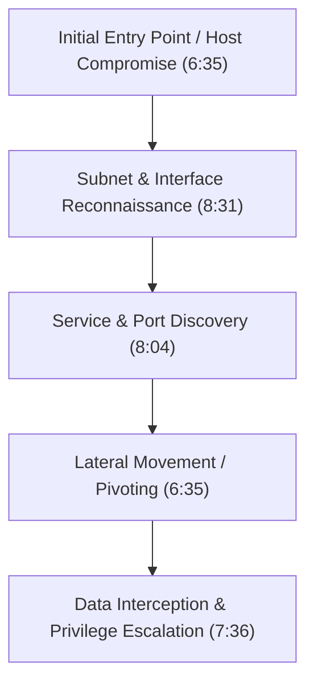
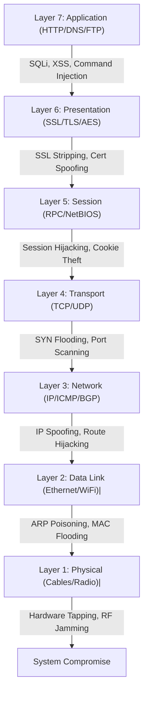
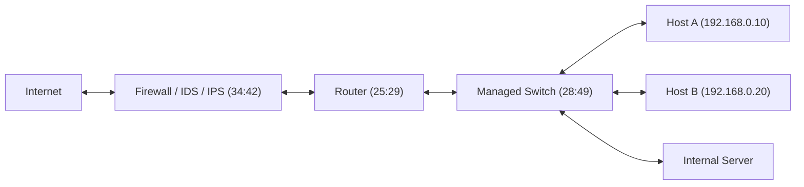

# Networking for Hackers Full Course — Zero to Expert in One Video 2026 (Part 1)

## Executive Summary & Metadata
- **Source**: [Networking for Hackers Full Course — Zero to Expert in One Video 2026 (YouTube)](https://www.youtube.com/watch?v=IGVcbu1I7Hg)
- **Creator**: [[Cyber Mind Space]] (Almadad Ali)
- **Scope**: Part 1 of 3 (Timestamps `0:00` to `36:30`)
- **Key Focus**: Practical networking fundamentals tailored specifically for ethical hacking, penetration testing, and cyber security engineering without superficial historical filler.
- **Reference Literature**: *Networking Basics for Hackers: Three Books in One* and *Networking Basics for Hackers* by OccupyTheWeb.

---

## 1. Course Overview & Mindset (`0:00` – `4:37`)

### 1.1 Mission & Methodology
The course rejects standard theoretical lectures (such as the history of ARPANET or optic cable physics) and focuses strictly on offensive and defensive networking mechanisms required by security professionals (`1:11`).

> *"Networking is the backbone of cyber security. If you are studying for cyber security or want to become an ethical hacker or penetration tester, networking is non-negotiable."* (0:56) — *Almadad Ali*

### 1.2 Course Structure Overview
The full course encompasses 13 core modules:
1. Networking Fundamentals
2. Types of Networks (LAN, WAN, WLAN, MAN, SDN, Cloud)
3. Network Devices & Security Implementations
4. IP Addressing, Subnetting & CIDR Notation
5. Core Network Protocols (TCP, UDP, DNS, ARP, DHCP, HTTP/S)
6. Packet Analysis & Wireshark (Hands-on)
7. Firewalls, VPNs, Proxies & Evasion
8. Wireless & IoT Security
9. Network Attacks & Man-in-the-Middle (MitM)
10. Advanced Hacker Techniques (Pivoting, Tunneling, C2)
11. Network Penetration Testing Toolkits (Nmap, Masscan, Ettercap, Bettercap)
12. Real-World Case Studies (WannaCry, BGP Hijacking, Mirai Botnet)
13. Defense & Detection Mechanisms (IDS/IPS, Snort, Suricata, Zeek)

---

## 2. Module 1: Networking Fundamentals for Ethical Hackers (`4:37` – `22:11`)

### 2.1 Formal Definition
Networking is defined as the practice of interconnecting computers, devices, and systems to share resources, data, and services (`5:25`).

### 2.2 Why Networking is the Foundation of Ethical Hacking (`5:45` – `8:48`)

Standard networking courses explain how to establish connections; hacker networking explains how connection mechanisms fail or can be manipulated.

| Pillar | Technical Mechanism | Hacker Objective | Timestamp |
|---|---|---|---|
| **Attack Surface ID** | Identification of listening ports, exposed services, and active network interfaces | Locate primary vectors of entry into a target system | `5:45` |
| **Lateral Movement** | Internal routing, subnets, and trust relationships | Pivot from an initial compromised node across internal networks (horizontal/vertical escalation) | `6:35` |
| **Data Interception** | Transmission of data across unencrypted or weakly encrypted channels | Sniff sensitive transit data (credentials, session tokens, plain text) | `7:36` |
| **Service Discovery** | Querying network sockets and daemon banners | Map specific software versions and known vulnerabilities (CVEs) | `8:04` |
| **Infrastructure Mapping**| Reconstructing network topology and routing paths | Understand perimeter defenses, gateways, and trust boundaries | `8:31` |



---

### 2.3 The OSI 7-Layer Model: Hacker Attack Mapping (`12:00` – `20:31`)

The Open Systems Interconnection (OSI) model standardizes network communication into seven distinct layers. For ethical hackers, each layer represents a specific attack surface with specialized exploitation techniques and tools.



#### Detailed OSI Layer & Security Analysis Table

| Layer # | Layer Name | Core Protocols & Services | Primary Hacker Attacks | Standard Security Tools | Timestamp |
|---|---|---|---|---|---|
| **7** | **Application** | HTTP, HTTPS, FTP, SSH, DNS, SMTP | Web application attacks (SQLi, XSS, Command Injection, SSRF) | Burp Suite, OWASP ZAP, SQLmap | `12:31` |
| **6** | **Presentation** | SSL/TLS, AES, JPEG, MIME, Compression | SSL/TLS Stripping (HTTPS to HTTP downgrade), Certificate Spoofing | `sslstrip`, Ettercap, Mitmproxy | `13:31` |
| **5** | **Session** | NetBIOS, RPC, Sockets, Session IDs | Session Hijacking, Session Fixation, Token Theft | Cookiecadger, Wireshark | `15:31` |
| **4** | **Transport** | TCP (3-way handshake), UDP | SYN Flood (DoS/DDoS), UDP Flooding, TCP Port Scanning | Nmap, Hping3, Masscan | `16:34` |
| **3** | **Network** | IP (IPv4/IPv6), ICMP, BGP, IPsec | IP Address Spoofing, ICMP Redirect, BGP Route Hijacking | Scapy, Hping3, Wireshark | `17:31` |
| **2** | **Data Link** | Ethernet, Wi-Fi (802.11), ARP, PPP | ARP Poisoning/Spoofing, MAC Table Flooding, Deauth Attacks | Arpspoof, Bettercap, Aircrack-ng | `18:37` |
| **1** | **Physical** | Ethernet Cable (Cat6), Fiber, Radio Waves | Cable Tapping, RF Jamming, Hardware Keyloggers | Wi-Fi Pineapple, Rubber Ducky | `19:00` |

> *"Do not just memorize OSI layer names for an interview. Understand which exact attack happens at which layer. When someone asks where SSL Stripping occurs, you must know it targets the Presentation Layer."* (15:05) — *Almadad Ali*

### 2.4 Industry Certification & Career Pathways (`20:31` – `22:11`)
- **Cisco Pathway**: CCNA (Cisco Certified Network Associate) $\rightarrow$ CCNP (Cisco Certified Network Professional) $\rightarrow$ CCIE (Cisco Certified Internetwork Expert).
- **Target Roles**: Network Engineer, System Administrator, Network Security Architect, Penetration Tester.
- **Hacker Pruning Rule**: Security professionals need deep operational knowledge of routing, switching, and packet flows, but should avoid getting bogged down in endless vendor-specific administration drills (e.g., complex static DHCP setups) (`21:35`).

---

## 3. Module 2: Types of Networks & Attack Vectors (`22:11` – `25:29`)

Networks are categorized by geographical scale and architectural design. Each network type introduces distinct security boundaries.

| Network Type | Full Name & Description | Specific Attack Vectors | Timestamp |
|---|---|---|---|
| **LAN** | **Local Area Network**: High-speed network covering a small physical area (home/office). | ARP Poisoning, Man-in-the-Middle (MitM), VLAN Hopping | `22:11` |
| **WAN** | **Wide Area Network**: Telecommunication network spanning cities or global regions. | BGP Route Hijacking, MPLS Infiltration, Transit Interception | `24:07` |
| **WLAN** | **Wireless LAN**: IEEE 802.11 wireless network operating via radio frequencies. | WPA/WPA2 Handshake Cracking, Evil Twin Access Points, Deauth Attacks | `24:33` |
| **MAN** | **Metropolitan Area Network**: Infrastructure spanning an entire city or municipality. | Fiber Optic Tapping, Rogue Infrastructure Interception | `24:42` |
| **SDN** | **Software-Defined Network**: Architecture decoupling control plane from data plane. | SDN Controller Compromise, Southbound API Exploitation | `24:50` |
| **Cloud** | **Cloud Networks**: Virtualized cloud infrastructure (Public/Private/Hybrid). | AWS S3 Bucket Misconfigurations, Exposed Security Groups, IAM Escalation | `25:00` |

---

## 4. Module 3: Network Devices & Security Implementations (`25:29` – `36:30`)

### 4.1 Topology & Device Flow
In an enterprise network architecture, packets flow across multiple inline security and routing devices:



---

### 4.2 Comprehensive Device & Security Breakdown

#### 1. Router (`25:29` – `28:49`)
- **Layer**: Layer 3 (Network Layer).
- **Core Function**: Interconnects distinct logical networks and routes IP packets using routing tables based on destination IP addresses.
- **Analogy**: A traffic police officer directing vehicle flows across major road intersections (`26:28`).
- **Hacker Attacks**:
  - **Route Hijacking**: Injecting false routing updates to divert traffic to attacker-controlled nodes.
  - **Firmware Exploitation**: Exploiting unpatched router OS vulnerabilities to achieve persistent execution.
  - **Default Credentials**: Accessing management portals using default usernames/passwords (`admin`/`admin`).
- **Local Diagnostics**: Standard default gateway addresses (e.g., `192.168.0.1` or `192.168.1.1`). Diagnostic command in Windows shell:
  ```cmd
  ipconfig
  ```
  *(Look for `Default Gateway` field to identify the local router IP address).*

#### 2. Switch (`28:49` – `32:50`)
- **Layer**: Layer 2 (Data Link Layer).
- **Core Function**: Forwards Ethernet frames between devices within the *same* local network segment using a Content Addressable Memory (CAM) / MAC Address Table.
- **Mechanism**: Dynamically maps physical switch ports to device MAC addresses (`30:33`).
- **Hacker Attacks**:
  - **CAM Table Overflow / MAC Flooding (`31:05`)**: Flooding the switch with thousands of fake MAC addresses until memory limits are reached.
  - **Switch-to-Hub Failover**: Once the CAM table is full, the switch enters failopen/failover mode, acting like a legacy hub and broadcasting all frames to every port, enabling network sniffing.
  - **VLAN Hopping**: Crafting double-tagged 802.1Q frames to jump across isolated Virtual LANs.

#### 3. Hub (`32:50` – `34:42`)
- **Layer**: Layer 1 (Physical Layer).
- **Core Function**: Legacy network device that blindly repeats incoming signals to all connected physical ports.
- **Analogy**: A neighborhood gossip ("gally ki aunty") who hears a private secret and broadcasts it to everyone in the neighborhood (`33:01`).
- **Security Risk**: Zero traffic isolation; any node on a hub can run a sniffer (e.g., Wireshark) in promiscuous mode and capture all network traffic.

#### 4. Firewall (`34:42` – `35:45`)
- **Layer**: Layer 3 to Layer 7.
- **Core Function**: Inspects and filters network traffic based on predefined security access control lists (ACLs).
- **Firewall Types**:
  - **Stateless Firewall**: Filters packets based on individual headers without tracking connection state.
  - **Stateful Firewall**: Maintains a connection state table to verify valid bidirectional flows.
  - **Next-Generation Firewall (NGFW)**: Integrates deep packet inspection (DPI), application awareness, and inline threat detection.
  - **Web Application Firewall (WAF)**: Operates at Layer 7 to block HTTP/S attacks (e.g., SQLi, XSS).
- **Hacker Evasion Techniques**: Packet fragmentation, decoy scanning (`nmap -D`), payload obfuscation, HTTP request smuggling, encrypted SSL/TLS tunneling.

#### 5. IDS & IPS (`35:45` – `36:30`)
- **IDS (Intrusion Detection System)**: Passive sensor monitoring traffic for signature matches or anomalies and raising security alerts.
- **IPS (Intrusion Prevention System)**: Active inline device capable of dropping malicious packets and severing TCP connections.
- **Hacker Evasion Techniques**: IP fragmentation evasion, payload encoding, polymorphic shellcode, timing-based delays (e.g., slow scanning).

#### 6. Proxy Server (`36:30`)
- **Core Function**: Intermediary server making network requests on behalf of client devices.
- **Types**: Forward Proxy (hides client identity), Reverse Proxy (protects backend servers & balances load), Transparent Proxy (intercepts traffic silently without client configuration).

---

## Source Provenance & Archival Link
- Original Raw Transcript File: `[[01_RAW/SOURCE/Networking for Hackers Full Course — Zero to Expert in One Video 2026.md]]`
