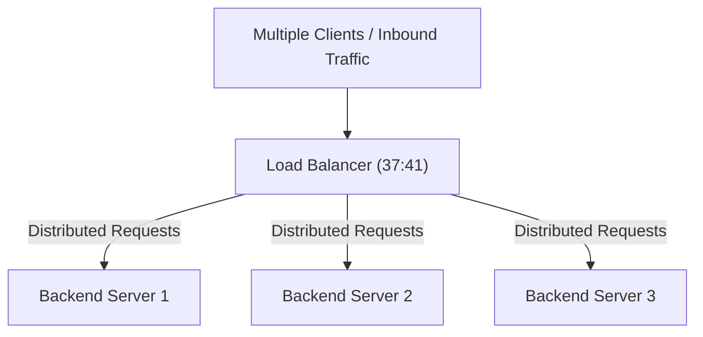
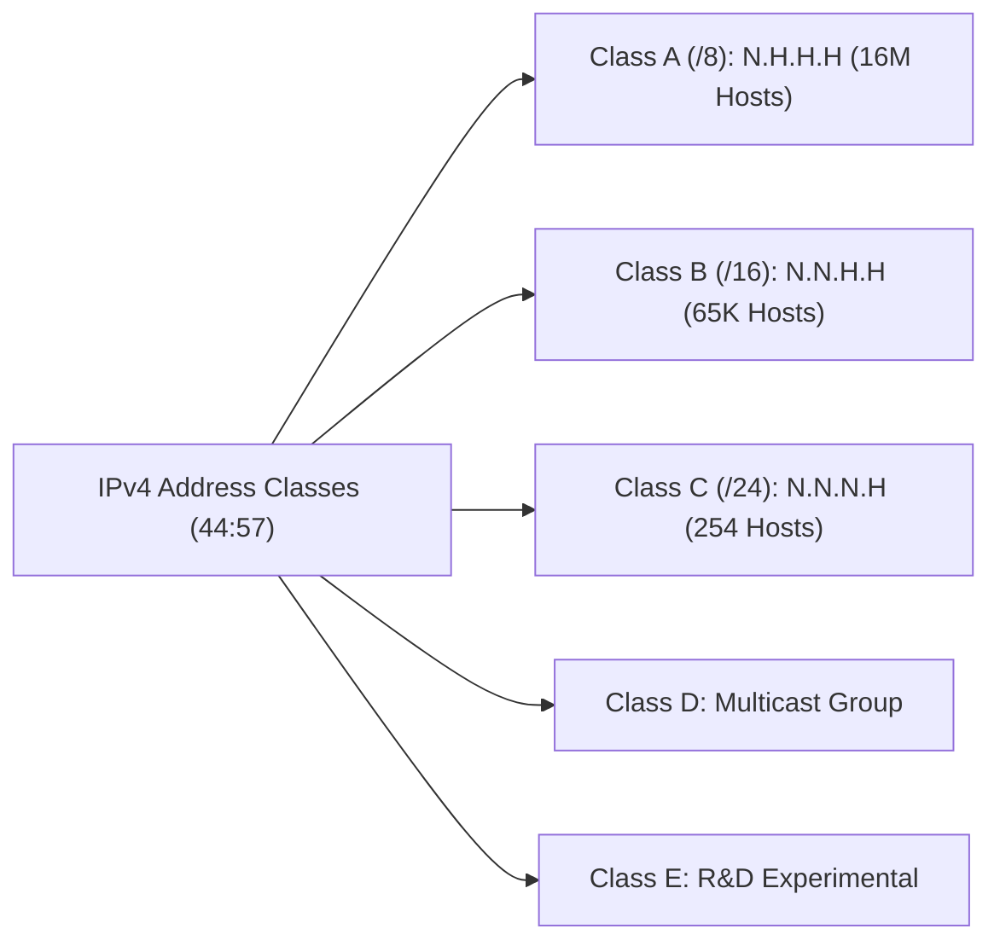
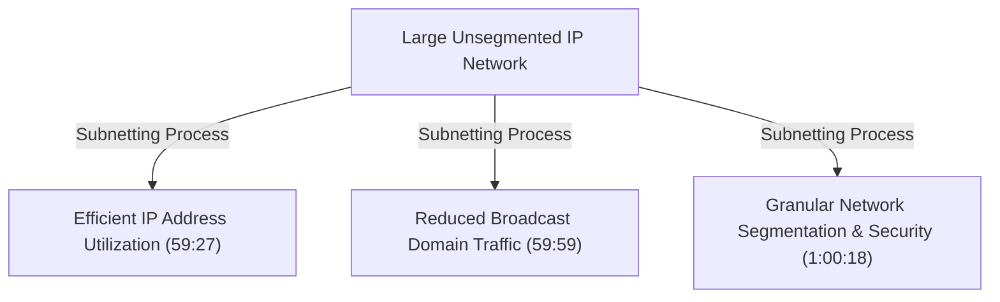

# Networking for Hackers Full Course — Zero to Expert in One Video 2026 (Part 2)

## Executive Summary & Metadata
- **Source**: [Networking for Hackers Full Course — Zero to Expert in One Video 2026 (YouTube)](https://www.youtube.com/watch?v=IGVcbu1I7Hg)
- **Creator**: [[Cyber Mind Space]] (Almadad Ali)
- **Scope**: Part 2 of 3 (Timestamps `36:30` to `1:12:11`)
- **Key Focus**: Load Balancers, IPv4 Architecture, Classful Addressing (Classes A–E), Unicast/Multicast/Broadcast modes, CIDR Notation, and In-Depth Subnetting Calculations.
- **Continuity**: Seamless continuation from [[detailed-study-notes-networking-for-hackers-full-course-part-01.md|Part 1]].

---

## 1. Advanced Traffic Distribution & Security Infrastructure (`36:30` – `39:03`)

### 1.1 Load Balancer Architecture & Mechanism
A load balancer distributes incoming client requests across a pool of backend servers (e.g., Server 1, Server 2, Server 3) to prevent single-point overload during traffic spikes (`37:41`).

### 1.2 Hacker Attack Vectors on Load Balancers (`38:26`)
- **Session Persistence Bypassing**: Manipulating cookie/sticky-session headers to jump across backend server boundaries.
- **SSL Termination Exploitation**: Intercepting plain text HTTP traffic decrypted at the load balancer before reaching backend servers.
- **HTTP Request Smuggling**: Exploiting discrepancies between load balancer and backend server length headers (`Content-Length` vs `Transfer-Encoding`).

---

## 2. Module 4: IP Addressing (IPv4) & Classful Architecture (`39:03` – `57:02`)

### 2.1 Technical Structure of IPv4
An Internet Protocol Version 4 (IPv4) address is a 32-bit logical identifier formatted as four decimal octets (8 bits per octet), separated by periods (`40:45`).

$$\text{IPv4 Format: } \text{Octet 1} . \text{Octet 2} . \text{Octet 3} . \text{Octet 4}$$
$$\text{Bit Size: } 8 \text{ bits} + 8 \text{ bits} + 8 \text{ bits} + 8 \text{ bits} = 32 \text{ bits (4 Bytes)}$$

- **Octet Decimal Range**: $0$ to $255$ per octet.
- **Total Address Space**: $2^{32} \approx 4,294,967,296$ (~$4.3 \text{ billion}$) unique addresses (`43:36`).
- **Global Exhaustion & IPv6**: Because global internet-connected devices exceed the ~4.3 billion IPv4 address pool, IPv6 (128-bit) and Network Address Translation (NAT) were introduced to mitigate address exhaustion (`44:28`).

---

### 2.2 Transmission Modes (`45:52`)

| Mode | Communication Scope | Technical Mechanics | Use Case |
|---|---|---|---|
| **Unicast** | Point-to-Point | Single sender $\rightarrow$ Single receiver | Standard web browsing, SSH |
| **Broadcast** | One-to-All | Single sender $\rightarrow$ All nodes on subnet (`255.255.255.255`) | ARP Requests, DHCP Discover |
| **Multicast** | One-to-Many Group | Single sender $\rightarrow$ Specific subscribed device group | Video streaming, Routing protocols (OSPF) |

---

### 2.3 Classful IPv4 Architecture Matrix (`44:57` – `57:02`)

IPv4 addresses are divided into five distinct classes based on leading bits, defining the ratio of Network ID bits ($N$) to Host ID bits ($H$).

#### Detailed IPv4 Class Breakdown Table

| Class | IP Range (First Octet) | Default CIDR / Subnet Mask | Structure ($N$: Network, $H$: Host) | Networks Available | Max Hosts per Network | Primary Use Case | Timestamp |
|---|---|---|---|---|---|---|---|
| **Class A** | `1.0.0.0` – `127.255.255.255` | `/8` (`255.0.0.0`) | `N.H.H.H` | $127$ | $2^{24} - 2 = 16,777,214$ | Massive ISPs, Enterprise Backbones | `49:33` |
| **Class B** | `128.0.0.0` – `191.255.255.255` | `/16` (`255.255.0.0`) | `N.N.H.H` | $16,384$ | $2^{16} - 2 = 65,534$ | Medium-Sized Organizations, Universities | `52:01` |
| **Class C** | `192.0.0.0` – `223.255.255.255` | `/24` (`255.255.255.0`) | `N.N.N.H` | $2,097,152$ | $2^{8} - 2 = 254$ | Local Area Networks (LAN), Home Routers | `54:10` |
| **Class D** | `224.0.0.0` – `239.255.255.255` | N/A | Multicast | N/A | N/A | Video Multicasting, Routing Feeds | `56:32` |
| **Class E** | `240.0.0.0` – `255.255.255.255` | N/A | Reserved | N/A | N/A | Future R&D, Experimental | `56:32` |

> *"When looking at a Class C IP like `192.168.10.67`, the first three octets (`192.168.10`) identify the Network, while the final octet (`67`) identifies the specific Host."* (54:56) — *Almadad Ali*

---

### 2.4 RFC 1918 Private IPv4 Address Ranges

Private IP addresses are non-routable on the public internet and are used inside isolated local networks behind NAT:
- **Class A Private**: `10.0.0.0` to `10.255.255.255` (`10.0.0.0/8`)
- **Class B Private**: `172.16.0.0` to `172.31.255.255` (`172.16.0.0/12`)
- **Class C Private**: `192.168.0.0` to `192.168.255.255` (`192.168.0.0/16`)

---

## 3. Module 5: Subnetting, CIDR & Network Calculations (`57:02` – `1:12:11`)

### 3.1 Why Subnetting Matters (`59:00` – `1:00:47`)
Subnetting borrows bits from the host portion of an IP address and converts them into network bits.

---

### 3.2 Key Subnetting Definitions & Mathematical Rules (`1:01:06`)

1. **CIDR (Classless Inter-Domain Routing) Notation**: Denoted by a trailing slash (e.g., `/24`, `/27`). Indicates the number of contiguous network bits ($1$s) in the subnet mask.
2. **Network Address**: The first IP address in a subnet (`1:01:06`). Represents the subnet itself and cannot be assigned to hosts.
3. **Broadcast Address**: The last IP address in a subnet (`1:01:06`). Used to send data to all devices on the subnet and cannot be assigned to hosts.
4. **Usable Host Formula**:
   $$\text{Usable Host IPs} = 2^{n} - 2$$
   where $n$ is the number of remaining Host Bits ($n = 32 - \text{CIDR}$). The $-2$ accounts for the Network Address and Broadcast Address (`1:01:53`).

---

### 3.3 Step-by-Step Subnet Calculation Example (`1:02:42` – `1:06:02`)

#### Target Input: `192.168.10.34 /27`

1. **Calculate Host Bits ($n$)**:
   $$n = 32 - 27 = 5 \text{ bits}$$
2. **Calculate Total IPs per Subnet**:
   $$\text{Total IPs} = 2^{5} = 32 \text{ IP addresses}$$
3. **Calculate Usable Hosts**:
   $$\text{Usable Hosts} = 2^{5} - 2 = 30 \text{ hosts}$$
4. **Calculate Subnet Block Size & Subnet Mask**:
   $$\text{Subnet Mask Octet} = 256 - 32 = 224 \implies \text{Subnet Mask: } 255.255.255.224$$
5. **Enumerate Subnet Block Ranges (Increments of 32)**:
   - Subnet 0: `192.168.10.0` to `192.168.10.31`
   - Subnet 1: `192.168.10.32` to `192.168.10.63`  $\leftarrow$ *(Target IP `34` falls here)*
   - Subnet 2: `192.168.10.64` to `192.168.10.95`
6. **Extract Subnet Properties for Target IP (`192.168.10.34`)**:
   - **Network Address**: `192.168.10.32`
   - **Broadcast Address**: `192.168.10.63`
   - **Usable Host Range**: `192.168.10.33` – `192.168.10.62` (30 Usable Hosts)

---

### 3.4 Subnetting Quick Reference Matrix (`1:06:27`)

| CIDR Prefix | Subnet Mask | Total IPs | Usable Hosts ($2^n - 2$) | Block Size (Magic Number) | Common Application |
|---|---|---|---|---|---|
| **/24** | `255.255.255.0` | $256$ | $254$ | $256$ | Standard Office LAN Segment |
| **/25** | `255.255.255.128` | $128$ | $126$ | $128$ | Half Class C Subnet |
| **/26** | `255.255.255.192` | $64$ | $62$ | $64$ | Departmental Isolation (Finance, HR) |
| **/27** | `255.255.255.224` | $32$ | $30$ | $32$ | Small Workgroup / DMZ |
| **/28** | `255.255.255.240` | $16$ | $14$ | $16$ | Micro Subnet / Security Appliances |
| **/29** | `255.255.255.248` | $8$ | $6$ | $8$ | Small Infrastructure Clusters |
| **/30** | `255.255.255.252` | $4$ | $2$ | $4$ | Point-to-Point Router Links |

---

## Source Provenance & Archival Link
- Original Raw Transcript File: `[[01_RAW/SOURCE/Networking for Hackers Full Course — Zero to Expert in One Video 2026.md]]`
- Continuation Link: [[detailed-study-notes-networking-for-hackers-full-course-part-01.md|Part 1 Note]]
