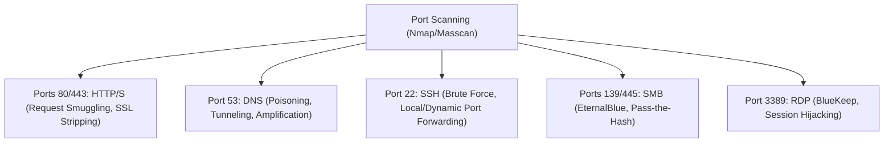
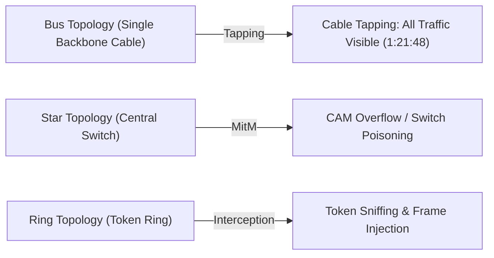
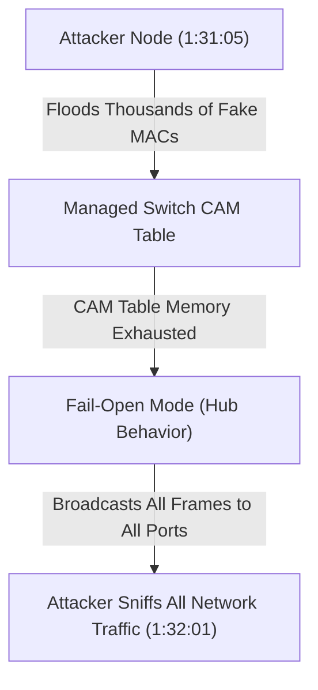

# Networking for Hackers Full Course — Zero to Expert in One Video 2026 (Part 3)

## Executive Summary & Metadata
- **Source**: [Networking for Hackers Full Course — Zero to Expert in One Video 2026 (YouTube)](https://www.youtube.com/watch?v=IGVcbu1I7Hg)
- **Creator**: [[Cyber Mind Space]] (Almadad Ali)
- **Scope**: Part 3 of 3 (Timestamps `1:12:11` to `1:43:22`)
- **Key Focus**: Core Network Protocols & Port Matrix, Network Topologies, Routing/Switching Exploitation (BGP, OSPF, CAM Table Overflow), MitM Attacks, Wireless Security, Pivoting, Real-World Case Studies (WannaCry, Mirai), and Hardening Checklists.
- **Continuity**: Final part following [[detailed-study-notes-networking-for-hackers-full-course-part-01.md|Part 1]] and [[detailed-study-notes-networking-for-hackers-full-course-part-02.md|Part 2]].

---

## 1. Module 6: Core Network Protocols & Hacker Port Matrix (`1:14:35` – `1:18:55`)

Modern networks rely on well-known network ports (range: `0` to `65535`). Each protocol has inherent design assumptions that hackers exploit.

### Comprehensive Hacker Port & Protocol Reference Table

| Port(s) | Protocol | Core Purpose | Primary Hacker Attack Vectors | Security Tools | Timestamp |
|---|---|---|---|---|---|
| **21** | **FTP** | File Transfer Protocol | Anonymous login abuse, unencrypted credential sniffing, FTP bounce attacks | Nmap, hydra | `11:15:57` |
| **22** | **SSH** | Secure Shell | Brute-force authentication, SSH pivoting/port forwarding, weak host key exploitation | Hydra, Proxychains | `11:15:38` |
| **23** | **Telnet** | Legacy CLI Access | Plain text credential sniffing, MitM interception | Wireshark, Ettercap | `11:18:08` |
| **25, 465, 587** | **SMTP** | Simple Mail Transfer | Open relay exploitation, email spoofing, spear-phishing credential harvesting | Swaks, Nmap | `11:16:27` |
| **53** | **DNS** | Domain Name System | DNS cache poisoning, ARP-based DNS spoofing, DNS tunneling, DNS amplification DDoS | Dnschef, Scapy, Dig | `11:15:07` |
| **80, 443** | **HTTP / HTTPS** | Web Traffic | Web app exploitation (SQLi, XSS), SSL/TLS stripping, HTTP request smuggling | Burp Suite, sslstrip | `11:14:35` |
| **110, 995 / 143, 993**| **POP3 / IMAP** | Mail Retrieval | Plain text login sniffing, credential stuffing | Hydra, Wireshark | `11:16:27` |
| **139, 445** | **SMB** | Server Message Block | EternalBlue (CVE-2017-0144), Pass-the-Hash (PtH), SMB relay attacks | Metasploit, Impacket | `11:16:59` |
| **161, 162** | **SNMP** | Network Management | Default community string enumeration (`public`/`private`), info leakage | Snmpwalk, Onesixtyone | `11:18:55` |
| **389, 636** | **LDAP / LDAPS** | Directory Services | Active Directory enumeration, LDAP injection, credential harvesting | BloodHound, Ldapsearch| `11:18:55` |
| **3389** | **RDP** | Remote Desktop | BlueKeep (CVE-2019-0708), RDP brute force, session hijacking | Crowbar, Nmap | `11:17:30` |

---

## 2. Module 7: Network Topologies & Advanced Routing/Switching Attacks (`1:18:55` – `1:33:13`)

### 2.1 Network Topologies & Hacker Vulnerabilities (`1:19:22` – `1:23:57`)

- **Bus Topology**: Devices connect to a single central backbone cable. *Vulnerability*: Single point of failure; physical/logical cable tapping allows eavesdropping on 100% of network traffic (`1:21:48`).
- **Star Topology**: Devices connect to a central switch or hub. *Vulnerability*: Central node compromise exposes all connected endpoints.
- **Ring Topology**: Devices form a closed loop. *Vulnerability*: Token sniffing and ring disruption.
- **Mesh Topology**: Redundant interconnections. *Vulnerability*: High operational complexity; rogue node insertion.

---

### 2.2 Advanced Routing & Switching Exploitation (`1:25:50` – `1:33:13`)

#### 1. BGP Route Hijacking (`1:25:50`)
- **Mechanism**: Attacker or misconfigured Autonomous System (AS) announces false, highly specific BGP prefixes to hijack global internet traffic.
- **Historical Case Study (Pakistan Telecom YouTube Hijack, 2008) (`1:26:26`)**: In 2008, Pakistan Telecom attempted to block YouTube domestically by announcing a false BGP route (`/24`) to a dead-end blackhole. Because the route was more specific than YouTube's global `/22` prefix, global ISPs routed YouTube traffic to Pakistan, taking YouTube offline worldwide for several hours.

#### 2. STP (Spanning Tree Protocol) Manipulation (`1:27:10`)
- **Mechanism**: Attacker injects rogue Bridge Protocol Data Unit (BPDU) frames with priority 0 to become the Root Bridge of a switch network, forcing all switch traffic to route through the attacker's switch port.

#### 3. OSPF (Open Shortest Path First) Attacks (`1:28:35`)
- **Mechanism**: Injecting false Link-State Advertisements (LSAs) into an OSPF routing domain to advertise a fake shortest path, causing routing loops, traffic diversion to attacker nodes, or blackhole DoS (`1:28:56`).

#### 4. CAM Table Overflow Attack (`1:31:05`)
- **Mechanism**: Attacker floods a Layer 2 switch with thousands of randomized fake MAC addresses.
- **Outcome**: The switch's CAM table fills to capacity. The switch fails open into legacy **Hub Mode**, broadcasting all incoming network frames to every port, enabling full network sniffing (`1:32:01`).

---

## 3. Module 8 & 9: Security Evasion, Wireless & MitM Attacks (`1:33:13` – `1:36:29`)

### 3.1 Firewall & Evasion Techniques (`1:33:13`)
- **Firewall Categories**: Stateless, Stateful, Next-Generation Firewall (NGFW), Web Application Firewall (WAF).
- **Evasion Tactics**: Packet fragmentation (`nmap -f`), decoy scanning (`nmap -D`), DNS/HTTPS/ICMP tunneling, proxy pivoting.

### 3.2 Wireless Security & Attack Vectors (`1:34:35`)
- **WEP Cracking**: Exploiting weak IV key schedules using `aircrack-ng`.
- **WPA/WPA2 Handshake Cracking**: Capturing the 4-way EAPOL handshake via deauthentication frames and cracking PMKID/WPA hashes via Hashcat/John.
- **Evil Twin Access Point**: Deploying a rogue access point with identical SSID to intercept client authentication and data.
- **Deauthentication Attacks**: Sending spoofed 802.11 deauth frames (`aireplay-ng -0`) to disconnect clients.

### 3.3 Man-in-the-Middle (MitM) Attacks (`1:35:18`)
- **ARP Cache Poisoning**: Sending unsolicited fake ARP replies to map the gateway IP to the attacker's MAC address (`arpspoof`, `bettercap`).
- **DNS Spoofing**: Injecting forged DNS responses to redirect victims to malicious IP addresses.
- **SSL/TLS Stripping**: Intercepting HTTP/HTTPS traffic and stripping TLS redirects to capture plain-text credentials (`sslstrip`).

---

## 4. Module 10 & 11: Advanced Hacker Techniques & Case Studies (`1:36:29` – `1:40:33`)

### 4.1 Pivoting & Lateral Movement (`1:36:29`)
- **SSH Local Port Forwarding**: Tunneling internal remote services to local ports (`ssh -L`).
- **SOCKS Proxies**: Routing custom attack tool traffic through compromised pivot hosts using `proxychains`.
- **Command Shell Toolkit**: Nmap, Masscan, Zmap, Wireshark, TShark, TCPDump, Ettercap, Bettercap, Aircrack-ng, Netcat, Socat.

### 4.2 Real-World Case Studies (`1:40:10`)
1. **WannaCry Ransomware (CVE-2017-0144 / MS17-010)**: Exploited unpatched Windows SMBv1 protocol to propagate autonomously across global networks without user interaction (`1:60:02`).
2. **Cloud Misconfigurations**: Publicly readable AWS S3 buckets and overly permissive Azure security groups exposing sensitive corporate data (`1:40:04`).
3. **Mirai Botnet (2016)**: Scanned the internet for exposed IoT devices (routers, IP cameras) using default credentials to assemble a massive botnet for record-breaking DDoS attacks (`1:40:10`).

---

## 5. Module 12 & 13: Defense & Detection Checklists (`1:40:33` – `1:43:22`)

### 5.1 Defense Architecture
- **Intrusion Detection Systems (IDS)**: Passive sensors analyzing traffic signatures and anomalies (`Snort`, `Suricata`, `Zeek`) (`1:40:33`).
- **Intrusion Prevention Systems (IPS)**: Inline security appliances actively blocking malicious payloads.

### 5.2 Network Hardening Checklist (`1:41:09` – `1:41:38`)

- [ ] **System Patching**: Apply vendor security updates (especially SMB MS17-010, RDP BlueKeep).
- [ ] **Disable Insecure Protocols**: Decommission Telnet, FTP, HTTP, and SNMPv1/v2c in favor of SSH, SFTP, HTTPS, and SNMPv3.
- [ ] **Network Segmentation & Isolation**: Implement VLANs and strict inter-VLAN ACLs to restrict lateral movement.
- [ ] **Port Security & CAM Protection**: Enable MAC limits and Sticky MAC security on managed switches.
- [ ] **BGP & Routing Security**: Implement RPKI route validation and prefix filtering.
- [ ] **Wireless Security**: Transition from WPA2 to WPA3 and disable WPS on all access points.
- [ ] **Logging & SIEM**: Enable centralized firewall/IDS logging and continuous monitoring.

---

## Source Provenance & Archival Link
- Original Raw Transcript File: `[[01_RAW/SOURCE/Networking for Hackers Full Course — Zero to Expert in One Video 2026.md]]`
- Prerequisites: [[detailed-study-notes-networking-for-hackers-full-course-part-01.md|Part 1 Note]], [[detailed-study-notes-networking-for-hackers-full-course-part-02.md|Part 2 Note]]
