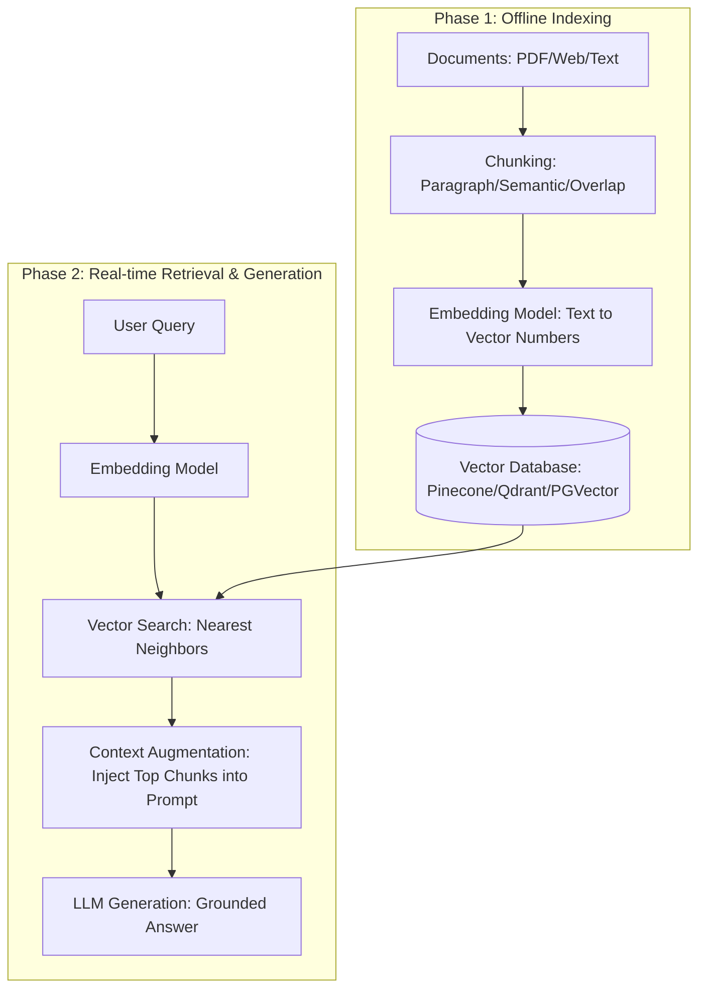

# What is RAG? Retrieval Augmented Generation Explained

## Executive Summary
Retrieval Augmented Generation (RAG) is a design pattern that bridges the gap between Large Language Models (LLMs) and private or dynamic knowledge bases. LLMs are pattern prediction engines, not static knowledge repositories; they suffer from knowledge cutoffs and hallucinations. RAG decouples reasoning from memory by fetching relevant document chunks from a vector database and injecting them into the LLM prompt context at query time.

---

## Core LLM Limitations

1. **Static Knowledge Cutoff**: Models freeze after training ends and cannot access real-time or updated information.
2. **Hallucination**: LLMs predict statistically plausible next tokens rather than querying a structured database, causing false information to sound fluent and convincing.
3. **Context Window Costs & Lost in the Middle**: Dumping entire document sets into prompts causes context window exhaustion, high API latency/costs, and degradation in attention toward middle context tokens.

---

## Two-Phase 9-Step RAG Pipeline

### Phase 1: Indexing (Offline / Ingestion)
1. **Gather Documents**: Collect raw data sources (PDFs, Notion pages, web articles).
2. **Chunking**: Split documents into granular text pieces.
3. **Embedding Conversion**: Generate high-dimensional vector representations capturing semantic meaning.
4. **Vector DB Storage**: Store embeddings and chunk text in a vector store (e.g., Pinecone, Qdrant, Weaviate, PGVector, Chroma).

### Phase 2: Retrieval & Generation (Query Time)
5. **User Query Submission**: Receive question from user.
6. **Query Embedding**: Convert query into the same vector space using the embedding model.
7. **Semantic Search**: Find nearest neighbor chunks based on cosine/vector similarity.
8. **Prompt Augmentation**: Assemble prompt combining system instructions, retrieved passages, and user question.
9. **Grounded Generation**: LLM reads passages and synthesizes an accurate answer without guessing.

---

## Chunking Strategies

- **Fixed-size**: Fixed token size (e.g., 500 tokens). Fast but can break sentences.
- **Sentence-based**: Splits at sentence boundaries. Preserves intra-sentence meaning.
- **Paragraph-based**: Splits at paragraph breaks. Excellent default for structured prose.
- **Semantic Chunking**: Uses AI to detect shift in meaning. Most accurate, highest compute cost.
- **Sliding Window with Overlap**: Overlaps neighboring chunks (e.g., 50 token overlap). Prevents cutting off critical boundary context.

---

## 5 RAG Failure Modes & Solutions

| Failure Mode | Root Cause | Engineering Solution |
|---|---|---|
| **Bad Retrieval** | Chunks too small, weak embedding model, query vocabulary mismatch | Better chunking, domain-specific embedding models, Reranking |
| **Missing Information** | Answer does not exist in knowledge base | Strict prompt design telling LLM to state "I don't know" |
| **Context Overload** | Too many/large chunks cluttering prompt | Filter with Re-rankers, reduce top-K count |
| **Stale Index** | Vector DB out of sync with updated source docs | Event-driven automated re-indexing pipeline |
| **Keyword/Exact Match Failures** | Technical codes/model numbers missed by fuzzy semantic search | Hybrid Search (BM25 Keyword + Vector Search) |

---

## Advanced RAG Techniques

1. **Reranking**: Second-stage scoring model (e.g., Cohere Rerank) that re-sorts initial top-K retrieved chunks specifically for answer relevance.
2. **Query Expansion & Multi-Query**: Generates multiple rephrased queries to retrieve a broader set of candidate passages.
3. **Contextual Retrieval**: Appends parent document context summary to each chunk before embedding (Anthropic showed up to 67% failure reduction).
4. **HyDE (Hypothetical Document Embedding)**: Generates a hypothetical LLM answer first, then uses that answer's vector to retrieve matching document chunks.
5. **Agentic RAG**: Gives the LLM tool-calling autonomy to choose when to search, re-query, or ask clarifying questions.
6. **GraphRAG**: Builds a knowledge graph of entities and relationships to connect multi-document facts.

---

## RAG vs Long Context Windows

| Feature | Long Context Windows (1M+ Tokens) | RAG Pipeline |
|---|---|---|
| **API Cost** | High (charges per token per request) | Low (sends only top relevant chunks) |
| **Latency** | Slow (large prompt processing time) | Fast (milliseconds retrieval + small prompt) |
| **Dynamic Data** | Requires re-sending full corpus | Re-indexes updated chunks incrementally |
| **Focus / Attention** | Risk of "Lost in the Middle" | Pinpointed context focus |
