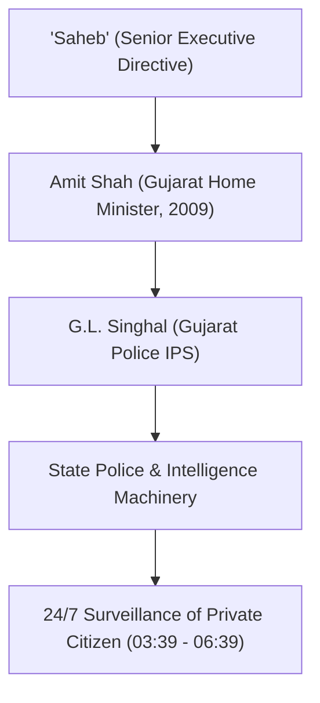
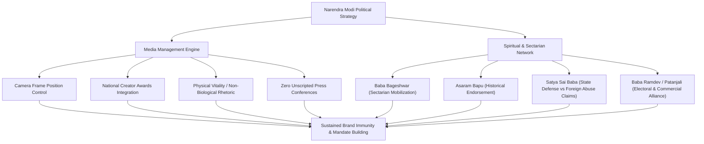

# Detailed Study Notes: 75 TOP FAILS of Modiji (Part 1 - Complete Final Note)

## Overview

- **Source Title**: 75 TOP FAILS of Modiji (part 1)
- **Creator**: Official PeeingHuman (Ramit Verma)
- **Source Link**: [YouTube Watch Link](https://www.youtube.com/watch?v=Lr8sh3_sKA0)
- **Duration / Scope**: `00:00` - `51:00` (Moments #1 through #35)
- **Primary Domain**: Indian Political History & Media Criticism
- **Source Note Link**: [[01_RAW/SOURCE/75 TOP FAILS of Modiji (part 1).md]]

---

## Executive Summary

This detailed study note provides a complete, high-fidelity synthesis of Part 1 of the investigative satire video series titled *"75 TOP FAILS of Modiji (part 1)"* produced by Ramit Verma (Official PeeingHuman). The video chronologically compiles 35 key public moments, speeches, policy initiatives, state actions, and controversies across Narendra Modi's political career. The analysis spans Constitutional framing, verbal speech slips, illegal state surveillance (Snoopgate), 2002 Gujarat riots Tehelka sting evidence, demonetisation RBI metrics, foreign black money claims, non-biological divine birth rhetoric, media management strategies, corporate ties (Adani and Ambani), political branding, pseudo-scientific statements, spiritual patronage (Baba Bageshwar, Asaram Bapu, Satya Sai Baba, Baba Ramdev), and empirical evaluation of key economic and social policy claims (rupee depreciation, youth unemployment rates, ODF statistics, farmer income targets, urban demolition drives, mendicant timelines, and election affidavit disclosures).

---

## Section Breakdown (00:00 - 51:00)

### 1. Disclaimer & Constitutional Framework (00:00 - 00:37)
- **Timestamp**: `00:00 - 00:37`
- Invokes fundamental freedom of speech rights under Article 19 of the Constitution of India.
- Cites **Article 51A(h)** regarding every citizen's fundamental duty to develop a scientific temper, humanism, and the spirit of inquiry and reform.

### 2. Introduction & The "Goldmine" Concept (00:38 - 02:20)
- **Timestamp**: `00:38 - 02:20`
- Positions the video as critical opposition following PM Modi's statements regarding the absence of strong political opposition and his assertion that genuine criticism is a "goldmine" for self-improvement.

### 3. Moment #1: Weed Energy Slip (02:21 - 03:02)
- **Timestamp**: `02:21 - 03:02`
- 2015 speech in Canada where PM Modi mispronounced "wind energy" as "weed energy" while listing clean energy sources.

### 4. Moment #2: Beti Patao & Investigating in Girls Slips (03:03 - 03:38)
- **Timestamp**: `03:03 - 03:38`
- Highlights verbal slips: mispronouncing *"Beti Bachao, Beti Padhao"* as *"Beti Bachao, Beti Patao"* and *"Investing in a girl child"* as *"Investigating in a girl child"*.

### 5. Moment #3: Snoopgate Scandal (03:39 - 06:39)
- **Timestamp**: `03:39 - 06:39`
- 2013 Cobrapost/Gulail leak of 2009 audio tapes where Gujarat Home Minister Amit Shah directed IPS officer G.L. Singhal to deploy state police for 24/7 surveillance of a private female architect on behalf of *"Saheb"*.

### 6. Moment #4: Gujarat 2002 Violence & Sting Operations (06:40 - 09:19)
- **Timestamp**: `06:40 - 09:19`
- Supreme Court 2022 SIT clean chit contrasted with 2007 Tehelka undercover sting footage showing Bajrang Dal/VHP members detailing state protection, judicial transfers, and temporary impunity.

### 7. Moment #5: Demonetisation Metrics & Narrative Shift (09:20 - 11:57)
- **Timestamp**: `09:20 - 11:57`
- 8 November 2016 invalidation of 86% of currency in circulation. RBI reports confirmed 99.3% of banned notes returned to banks (capturing only 0.7% unreturned cash), triggering a narrative shift to digital payment promotion within 20 days.

### 8. Moment #6: Foreign Black Money & ₹15-20 Lakh Promise (11:58 - 13:59)
- **Timestamp**: `11:58 - 13:59`
- 2014 campaign promises to repatriate foreign black money within 100 days yielding ₹15–20 lakh per poor family, contrasted with parliamentary admissions of zero official estimates.

### 9. Moment #7: Non-Biological Energy Claim (14:00 - 16:16)
- **Timestamp**: `14:00 - 16:16`
- Mukesh Ambani's wish for Modi to serve as PM until 2047 (age 97) and PM Modi's May 2024 interview statement declaring his birth was non-biological and divinely ordained.

### 10. Moments #8 & #9: 2024 Election Interviews & Anchor Scolding (16:17 - 18:50)
- **Timestamp**: `16:17 - 18:50`
- Deferential anchor questions prior to 2024 elections and PM Modi reprimanding anchors for claiming to ask hard questions while being intimidated by an anti-government "ecosystem".

### 11. Moment #10: Media Control Strategy Since 2002 (18:51 - 20:26)
- **Timestamp**: `18:51 - 20:26`
- 2002 interview snippet citing media handling as his main weakness, leading to post-2014 media alignment and bans on critical foreign coverage (BBC documentary).

### 12. Moment #11: Scripted Poetry Incident (20:27 - 21:27)
- **Timestamp**: `20:27 - 21:27`
- TV interview prompt leak showing computer-printed text with question numbers and prepared answers on pages presented as handwritten notes.

### 13. Moment #12: NaMo TV Channel (21:28 - 22:44)
- **Timestamp**: `21:28 - 22:44`
- Pre-2019 DTH channel launch promoted on PM Modi's official Twitter/X account despite interview denials, vanishing immediately post-elections.

### 14. Moment #13: Zero Unscripted Press Conferences (22:45 - 24:19)
- **Timestamp**: `22:45 - 24:19`
- PM Modi holding zero unscripted open press conferences in 11 years, including a 2019 appearance where he declined all direct journalist questions.

### 15. Moment #14: Relationship with Gautam Adani (24:20 - 25:41)
- **Timestamp**: `24:20 - 25:41`
- Adani's net worth expansion from $8B (2014) to $140B (2022), 2008 book launch footage, and opposition claims regarding land allocations, airport concessions, and overseas contracts.

### 16. Moment #15: Relationship with the Ambani Family (25:42 - 26:29)
- **Timestamp**: `25:42 - 26:29`
- Attendance at Ambani weddings/inaugurations and parliamentary speeches equating corporate criticism with historical accusations against Nehru ("Tata-Birla government").

### 17. Moment #16: Copying Nehru & "Pradhan Sevak" Title (26:30 - 27:24)
- **Timestamp**: `26:30 - 27:24`
- Transition from "Nehru Jacket" to "Modi Jacket" and adoption of "Pradhan Sevak" (Prime Servant) mirroring Nehru's "First Servant of India" statement.

### 18. Moment #17: Interaction with Children (27:25 - 27:52)
- **Timestamp**: `27:25 - 27:52`
- Video montage showing repetitive ear-tugging and cheek-pinching gestures during photo opportunities.

### 19. Moment #18: Pseudo-Scientific Statements (27:53 - 29:14)
- **Timestamp**: `27:53 - 29:14`
- 2014 speech citing Karna for ancient genetics and Ganesha for plastic surgery, alongside Union HRD Minister Satyapal Singh questioning Darwin's theory of evolution.

### 20. Moment #19: Degree Controversy & Speed Reading (29:15 - 30:35)
- **Timestamp**: `29:15 - 30:35`
- High Court ruling blocking disclosure of "MA in Entire Political Science" degree records and TV interview demonstrating instantaneous page flipping.

### 21. Moment #20: Prime Influencer — Camera Framing (30:36 - 31:39)
- **Timestamp**: `30:36 - 31:39`
- SPG commandos reprimanded on camera for blocking lens line of sight during bouquet presentation, and delaying greetings to align in camera center frame.

### 22. Moment #21: National Creator Awards (31:40 - 32:54)
- **Timestamp**: `31:40 - 32:54`
- Inaugural awards in early 2024 integrating digital content creators into state narrative campaigns.

### 23. Moment #22: Non-Biological Energy Rhetoric (32:55 - 33:29)
- **Timestamp**: `32:55 - 33:29`
- Mainstream anchors repeatedly asking PM Modi about his physical stamina ("Why don't you get tired?", "What tonic do you take?") to redirect discourse from policy metrics.

### 24. Moment #23: "Kare Toh Kare Kya" Meme Origin (33:30 - 34:23)
- **Timestamp**: `33:30 - 34:23`
- Viral satire audio clip origin traced to a BJP spokesperson father whose son asked PM Modi a staged energy question in London.

### 25. Moment #24: SRCC Address & Glass Analogy (34:24 - 36:19)
- **Timestamp**: `34:24 - 36:19`
- 2013 SRCC address featuring the 50% water + 50% air glass analogy and the "mouse charmers" technology story.

### 26. Moment #25: Patronage of Baba Bageshwar (36:20 - 37:16)
- **Timestamp**: `36:20 - 37:16`
- PM Modi calling Dhirendra Krishna Shastri his "younger brother" amidst Shastri's paper slip fortune telling, exorcism claims, and armed Hindu Rashtra calls.

### 27. Moment #26: Patronage of Asaram Bapu (37:17 - 38:37)
- **Timestamp**: `37:17 - 38:37`
- Historical political backing and seeking blessings from Asaram Bapu prior to his convictions for rape and sexual assault of a minor.

### 28. Moment #27: State Defense of Satya Sai Baba (38:38 - 40:02)
- **Timestamp**: `38:38 - 40:02`
- Official government letterhead defense dismissing international abuse claims as foreign propaganda, alongside sleight-of-hand miracle breakdowns.

### 29. Moment #28: Baba Ramdev & Patanjali Enterprise (40:03 - 42:11)
- **Timestamp**: `40:03 - 42:11`
- Patanjali's growth from ₹2,000 Cr to ₹60,000+ Cr valuation, bestowal of "Rashtriya Rishi" title, Coronil COVID cure claims, and Supreme Court reprimands for misleading ads.

### 30. Moment #29: Rupee Depreciation Hypocrisy (42:12 - 42:47)
- **Timestamp**: `42:12 - 42:47`
- Pre-2014 speeches calling the falling Rupee "in the ICU" contrasted with absence of accountability as INR hit all-time record lows post-2014.

### 31. Moment #30: Youth Unemployment & Pakoda Discourse (42:48 - 44:29)
- **Timestamp**: `42:48 - 44:29`
- 2 Crore annual job promises vs. CSDS data showing 83% of unemployed are youth, and framing pakoda selling as formal employment.

### 32. Moment #31: Open Defecation Free (ODF) Lie (44:30 - 45:19)
- **Timestamp**: `44:30 - 45:19`
- October 2019 declaration of 100% rural ODF status contradicted by WHO/UNICEF data showing 17% rural open defecation and 25% lacking basic sanitation.

### 33. Moment #32: Doubling Farmers' Income Failure (45:20 - 45:49)
- **Timestamp**: `45:20 - 45:49`
- 2016 commitment to double farm income by 2022 unmet, while NCRB records ~30 farmer suicides daily.

### 34. Moment #33: Housing Target vs Demolition Drives (45:50 - 47:26)
- **Timestamp**: `45:50 - 47:26`
- 2022 housing guarantee for all contrasted with municipal bulldozer demolition drives destroying 2,000+ homes overnight, and K-shaped inequality response ("Should everyone be poor?").

### 35. Moment #34: Inconsistent Ascetic (Bhiksha) Timelines (47:27 - 48:29)
- **Timestamp**: `47:27 - 48:29`
- Contradictory statements claiming 35 years vs 40 years begging for alms, when total timeline between age 17 (1967) and 2001 CM office is 34 years.

### 36. Moment #35: Undisclosed Marriage & Field Reality (48:30 - 50:59)
- **Timestamp**: `48:30 - 50:59`
- Disclosure of 1968 marriage in 2014 Lok Sabha affidavit after leaving spouse column blank in four previous Gujarat assembly elections, and field footage showing unpaved roads in Vadnagar.

---

## Analytical Tools & Synthesis Tables

### Comprehensive Policy Matrix: Public Claims vs. Verified Metrics

| Policy / Moment | Rhetorical Claim / Promise (MM:SS) | Empirical Reality / Documented Result | Metric Source |
| :--- | :--- | :--- | :--- |
| **Demonetisation (#5)** | Extinguish 78% black money `(09:20)` | **99.3%** banned cash returned to banking system | Reserve Bank of India `(10:29)` |
| **Foreign Black Money (#6)**| Return black money in 100 days; ₹15-20L `(11:58)` | No official government estimate exists | Parliamentary Records `(13:21)` |
| **Rupee Value (#29)** | Rupee in ICU under UPA `(42:12)` | INR reached historical all-time lows post-2014 | Foreign Exchange Markets `(42:30)` |
| **Youth Jobs (#30)** | 2 Crore jobs/year; Pakoda selling `(42:48)` | **83%** of unemployed are youth; 60%+ cite as top issue | CSDS National Survey `(43:12)` |
| **Sanitation (#31)** | 100% Rural Open Defecation Free (2019) `(44:30)`| **17%** rural open defecation; **25%** lack sanitation | WHO / UNICEF Data `(44:49)` |
| **Farmer Income (#32)** | Double real farmers' income by 2022 `(45:20)` | Income target unmet; ~**30 farmer suicides daily** | NCRB / Agri Reports `(45:36)` |
| **Housing (#33)** | Permanent home for every family by 2022 `(45:50)` | Demolition drives destroying 2,000+ homes overnight | Field Records `(46:02)` |
| **Ascetic Timeline (#34)** | Begged for alms for 35 yrs / 40 yrs `(47:27)` | Total duration between 1967 (age 17) and 2001 is 34 yrs | Chronological Verification `(47:48)` |
| **Marital Status (#35)** | Blank spouse column (2001-2012) `(48:30)` | Disclosed 1968 marriage in 2014 Lok Sabha affidavit | Election Affidavit `(48:45)` |

---

### Media & Spiritual Governance Architecture

---

## Controlled Metadata Verification

- **Schema Version**: `4`
- **Note Type**: `literature-note`
- **Status**: `learning`
- **Controlled Discovery Tags**: `case-study`, `history`, `reference`
- **Source File**: `01_RAW/SOURCE/75 TOP FAILS of Modiji (part 1).md`
