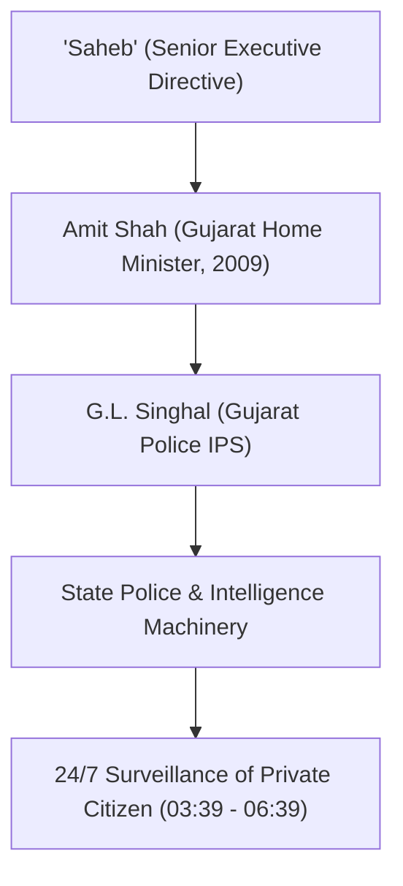

# Detailed Study Notes: 75 TOP FAILS of Modiji (Part 1 - Segment 01)

## Overview

- **Source Title**: 75 TOP FAILS of Modiji (part 1)
- **Creator**: Official PeeingHuman (Ramit Verma)
- **Source Link**: [YouTube Watch Link](https://www.youtube.com/watch?v=Lr8sh3_sKA0)
- **Segment Range**: `00:00` - `30:35` (Moments #1 to #19)
- **Primary Domain**: Indian Political History & Media Criticism
- **Source Note Link**: [[01_RAW/SOURCE/75 TOP FAILS of Modiji (part 1).md]]

---

## Executive Summary

This study note details Segment 01 of the investigative satire video titled *"75 TOP FAILS of Modiji (part 1)"* produced by Official PeeingHuman (Ramit Verma). The video compiles key moments, public speeches, policy outcomes, media interactions, and controversies spanning the political career of Prime Minister Narendra Modi. Segment 01 covers timestamps `00:00` through `30:35`, encompassing moments #1 through #19. Topics analyzed include public slips of speech, surveillance scandals, handling of the 2002 Gujarat riots, economic policy claims (demonetisation and foreign black money), media management, corporate relationships, pseudo-scientific claims, and educational degree disputes.

---

## Section Breakdown (00:00 - 30:35)

### 1. Disclaimer & Constitutional Framework (00:00 - 00:37)

- **Timestamp**: `00:00 - 00:37`
- **Context & Purpose**: 
  - The creator invokes fundamental rights under the Constitution of India (Article 19 - Freedom of Speech and Expression).
  - Outlines the video's rationale as a detailed investigative review published on the occasion of PM Modi's 75th birthday.
  - Cites **Article 51A(h)** of the Indian Constitution, which mandates every citizen to develop a scientific temper, humanism, and the spirit of inquiry and reform.

> *"According to the Constitution of India, every citizen has the fundamental right to speak. If anyone has an issue with what we say, they may use earphones or switch off their television."* (00:00) — *Ramit Verma*

---

### 2. Introduction & The "Goldmine" Concept (00:38 - 02:20)

- **Timestamp**: `00:38 - 02:20`
- **Context**: 
  - Addresses PM Modi's public statement regarding the absence of a strong political opposition in India.
  - The creator positions the video as constructive political criticism aimed at identifying administrative and rhetorical shortcomings.
  - References PM Modi's past statements in media interviews claiming that criticism serves as a valuable "goldmine" for personal and political development.

---

### 3. Moment #1: Weed Energy Slip (02:21 - 03:02)

- **Timestamp**: `02:21 - 03:02`
- **Topic**: Verbal Slip on Renewable Energy
- **Details**:
  - During a 2015 speech delivered in Canada, PM Modi mispronounced "wind energy" as "weed energy" while listing clean energy initiatives (nuclear energy, solar energy, wind energy).
  - **Significance**: The 16-second clip became the creator's first viral political satire video, serving as the starting point for his channel's content.

---

### 4. Moment #2: Beti Patao & Investigating in Girls Slips (03:03 - 03:38)

- **Timestamp**: `03:03 - 03:38`
- **Topic**: Public Speech Pronunciation Errors
- **Details**:
  - Highlights two distinct verbal slips during public addresses:
    1. Mispronouncing the flagship scheme *"Beti Bachao, Beti Padhao"* (Save the girl child, educate the girl child) as *"Beti Bachao, Beti Patao"* (Save the girl child, woo/entice the girl child).
    2. Mispronouncing *"Investing in a girl child"* as *"Investigating in a girl child"* during an international address.

---

### 5. Moment #3: Snoopgate Scandal (03:39 - 06:39)

- **Timestamp**: `03:39 - 06:39`
- **Topic**: 2013 Illegal Surveillance Allegations
- **Key Entities**: Narendra Modi (then CM Gujarat), Amit Shah (then Home Minister Gujarat), G.L. Singhal (IPS Officer), Pradeep Sharma (IAS Officer).
- **Details**:
  - Investigative reports by *Cobrapost* and *Gulail* in 2013 released audio tape recordings from 2009.
  - Tapes revealed Gujarat state police and intelligence apparatus being deployed to monitor every movement, phone conversation, and personal meeting of a private female architect.
  - Audio recordings featured Amit Shah directing police official G.L. Singhal on behalf of a superior referenced as *"Saheb"*.
  - **Official Stance & Counter-Claims**:
    - Former IAS Officer Pradeep Sharma testified to an administrative environment governed by surveillance and fear in Gujarat.
    - The female architect's father subsequently released a statement claiming he had orally requested CM Modi to ensure security coverage for his daughter.

---

### 6. Moment #4: Gujarat 2002 Violence & Sting Operations (06:40 - 09:19)

- **Timestamp**: `06:40 - 09:19`
- **Topic**: Judicial Clean Chit vs. Tehelka Sting Tapes
- **Legal Status**: In 2022, the Supreme Court of India upheld the Special Investigation Team (SIT) report granting a clean chit to Narendra Modi due to lack of prosecution-level legal evidence.
- **Sting Evidence (Tehelka 2007)**:
  - Video features undercover clips of Sangh Parivar members (including Babu Bajrangi) describing state support, political protection, judicial transfers, and three days of unchecked activity during the 2002 riots.
- **Rhetorical Contrast**:
  - Highlights PM Modi's statement that he should be hanged in a public square if proven guilty of a crime, contrasted with his refusal to issue public apologies or acknowledge state failure.

---

### 7. Moment #5: Demonetisation Metrics & Narrative Shift (09:20 - 11:57)

- **Timestamp**: `09:20 - 11:57`
- **Topic**: 8 November 2016 Currency Invalidation
- **Policy Details & Statistical Breakdown**:
  - On 8 November 2016, 86% of total currency in circulation (₹500 and ₹1000 notes) was invalidated overnight.
  - **Stated Objectives vs Reserve Bank of India (RBI) Data**:

| Metric / Parameter | Stated Goal / Claim | Actual RBI Finding / Result | Timestamp Citation |
|---|---|---|---|
| Black Money Invalidation | Extinguish high-value illicit cash | 99.3% of banned notes returned to banks | `10:29` |
| Unreturned Banned Currency | Eliminate unaccounted wealth | Only 0.7% failed to return to system | `10:29` |
| Primary Speech Focus (Day 1) | 78% Black Money / 22% Counterfeit | 86% cash supply shocked | `11:00` |
| Primary Speech Focus (Day 20) | Digital / Cashless Payments | 73% focus shifted to digital payments | `11:19` |

- **Narrative Shift**: Within 20 days of the announcement, official communications transitioned from black money eradication to promoting digital payment apps (e.g., Paytm).

---

### 8. Moment #6: Black Money from Foreign Banks (11:58 - 13:59)

- **Timestamp**: `11:58 - 13:59`
- **Topic**: 2014 Campaign Promises on Swiss Bank Accounts
- **Details**:
  - During the 2014 Lok Sabha campaign, BJP speeches promised the return of black money stored in foreign/Swiss banks within 100 days of forming government.
  - Campaign speeches claimed that repatriating foreign black money could mathematically yield ₹15–20 lakh for every poor family in India.
  - **Post-Election Position**: Government statements in Parliament subsequently confirmed that no official government estimate existed regarding the quantum of illicit black money deposited in foreign bank accounts.

---

### 9. Moment #7: Non-Biological Energy Claim (14:00 - 16:16)

- **Timestamp**: `14:00 - 16:16`
- **Topic**: Divine Incarnation Claims & 2047 Target
- **Details**:
  - Industrialist Mukesh Ambani publicly stated his wish for PM Modi to remain Prime Minister until India's independence centenary in 2047 (when Modi would be 97 years old).
  - In a May 2024 television interview, PM Modi stated:

> *"Until my mother was alive, I believed I was born biologically. After her passing, reflecting on my experiences, I am convinced that God has sent me. This energy does not come from a biological body."* (14:52) — *Narendra Modi*

- Highlights clips of public supporters and commentators referring to PM Modi as a "living god" or divine incarnation (Avatar).

---

### 10. Moments #8 & #9: 2024 Election Interviews & Scolding Anchors (16:17 - 18:50)

- **Timestamp**: `16:17 - 18:50`
- **Topic**: Television Interview Dynamics
- **Analysis**:
  - **Moment #8**: Compiles interview clips prior to the 2024 General Elections showing mainstream news anchors asking non-adversarial questions (e.g., rhyming slogans, inquiring about 2029 election plans).
  - **Moment #9**: Features a clip where PM Modi reprimands news anchors for claiming they asked tough questions, arguing that media houses are intimidated by an anti-government "ecosystem" and lack courage.

---

### 11. Moment #10: Media Control Since 2002 (18:51 - 20:26)

- **Timestamp**: `18:51 - 20:26`
- **Topic**: Evolution of Media Management Strategy
- **Details**:
  - Features a 2002 interview snippet where Modi stated that his primary weakness during the Gujarat riots was *"how to handle the media"*.
  - Contrasts 2002 ground reporting on police inaction with post-2014 media alignment, including host calls to ban foreign media outlets following critical documentaries (e.g., BBC's *India: The Modi Question*).

---

### 12. Moment #11: Scripted Poetry Incident (20:27 - 21:27)

- **Timestamp**: `20:27 - 21:27`
- **Topic**: Television Teleprompter / Script Leak
- **Details**:
  - During a broadcast where PM Modi requested his handwritten notebook to read a poem he allegedly wrote, camera close-ups revealed computer-printed text containing question numbers, prompt cues, and prepared answers.

---

### 13. Moment #12: NaMo TV Channel (21:28 - 22:44)

- **Timestamp**: `21:28 - 22:44`
- **Topic**: Pre-Election Direct-to-Home Broadcast Channel
- **Details**:
  - Prior to the 2019 Lok Sabha elections, a proprietary channel named *NaMo TV* was launched across DTH platforms, listed simultaneously under news and entertainment categories.
  - While PM Modi claimed in interviews to have little knowledge of the channel, official Twitter/X posts from his account had directly promoted its launch via the NaMo App. The channel was removed immediately after voting concluded.

---

### 14. Moment #13: Zero Unscripted Press Conferences (22:45 - 24:19)

- **Timestamp**: `22:45 - 24:19`
- **Topic**: Absence of Open Media Conferences
- **Historical Record**:
  - Narendra Modi is the only Prime Minister in independent India's history to have held zero unscripted, open press conferences over an 11-year period.
  - During a singular joint press appearance in May 2019, PM Modi sat alongside Amit Shah but deferred all direct journalist questions to the party president.

---

### 15. Moment #14: Relationship with Gautam Adani (24:20 - 25:41)

- **Timestamp**: `24:20 - 25:41`
- **Topic**: Corporate Growth & State Allocation Allegations
- **Key Entities**: Gautam Adani, Adani Group.
- **Details**:
  - Examines Gautam Adani's net worth escalation from $8 billion (2014) to $140 billion (2022).
  - Displays archival footage from 2008 showing Adani attending Modi's book launch in Gujarat.
  - Outlines political opposition claims regarding cheap land allocation in Gujarat, infrastructure/airport concession rule changes, and international port/power contracts awarded following bilateral visits.

---

### 16. Moment #15: Relationship with the Ambani Family (25:42 - 26:29)

- **Timestamp**: `25:42 - 26:29`
- **Topic**: Industrialist Ties & Parliamentary Rebuttals
- **Details**:
  - Documents PM Modi's attendance at Ambani family weddings and commercial inaugurations (e.g., Sir H.N. Reliance Foundation Hospital).
  - Rebuttal: Highlights PM Modi's parliamentary speech arguing that opposition accusations regarding corporate closeness mirror historical criticisms directed at Jawaharlal Nehru ("Tata-Birla government").

---

### 17. Moment #16: Copying Nehru & "Pradhan Sevak" Title (26:30 - 27:24)

- **Timestamp**: `26:30 - 27:24`
- **Topic**: Historical Parallels & Title Branding
- **Details**:
  - Compares political branding strategies: transition from "Nehru Jacket" to "Modi Jacket".
  - Identifies the origin of the title *"Pradhan Sevak"* (Prime Servant), noting that Jawaharlal Nehru had explicitly written that he preferred to be regarded as the "First Servant of India" rather than Prime Minister.

---

### 18. Moment #17: Interaction with Children (27:25 - 27:52)

- **Timestamp**: `27:25 - 27:52`
- **Topic**: Public Interaction Style
- **Details**:
  - Compiles video clips of public interactions with children, noting repetitive ear-tugging and cheek-pinching gestures during media photo opportunities.

---

### 19. Moment #18: Pseudo-Scientific Statements (27:53 - 29:14)

- **Timestamp**: `27:53 - 29:14`
- **Topic**: Claims Linking Ancient Mythology to Modern Science
- **Details**:
  - Highlights two prominent public statements:
    1. **October 2014 (Reliance Hospital Inauguration)**: PM Modi cited Karna's birth in the Mahabharata as proof of ancient genetic science, and Lord Ganesha's elephant head as proof of ancient plastic surgery.
    2. **Union HRD Minister Statements**: Former Union Minister Satyapal Singh publicly challenged Darwin's Theory of Evolution, claiming it was scientifically invalid because no historical text recorded anyone witnessing an ape transform into a human.

---

### 20. Moment #19: Educational Degree Controversy & Speed Reading (29:15 - 30:35)

- **Timestamp**: `29:15 - 30:35`
- **Topic**: Educational Records & Reading Technique
- **Details**:
  - Recounts the political dispute surrounding PM Modi's educational qualifications ("MA in Entire Political Science").
  - Notes the Delhi High Court ruling setting aside the Central Information Commission's direction to disclose Delhi University degree records.
  - Highlights a television clip where PM Modi demonstrates a rapid reading method by flipping entire book pages instantaneously.

---

## Controlled Tagging & Metadata Verification

- **Schema Version**: `4`
- **Note Type**: `literature-note`
- **Status**: `learning`
- **Controlled Discovery Tags**: `case-study`, `history`, `reference`
- **Source File**: `01_RAW/SOURCE/75 TOP FAILS of Modiji (part 1).md`
