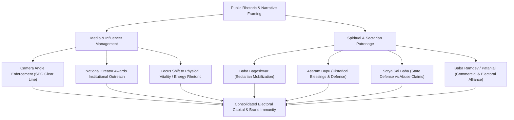

# Detailed Study Notes: 75 TOP FAILS of Modiji (Part 1 - Segment 02)

## Overview

- **Source Title**: 75 TOP FAILS of Modiji (part 1)
- **Creator**: Official PeeingHuman (Ramit Verma)
- **Source Link**: [YouTube Watch Link](https://www.youtube.com/watch?v=Lr8sh3_sKA0)
- **Segment Range**: `30:36` - `51:00` (Moments #20 to #35)
- **Primary Domain**: Indian Political History & Media Criticism
- **Source Note Link**: [[01_RAW/SOURCE/75 TOP FAILS of Modiji (part 1).md]]

---

## Executive Summary

This study note details Segment 02 of the investigative satire compilation *"75 TOP FAILS of Modiji (part 1)"* produced by Official PeeingHuman (Ramit Verma). Spanning timestamps `30:36` through `51:00`, this segment analyzes Moments #20 through #35, followed by the creator's concluding production note. Topics systematically analyzed include: camera awareness and media positioning, the political utility of the inaugural National Creator Awards, non-biological energy rhetoric in broadcast media interviews, the origin of viral political memes (*"Kare toh kare kya"*), narrative framing at the 2013 SRCC address, state patronage of controversial spiritual figures (Baba Bageshwar, Asaram Bapu, Satya Sai Baba, and Baba Ramdev/Patanjali Enterprise), and empirical evaluation of key economic and social policy claims (rupee depreciation, youth unemployment rates, Open Defecation Free statistics, farmer income targets, housing guarantees vs urban demolitions, contradictory mendicant/bhiksha timelines, and the 2014 disclosure of PM Modi's 1968 marriage).

---

## Section Breakdown (30:36 - 51:00)

### 1. Moment #20: Prime Influencer — Camera Awareness & Framing (30:36 - 31:39)

- **Timestamp**: `30:36 - 31:39`
- **Topic**: Public Image Management and Camera Positioning
- **Key Details**:
  - Highlights Prime Minister Modi's acute awareness of visual framing during media appearances and public events.
  - Features an incident where Special Protection Group (SPG) commandos inadvertently stepped between the television camera lens and PM Modi while late Union Minister Arun Jaitley was presenting a floral bouquet. PM Modi visibly reprimanded the security detail on camera, instructing them to clear the line of sight immediately.
  - Illustrates subsequent security adjustments where officers actively move out of camera frames.
  - Details a second clip demonstrating PM Modi holding back a public hand-gestured greeting (*"Namaste"*) before boarding an aircraft until he positioned himself directly in the center of the broadcast camera frame.

> *"What was the reason Narendra Modi had to publicly reprimand SPG commandos? ... Television cameras were blocked when Jaitley presented the bouquet. The Prime Minister grew upset and immediately instructed the SPG to move away from the cameras."* (30:55) — *News Anchor Narrative*

---

### 2. Moment #21: National Creator Awards & Media Strategy (31:40 - 32:54)

- **Timestamp**: `31:40 - 32:54`
- **Topic**: Institutional Outreach to Digital Content Creators
- **Key Details**:
  - Evaluates the government's inauguration of the **National Creator Awards** held in early 2024 prior to the General Elections.
  - Content creators in attendance released synchronized testimonial videos praising PM Modi's "intense energy," "otherworldly mind," and leadership.
  - The creator notes how state recognition was leveraged to align prominent social media influencers, effectively integrating digital content creators into national narrative campaigns.

> *"I bowed before our PM because he is the PM of our country... To attain that captain's position, a person needs otherworldly energy and an otherworldly mind."* (32:34) — *Awardee Content Creator*

---

### 3. Moment #22: Non-Biological Energy Rhetoric in Media (32:55 - 33:29)

- **Timestamp**: `32:55 - 33:29`
- **Topic**: Broadcast Media Interview Focus and Sycophancy
- **Key Details**:
  - Documents how mainstream television journalists repeatedly questioned PM Modi about his physical stamina and energy reserves rather than policy execution or governance metrics.
  - Compiles footage of prominent television anchors repeatedly asking: *"Why don't you get tired?"*, *"What is the secret behind your energy?"*, and *"Are you taking any tonic?"*
  - Demonstrates how public discourse was redirected from economic indicators toward personal vigor.

---

### 4. Moment #23: "Kare Toh Kare Kya" Meme Origin (33:30 - 34:23)

- **Timestamp**: `33:30 - 34:23`
- **Topic**: Channel Outro Origin and Media Satire
- **Key Details**:
  - Traces the origin of the channel's signature satire sample: *"Hum kare toh kare kya? Bole toh bole kya?"* ("What are we to do? What are we to say?").
  - The phrase originated when a young man asked PM Modi in London where he derived his endless energy. Investigative archival search revealed that the youth's father was a ruling party (BJP) spokesperson.
  - During a broadcast clip, the spokesperson uttered the dramatic question, which became one of the most widely circulated political satire audio samples in Indian digital media.

> *"If we do anything, what are we to do? If we speak, what are we to say? Who is going to listen to our voice?"* (33:52) — *BJP Spokesperson*

---

### 5. Moment #24: SRCC Address & Narrative Framing (34:24 - 36:19)

- **Timestamp**: `34:24 - 36:19`
- **Topic**: 2013 Keynote Address at Shri Ram College of Commerce (SRCC)
- **Key Details**:
  - Analyzes CM Narendra Modi's February 2013 address at SRCC Delhi, widely viewed as a major stepping stone for his 2014 Prime Ministerial candidacy.
  - Details two core rhetorical devices used during the speech:
    1. **Glass Analogy**: Replaced the classic "half empty vs. half full" paradigm with a third interpretation—claiming the glass is 50% water and 50% air, making it 100% full, framing himself as an absolute optimist.
    2. **Snake Charmer vs. Mouse Charmer**: Recounted an anecdote from a trip to Taiwan where an interpreter asked if India was still a land of snake charmers and black magic. Modi responded that Indians are no longer "snake charmers" but "mouse charmers" who move the world via computer mice.

> *"My third view is that this glass is completely full—half with water and half with air... We are no longer snake charmers; we are mouse charmers who move the world with a computer mouse."* (35:15, 36:05) — *Narendra Modi*

---

### 6. Moment #25: Patronage of Baba Bageshwar (36:20 - 37:16)

- **Timestamp**: `36:20 - 37:16`
- **Topic**: Political Alignment with Controversial Religious Figures
- **Key Details**:
  - Highlights PM Modi publicly addressing Dhirendra Krishna Shastri (Baba Bageshwar) as his "younger brother".
  - Shastri claims to write individuals' past, present, and future on paper slips (*parchi*) through divine intervention and purports to cure demonic possession.
  - Documents Shastri's public speeches calling for a "Hindu Rashtra" and advocating armed violence for religious establishment ("Pick up weapons for religion; violence for establishing religion is not violence").

> *"My younger brother has been raising awareness among people regarding the message of unity in the country..."* (36:31) — *Narendra Modi*  
> *"All Hindus must pick up weapons in their hands. If violence is required for religion, that is not violence."* (37:06) — *Dhirendra Krishna Shastri (Baba Bageshwar)*

---

### 7. Moment #26: Patronage of Asaram Bapu (37:17 - 38:37)

- **Timestamp**: `37:17 - 38:37`
- **Topic**: Historical Political Endorsements of Convicted Figures
- **Key Details**:
  - Examines past political backing received by Asaram Bapu (currently serving a life sentence following convictions for sexual assault of a minor and rape).
  - Archival footage shows CM Narendra Modi and senior cabinet ministers attending Asaram's religious gatherings and seeking his blessings.
  - When criminal allegations first surfaced, Asaram defended himself by alleging a foreign-funded conspiracy designed to defame Indian spiritual leaders—a defensive argument later mirrored across political and religious controversies.

> *"Since the time when nobody knew me, I have received Bapu's blessings and affection. Even today, I receive that same affection."* (38:05) — *Narendra Modi*

---

### 8. Moment #27: State Defense of Satya Sai Baba (38:38 - 40:02)

- **Timestamp**: `38:38 - 40:02`
- **Topic**: State Interventions in Foreign Abuse Allegations
- **Key Details**:
  - Reviews state patronage of Satya Sai Baba during the 1980s and 1990s despite sexual abuse and harassment allegations raised by international devotees.
  - Documents how former Prime Minister Atal Bihari Vajpayee issued an official letter on government letterhead dismissing allegations against Satya Sai Baba as unfounded foreign propaganda.
  - Details Satya Sai Baba's publicized "miracles" (producing sacred ash, gold chains, and gold eggs), analyzing broadcast footage revealing sleight-of-hand handoffs by aides.
  - Highlights PM Modi continuing to praise Satya Sai Baba a decade after his death.

---

### 9. Moment #28: Baba Ramdev & Patanjali Enterprise (40:03 - 42:11)

- **Timestamp**: `40:03 - 42:11`
- **Topic**: Corporate Expansion, Unverified Health Claims, and SC Reprimands
- **Key Details**:
  - Examines Baba Ramdev's role during the 2014 election campaign in championing corruption removal and black money retrieval.
  - Tracks the commercial growth of Patanjali Ayurved from a valuation of ~₹2,000 crore in 2014 to over ₹60,000 crore.
  - Highlights Baba Ramdev bestowing the title *"Rashtriya Rishi"* (National Saint) upon PM Modi.
  - Documents the promotion of *"Coronil"* during the COVID-19 pandemic as a validated cure, leading to Supreme Court of India reprimands against Patanjali for misleading advertisements and false claims against modern medicine.

---

### 10. Moment #29: Rupee Depreciation Rhetoric vs. Reality (42:12 - 42:47)

- **Timestamp**: `42:12 - 42:47`
- **Topic**: Currency Value Discrepancies and Policy Rhetoric
- **Key Details**:
  - Compares PM Modi's pre-2014 speeches aggressively attacking the UPA government over the falling value of the Indian Rupee (INR) against the US Dollar (USD) with post-2014 realities.
  - Pre-2014 quote: *"The Rupee is standing in the ICU between life and death... Foreign economic powers are taking advantage."*
  - Highlights the total absence of similar accountability metrics as the Indian Rupee reached historic all-time lows against the USD post-2014.

---

### 11. Moment #30: Youth Unemployment & "Pakoda" Employment Discourse (42:48 - 44:29)

- **Timestamp**: `42:48 - 44:29`
- **Topic**: National Employment Statistics and Policy Framing
- **Key Details**:
  - Contrasts 2014 campaign promises of generating 2 crore jobs annually against empirical data from CSDS (Centre for the Study of Developing Societies) reporting that **83% of India's unemployed population consists of youth**, with over 60% of survey respondents citing unemployment and inflation as their top concerns.
  - Re-examines PM Modi's televised assertion that selling fried snacks (*pakodas*) outside a television studio constitutes gainful employment.
  - Demonstrates how election campaigns shifted away from employment metrics toward personal branding.

---

### 12. Moment #31: Open Defecation Free (ODF) Claims vs. Global Data (44:30 - 45:19)

- **Timestamp**: `44:30 - 45:19`
- **Topic**: Verification of Sanitation Policy Announcements
- **Key Details**:
  - Evaluates the official declaration made on October 2, 2019, asserting that rural India had achieved 100% Open Defecation Free (ODF) status under the Swachh Bharat Abhiyan.
  - Contrasts the declaration against joint WHO/UNICEF monitoring data published three years later showing that **17% of India's rural population continued to practice open defecation**, while **25% lacked access to basic sanitation facilities**.

---

### 13. Moment #32: Doubling Farmers' Income Deadline Failure (45:20 - 45:49)

- **Timestamp**: `45:20 - 45:49`
- **Topic**: Agricultural Income Targets and Farm Distress Metrics
- **Key Details**:
  - Examines the flagship 2016 agricultural policy commitment to double Indian farmers' real income by the year 2022.
  - Notes that agricultural income failed to double by the stated deadline, while national crime records indicated an average of **30 farmers dying by suicide daily across India**.

---

### 14. Moment #33: Housing Target vs. Demolition Drives & Inequality (45:50 - 47:26)

- **Timestamp**: `45:50 - 47:26`
- **Topic**: Housing Guarantees, Municipal Demolitions, and Wealth Disparity
- **Key Details**:
  - Critiques the policy target promising a permanent home (*pucca makaan*) to every Indian family by 2022.
  - Contrasts this commitment with administrative bulldozer demolition drives conducted across various states, destroying long-standing residential settlements (e.g., demolitions affecting over 2,000 residents overnight).
  - Addresses K-shaped economic recovery reports highlighting widening income inequality, paired with PM Modi's interview response: *"So should everyone be poor?"*

---

### 15. Moment #34: Inconsistent Ascetic Mendicant (Bhiksha) Claims (47:27 - 48:29)

- **Timestamp**: `47:27 - 48:29`
- **Topic**: Public Personal History Claims and Chronological Verification
- **Key Details**:
  - Analyzes public statements made by PM Modi regarding his years as a wandering mendicant asking for alms (*bhiksha*).
  - Highlights two conflicting public statements: *"I begged for alms for 35 years"* versus *"I begged for alms for 40 years."*
  - Chronological verification: Modi left home at age 17 in 1967 and assumed office as Chief Minister of Gujarat in 2001 (a total span of 34 years), rendering both claims mathematically contradictory.
  - Contrasts the "fankir/ascetic" narrative with documented international travels during the same period.

---

### 16. Moment #35: Undisclosed Marriage & Gujarat Model Field Verification (48:30 - 50:59)

- **Timestamp**: `48:30 - 50:59`
- **Topic**: Election Affidavit Disclosures and Infrastructure Reality Checks
- **Key Details**:
  - Analyzes the disclosure of PM Modi's 1968 marriage to Jashodaben in his 2014 Lok Sabha election affidavit, following four consecutive Gujarat Assembly elections (2001, 2002, 2007, 2012) where the spouse column was left blank.
  - Features field reporting from Vadnagar village showing unpaved roads and severe basic infrastructure deficits, directly challenging claims that the "Gujarat Model" ensured 99% paved road connectivity across all villages.

---

### 17. Conclusion & Production Rationale (51:00 - End)

- **Timestamp**: `51:00 - 51:59`
- **Topic**: Multi-Part Production Logistics
- **Key Details**:
  - Creator Ramit Verma explains the logistical necessity of splitting the 75-moment compilation into a multi-part series.
  - Outlines the demands of solo content production—handling research, writing, directing, producing, and editing independently—making a single monolithic video unviable.

---

## Analytical Tools & Comparative Data

### Comparative Policy Matrix: Public Commitments vs. Empirical Reality

| Policy Area / Moment | Public Commitment / Rhetorical Claim (MM:SS) | Empirical Reality / Documented Metric | Source Citation / Metric |
| :--- | :--- | :--- | :--- |
| **Rupee Value (#29)** | UPA govt falling Rupee in "ICU" `(42:12)` | INR reached historical low levels post-2014 | RBI / Foreign Exchange Data `(42:30)` |
| **Employment (#30)** | 2 Crore jobs/yr; Pakoda selling is employment `(42:48)` | **83%** of unemployed are youth; 60%+ cite as top issue | CSDS Survey Data `(43:12)` |
| **Sanitation (#31)** | 100% Rural Open Defecation Free by Oct 2019 `(44:30)` | **17%** rural open defecation; **25%** lack basic sanitation | WHO / UNICEF Joint Monitoring `(44:49)` |
| **Farmer Income (#32)** | Double real farmers' income by 2022 `(45:20)` | Income target unmet; ~**30 farmer suicides daily** | NCRB / Agri Data `(45:36)` |
| **Housing Target (#33)** | Permanent house (*pucca makaan*) for all by 2022 `(45:50)` | Demolition drives destroying thousands of homes | Field Reporting / Court Filings `(46:02)` |
| **Ascetic Claims (#34)** | Begged for alms for 35 yrs / 40 yrs `(47:27)` | Total duration between 1967 (age 17) and 2001 is 34 yrs | Chronological Math `(47:48)` |
| **Marital Status (#35)** | Spouse column left blank in 2001-2012 elections `(48:30)` | Disclosed 1968 marriage in 2014 Lok Sabha affidavit | Election Commission Affidavit `(48:45)` |

---

### Thematic Media & Spiritual Patronage Pipeline

---
