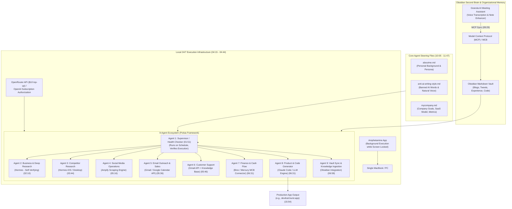
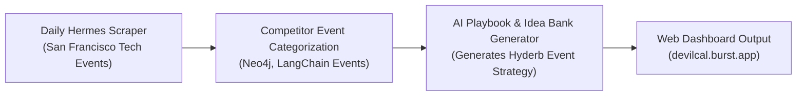

# Detailed Study Notes — How to Create $1M ARR company with Claude + 2nd Brain!!

## 📖 Ingestion Overview

This document represents an exhaustive, high-fidelity, line-by-line technical distillation of the YouTube video titled **"How to Create $1M ARR company with Claude + 2nd Brain!!"** created by **Singh in USA** (Harnoor Singh) ([YouTube Watch Link](https://www.youtube.com/watch?v=8x1ZWBtdsYE)).

The video provides a comprehensive architectural breakdown of how solo engineers and lean teams build hyper-profitable AI enterprises (such as **Polsia**, which reached **$10M ARR in 5 months** with a **$30M fundraise at a $250M valuation** operated by a single person). The core premise is that building scalable autonomous companies does not require massive engineering teams, but rather an **engineering mindset** that combines a reasoning/coding agent (Claude 3.5 Sonnet / Hermes) with a personal knowledge system (Second Brain via Obsidian and Granola).

---

## 🏗️ Master System Architecture Diagram



---

## 📽️ Section 1: The $30M AI-Run Company & Solo-Founder Paradigm (0:00 - 1:33)

### 1. The $10M ARR Benchmark & Polsia Case Study (0:00 - 0:38)
- **The Shift (0:00)**: The rise of autonomous AI agents represents the most significant architectural shift in software engineering and entrepreneurship.
- **Empirical Case Study — Polsia (0:18)**:
  - **Revenue**: Scaled to **$10M ARR** within **5 months** of launch.
  - **Team Size**: Operated by **1 person** utilizing 9 autonomous AI agents.
  - **Valuation & Funding**: Raised **$30M in venture funding at a $250M valuation**, with the fundraising process and investor interactions driven largely by the AI system itself.
- **The Core Premise (0:38)**: You do not need deep artificial intelligence research skills to replicate this success. You only need an **engineering mindset** (systemic process design, modular automation, structured data pipelines) and two core components:
  1. **Claude / Reasoning Agent**: Model context for code generation and logic.
  2. **Second Brain Repository**: A structured personal/company knowledge graph (Obsidian) capturing context, preferences, writing voice, and institutional memory.

### 2. Breakdown of the 2 System Fundamentals (1:00 - 1:51)
Under the hood, any $10M ARR AI agent infrastructure relies on two basic engineering concepts:
1. **Shared Memory**: A centralized, persistent markdown repository (Second Brain) accessible by all agents.
2. **Scheduled Routines**: A cron/automation execution schedule running agents at fixed intervals to execute tasks continuously without human prompting.

---

## 🤖 Section 2: Deep Dive into the 9 Autonomous Agents (1:33 - 6:59)

The video outlines the 9 specialized agents that Polsia and solo builders engineer to automate complete company lifecycles:

| Agent # | Role / Name | Primary Engine / Connector | Comprehensive Operational Description (Timestamp) |
| :--- | :--- | :--- | :--- |
| **Agent 1** | **Scheduled Supervisor Agent** | Cron / Script | Checks whether all other 8 agents executed their assigned jobs successfully. It runs on a fixed timer, validates output integrity, and triggers automated retries upon failure (01:51). |
| **Agent 2** | **Business Planning & Deep Research** | Hermes Agent | Executes continuous, multi-source market and domain research. Unlike basic LLM Web Search, Hermes self-verifies data, passes quality checks, and retains research state over time (02:10). |
| **Agent 3** | **Competitor Intelligence Agent** | Hermes (iOS / Desktop) | Monitors competitor product launches, feature updates, pricing changes, and event calendars automatically (03:44). |
| **Agent 4** | **Social Media Operations Agent** | Ampify Connector | Scrapes data from complex social platforms (TikTok, Instagram, YouTube, X) beyond basic HTML web scraping, generating platform-native posts and tracking engagement (05:16). |
| **Agent 5** | **Email Outreach & Sales Agent** | Gmail & Google Calendar API | Automated cold prospect research, customized email dispatch, follow-up sequence handling, and calendar booking via OAuth read/write permissions (05:36). |
| **Agent 6** | **Customer Support Agent** | Gmail API + Obsidian Knowledge Base | Resolves incoming customer support queries using context from the Second Brain, triaging complex technical issues to human escalation (05:46). |
| **Agent 7** | **Finance & Treasury Health Agent** | Brex / Mercury MCB Connectors | Connects directly to bank MCP/MCB endpoints to perform automated financial health checks, balance audits, expense categorization, and runway tracking (06:31). |
| **Agent 8** | **Product & Code Generation Agent** | Claude / Codex | Writes application code, constructs database queries, deploys web tools, and fixes bugs autonomously based on user feedback and research reports (06:31). |
| **Agent 9** | **Second Brain Knowledge Sync Agent** | Granola + Obsidian MCP | Transcribes daily meeting recordings, cleans voice notes, and updates the core Obsidian vault to keep organizational memory current (06:59). |

---

## 🔬 Section 3: Research Agents Done Right & 24/7 Local Infrastructure (2:10 - 5:16)

### 1. Limitations of Standard LLM Routines vs. Hermes (2:10 - 3:44)
- **The ChatGPT Routine Problem (2:51)**: Standard scheduled routines in ChatGPT or Claude often fail at serious research tasks. When tested on daily developer job scraping, ChatGPT repeatedly pulled surface-level results from the exact same single source without verifying freshness.
- **Why Hermes Succeeds (3:16)**:
  - **Continuous Learning**: Hermes retains context across runs and adapts its scraping strategy over time.
  - **Self-Verification Loop**: Implements an explicit *"clean and verified passing"* step before accepting research results.
  - **Cross-Source Validation**: Aggregates information across multiple independent sources rather than relying on a single web query.

### 2. Running Agents 24/7 on a Single Laptop (3:44 - 5:16)
- **Eliminating Mac Mini Hardware (4:15)**: Solo builders previously purchased dedicated hardware (such as standalone Mac Minis) to run 24/7 background agent scripts. Today, all operations can run on a single primary MacBook/laptop.
- **The Amphetamine Solution (4:44)**:
  - **Background Execution**: Using session management tools like **Amphetamine**, developers can configure scheduled sessions (e.g., 30 minutes, 2 hours, or 24/7 indefinitely).
  - **Password-Locked Uptime**: Amphetamine allows background scripts and AI agents to run continuously even when the MacBook lid is closed and the OS is password-locked.

---

## 🧠 Section 4: Engineering the Second Brain — Obsidian, Granola, and Core Files (6:59 - 12:25)

### 1. The Obsidian Knowledge Vault Architecture (6:59 - 8:12)
- **Vault Scope**: Stores all personal domain knowledge, career history (San Francisco route, Indian engineering background), technical notes, tweet drafts, and blog posts.
- **Claude Vault Integration (7:45)**: By connecting Claude to the Obsidian markdown repository, the LLM reads historical notes and writes new content that perfectly matches the author's prior writing patterns, tone, and personal context.

### 2. Granola as the Audio-to-Knowledge Pipeline (8:12 - 9:45)
- **Voice Transcription + Note Enhancement (8:42)**:
  - Granola transcribes meeting audio and spoken thoughts.
  - It does **not** replace handwritten notes; instead, it enhances them by filling in missing context (e.g., expanding brief bullet points like *"9:00 AM breakfast"* or resolving timestamp gaps).
  - Automatically deletes raw audio files post-transcription to preserve privacy and storage efficiency.
- **Granola MCP Connector (9:29)**: Connects to Claude via Model Context Protocol (MCP), seamlessly moving daily meeting context directly into Obsidian.

### 3. The 3 Files Every AI Agent Workspace Needs (9:45 - 12:18)

Every agent repository must be initialized with three core steering Markdown files:

```markdown
├── CLAUDE.md / agents.md    # Agent workspace rules and framework boundaries
├── aboutme.md               # Owner persona, technical background, achievements
├── anti-ai-writing-style.md # Banned words, hated patterns, natural human phrasing
└── mycompany.md             # Business model, growth targets, monetization strategy
```

| File Name | Purpose & Contents (Timestamp) | Best Practices |
| :--- | :--- | :--- |
| **`aboutme.md`** | Defines developer/founder persona, technical background, career milestones, and domain expertise (11:00). | Keep concise (< 2,000 words). Include authentic personal details. |
| **`anti-ai-writing-style.md`** | Defines voice guidelines by explicitly banning corporate AI jargon, overused buzzwords, and synthetic phrasing (10:05). | List specific banned words (e.g., "delve", "tapestry", "game-changer") and preferred sentence structures. |
| **`mycompany.md`** | Outlines business model, target ARR milestones, target audience, pricing models, and key performance indicators (10:25). | Detail whether the company is SaaS, AI-agent-as-a-service, or API-based. |

#### Repository Initialization Workflow (10:45 - 11:47)
1. Create dedicated local directory: `developer/1-million-arr-company/`.
2. Initialize repository using Claude (`init as claude repo`).
3. Claude automatically generates `CLAUDE.md` and `agents.md` to store context guidelines (e.g., specifying framework choices like Next.js vs. Cloudflare).
4. Replace default agent files with custom `aboutme.md`, `anti-ai-writing-style.md`, and `mycompany.md`.

---

## 💰 Section 5: Cost Optimization, Token Budgeting & Real Application Case Study (12:25 - 17:17)

### 1. Economical Model Selection & Sourcing (12:40 - 14:05)
- **OpenRouter API Key ($10 Top-Up)**: Purchasing a $10 OpenRouter token allowance provides enough API access to run prototype research agents for approximately one full week (13:13).
- **OpenAI / Anthropic Subscription Authorization**: Authorizing Hermes to run against an existing $20/month ChatGPT Plus or Claude Pro subscription delivers the highest return on investment for early-stage background execution (13:31).

### 2. Top 5 Token Saving & Cost Reduction Rules (14:05 - 15:54)

| Rule # | Strategy Name | Operational Implementation (Timestamp) |
| :--- | :--- | :--- |
| **Rule 1** | **Context Clearing (`/clear`)** | Run `/clear` immediately after completing a discreet task to flush the conversation buffer and prevent unnecessary token re-processing (14:35). |
| **Rule 2** | **Task Batching** | Combine related sub-tasks into a single prompt session to avoid re-fetching repository system prompts multiple times (14:45). |
| **Rule 3** | **Model Tiering** | Route lightweight tasks (formatting, simple parsing) to cheap models, reserving top-tier models (Claude 3.5 Sonnet) strictly for complex logic (14:50). |
| **Rule 4** | **Concise Context Files** | Enforce a strict **2,000-word limit** on core context files (`aboutme.md`, `mycompany.md`) to eliminate fluff and conserve prompt tokens (14:57). |
| **Rule 5** | **Sporadic Usage Distribution** | Spread heavy coding/agent sessions across 5-hour rate-limit windows (e.g., 7 AM morning prompt, 10 AM execution block) to maximize tier resets (15:28). |

---

### 3. Real-World Application Case Study: `devilcal.burst.app` (15:54 - 17:17)

To demonstrate this entire architecture in production, the video presents **`devilcal.burst.app`**, a automated event intelligence application built for **Hyderb** (a database infrastructure company):



1. **Automated Scraping (16:10)**: Every day at a scheduled time, a Hermes agent scrapes all tech events, database meetups, and conference schedules across San Francisco.
2. **Competitor Intelligence (16:41)**: Filters and categorizes events hosted specifically by competitor database companies (e.g., Neo4j, LangChain).
3. **Idea Bank & Playbook Generation (16:51)**: Analyzes competitor event patterns to generate tailored event hosting recommendations and community growth playbooks for Hyderb.
4. **Maintenance Overhead (17:17)**: Requires zero manual daily maintenance once deployed, proving the power of combining Claude + Second Brain + Hermes automation.

---

## 📌 Section 6: Key Takeaways & Direct Transcript Quotes (00:00 - 17:17)

> *"I really believe that the smallest teams will have the most impact. This company generated 10 million ARR created 5 months ago and by one person and in fact they raised at 250 million valuation that also the AI did all the magic... engineering mindset can make it happen with just two things needed: Claude plus your second brain."* (00:18 - 00:38) — **Harnoor Singh**

> *"Hermes if you don't know is one of the best agents for research and it's special because it continuously learns as you do... plus in the end it has a verification clean and verified passing."* (03:16 - 03:44) — **Harnoor Singh**

> *"Instead of using what agents create on default, create these three files (`aboutme.md`, `anti-ai-writing-style.md`, `mycompany.md`) using your agent so that it knows about you, about your anti-AI style, and about your company."* (11:47 - 12:18) — **Harnoor Singh**

> *"Build it once and it works every day."* (13:54) — **Harnoor Singh**

---

## 🔗 Related & Source Metadata
- **Source Captured File**: `[[01_RAW/SOURCE/How to Create $1M ARR company with Claude + 2nd Brain!!.md]]`
- **Primary MOC**: `[[03_MOC/yt-moc|YouTube MOC]]`
