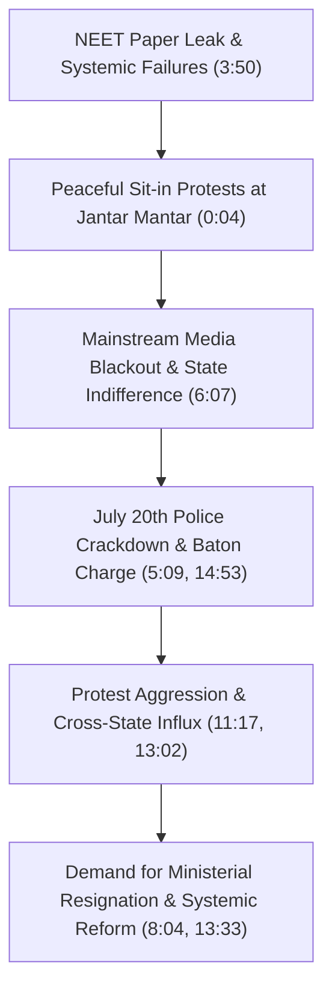

# Detailed Study Notes — Jantar Mantar Situation!

## 📖 Ingestion Overview

This note provides a comprehensive, high-fidelity distillation of the ground-reporting YouTube video titled **"Jantar Mantar Situation!"** produced by independent journalist **Shyam Meera Singh** (*SMS Productions / SM Show*), published on July 24, 2026. The video documents the escalating student and citizen protests at Jantar Mantar, New Delhi, following the national NEET exam paper leak crisis and broader state governance failures.

- **Video Title**: Jantar Mantar Situation!
- **Channel / Creator**: Shyam Meera Singh (SMS Productions / SM Show)
- **Watch Link**: [YouTube Watch Link](https://www.youtube.com/watch?v=Mzo6fsCdSpg)
- **Primary Subject**: Student protests at Jantar Mantar, Delhi police escalation, systemic educational/healthcare failures, media censorship, and political demands for the resignation of Union Education Minister Dharmendra Pradhan.

---

## 📽️ Section 1: Ground Reality & Crowd Dynamics at Jantar Mantar (0:04 - 3:24)

### 1. High-Tension Anticipation of State Action (0:04 - 0:29)
- **Daily Escalation (0:04)**: Daily visits to Jantar Mantar reflect an environment of continuous tension and uncertainty, with protesters constantly anticipating government crackdowns or major political announcements.
- **Ministerial Resignation Demands (0:04)**: Central focus remains on demanding the immediate resignation of Union Education Minister Dharmendra Pradhan.
- **Negotiation Timeline (0:04)**: High-level talks scheduled for 12:00 PM between Cockroach Janta Party (CJP) protest leaders and government officials to discuss demands.

### 2. Crowd Autonomy & Sonam Wangchuk’s Fast Termination (0:29 - 1:52)
- **Dispelling Fast Termination Myths (0:29)**: Public perception suggested that the end of climate activist Sonam Wangchuk’s indefinite hunger strike (*anshan*) would conclude the protest movement. Ground reporting refutes this.
- **Decentralized Mobilization (0:35)**: While Wangchuk’s hunger strike provided initial inspiration and hope, the gathered crowd operates independently of Wangchuk or formal party leadership.
- **Unusual Early Morning Gathering (0:55)**: For the first time since the major July 20th march, massive crowds filled the streets of Jantar Mantar early in the morning, departing from the standard pattern where crowds typically assemble after 2:00 PM or 5:00 PM.
- **Independence from Formal Leadership (1:27)**: Demonstrators are not bound by CJP organization leaders. Even if CJP leadership were to reach a compromise with the government without Education Minister Dharmendra Pradhan’s resignation, the crowd on the ground would refuse to disperse.

### 3. Student Demographics & Educational Crisis (1:52 - 3:24)
- **Secondary School Participation (1:52)**: High school students from 9th and 10th grades joined the protest directly after finishing school examinations.
- **Student Testimonial — Niyati (9th Grade) (2:08 - 2:42)**:
  - *Education System Breakdown*: Students expressed deep disillusionment with India’s education system due to recurring paper leaks (NEET), expressing a growing desire among youth to emigrate ("Leave India, go abroad").
  - *Direct Action*: Students arrived straight from exam halls to protest against state examination mismanagement, seeking to safeguard future medical entrance exams.
- **Unprecedented Demographic Breadth (2:42 - 3:14)**: Unlike the Farmers' Protest or CAA/NRC protests, this movement features an unprecedented demographic spectrum ranging from 14-year-old middle school students to 70-year-old senior citizens.
- **Erosion of Civic Trust (3:14)**: Deepening frustration post-2014 has transformed patriotic ideals into distant concepts rather than lived realities, contrasting domestic police heavy-handedness with citizen protections in Western democracies.

---

## 📉 Section 2: Police Escalation, Systemic Grievances & Media Censorship (3:24 - 8:40)

### 1. Police Baton Charges & Physical Resistance (3:24 - 4:43)
- **Direct Witness Accounts of Police Brutality (3:24)**: Protesters documented police officers physically assaulting female students with batons during demonstrations.
- **Physical Retaliation (3:24)**: Protesters described retaliating against police violence after being struck with batons, illustrating escalating violent confrontations on the ground.
- **Multi-Systemic Trigger Points (3:50)**: The NEET paper leak served merely as a trigger. The broader movement encompasses widespread public anger over multiple systemic failures:

| Grievance Category | Core Issues & Metric Details | Context & Impact (MM:SS) |
| :--- | :--- | :--- |
| **Education Sector** | Rampant paper leaks (NEET), exam cancellations, systemic delays | Severe impact on millions of youth and aspirants (2:08, 3:50) |
| **Public Safety** | Failures in women's safety, physical assaults during peaceful protests | Police baton charges on female students (3:24, 5:09) |
| **Economic & Infra** | Toll taxes, poor road quality, ethanol policy mandates, price inflation | Multi-sector economic frustration across citizens (3:50) |
| **Healthcare Access** | 500+ queue limits, 2+ month appointment delays at AIIMS/RML | Collapse of public health safety net (8:40) |

- **Symbolic Mock Funeral (4:10)**: Demonstrators staged mock funeral processions chanting "Ram Ram Satya Hai" to highlight religious political hypocrisy amidst governance failures.

### 2. Political Accountability & Cabinet Swap Proposals (4:43 - 6:07)
- **Ministerial Portfolio Swapping Proposal (4:43)**: Demonstrators suggested swapping Union Education Minister Dharmendra Pradhan with Road Transport Minister Nitin Gadkari to test ministerial capability and curb corruption, emphasizing targeted accountability over full government overthrow.
- **State Slogan Hypocrisy (5:09)**: Protesters highlighted the contrast between state slogans ("Beti Bachao, Beti Padhao") and the July 20th police crackdown, where female students faced physical violence and torn clothing.
- **Futility of Conventional Petitions (5:36)**: Demonstrators questioned the efficacy of traditional democratic mechanisms (emails, petitions) after 32+ days of unheeded sit-in protests.

### 3. Media Censorship & Systemic Transformation (6:07 - 8:40)
- **Mainstream Media ("Godi Media") Blackout (6:07)**: Over 30 days of continuous student protests, teargas, and baton charges were omitted from mainstream media coverage.
- **PR Strategy Shift (7:07)**: Media coverage commenced only after Prime Minister Narendra Modi released a stylized Instagram video attempting to connect with youth.
- **Public Rejection of Mainstream Media (7:34)**: Protesters actively refused soundbites to mainstream reporters due to perceived bias, while welcoming independent journalists.
- **Demand for Total Transformation ("Sampoorna Kranti") (8:04 - 8:40)**: Drawing parallels to the 1974 Jayaprakash Narayan (JP) Movement, youth call for total systemic reform rather than piecemeal ministerial changes, leveraging social media to bypass censored news outlets.

---

## 🎯 Section 3: Healthcare Disruption, Cross-State Influx & Strategic Risk (8:40 - 16:49)

### 1. Healthcare Safety Net Collapse & Political Rhetoric (8:40 - 11:17)
- **Public Hospital Breakdown (8:40)**: Premier public hospitals (AIIMS, RML) require citizens to queue from 4:00 AM in lines exceeding 500 people, only to issue diagnostic dates delayed by two months, forcing families into private care.
- **Government Communication Failures (9:35)**: Prime Minister Modi’s social media address omitted any mention of Education Minister Dharmendra Pradhan, reinforcing public perceptions of state disinterest after 35 days of agitation.
- **Transition to the "Bihar Model" (11:00)**: Student protest tactics shifted from passive sit-ins to active barricade resistance, mirroring aggressive student movements in Bihar.

### 2. Out-of-State Student Mobilization (11:17 - 14:24)
- **Interstate Influx — Patna Sahib Case (11:17 - 13:02)**: Students traveled directly from Patna Sahib (Patna, Bihar) to New Delhi Railway Station and Jantar Mantar with backpacks, defying family warnings.
- **Generational Political Divide (12:33)**: Students bypassed BJP-supporting parents who relied on mainstream media narratives, driven by social media footage of student suppression.
- **Shift in Protest Temperament**:

| Phase | Demographics & Mindset | Tactics & Demands |
| :--- | :--- | :--- |
| **Initial Phase (Wangchuk / Early Leadership)** | Disciplined, request-oriented, neutral exam takers (14:53) | Seeking media coverage and exam leak investigations (14:53) |
| **Post-July 20th Crackdown Phase** | Militant, resilient, multi-demographic coalition (14:53) | Resisting police force, demanding Dharmendra Pradhan's resignation and regime change (13:33, 15:25) |

### 3. Strategic Analysis & Advisory for Central Delhi (14:24 - 16:49)
- **Ideological Composition (15:25)**: Reporter analysis estimates 20% of current demonstrators are neutral students focused strictly on paper leaks, while 80% are driven by broader anti-government sentiments seeking political transformation.
- **Tactical Failure of Police Containment (15:53)**: Delhi Police's initial strategy of permitting small groups (100–200 people) to prevent escalation backfired, resulting in widespread mobilization at Jantar Mantar.
- **Risk of Spillover into Commercial Hubs (16:21 - 16:49)**: Continued refusal to accept Dharmendra Pradhan's resignation risks converting peaceful student crowds into violent unrest, potentially disrupting key Central Delhi zones like Connaught Place (CP). Independent journalist Shyam Meera Singh advises immediate political de-escalation via ministerial resignation.

---

## 📌 Section 4: Key Takeaways & Core Direct Quotes (0:04 - 16:49)

### Key Takeaways
1. **Decentralized Protest Movement**: Sonam Wangchuk's hunger strike termination did not dismantle the protest; student and citizen crowds operate independently of central figures.
2. **Unprecedented Demographic Representation**: The movement spans from 9th-grade students (age 14) to senior citizens (age 70), triggered by the NEET paper leak and amplified by broader socio-economic grievances.
3. **Escalation Following Police Crackdowns**: The July 20th police action hardened protest resolve, shifting tactics from polite petitioning to physical barricade resistance ("Bihar model").
4. **Media Blackout & Digital Counter-Narratives**: Mainstream television blackout led youth to organize through social media platforms, bypassing traditional state-aligned news outlets.
5. **Strategic Warning to Government**: Delays in replacing Education Minister Dharmendra Pradhan risk turning targeted educational grievances into a wider political campaign threatening Central Delhi stability.

### Core Direct Quotes

> *"The misunderstanding that this protest ended with Sonam Wangchuk's hunger strike is disproved by the ground reality; this crowd is inspired by Wangchuk, but not controlled by him."* (0:35) — **Shyam Meera Singh**

> *"India's education system is completely broken. They leak papers continuously. Rather than staying in India, it is better to go abroad."* (2:08) — **Niyati (9th Grade Student)**

> *"This is an movement where you see 9th-grade children alongside 70-year-old citizens. People have become deeply exhausted by governance failures."* (2:42) — **Shyam Meera Singh**

> *"If we don't stand up for our rights today, we will never be able to stand up. We packed our bags and came directly from Patna."* (12:33) — **Abhishek Kumar (Student Protester from Patna Sahib)**

> *"If the government delays Dharmendra Pradhan's resignation, this crowd will not leave without changing the entire government. The aggression post-July 20th is entirely different from the initial disciplined protest."* (14:24) — **Shyam Meera Singh**

---

## 🔗 Related & Source Metadata

- **Source Captured File**: `[[01_RAW/SOURCE/Jantar Mantar Situation!.md]]`
- **Primary MOC**: `[[03_MOC/yt-moc|YouTube MOC]]`
