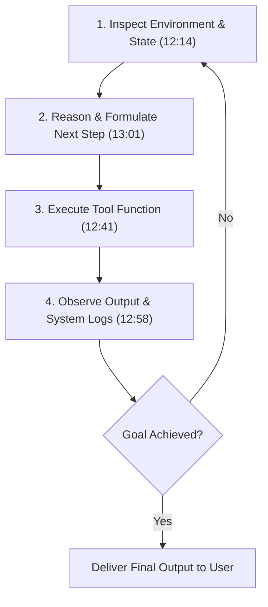
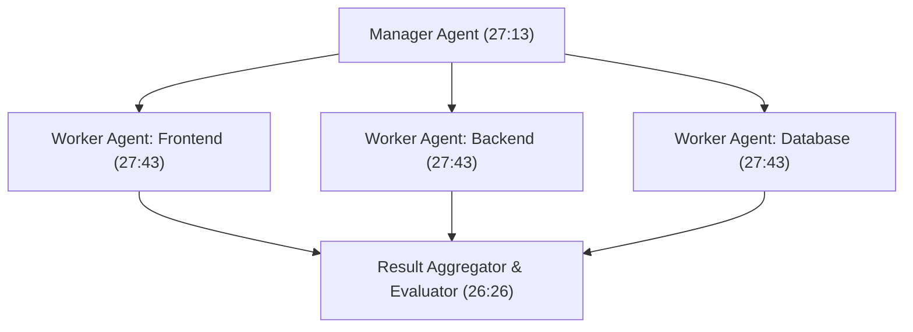

# Detailed Study Notes — Learn All AI terms in 1 video (Part 1)

## 📖 Ingestion Overview
This document represents Part 1 (0:00 - 30:14) of an exhaustive, zero-loss knowledge distillation of the video titled *"Learn All AI terms in 1 video"* by [[Chai aur Code]] (Hitesh Choudhary) ([YouTube Source](https://www.youtube.com/watch?v=_g2CgoTcVME)).

The primary goal of this note is **100% knowledge preservation**, providing an authoritative, line-by-line breakdown of modern AI engineering jargon, mathematical primitives, system architecture patterns, industry counter-narratives, and production trade-offs.

---

## 📽️ Section 1: Introduction & The Agentic Paradigm Shift (0:00 - 3:38)

### 1. Demystifying Artificial Intelligence Jargon (0:00 - 0:49)
- **The Core Problem (0:00)**: The modern software landscape is flooded with intimidating AI terminology—such as *guardrails*, *transformers*, *agentic loops*, *vector embeddings*, and *model context protocols*. Tech marketing often intentionally overcomplicates these terms to create artificial barriers to entry.
- **Instructional Objective (0:32)**: The goal of this technical breakdown is to remove the hype, providing an intuitive, practical understanding of *why* these primitives exist, *how* they emerged from computer science history, and *where* they fit into production software engineering.

### 2. The Agentic Shift: Chatbots vs. Autonomous Agents (0:49 - 2:36)
- **The Venture Capital / Marketing Narrative (1:54)**:
  - AI agents are framed as a "virtual workforce of brilliant assistants who never sleep, never request a raise, and complete complex technical tasks endlessly."
  - This narrative drove massive VC funding under the promise that AI would eliminate the need for human software developers entirely.
- **The Engineering & Economic Reality (2:00 - 2:36)**:
  - **Developers are still required**: AI agents do not orchestrate or debug themselves out-of-the-box. Human software engineers are strictly required to write deterministic API tools, configure sandboxed runtimes, handle token rate limits, implement retry loops, and manage state persistence.
  - **Dual Cost Model**: Deploying production AI agents does not replace developer salaries; it adds an additional operational cost layer—paying for skilled software engineering *plus* high LLM token consumption bills.
- **Functional Paradigm Shift (2:36)**:
  - **Generative Chat AI (e.g., ChatGPT UI)**: Operates purely in a conversational text box. The user requests code, the model returns a text snippet, and the human user must manually copy, paste, and execute that code inside an IDE.
  - **Agentic AI**: Granted direct execution privileges over local or remote environments. An agent can independently inspect directories (`ls`), create files (`touch`), modify code repos (`git`), execute terminal commands (`npm test`), and call external web APIs (`curl`).

| Feature Dimension | Traditional Software | Generative Chat AI | Agentic AI | Timestamp |
| :--- | :--- | :--- | :--- | :--- |
| **Logic Foundation** | Hardcoded `if-else` rules | Probabilistic token prediction | Goal-driven iterative loop | (3:38) |
| **Execution Domain** | Local CPU/GPU runtime | Text conversation window | Autonomous environment actions | (2:36) |
| **Human Workload** | Writing explicit syntax | Prompting & manual code integration | Specifying macro goals & supervising | (1:23) |
| **Primary Failure Mode** | Inflexible to unhandled cases | Cannot affect external system state | High token expense & agent drift | (2:16) |

---

## 📽️ Section 2: Historical Taxonomy & Model Breakthroughs (3:38 - 7:15)

### 1. Taxonomy of Artificial Intelligence (3:38 - 4:22)
- **Nested Domain Hierarchy**: Artificial Intelligence is an overarching umbrella field encompassing several distinct layers:
  $$\text{Artificial Intelligence (AI)} \supset \text{Machine Learning (ML)} \supset \text{Deep Learning (DL)} \supset \text{Generative AI (GenAI)}$$
- **Demystifying "20+ Years of AI Experience" (3:38)**: When senior practitioners claim decades of AI experience, they refer to statistical ML algorithms, decision trees, computer vision, and neural network foundations. Modern advancements represent *Applied AI*—scaling 30-to-40-year-old algorithmic papers using modern GPU hardware clusters and massive internet-scale datasets (4:22).

### 2. Rules-Based Logic vs. Machine Learning (4:22 - 6:10)
- **Rules-Based Legacy Systems (4:22)**: Legacy applications rely on rigid recipes explicitly authored by human developers:
  ```python
  if user.is_authenticated and user.has_permission:
      grant_access()
  else:
      deny_access()
  ```
  - *Limitation*: Highly rigid. Fails immediately when encountering unstructured or out-of-distribution inputs.
- **Machine Learning Paradigm (4:42)**: Instead of authoring rules, developers feed raw feature vectors $\vec{x}$ and target outputs $y$ into statistical models to discover decision boundaries automatically.
  - **Train/Test Data Split**: Pipelines split data (commonly 80% training data to fit parameters, 20% validation data to evaluate overfitting/underfitting) for *Classification* (e.g., Spam vs. Ham) or *Regression* (predicting numerical values).
  - **The Retraining Bottleneck**: Traditional ML models are static after training. When real-world data patterns drift, the entire pipeline must undergo explicit retraining.
  - **Enterprise Workhorses**: Traditional ML algorithms remain heavily deployed in production today for specialized, low-latency tasks like credit card fraud detection and email spam filtering (5:44).

### 3. The 2017 Transformer Architecture Breakthrough (6:10 - 7:15)
- **The Sequential Bottleneck of Legacy NLP (6:10)**: Prior natural language processing models (RNNs, LSTMs) processed text sequentially token-by-token ($t_1 \rightarrow t_2 \rightarrow t_3$). This created a severe GPU hardware parallelization bottleneck and suffered from vanishing gradients over long distances.
- **Parallel Self-Attention ("Attention Is All You Need", 2017) (6:35)**: The Transformer architecture eliminated sequential processing by evaluating all tokens in a passage simultaneously. It calculates pairwise attention weights across tokens, mapping distant dependencies (e.g., connecting a pronoun in line 10 to a noun in line 1).
- **GPU Hardware Scaling & Global RAM Scarcity**: Parallel attention allowed transformer models to be trained efficiently across vast GPU clusters. The massive memory bandwidth requirements for loading multi-billion parameter matrices into VRAM explain why GPU demand and high-speed RAM prices have escalated globally (7:07).

---

## 📽️ Section 3: Large Language Models (LLMs), Tokens, & Hyperparameters (7:15 - 10:23)

### 1. Next-Token Prediction Mechanics (7:15 - 8:57)
- **Underlying Engine (7:15)**: LLMs (GPT-4, Gemini, Claude) are non-sentient statistical engines whose fundamental operation is calculating a probability distribution over a vocabulary to predict the most likely next token:
  $$P(w_n \mid w_1, w_2, \dots, w_{n-1})$$
- **Tokenization Breakdown (7:46)**:
  - A token is a sub-word numerical chunk generated by algorithms like Byte-Pair Encoding (BPE).
  - A token does not equal a word. Roughly 70% of common English words equal 1 token, whereas technical terms, code, or non-English scripts split into 2 to 5+ tokens.
  - *Financial Billing Impact*: API providers bill per token (input prompt tokens + output generated tokens), not per word or byte.
- **Data Provenance & Legal Controversies (8:33)**: Pre-training requires scraping billions of web pages, public repositories, and digitized books. This has triggered extensive copyright lawsuits regarding unconsented data usage.

### 2. Hyperparameters: Temperature & Context Window (8:57 - 10:23)
- **Temperature ($T$) (8:57)**: Controls probability distribution flattening during token sampling:
  $$P(i) = \frac{\exp(z_i / T)}{\sum_j \exp(z_j / T)}$$
  - *Low Temperature ($T = 0.0 - 0.2$)*: Sharp probability distribution. Forces the model to select top-ranked probabilistic tokens. Ideal for deterministic code generation, JSON extraction, and mathematics.
  - *High Temperature ($T = 0.7 - 1.0+$)*: Flattens the distribution, allowing lower-ranked tokens to be sampled. Ideal for creative writing and brainstorming.
- **Context Window Mechanics & Degradation (9:58)**:
  - The context window is the maximum active token capacity held in memory during an inference call.
  - *The 1M+ Context Window Fallacy*: Advertised 1M+ token context windows suffer from severe "Lost in the Middle" attention degradation. Passing an entire 50,000-line codebase into a single prompt degrades response quality, causing instruction drift and severe hallucinations (10:23).

---

## 📽️ Section 4: AI Agent Primitives & Execution Loops (10:23 - 14:46)

### 1. Chatbot vs. AI Agent Distinction (10:23 - 12:14)
- **Chatbots**: Reactive, conversational entities bound to a single chat window (e.g., answering Q&A queries).
- **AI Agents**: Proactive, goal-driven systems authorized to formulate multi-step execution plans and invoke external tools (e.g., *"Compare delivery pricing on Swiggy and Zomato, generate a table, and email it to me"*).

### 2. The Core Agent Execution Loop (12:14 - 13:30)
Every autonomous agent operates on a continuous 4-stage feedback loop until its target goal is completed:



- **Developer Engineering in the Loop**:
  - *Environment*: Developers define sandboxed runtimes (Docker containers, local working trees).
  - *Act*: Developers author the underlying tool functions in code (Python, JS, Java).
  - *Observe*: Developers attach logging and testing harnesses (e.g., TestSprite, Zoho monitoring) to capture execution errors (12:58).

### 3. The ReAct Pattern (Reasoning + Acting) (13:30 - 14:46)
- **Mechanism (13:30)**: ReAct forces the model to emit a structured "Thought" log before generating a tool invocation payload "Action".
- **Trace Example**:
  ```text
  Thought: The user wants to check database counts. I must query PostgreSQL.
  Action: execute_sql_query(sql="SELECT count(*) FROM users;")
  Observation: Returns 15,420 records.
  Thought: The record count is retrieved. I will format the response.
  ```
- **Auditing Value**: Exposes internal decision logic for debugging agent failures and preventing unintended destructive commands (14:15).

---

## 📽️ Section 5: Tooling, Memory Systems, RAG, & Vector Databases (14:46 - 22:43)

### 1. Tool Call Architecture & Deterministic Execution (14:46 - 16:19)
- **The "Genius in a Room" Analogy (14:46)**: An LLM without tools is like an isolated genius locked in a room without internet—it only knows historical training weights.
- **Probabilistic vs. Deterministic Split (15:43)**: LLMs are probabilistic engines poor at exact arithmetic, precise dates, and live state. Developers write deterministic code wrappers (in Python, JavaScript, Java) to handle math, database operations, and API requests reliably.

### 2. Memory Architectures in AI Systems (16:19 - 18:09)
- **Stateless API Nature (16:19)**: LLM API requests carry zero native memory ("LLM Amnesia"). Every API call is stateless.
- **Memory Tiering Strategies**:
  - *Working Memory*: Active prompt history passed in the context window.
  - *Summarized Memory*: Periodically compressing conversation history into condensed text summaries.
  - *Long-Term Memory*: Persisting user preferences, facts, and entities in external vector stores (17:13).

### 3. Retrieval-Augmented Generation (RAG) (18:09 - 19:45)
- **Concept (18:09)**: Connects LLMs to proprietary private data (support tickets, HR documents, PDFs) without expensive model retraining or fine-tuning.
- **RAG Pipeline**: Document Ingestion $\rightarrow$ Text Chunking $\rightarrow$ Vector Embedding $\rightarrow$ Vector Database Indexing $\rightarrow$ Semantic Query Matching $\rightarrow$ Prompt Context Injection $\rightarrow$ Grounded Answer Synthesis.

### 4. Vector Databases & High-Dimensional Semantic Search (19:45 - 22:43)
- **Vector Embeddings (20:09)**: Neural networks convert unstructured text into dense arrays of floating-point numbers (e.g., 768 or 1536 dimensions) representing semantic meaning.
- **Spatial Clustering (20:44)**: Semantically related terms (e.g., *Swiggy* and *Zomato*) cluster together in mathematical space.
- **Mathematical Querying**: Unlike SQL exact string matching (`LIKE '%query%'`), vector databases perform geometric similarity searches using Dot Product ($\mathbf{A} \cdot \mathbf{B}$), Cosine Similarity, or Euclidean Distance.
- **Dedicated Vector Engines (21:11)**: Systems like Qdrant and Pinecone are specialized for high-speed vector matrix calculations and graph indexing (HNSW).

| Metric | Relational Database (SQL) | Vector Database | Timestamp |
| :--- | :--- | :--- | :--- |
| **Data Format** | Tables, rows, text strings | High-dimensional dense vectors | (21:11) |
| **Query Paradigm** | Exact string / Boolean logic | Geometric similarity distance | (20:44) |
| **Search Mechanism** | Literal keyword match | Semantic context & meaning | (22:12) |
| **Primary Use Cases** | User accounts, transactions | RAG retrieval, image search, LLM memory | (21:43) |

---

## 📽️ Section 6: Integration Protocols, Smart Architectures, & Guardrails (22:43 - 30:14)

### 1. Model Context Protocol (MCP) (22:43 - 24:41)
- **The Integration Problem (22:43)**: Connecting LLMs to disparate platforms (Slack, PostgreSQL, GitHub) historically required custom API integration code.
- **Anthropic's MCP (23:36)**: Standardized open protocol ("Universal USB") allowing uniform communication between LLM clients and local/remote tool servers.
- **Agent-to-Agent (A2A) Protocols (23:54)**: Emerging standards for multi-agent platforms to negotiate sub-tasks across agent boundaries.

### 2. Smart Agent Architecture Primitives (24:41 - 26:45)
- **Core Design Components**:
  - *Chain of Thought (CoT)*: Structured step-by-step reasoning prompts (25:10).
  - *Plan & Execute*: Generating markdown TODO checklists in working memory, checking off steps line by line (25:28).
  - *Evaluations (Evals)*: Automated validation checks evaluating output quality before concluding tasks (26:26).
  - *Human-in-the-Loop (HITL)*: Requiring explicit user authorization for high-risk actions (e.g. database drops, financial transactions) (26:45).

### 3. Multi-Agent Systems (MAS) & Token Cost Warnings (26:45 - 29:12)
- **Orchestrator-Worker Pattern (27:13)**: A central Manager Agent delegates sub-tasks to specialized Worker Agents running in parallel (e.g., isolated git worktrees for separate modules).
- **Severe Financial Risk (27:43)**: Multi-agent execution increases token consumption exponentially—20 parallel worker agents consume 20x tokens, rapidly exhausting weekly API limits in minutes (28:15).



### 4. Safety & Guardrail Middleware (29:12 - 30:14)
- **Dual Interception Layer (29:12)**: Middleware sitting between user input, the LLM, and external APIs:
  - *Input Guardrails*: Detect prompt injection attacks, jailbreak attempts, and PII leaks.
  - *Output Guardrails*: Validate syntax against schemas (e.g., Zod), filter toxic responses, and enforce policy compliance (29:44).
- **Sandboxing**: Executing generated code inside isolated Docker containers or WebAssembly runtimes to prevent local host system damage (30:14).

---

## 🔗 Related & Source Metadata
- **Source Captured File**: `[[01_RAW/SOURCE/Learn All AI terms in 1 video.md]]`
- **Primary MOC**: `[[03_MOC/yt-moc|YouTube MOC]]`
