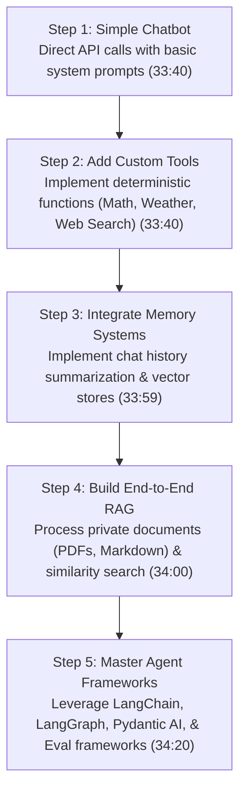

# Detailed Study Notes — Learn All AI terms in 1 video (Part 2)

## 📖 Ingestion Overview
This document represents Part 2 (30:14 - 36:00) of an exhaustive, zero-loss knowledge distillation of the video titled *"Learn All AI terms in 1 video"* by [[Chai aur Code]] (Hitesh Choudhary) ([YouTube Source](https://www.youtube.com/watch?v=_g2CgoTcVME)).

---

## 📽️ Section 7: Production Cost Management & Model Routing (30:14 - 32:45)

### 1. Economics of Production AI Systems (30:14 - 31:38)
- **The Financial Risk of Single-Model Architectures (31:05)**: Directing all application requests to top-tier frontier models (e.g., Claude 3.5 Sonnet / Opus or GPT-4o) creates unsustainable API expenses. Tasks like simple string extraction, JSON formatting, or initial query intent classification do not require frontier-class reasoning models.
- **Model Heterogeneity in Enterprise Production (31:38)**: Production systems must implement dynamic model routing—delegating workloads across local zero-cost models, lightweight API endpoints, and heavy frontier models based on request complexity and latency requirements.

### 2. The 60/30/10 Cost Allocation Framework (31:38 - 32:45)
An engineering heuristic for optimizing LLM API spending across production pipelines:

| Workload Tier | Share | Target Model Class | Suitable Operations | Timestamp |
| :--- | :--- | :--- | :--- | :--- |
| **Tier 1: Low-Cost** | **60%** | Lightweight / Small Models (GPT-4o mini, Gemini Flash, local LLMs like Ollama / Gemma) | Intent classification, simple JSON extraction, text formatting, initial query triage | (32:05) |
| **Tier 2: Mid-Tier** | **30%** | Balanced Production Models (Claude Haiku / Sonnet, GPT-4o) | Function/tool execution, code generation, RAG document synthesis, multi-turn dialogue | (32:05) |
| **Tier 3: Frontier** | **10%** | Premium Reasoning Models (Claude Opus, GPT-4o full, O1) | Complex architecture design, high-risk code refactoring, master evaluation loops | (32:05) |

---

## 📽️ Section 8: AI Mastery Roadmap & Ecosystem Analysis (32:45 - 36:00)

### 1. Step-by-Step Practical Learning Roadmap (32:45 - 34:20)
Mastering AI engineering requires an incremental hands-on build path rather than passive video consumption:

### 2. Industry Frameworks & Tooling Ecosystem (34:20 - 35:01)
- **Agent Orchestration Frameworks**: Once foundational primitives are mastered manually, developers leverage production frameworks:
  - *LangChain & LangGraph*: Graph-based state machine orchestration for complex agents.
  - *Pydantic AI*: Type-safe data validation and structured output enforcement.
  - *Eval Frameworks (Eval AI, El.dev)*: Benchmarking agent accuracy and tool calling reliability.

### 3. Provider Infrastructure & Benchmark Trade-offs (35:01 - 35:55)
- **Tool Calling Reliability Benchmark (35:01)**: Anthropic (Claude series) and OpenAI set the industry standard for strict JSON schema compliance and deterministic tool invocation.
- **Multimodal & Image Generation Leaderboards (35:31)**:
  - *Text & Vision*: Google Gemini leads in native multimodal context handling.
  - *Image & Video Generation*: Specialized open-weight models (e.g., Flux on HuggingFace, Nano Banana) outperform general-purpose commercial models in visual fidelity.

---

## 📌 Section 9: Key Takeaways & Direct Quotation (35:55 - 36:00)

> *"Learning AI terms is not about fearing fancy buzzwords. Start small by building simple tool-calling scripts, understand the underlying probabilistic mechanics, and incrementally move towards complex memory, RAG, and agentic workflows."* (34:43)

---

## 🔗 Related & Source Metadata
- **Source Captured File**: `[[01_RAW/SOURCE/Learn All AI terms in 1 video.md]]`
- **Primary MOC**: `[[03_MOC/yt-moc|YouTube MOC]]`
