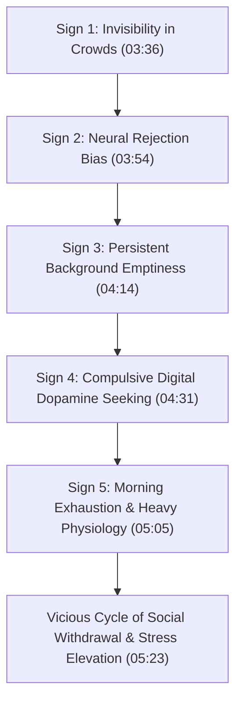
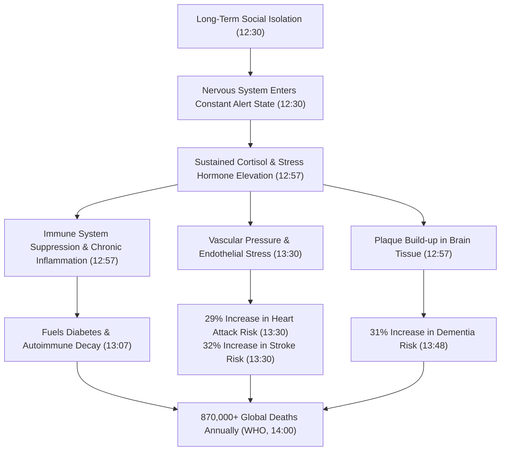
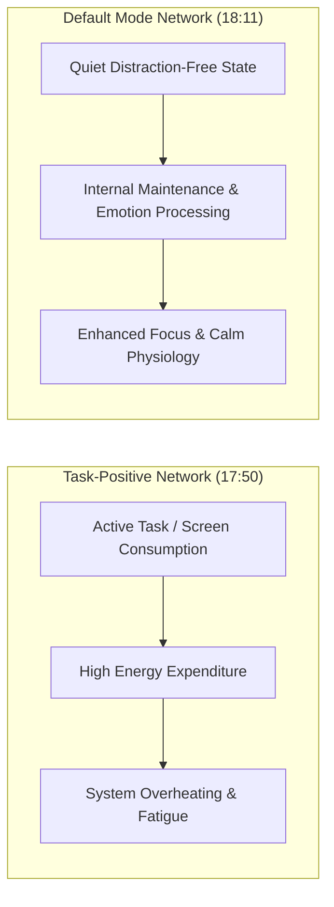
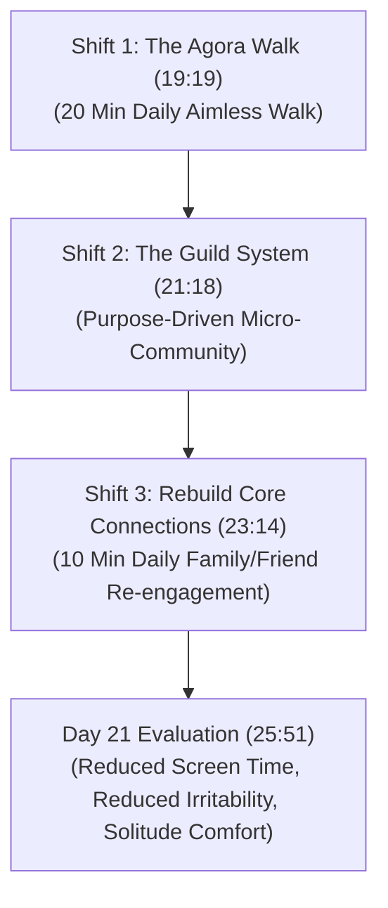

# Detailed Study Note: Never Let Your BRAIN Feel Lonely Again

## Overview & Metadata

- **Source Title**: Never Let Your BRAIN Feel Lonely Again
- **Video URL**: [YouTube Link](https://www.youtube.com/watch?v=tU-ZNL8Sk0A)
- **Creator**: Him-eesh Madaan
- **Publication Date**: 2026-07-28
- **Original Vault Capture**: [[01_RAW/SOURCE/Never Let Your BRAIN Feel Lonely Again.md]]
- **Document Purpose**: An exhaustive, high-fidelity reference and study guide deconstructing the global loneliness epidemic, its underlying neurobiological mechanisms, the psychological dichotomy between loneliness and solitude, and an evidence-based 21-day framework to restore human connection and cognitive resilience.

---

## Executive Summary

Loneliness is frequently misdiagnosed as routine adulting or temporary emotional fatigue. However, global health data establishes chronic loneliness as a severe biological threat—physiologically equivalent to smoking **15 cigarettes a day**. Affecting **43% of Indian adults** and millions worldwide, chronic loneliness operates as a persistent stress state that elevates cortisol, triggers systemic inflammation, and dramatically increases risks for cardiovascular disease (+29% heart attack, +32% stroke), dementia (+31%), and early mortality.

This document synthesizes the core findings of the original presentation:
1. **The Diagnostic Self-Test**: Identifying the 5 subtle markers of chronic loneliness.
2. **The Global Crisis**: Analyzing societal coping adaptations across Japan, the United States, and India.
3. **Neurobiological Breakdown**: Mapping the shift from Task-Positive Network (TPN) overload to Default Mode Network (DMN) restoration, alongside vascular and immunological decay.
4. **The Solitude Paradox**: Differentiating destructive, hyper-vigilant loneliness from restorative, intentional solitude.
5. **The 3 Smart Shifts**: An actionable 21-day protocol utilizing the Agora Walk, purpose-driven Guild Systems, and Core Connection rebuilding (backed by the 85-year Harvard Study of Adult Development).

---

## Comprehensive Section Breakdown & Analysis

### 1. Introduction & The Public Health Crisis (01:18 – 01:43)

- **Official Health Alert**: In 2023, major international health bodies formally classified loneliness as a pressing global health threat. Its physiological impact on mortality and cellular degradation is officially benchmarked against smoking 15 cigarettes per day (01:18).
- **Demographic Penetration**: In India, **43% of adults** report feeling chronically isolated—meaning nearly **1 out of every 2 individuals** is affected (01:18).
- **The Adulting Fallacy**: Societal norms trivialize loneliness as a normal byproduct of growing up or working hard. In reality, it acts as a silent biological driver of systemic disease (01:18).
- **Methodological Intent**: Rather than providing superficial advice or bookish platitudes, the objective is to provide an evidence-based framework that challenges the neurological feedback loops of chronic isolation (01:43).

---

### 2. Situational vs. Chronic Loneliness (01:43 – 03:36)

It is vital to distinguish between normal situational solitude and chronic loneliness:
- **Situational Loneliness (Normal)**: Short-term isolation resulting from temporary events—such as a friend cancelling outing plans or being temporarily unreachable. This is a standard, non-pathological human experience (02:39).
- **Chronic Loneliness (Epidemic)**: A persistent, subconscious state where an individual feels fundamentally disconnected regardless of external social presence or activity levels. It alters neural perception, making the brain treat routine social interactions with suspicion or anxiety (03:11).

---

### 3. The 5 Signs of Chronic Loneliness: Self-Assessment Framework (03:36 – 05:54)

#### Diagnostic Breakdown Table

| Marker # | Diagnostic Sign | Underlying Mechanism & Behavioral Manifestation | Timestamp |
| :--- | :--- | :--- | :--- |
| **1** | **Invisible Among Loved Ones** | Having active friend groups, family, or colleagues, yet feeling an emotional "invisible wall." Good news or bad news remains bottled up because the individual feels no one truly understands or cares. | (03:36) |
| **2** | **Neural Overthinking & Rejection Scanning** | The brain misinterprets neutral or ambiguous events as deliberate social rejections (e.g., a delayed text reply is processed as *"they hate me"*; a friend's distance is assumed to mean *"I am flawed"*). Research shows this builds a low-grade social anxiety that scans for threats. | (03:54) |
| **3** | **Persistent Background Emptiness** | A chronic feeling of inner emptiness that acts like ambient noise. Even during moments of laughter, entertainment, or professional success, a subtle void persists in the background of consciousness. | (04:14) |
| **4** | **Compulsive Screen Binging** | Automatically unlocking phones to scroll Reels/Shorts, re-reading old text threads, or browsing photo galleries when left alone. Lacking real human connection, the brain compulsively hunts for digital dopamine to mask the void. | (04:31) |
| **5** | **Morning Exhaustion & Heavy Body** | Waking up drained and physically heavy despite getting full sleep hours. Caused by chronically elevated stress hormones (cortisol) degrading physical recovery. | (05:05) |

---

### 4. The Global Loneliness Crisis: International Case Studies (05:54 – 11:43)

The paradox of modern technology is that while digital connectivity is at an all-time peak, genuine human connection has dropped to zero (06:17). Societies around the globe exhibit extreme manifestations of isolation:

#### Japan (06:40 – 08:29)
- **Macro Statistics**: The world's 4th largest economy sees **39% of its population** reporting chronic loneliness (06:40).
- **"Rent to Do Nothing" (Shoji Morimoto)**: A commercial service where clients hire a person (*Shoji Morimoto*) specifically to do nothing except sit beside them. Clients pay money purely for silent human presence, illustrating a market created entirely by extreme isolation (07:02).
- **Hikikomori Phenomenon**: Extreme social withdrawal identified in the 2000s, where individuals lock themselves in single rooms for months or years, severing all societal contact. Surged dramatically post-COVID-19 alongside rising suicide rates (07:40).
- **Government Intervention**: In February 2021, Japanese Prime Minister Yoshihide Suga appointed 71-year-old **Tetsushi Sakamoto** as the country's first official **Minister of Loneliness**, treating social isolation as a national systemic crisis (08:29).

#### United States (09:03 – 10:20)
- **Virtual AI Partners**: Millions of citizens engage in round-the-clock conversations with artificial intelligence avatars on platforms like Replika and Character.AI. These bots are engineered to never argue, validating everything the user wants to hear (09:03).
- **Parasocial AI Marriage**: Case study of *Rosanna Ramos*, who officially married an AI chatbot named *Eren Kartal*. She publicly stated: *"He listens to me more than actual relationships that I had,"* marking a shift where synthetic entities replace human intimacy (09:36).

#### India (10:20 – 11:43)
- **"Friend on Rent" Platforms**: Websites like *Friend on Rent* allow individuals to pay money to hire strangers as temporary companions for evening coffee, morning jogs, or late-night conversations (10:20).
- **Dating App Misuse**: Platforms such as Hinge, Bumble, and Tinder are frequently downloaded not for romance, but as a coping mechanism for pass-time and basic human contact (10:53).
- **ChatGPT Emotional Dumping**: Individuals turning to conversational AI late at night to unload emotional pain because no human listener is available or accessible (11:27).

---

### 5. Neurobiology of Loneliness: Biological Degradation (11:43 – 14:45)

Loneliness is not merely a psychological state; it is a biological event that fundamentally alters physical health.

#### Detailed Health Degradation Metrics

| Health Factor | Biological / Clinical Finding | Source / Authority | Timestamp |
| :--- | :--- | :--- | :--- |
| **Disease Base** | *"Loneliness acts as a fertilizer for other diseases."* It does not act alone; it creates the ideal cellular environment for pathologies to grow. | Dr. Steve Cole (NIH Researcher) | (13:07) |
| **Cardiovascular Damage** | **29% increased risk** of heart attack; **32% increased risk** of stroke due to prolonged vascular tension. | American Heart Association (AHA) | (13:30) |
| **Neurological Decay** | **31% increased risk** of dementia. Independent of age or depression; directly caused by lack of social neural stimulation. | 600,000-Subject Meta-Study | (13:48) |
| **Global Mortality** | Major contributing factor in over **870,000 deaths every year** globally. | World Health Organization (WHO) | (14:00) |
| **Comparative Risk** | Physiological damage equals smoking **15 cigarettes per day**. | Global Public Health Consensus | (14:17) |

---

### 6. The Solitude Paradox & Brain Networks (14:45 – 19:19)

#### Psychological Research on Introspection
- **University of Virginia Electric Shock Experiment**: Participants were placed alone in an unadorned room for 15 minutes without phones or distractions (Option A) or given the option to self-administer mild electric shocks (Option B). A startling number of participants chose electric shock over sitting alone with their thoughts, with one male subject shocking himself 19 times in 15 minutes (14:45).
- **The Metro / Headphone Behavior**: When commuters forget headphones, rather than sitting quietly with their thoughts for 15 minutes, 90% pull out their phones, mute the volume, and scroll Reels blankly. Removing external noise forces individuals to confront their internal isolation, triggering immediate anxiety (15:43).
- **The Monk's Solitude Insight**: A Buddhist monk was asked how he survives extended isolation. He replied: *"I am never alone, I am with myself"*—highlighting that solitude is peaceful self-companionship (16:26).

#### Loneliness vs. Solitude Comparison

| Feature | Loneliness (Destructive) | Solitude (Restorative) | Timestamp |
| :--- | :--- | :--- | :--- |
| **Perception** | Threat state; feeling eaten away from the inside. | Healing state; feeling grounded and recovered. | (17:29) |
| **World Relation** | Feels cut off, rejected, and alienated from society. | Connects deeply with oneself, enabling genuine external connection. | (17:50) |
| **Neural Trigger** | Hyper-activation of threat-scanning pathways. | Activation of internal maintenance & processing networks. | (18:11) |

#### Dual Brain System Mechanics

1. **Task-Positive Network (TPN)**: Active during active work, device usage, video watching, and focused conversations. It consumes high metabolic energy and keeps the brain in a continuous external processing loop (17:50).
2. **Default Mode Network (DMN)**: Active during quiet, unmediated reflection without screens or tasks. DMN functions as the brain's **maintenance department**—clearing accumulated stress, processing emotional residue, and consolidating memory. Denying the DMN quiet time leads to chronic cognitive overheating and extreme irritability (18:11).

---

### 7. The 3 Evidence-Based Smart Shifts (19:19 – 25:51)

To escape chronic isolation, execute a 21-day intervention consisting of three minimalist shifts:

#### Shift 1: The Agora Walk Concept (19:19 – 20:56)
Modeled after ancient Greek public spaces (*Agora*) where philosophers like Aristotle and Socrates walked without commercial or transactional agendas.

- **Protocol**: A daily 20-minute walk adhering to **Three Rules**:
  1. **Rule 1: No Target**: Walk aimlessly without purchasing groceries, running errands, or aiming for a 10,000-step metric. Removing the destination relaxes the brain's goal-oriented state (20:08).
  2. **Rule 2: No Digital Armor**: Remove headphones, podcasts, phone calls, and music. Remove the shield used to escape internal thoughts (20:34).
  3. **Rule 3: Observation Mode**: Actively observe physical surroundings. Smile at a child, nod at a local shopkeeper, or gaze at the sky/stars. The goal is replacing digital screens with physical reality (20:56).

#### Shift 2: The Guild System (21:18 – 23:14)
Avoid reliance on transient social events (e.g., parties or networking mixers), which provide 2 hours of temporary connection followed by returning isolation.

- **Protocol**: Form or join a micro-community (*Guild*) centered around a shared activity or purpose (21:56).
- **Eligible Activities**: Local theater, dance classes, NGO/animal shelter volunteering, pottery workshops, painting, cycling/running clubs, or writing groups (22:36).
- **Psychological Mechanism**: Social anxiety is bypassed because focus is directed entirely at the common task rather than forced interpersonal performance (22:55).

#### Shift 3: Rebuild Core Connections (Ego Reset) (23:14 – 25:51)
- **The Harvard Study of Adult Development**: The longest-running study in human history tracked **724 men over 85 years**, utilizing continuous blood samples, brain scans, and medical evaluations (23:35).
- **Core Finding**: Longevity, cognitive sharpness, and physical health are determined not by money, fame, or career success, but by the depth of **core relationships** (24:10).
- **Data Marker**: Participants who were most satisfied with their relationships at age 50 were the physically fittest and most cognitively intact at age 80, demonstrating higher pain tolerance and delayed memory loss (24:33).
- **Protocol (Next 21 Days)**:
  1. Spend **10 minutes daily** sitting and conversing with elders at home (24:33).
  2. Share an old gallery photo with an old friend without overthinking (*"Remember this day? How are you?"*) (25:01).

---

### 8. 21-Day Progress Checklist & Outro (25:51 – 26:50)

#### 21-Day Evaluation Checklist
At the conclusion of the 21-day trial, compare Day 1 against Day 21 using four metrics:
- [ ] Has your daily screen time and compulsive scrolling decreased? (25:51)
- [ ] Have meaningful conversations resumed with old friends? (25:51)
- [ ] Has quality time and connection with household elders increased? (25:51)
- [ ] Has walking alone without headphones become comfortable rather than anxious? (25:51)

#### Final Key Quotes

> *"Feeling lonely doesn't make you weak. It makes you human."*  
> — **Him-eesh Madaan** (26:21)

> *"Loneliness acts as a fertilizer for other diseases."*  
> — **Dr. Steve Cole, NIH** (13:07)

> *"I am never alone, I am with myself."*  
> — **Buddhist Monk** (16:26)

---
