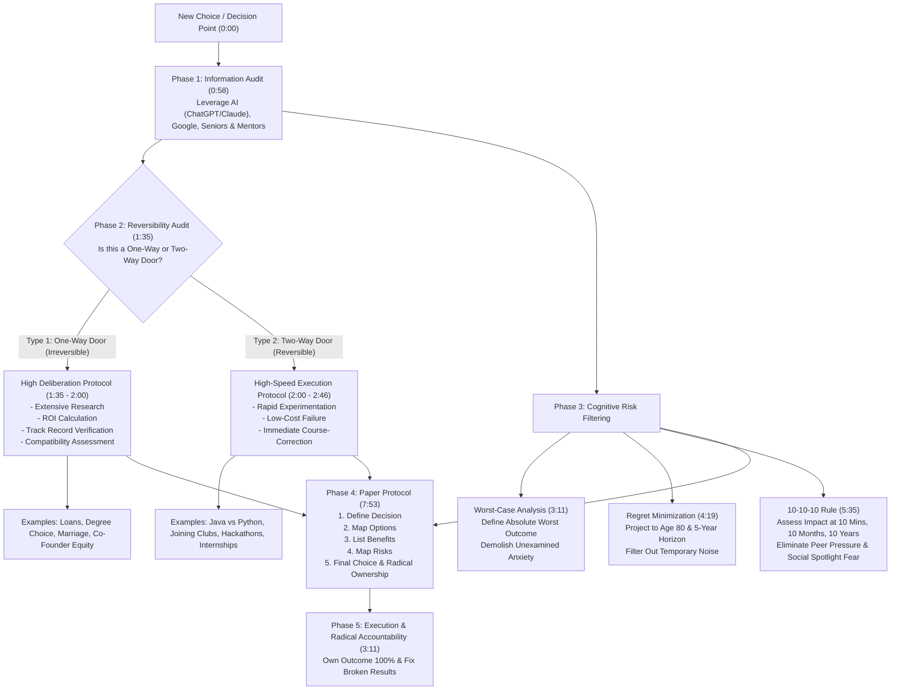

# The Decision-Making Framework I Wish I Knew at 18

## 1. Overview & Comprehensive Metadata

- **Source Title**: The Decision-Making Framework I Wish I Knew at 18.
- **Creator / Channel**: Not Your College ([[Not Your College]] / Harshvardhan Sharma / Sheryians Coding School)
- **Source Link**: [YouTube Video](https://www.youtube.com/watch?v=WcMRYf2HE9s)
- **Published Date**: 2026-06-02
- **Captured Date**: 2026-07-30
- **Source File**: [[01_RAW/CAPTURE/The Decision-Making Framework I Wish I Knew at 18.md]]

### Executive Summary & Core Paradigm

This study note provides an exhaustive, granular synthesis of Day 2 of the 7-day career development and personal transformation curriculum presented by Not Your College (NYC). Operating specifically to bridge the massive void between outdated college curriculums and high-stakes real-world tech careers, this lecture addresses the primary root cause of student failure in Tier-2 and Tier-3 institutions: **poor decision-making, chronic overthinking, and action paralysis**.

The central thesis of the lecture rests on a fundamental law of life quality: **your life quality is strictly bounded by the quality of your decisions**. Countering the widespread misconception that life is destroyed by isolated, high-drama errors, the speaker demonstrates that careers and personal lives are eroded by compounding **silent micro-failures**—unexamined bad choices that feel inconsequential in the moment but imperceptibly destroy long-term potential. 

To eliminate decision fatigue, emotional reactivity, and fear of failure, the lecture synthesizes 5 robust mental models:
1. **Jeff Bezos's Type 1 vs. Type 2 Decision Classification** (Reversibility & Speed)
2. **Worst-Case Analysis** (De-risking & Fear Demolition)
3. **Regret Minimization Framework** (Long-Horizon Perspective)
4. **The 10-10-10 Rule** (Temporal Distortion Neutralization)
5. **The Written Paper Protocol** (Structured Problem Decomposition & Radical Ownership)

---

## 2. Visual Architecture & Decision Engineering

### Master Decision Architecture Flowchart



---

## 3. Exhaustive Section-by-Section Deep Dive

### Section 1: The Psychology of Micro-Failures & Series Mission (0:00 - 0:58)

#### 1.1 The Law of Compounding Micro-Failures (0:00 - 0:26)
- **The Life-Quality Equation**: The quality of an individual's life is mathematically bounded by the cumulative quality of their decisions.
- **The Fallacy of the Single Catastrophic Mistake**: Most young adults operate under the false assumption that life is ruined only by single, dramatic mistakes (e.g., failing a major exam or committing a legal crime). In reality, single large failures are rare and usually force an immediate, visible crisis that provides a clear opportunity for course-correction.
- **The Invisible Hazard of Small Bad Choices**: Micro-failures—such as enrolling in an unsuitable college program, tolerating toxic friendships, staying in misaligned romantic relationships, or wasting hours on mindless consumption—do not trigger immediate alarm. Because they carry no immediate penalty, individuals fail to realize they are making errors. Over 3 to 4 years, these micro-choices compound into severe career stagnation, panic during final-year placement drives, and financial dependence.

#### 1.2 The NYC Curriculum & Independence Mandate (0:26 - 0:58)
- **Bridging the College Gap**: Tier-2 and Tier-3 engineering colleges maintain outdated academic syllabi that fail to teach real-world software engineering, AI workflows, or high-stakes decision-making.
- **7-Day Transformation Goal**: The primary objective of the series is to build self-reliant individuals who develop high-income technical and decision-making capabilities, ensuring they never have to beg for employment or face desperation at graduation.

---

### Section 2: Tool 1 — Jeff Bezos's Irreversible vs. Reversible Framework (0:58 - 3:11)

#### 2.1 Demystifying Decision-Making (0:58 - 1:17)
- **Decision-Making vs. Future Prediction**: Decision-making is frequently paralyzed by the mistaken belief that one must predict the future. Since the future is fundamentally unknowable, true decision-making is defined as **the systematic aggregation and synthesis of available market intelligence** (using AI tools like ChatGPT/Claude, search engines, industry mentors, and experienced seniors) to select the option with the highest expected value.

#### 2.2 Type 1 Decisions: One-Way Doors (Irreversible) (1:35 - 2:00)
- **Mechanism**: Type 1 decisions are "locked door" choices. Passing through the door creates a permanent or near-permanent commitment where reversing course incurs severe financial, emotional, or structural costs.
- **Required Evaluative Criteria**:
  1. **Return on Investment (ROI)**: Calculate financial and career yield over time (e.g., assessing debt-to-income ratio for student loans).
  2. **Compatibility & Track Record**: Inspect historical data before committing (e.g., verifying if potential co-founders have a history of quitting or betraying teammates under pressure).
  3. **Deliberation Speed**: Slow, deliberate, and evidence-backed. Never rush a Type 1 decision.
- **Domain Applications**:
  - *Finance*: Taking high-interest personal or educational loans.
  - *Academics*: Selecting an engineering institution or degree specialization.
  - *Personal*: Marriage, long-term cohabitation, or equity partnerships.

#### 2.3 Type 2 Decisions: Two-Way Doors (Reversible) (2:00 - 2:46)
- **Mechanism**: Type 2 decisions are "swinging door" choices. If the outcome proves unsatisfactory, the individual can push the door open and walk back to the starting point with negligible loss.
- **Required Evaluative Criteria**:
  1. **Execution Velocity**: Rapid execution is prioritized over extended research.
  2. **Acceptable Error Rate**: Making a wrong choice in a Type 2 decision is entirely acceptable because recovery is fast and inexpensive.
- **Domain Applications**:
  - *Technology Stack*: Choosing between Java and Python as a first programming language.
  - *Extracurriculars*: Joining a campus coding club or registering for a weekend hackathon.
  - *Career*: Accepting a short-term trial internship or testing a new project idea.

#### 2.4 The Rule of Speed & Radical Decision Ownership (2:46 - 3:11)
- **The Core Rule**: Never apply Type 1 deliberation speed to Type 2 decisions. Spending 3 months debating whether to learn Java or Python is a catastrophic waste of time; in those 3 months, an individual could master Java fundamentals and pivot to Python seamlessly.
- **Radical Ownership**: Once a choice is executed, stop second-guessing. Fully own the decision, accept complete accountability for any flaws in the outcome, and put in relentless effort to repair what is broken.

---

### Section 3: Tool 2 — Worst-Case Analysis (3:11 - 4:19)

#### 3.1 Demolishing Imaginary Fear (3:11 - 3:43)
- **Cognitive Distortion**: The human brain naturally inflates unspecified risks into catastrophic fears, leading to total action paralysis over trivial tasks.
- **The De-risking Algorithm**: Explicitly write down the absolute worst physical, financial, and social outcome that can occur from taking an action. In 95% of everyday choices, the realistic worst-case scenario carries no permanent damage.

#### 3.2 Real-World Case Studies & Applications (3:43 - 4:19)
- **Cold Messaging Founders**: 
  - *Perceived Risk*: Social rejection or embarrassment.
  - *Actual Worst-Case*: The founder ignores the message. Net loss: zero.
  - *Action*: Send the outreach immediately.
- **Hackathon Participation**:
  - *Perceived Risk*: Failing publicly or not winning a prize.
  - *Actual Worst-Case*: Elimination in the first round. Net outcome: acquired practical project experience and networking exposure.
- **Creator Backstory**: The speaker built **Sheryians Coding School** and **Not Your College** by applying Worst-Case Analysis—realizing that even if the platforms failed completely, the worst outcome was simply returning to software development with expanded domain knowledge.
- **Tech Stack Choice**: Starting Java and later realizing Python was needed results only in acquiring valuable object-oriented programming logic that accelerates learning Python.

---

### Section 4: Tool 3 — Regret Minimization Framework (4:19 - 5:35)

#### 4.1 The 80-Year-Old Life Lens (4:19 - 4:50)
- **Mechanism**: Created by Jeff Bezos, this framework forces an individual to project their consciousness to age 80 or 100 and evaluate choices backward. 
- **Filtering Priority**: At age 80, individuals never regret taking calculated risks, trying difficult technical disciplines, or starting ambitious projects—even if they failed. They experience deep, irreversible regret over choices they were too afraid to attempt due to temporary fear.

#### 4.2 The 5-Year Filter for Temporary Stress (4:50 - 5:35)
- **Operational Rule**: Ask: *"Will this failure, financial loss, or social embarrassment matter 5 years down the line?"*
- **Stress Elimination**: If the answer is no, it does not warrant emotional distress or anxiety today. Use this filter to instantly recover from bad days, harsh criticism, lost minor funds (e.g., losing ₹100), or temporary project setbacks.

---

### Section 5: Tool 4 — The 10-10-10 Rule (5:35 - 7:53)

#### 5.1 Temporal Distortion & Decision Horizons (5:35 - 5:42)
- **Mechanism**: Evaluate the exact fallout of a decision across three precise time horizons:
  1. **10 Minutes Later**: Immediate visceral reactions, awkwardness, or anxiety.
  2. **10 Months Later**: Mid-term impact on personal growth, skill, and relationships.
  3. **10 Years Later**: Macro-impact on lifetime trajectory and wealth.

#### 5.2 Application to Peer Pressure & Social Anxiety (5:58 - 6:45)
- **Resisting Unhealthy Peer Pressure**: 
  - *Scenario*: Being pressured by college peers to try smoking or indulge in destructive habits.
  - *10 Minutes Later*: Minor social friction or awkwardness from refusing.
  - *10 Months Later*: Neutral impact; real friends respect boundaries, while toxic acquaintances fade away.
  - *10 Years Later*: Massive positive health and habit compound effect. Most college acquaintances are no longer in contact after 10 years.
- **Action Acceleration**: If delaying a study task by one day causes minor mid-term delay, taking action immediately resolves 10-day compounding lag.

#### 5.3 Demolishing Public Speaking & Spotlight Anxiety (6:45 - 7:53)
- **The Fear of Looking Foolish**: Fear of public speaking or camera presentation stems from overestimating how much others care.
- **Temporal Fact**: Short-term public mistakes are forgotten by others within days.
- **Vulnerability as a Power Move**: Publicly acknowledge personal developmental areas (e.g., stating on camera: *"My spoken English is currently weak, but I am practicing publicly to improve. Please share constructive feedback"*). This disarms critics, builds authenticity, and accelerates skill acquisition.

---

### Section 6: Tool 5 — The Written Paper Protocol (7:53 - 9:04)

#### 6.1 Externalizing Mental Chaos (7:53 - 8:10)
- **The Core Rule**: Never resolve complex, high-stakes decisions inside the head. The human brain is prone to looping thoughts, emotional bias, and cognitive overload. Writing on paper forces linear, objective analysis.

#### 6.2 Speaker's Turnaround Case Study (8:10 - 8:39)
- **The Low-Point Crisis**: Upon graduating high school with dismal academic marks due to excessive social distractions, conflicts, and relationship drama, the speaker faced zero viable college placement prospects.
- **Paper Decomposition**: He sat down with a paper notebook and explicitly documented every past error, distraction, and habit failure.
- **The Execution Protocol**: Committed to working 13 to 14 hours daily on software development (mastering Angular).
- **The Breakout Outcome**: Secured a professional Angular Developer job offer in his **3rd year of college**—an extraordinary breakthrough for a Tier-3 student at that time, achieved entirely through structured discipline written on paper.

#### 6.3 Standardized Paper Analysis Worksheet (8:39 - 9:04)
Every major decision must be evaluated using a 5-part written template:
1. **Decision Statement**: Precise definition of the choice.
2. **Options Matrix**: Comprehensive list of all available paths.
3. **Benefits Analysis**: Expected positive yields for each path.
4. **Risk & Failure Mapping**: Realistic worst-case outcomes and mitigation strategies.
5. **Final Selection & Commitment**: Unambiguous declaration of choice backed by radical ownership.

---

## 4. Deep-Dive Analytical & Comparison Matrices

### Table 4.1: Domain-Specific Decision Reversibility Matrix

| Domain | Decision | Classification | Reversibility Level | Evaluation Protocol | Risk Level |
| :--- | :--- | :--- | :--- | :--- | :--- |
| **Finance** | Education Loan / Debt | `Type 1` | Irreversible | Compute ROI, interest rates, and post-grad salary coverage | **High** |
| **Education** | College / Branch Selection | `Type 1` | Irreversible | Research faculty, placement data, and long-term autonomy | **High** |
| **Personal** | Co-Founder Equity / Marriage | `Type 1` | Irreversible | Assess historical integrity under stress & deep alignment | **Critical** |
| **Tech Stack** | Java vs. Python / Web Dev | `Type 2` | Reversible | Pick one immediately; build core logic; pivot if needed | **Low** |
| **Network** | Cold Outreach / Event Attendance | `Type 2` | Reversible | Zero-deliberation execution; worst outcome is no reply | **Zero** |
| **Activities** | Joining Campus Clubs | `Type 2` | Reversible | Test for 30 days; leave if low value | **Zero** |

---

### Table 4.2: Comprehensive Matrix of the 5 Cognitive Tools

| Tool # | Tool Name | Target Cognitive Bias | Primary Operational Formula | Primary Benefit | Key Example | Timestamp |
| :--- | :--- | :--- | :--- | :--- | :--- | :--- |
| **1** | Type 1 vs. Type 2 Classification | Analysis Paralysis & Sunk Cost | Separate choices by reversibility; move fast on Type 2 | Eliminates overthinking on low-risk decisions | Java vs. Python selection | (0:58 - 2:46) |
| **2** | Worst-Case Analysis | Catastrophizing & Irrational Fear | Define absolute worst outcome explicitly | Unlocks immediate action by proving low actual risk | Cold messaging startup founders | (3:11 - 4:19) |
| **3** | Regret Minimization | Short-Term Loss Aversion | Project to Age 80 & 5-year future horizon | Filters out trivial stress; prioritizes long-term growth | Trying AI/Web Dev vs. staying passive | (4:19 - 5:35) |
| **4** | 10-10-10 Rule | Spotlight Effect & Peer Pressure | Assess fallout at 10 Mins, 10 Months, 10 Years | Neutralizes social anxiety and short-term peer pressure | Resisting smoking pressure; public speaking | (5:35 - 7:53) |
| **5** | Written Paper Protocol | Cognitive Overload & Looping Thoughts | Document Decision, Options, Benefits, Risks, Choice | Converts emotional chaos into structured execution | Speaker's 13-14 hr/day Angular turnaround | (7:53 - 9:04) |

---

### Table 4.3: 10-10-10 Risk Assessment Matrix Across Common Scenarios

| Decision Scenario | 10 Minutes Later | 10 Months Later | 10 Years Later | Recommended Action |
| :--- | :--- | :--- | :--- | :--- |
| **Refusing Peer Pressure (Smoking/Partying)** | Minor social awkwardness / friction | Respect from real peers; toxic friends filtered out | High physical health & disciplined habit compounding | **Refuse Firmly** |
| **Public Speaking / Camera Video Recording** | Nervousness / temporary performance embarrassment | Totally forgotten by audience; skill level increased | High confidence & public communication mastery | **Execute Publicly** |
| **Cold Outreach to Founder for Internship** | Slight anxiety while clicking send | Zero memory of non-replies; potential job from responses | Accelerated career trajectory & network strength | **Send Immediately** |
| **Studying 14 Hours/Day vs. Mindless Consumption** | Discomfort from missing leisure | Superior technical portfolio & job offer in hand | Long-term financial independence & career freedom | **Choose Heavy Work** |

---

## 5. Actionable Implementation & Assignment Playbook (9:04 - 11:18)

### 5.1 Standardized Paper Decision Analysis Template (Worksheet)

```markdown
# WRITTEN DECISION PROTOCOL WORKSHEET

## 1. DECISION STATEMENT
- Clearly state the core choice: [e.g., Should I focus 100% on Web Development or AI/ML for the next 6 months?]

## 2. AVAILABLE OPTIONS
- Option A: [Full-stack Web Development (React/Node)]
- Option B: [AI/ML Foundations (Python/PyTorch)]
- Option C: [Hybrid Path]

## 3. BENEFITS ANALYSIS
- Option A Yield: [High immediate job availability in Tier-2/Tier-3 market, fast deployment]
- Option B Yield: [High long-term growth, higher skill moat]

## 4. RISK & FAILURE MAPPING (WORST-CASE ANALYSIS)
- Option A Worst-Case: [Market saturation; mitigated by building complex full-stack apps]
- Option B Worst-Case: [Higher barrier to entry without advanced math; mitigated by practical API/LLM engineering]

## 5. TEMPORAL CHECK (10-10-10 & REGRET MINIMIZATION)
- Will I regret not trying Option B at Age 80? [Yes/No]
- Will this choice matter in 5 years? [Yes, establishes core career direction]

## 6. FINAL SELECTION & RADICAL COMMITMENT
- Selected Choice: [Option A for immediate execution + 1 hour daily AI integration]
- Ownership Statement: "I own this choice 100%. I will put in 10+ hours daily and resolve any failure modes myself."
```

---

### 5.2 Practical LinkedIn Homework Protocol (Day 2 Tasks)

#### Task 1: Opportunity Recognition Post (Carryover from Day 1)
- **Objective**: Identify 3 distinct, non-obvious tech or career opportunities in the current market.
- **Format**: Concise public LinkedIn post describing the opportunities, why they exist, and how students can capitalize on them. Avoid generic AI text; use authentic analysis.

#### Task 2: Public Decision Declaration (Day 2 Core Task)
- **Objective**: Select one active career decision (e.g., mastering a specific tech stack, committing to daily coding hours, or taking a drop year).
- **Format**: Publish a short, crisp LinkedIn post structured as follows:
  1. **Header**: `[NYC Day 2: My Career Decision]`
  2. **Decision**: Explicitly state the decision.
  3. **Rationale**: State the personal reason driving the choice (keep it authentic and concise).
  4. **Tagging & Accountability**: Tag `Harshvardhan Sharma`, `Sheryians Coding School`, and `Not Your College` for mentorship review and potential reposting.

---

## 6. Verbatim Quotes & Citable Principles (Translated)

> *"The quality of your life is equal to the quality of your decisions."* (0:00) — *Harshvardhan Sharma*

> *"A single big wrong decision gives you a chance to realize and fix it, but multiple small wrong decisions ruin your life slowly without ever letting you feel that those decisions were wrong."* (0:00 - 0:26) — *Harshvardhan Sharma*

> *"Decision-making is not about predicting the future—nobody knows the future. Decision-making means taking the best choice by utilizing all available information."* (0:58 - 1:17) — *Harshvardhan Sharma*

> *"Where can you afford to make a wrong decision? Where it is reversible. But for irreversible decisions, you must take ample time and research deeply."* (2:26 - 2:46) — *Harshvardhan Sharma*

> *"Once you take a decision, own it. Accept complete accountability for it, and work really hard to fix whatever is broken by that decision."* (3:11) — *Harshvardhan Sharma*

> *"If a setback is not going to matter to you 5 years down the line, you should not waste your emotional energy worrying about it today."* (4:50 - 5:16) — *Harshvardhan Sharma*

> *"If you are not willing to do something and you are getting forced into it, think: what impact will it have 10 minutes later, 10 months later, and 10 years later?"* (6:24) — *Harshvardhan Sharma*

> *"Write it down. Whatever decisions you are taking—write the decision, the options, the benefits, the risks, and your final choice on paper. That's it."* (7:53 - 9:04) — *Harshvardhan Sharma*
