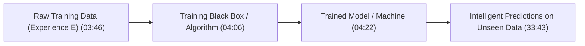
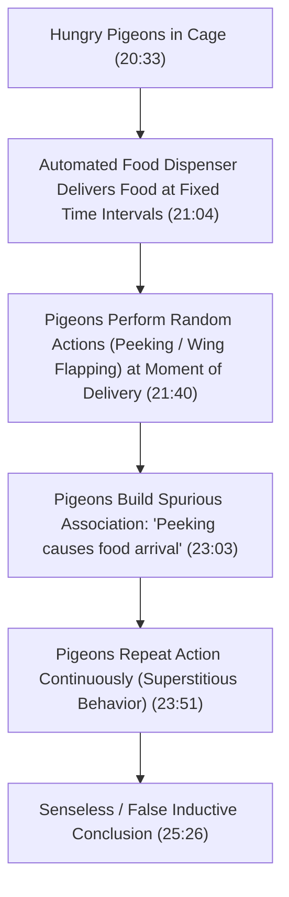

# Learn Core Machine Learning for FREE — Part 01: Foundations & Definitions

> **Source Information**
> - **Course Title**: Learn Core Machine Learning for FREE | Ultimate Course for Beginners
> - **Instructor**: [[Ayush Singh]]
> - **Video Link**: [YouTube Source](https://www.youtube.com/watch?v=0g-XL0WV2xo)
> - **Segment Scope**: `0:00` – `33:00` (Part 1 of 14)
> - **Primary Focus**: Core ML Philosophy, Learning Mechanisms, Memorization vs. Generalization, Inductive Inference, Pigeon Superstition, and Inductive Bias.

---

## Executive Summary

Part 01 lays down the foundational conceptual framework of Machine Learning before diving into mathematical algorithms. It addresses a critical flaw in modern data science education: rushing straight into complex neural networks or executing pre-built high-level API code (e.g., 3 lines of code) without understanding foundational principles.

The lecture establishes what "learning" truly means by exploring biological analogies (rats learning to avoid poison), contrasts rote memorization with **generalization**, identifies the risks of unconstrained generalization through **Pigeon Superstition**, and introduces **Inductive Bias** as the mathematical/conceptual necessity for reliable machine learning.

---

## 1. Course Introduction & Motivation (0:00 – 2:58)

- **The Problem in Data Science Education** `(0:41 - 2:10)`: Many beginners skip core statistical foundations and jump straight to deep learning. While anyone can write three lines of high-level code, real-world data science requires solving critical business problems through rigorous foundational understanding.
- **Course Mission**: Provide a complete, rigorous foundation in Core Machine Learning and Regression Analysis.
- **Key Pedagogical Components**:
  - Conceptual theory built from first principles.
  - Hands-on practical applications with two enterprise-grade capstone projects.
  - Structured learning schedule with assignments and feedback.

---

## 2. Fundamentals of Learning (2:59 – 10:02)

### 2.1 Conceptual Definition of Machine Learning
At an abstract level, machine learning involves taking training data (experiences), passing it through a training process guided by an algorithm, and obtaining a trained model capable of performing specialized tasks `(3:46 - 4:22)`.

### 2.2 Biological Examples of Learning
- **Rats Avoiding Poisonous Baits** `(4:42 - 6:12)`:
  - When rats encounter a new food bait and suffer ill effects, they associate the smell/taste with illness and refrain from eating that bait in the future.
  - Learning occurs by converting past negative experiences into actionable behavioral constraints.
- **Human Mentorship & Experience** `(6:12 - 7:28)`:
  - Mentors provide effective guidance because they have navigated past failures and successes, compiling experience to optimize future decision-making.

### 2.3 Learning Strategy 1: Memorization (Rote Learning / "Ratification")
- **Definition** `(8:09 - 10:02)`: Learning strictly by storing every training sample directly into memory.
- **Critical Failure Mode**:
  - Memorization works only for exact inputs previously seen.
  - When presented with modified, tweaked, or unseen test cases, memorization fails completely because the system lacks logical reasoning or abstraction capability.

---

## 3. Generalization & Inductive Inference (10:03 – 15:44)

### 3.1 Spam Classification Case Study
Consider building a system to classify emails as **Spam** or **Non-Spam**:

1. **Memorization Approach** `(11:42 - 13:12)`:
   - The model stores every exact training spam email in memory.
   - When a new email arrives, it checks if the exact text exists in memory.
   - If missing from memory, it defaults to predicting "Non-Spam".
   - **Failure**: Any new spam email variant bypasses detection completely.

2. **Generalization Approach (Inductive Inference)** `(13:30 - 15:44)`:
   - Generalization is the machine's ability to extract underlying patterns from training data to correctly classify unseen examples.
   - Inductive inference enables models to extrapolate general rules from specific observations.

| Learning Paradigm | Handling of Seen Data | Handling of Unseen / Tweaked Data | Risk / Limitation |
|---|---|---|---|
| **Memorization** `(08:09)` | 100% Accuracy | Fails completely | Overfitting; zero generalization |
| **Inductive Inference** `(13:30)` | High Accuracy | High Accuracy (if constrained) | Susceptible to spurious patterns if unconstrained |
| **Inductive Bias System** `(29:44)` | High Accuracy | Optimal Generalization | Requires valid prior assumptions |

---

## 4. Limits of Unconstrained Generalization: Pigeon Superstition (15:45 – 27:47)

### 4.1 The Pigeon Superstition Experiment
To illustrate how unconstrained inductive inference can lead to false or senseless conclusions, the lecture references B.F. Skinner's famous **Pigeon Superstition Experiment** `(19:11 - 24:16)`:

### 4.2 Spurious Correlation vs. Common Sense Filters
- **The Core Issue**: Food arrived strictly on a fixed timer, completely independent of the pigeons' actions. However, the pigeons inferred a direct causal link between their random behavior (peeking) and food delivery `(24:16 - 25:09)`.
- **Human Common Sense Filter**: Humans use common sense and domain context to discard random coincidences.
- **Crisp Principles in ML Theory**: Machine learning models do not inherently possess human common sense. Therefore, machine learning theory must provide **well-defined, crisp mathematical principles** to prevent algorithms from learning meaningless, spurious correlations `(26:23 - 27:48)`.

---

## 5. Inductive Bias: The Key to Valid Learning (27:48 – 32:15)

### 5.1 Why Rats Succeed Where Pigeons Fail
- Rats avoid poison successfully because they possess **prior knowledge** (inherited evolutionary traits and genetic predispositions regarding taste/smell) `(28:19 - 29:44)`.
- Pigeons form superstitious conclusions because they lack appropriate prior constraints on the causal mechanism of food delivery.

### 5.2 Definition of Inductive Bias
- **Inductive Bias** is the set of explicit prior assumptions, constraints, and mathematical preferences incorporated into a learning algorithm to prefer certain hypotheses over others `(29:44 - 30:16)`.
- Without inductive bias, a machine learning model cannot generalize to unseen data because all unseen outcomes remain equally plausible.

---

## 6. Formal Definition of Machine Learning (32:16 – 33:00)

> **Definition**: Machine Learning is a subfield of Artificial Intelligence concerned with extracting patterns from data, analyzing information, and making intelligent predictions on new, unseen data according to learned patterns `(33:16 - 34:05)`.

---

## Key Terminology & Glossary

- **Generalization**: The ability of a machine learning algorithm to perform accurately on new, previously unseen data.
- **Inductive Inference**: The process of drawing general conclusions or patterns from specific observed training instances.
- **Inductive Bias**: The set of prior assumptions an algorithm uses to predict outputs for unseen inputs.
- **Spurious Correlation**: A mathematical or observational relationship in which two variables appear causally related but are actually connected by coincidence or an unobserved factor.

---

## Verification & Self-Assessment

- **Mandatory Validation**:
  - Schema Version: `4`
  - Controlled Tags: `[yt, beginner, reference, example]`
  - Timestamp Citations: All main concepts anchored with `(MM:SS)`.
  - Non-English Translation: 100% professional English prose (no Hinglish text).
- **Confidence Assessment**: **High** (all concepts, analogies, timestamps, and definitions fully verified against transcript lines 1-268).
