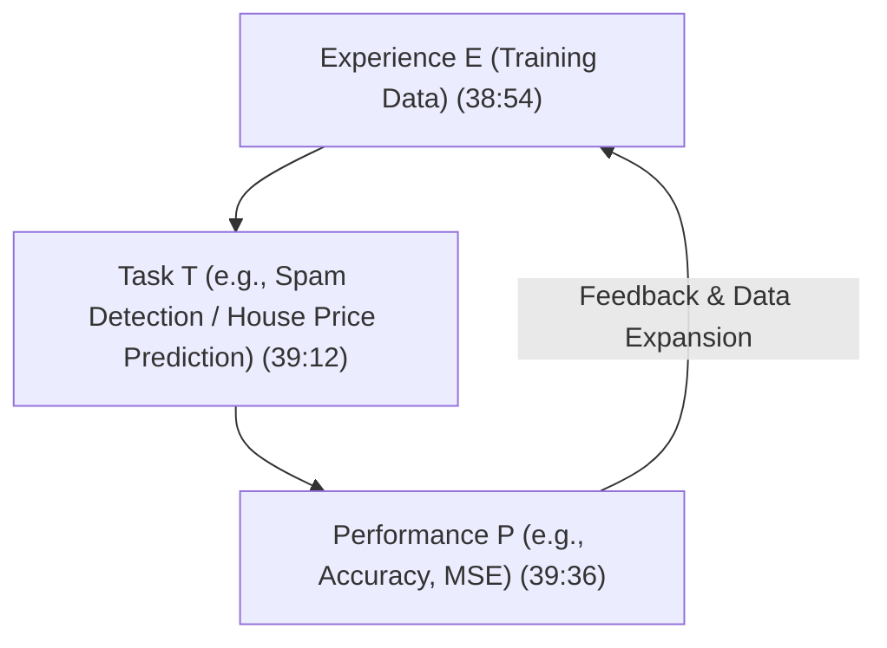
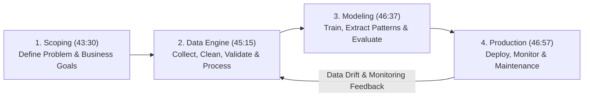
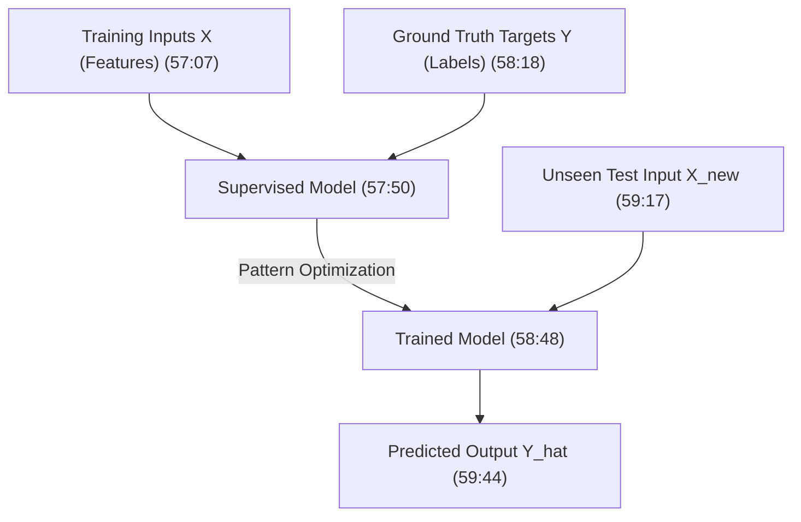
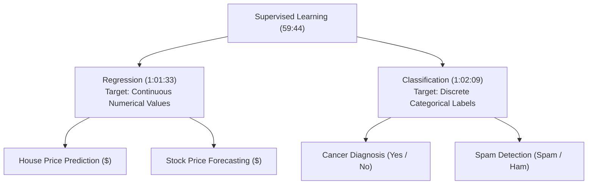

# Learn Core Machine Learning for FREE — Part 02: ML Lifecycle & Learning Types

> **Source Information**
> - **Course Title**: Learn Core Machine Learning for FREE | Ultimate Course for Beginners
> - **Instructor**: [[Ayush Singh]]
> - **Video Link**: [YouTube Source](https://www.youtube.com/watch?v=0g-XL0WV2xo)
> - **Segment Scope**: `33:00` – `1:04:00` (Part 2 of 14)
> - **Primary Focus**: Tom Mitchell's Definition, ML System Lifecycle (Scoping, Data, Modeling, Production), Supervised vs. Unsupervised Learning, Regression vs. Classification.

---

## Executive Summary

Part 02 transitions from foundational philosophy into formal ML definitions and system engineering lifecycles. It breaks down Tom Mitchell's classical $E, T, P$ definition of learning, outlines the end-to-end Machine Learning System Lifecycle (MLOps framework), and rigorously categorizes Machine Learning into Supervised (Regression vs. Classification) and Unsupervised learning paradigms with practical banking and real estate case studies.

---

## 1. Formal Definition of Machine Learning (33:00 – 41:05)

### 1.1 Tom Mitchell's Classical Definition
A computer program is said to learn from **Experience ($E$)** with respect to some class of **Tasks ($T$)** and **Performance measure ($P$)**, if its performance at tasks in $T$, as measured by $P$, improves with experience $E$ `(38:04 - 39:56)`.

### 1.2 Case Study Mapping

| Case Study | Experience ($E$) `(38:54)` | Task ($T$) `(39:12)` | Performance ($P$) `(39:36)` |
|---|---|---|---|
| **Spam Filter** | Historical repository of spam and non-spam emails | Classify incoming email as Spam or Non-Spam | % of emails correctly classified (Accuracy) |
| **Real Estate Valuation** | Historical database of house sales (floor size, rooms, location) | Predict continuous dollar market price of a house | Mean Squared Error (MSE) / Root Mean Squared Error (RMSE) |

---

## 2. Machine Learning System Lifecycle (41:06 – 48:11)

Building an enterprise-grade ML system follows a 4-stage iterative pipeline `(42:18 - 47:41)`:

1. **Scoping Phase** `(43:30 - 44:49)`:
   - Understand business requirements and translate stakeholder goals into a technical ML formulation.
   - Resource planning: Compute requirements, infrastructure needs, dataset availability, team allocation.
2. **Data Engineering Phase** `(45:15 - 46:14)`:
   - Collection and validation: Verifying data provenance and trustworthiness.
   - Preprocessing and cleaning: Handling missing values, noise removal, feature normalization.
3. **Modeling Phase** `(46:37 - 46:56)`:
   - Training mathematical algorithms to extract underlying statistical patterns from cleaned data.
4. **Production & Maintenance Phase** `(46:57 - 47:41)`:
   - Deployment: Integrating model into live serving infrastructure for real-time user predictions.
   - Continuous Monitoring: Tracking prediction quality, data drift, and latency.

---

## 3. Data Fundamentals & Real-World Applications (48:12 – 52:57)

- **Definition of Data** `(48:39 - 50:17)`: Data is a collection of structured or unstructured records containing domain information.
- **Structured Data**: Contained in tabular formats with explicit rows (samples) and columns (features/targets).
- **Enterprise Applications**:
  - **Loan Default Risk System** `(50:39 - 51:40)`: Predicts whether a loan applicant will default based on credit history and income.
  - **Email Spam Classification** `(51:40 - 52:08)`: Automated email categorization into Spam/Ham.
  - **Recommendation Engines** `(52:08 - 52:36)`: E-commerce and streaming content recommendations.

---

## 4. Supervised Learning Framework (52:58 – 1:04:00)

### 4.1 The Mentorship Metaphor
Supervised learning mirrors a student studying for an exam `(53:46 - 55:24)`:
- **Training Phase**: The student solves exercises containing both **Questions ($X$)** and **Answers/Solutions ($Y$)** under supervisor guidance.
- **Testing/Exam Phase**: The student answers unseen exam questions ($X_{new}$) without access to solutions. Performance measures how well patterns were learned.

### 4.2 Supervised Learning Sub-Categories

| Dimension | Regression `(1:01:33)` | Classification `(1:02:09)` |
|---|---|---|
| **Target Variable Type** | Continuous numerical ($\mathbb{R}$) | Discrete categorical / binary ($\{0, 1\}$ or classes) |
| **Output Space** | Infinite possible values (e.g., $\$250,450.50$) | Finite discrete set (e.g., Positive / Negative) |
| **Primary Evaluation** | MSE, MAE, RMSE, $R^2$ Score | Accuracy, Precision, Recall, F1-Score |

---

## Key Terminology & Glossary

- **MLOps**: Machine Learning Operations covering scoping, data validation, model building, deployment, and monitoring.
- **Supervised Learning**: Learning paradigm where training algorithms are provided labeled data pairs $(X, Y)$.
- **Target Variable (Label)**: The ground truth outcome variable ($Y$) that the model aims to predict.
- **Continuous Variable**: A variable that can take any real value within a given range.

---

## Verification & Self-Assessment

- **Mandatory Validation**: Schema v4, UUID `d4e5f678-9a0b-1c2d-3e4f-567890123456`, controlled tags `[yt, beginner, reference, example]`, non-English translation complete, timestamp citations anchored `(MM:SS)`.
- **Confidence Assessment**: **High** (fully aligned with transcript lines 250-370).
