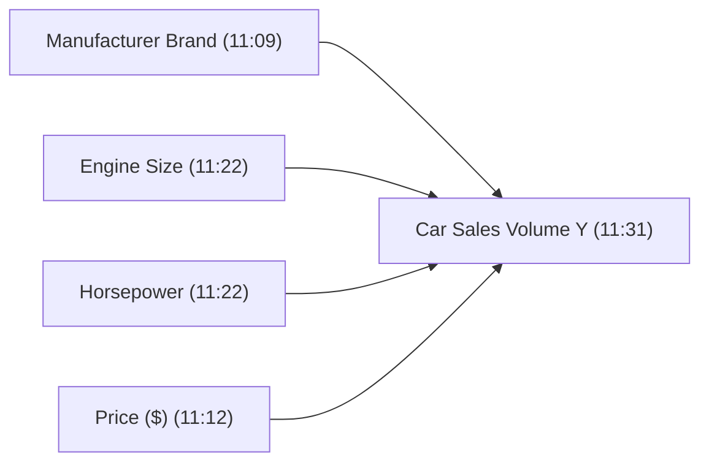
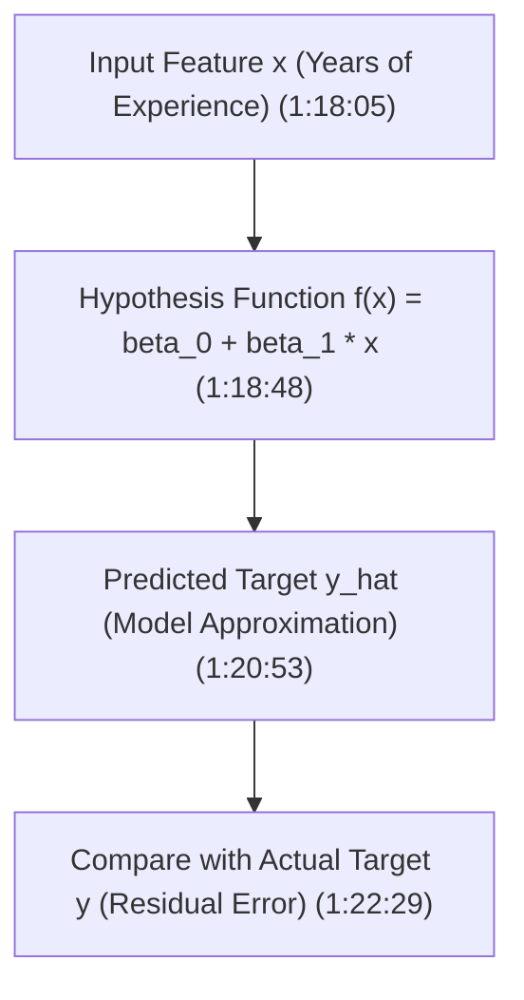
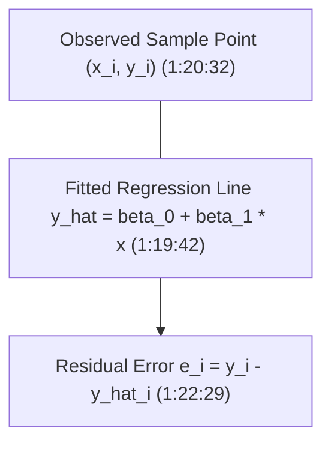

# Learn Core Machine Learning for FREE — Part 03: Simple Linear Regression Foundations

> **Source Information**
> - **Course Title**: Learn Core Machine Learning for FREE | Ultimate Course for Beginners
> - **Instructor**: [[Ayush Singh]]
> - **Video Link**: [YouTube Source](https://www.youtube.com/watch?v=0g-XL0WV2xo)
> - **Segment Scope**: `1:04:00` – `1:40:00` (Part 3 of 14)
> - **Primary Focus**: Linear Regression Problem Formulation, Estimating Variable Relationships, Geometric Intuition of Line Fitting, Hypothesis Function $f(x) = \beta_0 + \beta_1 x$.

---

## Executive Summary

Part 03 opens the Linear Regression module by establishing how machine learning algorithms estimate mathematical relationships between input features ($X$) and continuous output targets ($Y$). Using real estate advertising and salary prediction case studies, it presents the geometric intuition of finding the line of best fit that minimizes prediction error across all data points.

---

## 1. Estimating Feature Relationships (1:04:00 – 1:13:30)

### 1.1 Purpose of Regression Modeling
Linear Regression estimates or establishes the mathematical relationship between independent feature variables ($X$) and a continuous target variable ($Y$) `(1:06:36 - 1:09:04)`.

### 1.2 Automotive Marketing Case Study
Consider a car manufacturer analyzing sales data across 4 distinct features `(1:09:37 - 1:12:43)`:

Data scientists answer five critical business questions for stakeholders `(1:11:00 - 1:13:03)`:
1. **Relationship Existence**: Is there an association between feature $X_i$ and sales $Y$?
2. **Relationship Strength**: How strongly does feature $X_i$ influence sales $Y$?
3. **Feature Importance**: Which features contribute significantly versus which are redundant noise?
4. **Estimation Accuracy**: How accurately can we estimate the impact of each feature on sales $Y$?
5. **Linearity**: Is the relationship between feature $X_i$ and target $Y$ strictly linear?

---

## 2. Geometric Intuition of Line Fitting (1:13:31 – 1:22:29)

### 2.1 Definition of Linear Data
Data is linear if it can be represented on a Cartesian plane such that a 1-unit increase in input $X$ produces a constant proportional change in output $Y$ `(1:14:29 - 1:15:23)`.

### 2.2 Salary Prediction Problem Setup
Consider predicting salary ($Y$, in $\$1,000$) based on years of experience ($X$) `(1:15:52 - 1:18:05)`:

$$y = f(x)$$

Where:
- $x$: Input feature (Years of Experience).
- $f(x)$: Hypothesis mapping function to be learned by the algorithm.
- $y$: Predicted output (Salary).

### 2.3 Mathematical Form of Simple Linear Regression
The hypothesis line for simple linear regression (single feature) is defined as `(1:18:48 - 1:19:17)`:

$$\hat{y} = f(x) = \beta_0 + \beta_1 x$$

Or in standard slope-intercept form:

$$y = mx + b$$

Where:
- $\beta_0$ (or $b$): **Intercept term** — predicted value of $Y$ when $X = 0$.
- $\beta_1$ (or $m$): **Slope coefficient** — rate of change in $Y$ per unit increase in $X$.
- $\hat{y}$: Model approximation (predicted target).

---

## 3. Residual Error & Line Selection (1:22:30 – 1:40:00)

### 3.1 Model Approximation vs. Actual Target
For any data point $(x_i, y_i)$, the model predicts $\hat{y}_i = \beta_0 + \beta_1 x_i$. The difference between the actual value $y_i$ and predicted value $\hat{y}_i$ is the **residual error** $\epsilon_i$ `(1:20:53 - 1:22:29)`:

$$\epsilon_i = y_i - \hat{y}_i = y_i - (\beta_0 + \beta_1 x_i)$$

---

## Key Terminology & Glossary

- **Simple Linear Regression**: Regression model establishing a linear relationship between one independent variable $X$ and one continuous target $Y$.
- **Slope ($\beta_1$)**: The magnitude and direction of change in target $Y$ for every 1-unit increase in feature $X$.
- **Intercept ($\beta_0$)**: The expected value of target $Y$ when independent variable $X$ equals zero.
- **Residual ($\epsilon_i$)**: The vertical distance/difference between an observed sample point $y_i$ and the model's predicted value $\hat{y}_i$.

---

## Verification & Self-Assessment

- **Mandatory Validation**: Schema v4, UUID `e5f67890-1a2b-3c4d-5e6f-789012345678`, controlled tags `[yt, beginner, reference, example]`, non-English translation complete, timestamp citations anchored `(MM:SS)`.
- **Confidence Assessment**: **High** (fully aligned with transcript lines 370-460).
