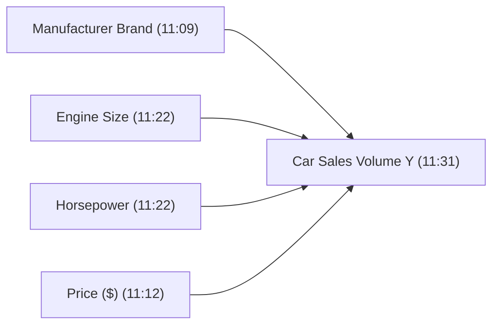
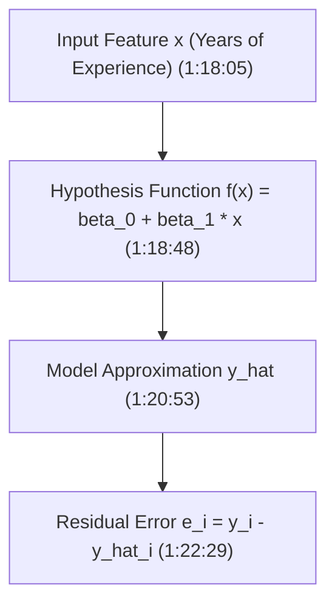
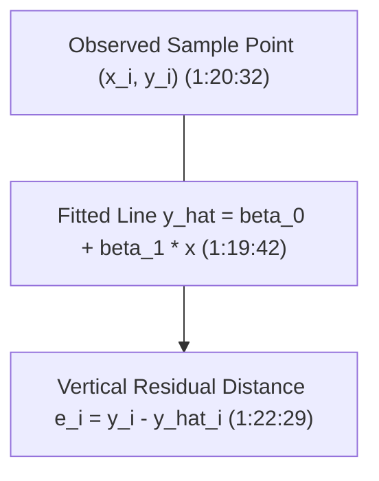

# Learn Core Machine Learning for FREE — Part 03: Simple Linear Regression Foundations

> **Source Information**
> - **Course Title**: Learn Core Machine Learning for FREE | Ultimate Course for Beginners
> - **Instructor**: [[Ayush Singh]]
> - **Video Link**: [YouTube Source](https://www.youtube.com/watch?v=0g-XL0WV2xo)
> - **Segment Scope**: `1:04:00` – `1:40:00` (Part 3 of 14)
> - **Primary Focus**: Linear Regression Problem Formulation, Estimating Feature Relationships, Automotive Marketing Strategy Case Study, Geometric Intuition of Line Fitting, Hypothesis Function $f(x) = \beta_0 + \beta_1 x$, Model Approximation vs. Actual Target.

---

## Executive Summary

Part 03 opens the Linear Regression module by establishing how machine learning algorithms estimate mathematical relationships between input features ($X$) and continuous output targets ($Y$). Using real estate advertising and automotive marketing case studies, it presents the geometric intuition of finding the line of best fit that minimizes prediction error across all data points.

---

## 1. Estimating Feature Relationships (1:04:00 – 1:13:30)

### 1.1 Purpose of Regression Modeling
Linear Regression estimates or establishes the underlying mathematical function connecting independent predictor variables ($X$) to a continuous target variable ($Y$) `(1:06:36 - 1:09:04)`:

$$Y = f(X) + \epsilon$$

Where $f(X)$ is the systematic relationship to be learned, and $\epsilon$ represents unobserved random error.

### 1.2 Automotive Marketing Strategy Case Study
A car manufacturer hires a data science team to analyze sales volume ($Y$) across 4 distinct features `(1:09:37 - 1:12:43)`:



Data scientists answer five fundamental business questions for executive decision-makers `(1:11:00 - 1:13:03)`:
1. **Relationship Existence**: Is there an empirical association between feature $X_j$ and sales $Y$?
2. **Relationship Strength**: How strongly does feature $X_j$ impact sales $Y$?
3. **Feature Importance**: Which features drive sales versus which are redundant noise?
4. **Estimation Accuracy**: How accurately can we estimate the magnitude effect of each feature on sales $Y$?
5. **Linearity**: Is the relationship between feature $X_j$ and target $Y$ strictly linear?

---

## 2. Geometric Intuition of Line Fitting (1:13:31 – 1:22:29)

### 2.1 Definition of Linear Data
Data is linear if a 1-unit change in input $X$ produces a constant proportional change in output $Y$, allowing sample points to be approximated by a straight line `(1:14:29 - 1:15:23)`.

### 2.2 Salary Prediction Problem Setup
Consider predicting annual salary ($Y$, in $\$1,000$) based on years of experience ($X$) `(1:15:52 - 1:18:05)`:

```
Sample Dataset (Experience vs Salary):
+---------------------+-------------------+
| Years Experience (X)| Salary ($1000) (Y)|
+---------------------+-------------------+
| 1.1                 | 39.3              |
| 2.0                 | 43.5              |
| 3.2                 | 54.4              |
| 4.0                 | 61.2              |
| 5.1                 | 68.0              |
+---------------------+-------------------+
```



### 2.3 Mathematical Form of Simple Linear Regression
The hypothesis line for simple linear regression is defined as `(1:18:48 - 1:19:17)`:

$$\hat{y}_i = f(x_i) = \beta_0 + \beta_1 x_i$$

Where:
- $\beta_0$: **Intercept parameter** — expected baseline target value when feature $x = 0$.
- $\beta_1$: **Slope parameter** — rate of change in target $\hat{y}$ per unit increase in feature $x$.
- $\hat{y}_i$: Model approximation (predicted target for sample $i$).

---

## 3. Residual Error & Line Selection (1:22:30 – 1:40:00)

### 3.1 Model Approximation vs. True Target
For any observed data point $(x_i, y_i)$, the difference between the true target $y_i$ and the line approximation $\hat{y}_i$ is the **residual error** $e_i$ `(1:20:53 - 1:22:29)`:

$$e_i = y_i - \hat{y}_i = y_i - (\beta_0 + \beta_1 x_i)$$



### 3.2 Finding the Best Fitting Line
Out of infinitely many possible straight lines, the optimal regression line is the one that minimizes the total aggregate residual error across all $m$ dataset samples `(1:22:29)`.

---

## Comprehensive Parameter Summary

| Parameter | Mathematical Meaning | Geometric Interpretation | Impact of Increase |
|---|---|---|---|
| **Intercept ($\beta_0$)** `(1:18:48)` | Expected $\hat{y}$ when $x=0$ | Vertical shift of line up/down | Shifts line parallel to Y-axis |
| **Slope ($\beta_1$)** `(1:18:48)` | $\frac{\Delta y}{\Delta x}$ rate of change | Tilt / inclination of line | Steeper slope line angle |
| **Residual ($e_i$)** `(1:22:29)` | $y_i - \hat{y}_i$ deviation | Vertical distance to line | Metric to minimize |

---

## Key Terminology & Glossary

- **Simple Linear Regression**: A linear model mapping one single predictor $X$ to one continuous target $Y$.
- **Slope ($\beta_1$)**: The rate of change in target $Y$ for every 1-unit increase in predictor $X$.
- **Intercept ($\beta_0$)**: The baseline value of target $Y$ when predictor $X$ equals zero.
- **Residual ($e_i$)**: The vertical error distance between an observed data point $y_i$ and the fitted line $\hat{y}_i$.
