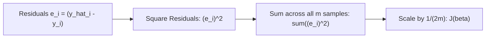
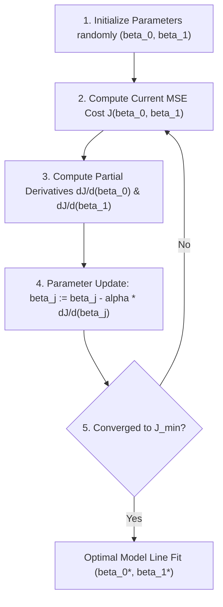

# Learn Core Machine Learning for FREE — Part 04: Cost Function & Gradient Descent Intuition

> **Source Information**
> - **Course Title**: Learn Core Machine Learning for FREE | Ultimate Course for Beginners
> - **Instructor**: [[Ayush Singh]]
> - **Video Link**: [YouTube Source](https://www.youtube.com/watch?v=0g-XL0WV2xo)
> - **Segment Scope**: `1:40:00` – `2:15:00` (Part 4 of 14)
> - **Primary Focus**: Mean Squared Error (MSE) Cost Function, Mathematical Justification for Squaring, 3D Parabolic Error Surface Geometry, Mountain Hiker Analogy, Gradient Descent Parameter Updates.

---

## Executive Summary

Part 04 formalizes how a machine learning model quantitatively measures its aggregate prediction error across a dataset using the **Mean Squared Error (MSE)** cost function $J(\beta_0, \beta_1)$. It details the mathematical properties of MSE, explains why squaring residuals produces a smooth convex parabolic surface, and introduces **Gradient Descent** as an optimization algorithm navigating this surface to converge on global minimum error.

---

## 1. Mean Squared Error (MSE) Cost Function (1:40:00 – 1:55:00)

### 1.1 Defining Aggregate Model Error
To evaluate how well a hypothesis line fits $m$ dataset samples, we compute the average squared residual error:

$$\text{MSE} = J(\beta_0, \beta_1) = \frac{1}{m} \sum_{i=1}^{m} (y_i - \hat{y}_i)^2 = \frac{1}{m} \sum_{i=1}^{m} \left( y_i - (\beta_0 + \beta_1 x_i) \right)^2$$

In standard theoretical machine learning literature, a scaling factor of $\frac{1}{2}$ is introduced to cancel out the power of 2 during partial differentiation:

$$J(\beta_0, \beta_1) = \frac{1}{2m} \sum_{i=1}^{m} \left( (\beta_0 + \beta_1 x_i) - y_i \right)^2$$

### 1.2 Mathematical Rationale for Squaring Errors
1. **Eliminates Sign Cancellation**: Squaring prevents positive deviations ($+e_i$) from canceling negative deviations ($-e_i$).
2. **Penalizes Large Outliers Exponentially**: An error of 4 units produces 16 penalty points, whereas an error of 2 units produces only 4 penalty points.
3. **Smooth Convex Differentiability**: Provides a continuous, everywhere-differentiable parabolic surface essential for gradient calculus.

---

## 2. Geometry of the Error Surface (1:55:01 – 2:05:00)

When plotting cost $J(\beta_0, \beta_1)$ as a function of parameters $\beta_0$ and $\beta_1$, the resulting 3D surface forms a **convex parabolic bowl**.

- **Global Minimum ($J_{\min}$)**: The lowest point on the 3D surface, representing the unique parameter combination $(\beta_0^*, \beta_1^*)$ that yields the lowest possible training error.

---

## 3. Gradient Descent Optimization Intuition (2:05:01 – 2:15:00)

### 3.1 Mountain Hiker Analogy
Imagine a hiker trapped in dense fog atop a mountain (high cost $J$) who must descend to the lowest valley floor ($J_{\min}$):
- **Sense Slope**: The hiker feels the incline of the terrain underfoot (partial derivative / gradient).
- **Step Downward**: The hiker takes a step in the direction of steepest descent.
- **Repeat**: The hiker continues stepping until the terrain becomes flat ($\text{slope} \approx 0$).

### 3.2 Parameter Update Rules
Parameters are updated simultaneously using the negative gradient scaled by **learning rate ($\alpha$)**:

$$\beta_0 := \beta_0 - \alpha \frac{\partial J}{\partial \beta_0}$$

$$\beta_1 := \beta_1 - \alpha \frac{\partial J}{\partial \beta_1}$$

Where:
- $\alpha$: **Learning rate** hyperparameter controlling step size per iteration.
- $\frac{\partial J}{\partial \beta_j}$: Partial derivative giving the slope/direction of steepest increase.

---

## Key Terminology & Glossary

- **Cost Function ($J$)**: Mathematical function quantifying total prediction error across a dataset.
- **Mean Squared Error (MSE)**: The average squared distance between true targets and model predictions.
- **Gradient Descent**: An iterative optimization algorithm that moves parameter values in the direction of steepest descent to minimize cost.
- **Learning Rate ($\alpha$)**: A tuning hyperparameter governing the step size taken per iteration toward the minimum.
